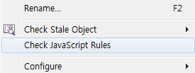
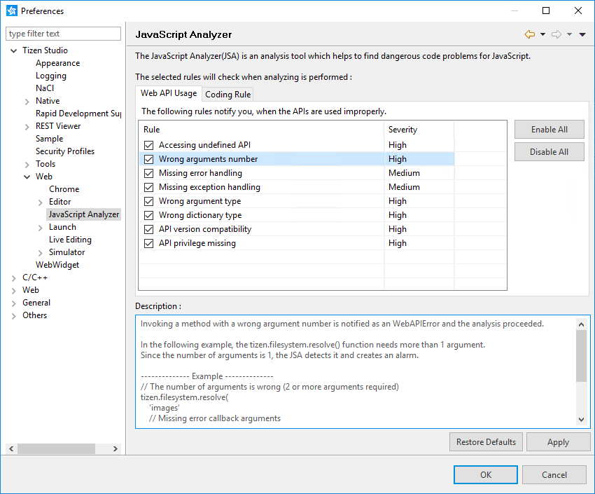
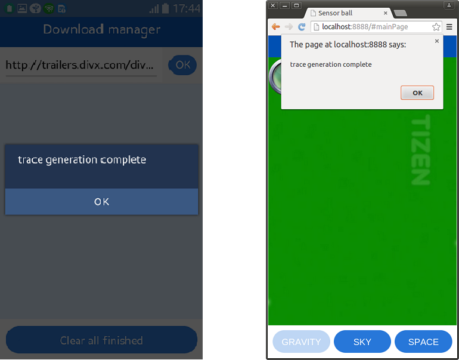
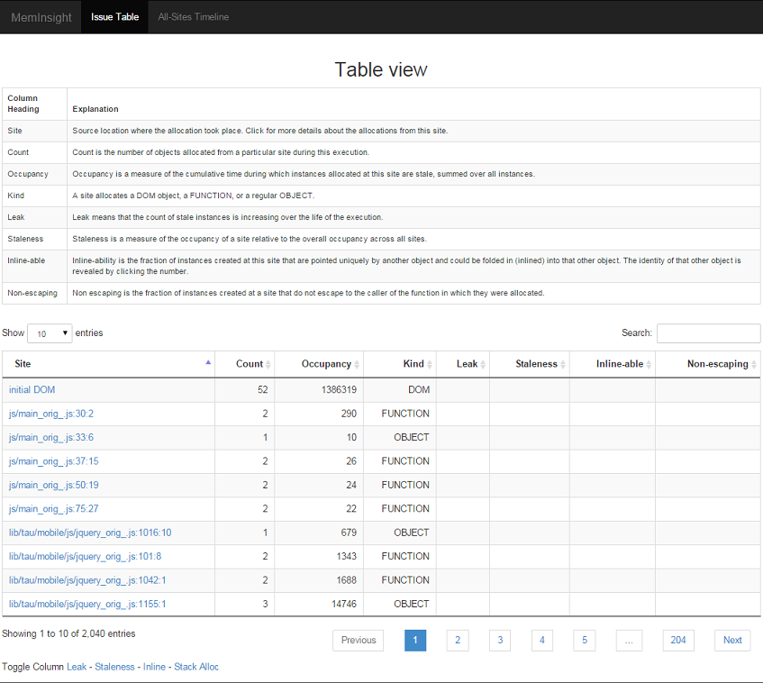
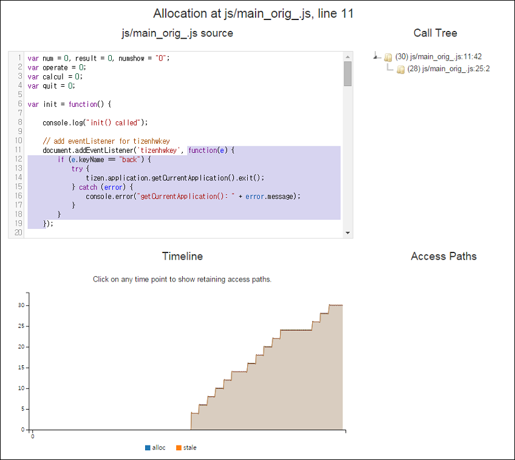
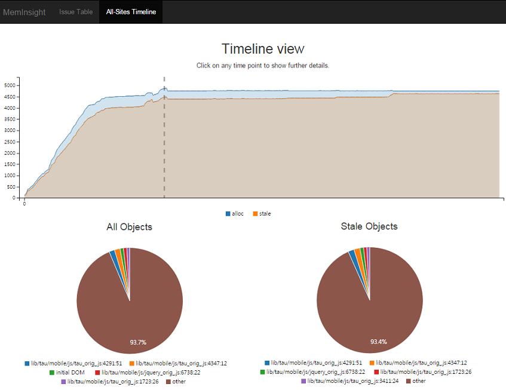
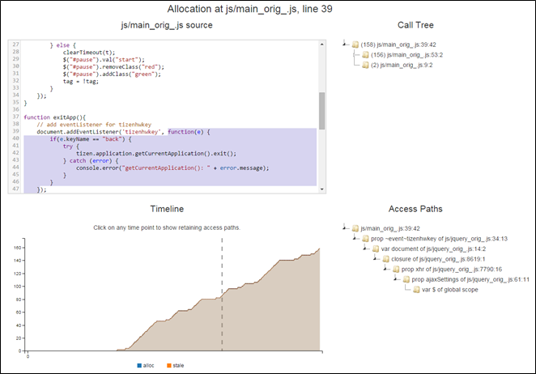

# Analyzing JavaScript Problems

The JavaScript Analyzer (JSA) is an analysis tool, which helps to find problems in JavaScript code. When you develop a Web application with a new project in the Tizen Studio, you can run JSA to detect potential problems in your JavaScript code.

JSA supports 2 analyzer types:

- **Static Analyzer** (Coding Rule Checker)

  Contains checkers for a set of predefined coding rules. It supports 27 rules, including coding rules and Web API usage rules.

  The Coding Rule Checker is a static analysis tool that evaluates an application by examining the JavaScript code without its execution. This checker examines all possible execution paths and variable values.

- **Dynamic Analyzer** (Stale Object Checker)

  Contains a checker for stale objects that cause possible memory leaks.

  The Stale Object Checker is a dynamic analysis tool that requires executing the application in a runtime environment. This checker examines all the JavaScript objects created during its execution and points out relatively critical staled objects.

<a name="use"></a>
## Using the JavaScript Analyzer

To analyze a Web application with the JSA in the Tizen Studio, choose the target project in the **Project Explorer** view, open the context menu, and select **Check JavaScript Rules**.

**Figure: JSA in the menu**



The JSA analyzes JavaScript code in the selected Web application project after selecting JavaScript files and code segments to analyze. This can be done by parsing the start HTML file (such as `index.html`) specified in the `config.xml` file.

**Figure: Checking in progress**


If JavaScript Analyzer detects code that can cause potential problems during its analysis step, the problems are listed in the **Problems** view. If you want to locate a possibly problematic code line, double-click the alarm in the view.

**Figure: Problems view**


<a name="settingrules"></a>
## Setting JavaScript Rules

You can enable or disable the JavaScript rules in JavaScript Analyzer preferences.

To enable or disable the rules:

1. In the Tizen Studio, go to **Window > Preferences > Tizen Studio > Web > JavaScript Analyzer**.
2. Select or clear a rule checkbox to enable or disable the rule.

**Figure: Preferences**



<a name="support"></a>
## Supported Rules

<a name="coding"></a>
### Coding Rules

The JSA provides coding rules to help in writing better JavaScript code. For more information on these rules, see JSLint and [Google JavaScript Guide](https://github.com/google/styleguide/blob/gh-pages/javascriptguide.xml).

#### Rule 1. Use `var` to declare variables

If variables are declared in the JavaScript language without the `var` keyword, they are assigned to the global scope. This can be dangerous.

For example, if 2 functions that have the same name are defined as in the following example code, the `foo` function is changed whenever the `func1` or `func2` function is called. The `foo` function cannot be guaranteed.

This rule is supported by the JSLint and the Google Closure Linter. They say that "When you fail to specify `var`, the variable gets placed in the global context, potentially clobbering existing values. Also, if there is no declaration, it is hard to tell in what scope a variable lives."

```
function func1() {
    /* The foo function is defined without the var keyword */
    foo = function() {
        alert('func1');
    };

    /* When the foo function is called, the foo function is not clear */
    foo();
}
function func2() {
    /* The other foo function is defined without var keyword */
    foo = function() {
        alert('func2');
    };

    /* When the foo function is called, the foo function is not clear */
    foo();
}
```

The JSA displays the following message:

```
[Coding Rule] Use var to declare the variable foo.
```

#### Rule 2. Do Not Declare an Arguments Array within Functions

If the `arguments` array is declared with `var` in functions, it causes duplication with the `arguments` JavaScript reserved keyword in the functions.

In the following example, the `var arguments = [];` statement in the function overwrites the `arguments` reserved keyword. As a result, the `arguments` reserved keyword in functions loses the ability to access the arguments of the function.

```
function func() {
    /* 'arguments' has been predefined as a reserved keyword */
    var arguments = [];
}
```

The JSA displays the following message:

```
[Coding Rule] Do not declare arguments Array as variables in functions.
```

#### Rule 3. Do Not Capture Variables in Functions

If there are captured variables in functions, they can make a closure. The closure can cause potential defects.

In the following example, you always expect 1 to be returned from calling the `test` function. However, the returned value is not always 1 because the variable `x` in the function `outer` is captured.

This rule is introduced in the Google JavaScript Style Guide. They say that "The ability to create closures is perhaps the most useful and often overlooked feature of JS. One thing to keep in mind, however, is that a closure keeps a pointer to its enclosing scope. As a result, attaching a closure to a DOM element can create a circular reference and thus, a memory leak."

```
var outer = function() {
    /* Warning case, be careful */
    var x = 0;

    return function() {
        /* Variable x of the outer function is captured in the inner function */

        return ++x;
    }
};
var x = -1;

/*
   The inner function of function outer is assigned to variable test
   outside function outer
*/
var test = outer();

/* Whenever the test is called, the result can be different from the expectation */

/* First return */
test();

/* Second return */
test();

/* Third return */
test();
```

The JSA displays the following message:

```
[Coding Rule] Do not capture the variable x in a closure.
```

#### Rule 4. Do Not Use Extra Semicolons

Extra semicolons make readability worse. In addition, they can cause unexpected operation of the program.

This rule is described in the Google JavaScript Coding Style Guide. They say that "Extra comma and semicolon can make error."

```
function func() {
    for (var i = 0; i < 10; i++) {
        /* Extra semicolon */
        x++;;
        /* Extra semicolon after the 'for' statement */
    };

    return x;
/* Extra semicolon after the function definition statement */
};
var result = func();
```

The JSA displays the following message:

```
[Coding Rule] Do not use extra semicolons.
```

#### Rule 5. Do Not Use the Delete Keyword

Deleting the property of an object takes time. In addition, it changes the shape of the object. The change in the object's shape can cause decreased performance.

In the following example, the property `value` of the instance `obj` is deleted using the keyword `delete`. This leads the instance `obj` not to share the shape of the constructor `Obj` with other instances. For that reason, the performance can be slower.

This rule is introduced by the Google JavaScript Style Guide. They say that "In modern JavaScript engines, changing the number of properties on an object is much slower than reassigning the values. The delete keyword should be avoided except when it is necessary to remove a property from an object's iterated list of keys, or to change the result of if (key in obj)."

```
function Obj() {
    this.value = 10;
}
var obj = new Obj();

/* Deleting properties of objects can make the performance of the program worse */
delete obj.value;
```

The JSA displays the following message:

```
[Coding Rule] Use var to declare the variable value.
```

#### Rule 6. Do Not Use Multi-line Literals

Using multi-line string literals can cause unexpected operation of the program because of the whitespace at the beginning of each line and after the backslash (\\).

This rule is introduced by the Google JavaScript Style Guide. They say that "The whitespace at the beginning of each line can't be safely stripped at compile time; whitespace after the slash will result in tricky errors; and while most script engines support this, it is not part of ECMAScript."

```
/* Multi-line string literals can create a problem */
var str = 'The Test String \
    for Positive TC';
```

The JSA displays the following message:

```
[Coding Rule] Do not use multi-line string literals.
```

#### Rule 7. Do Not Use Array or Object Constructors

Use array and object literals instead of their constructors to avoid confusing and unexpected results.

In the following example, the array `arr2` that has 3 values (1, 2, and 3) can be created using an array constructor. In the same way, if the array `arr1` that has a single value (1) is created using an array constructor, it is an array with length 1; it is not `arr1[0] = 1`.

This rule is introduced by the Google Javascript Style Guide. They say that "Array constructors are error-prone due to their arguments."

```
var x = 1

/* If the variable x is 1, array arr1 is an array whose length is 1; it is not arr1[0] = 1 */
var arr1 = new Array(x);

/* The array arr2 is the array which has 3 values, 1, 2, and 3 */
var arr2 = new Array(1, 2, 3);
```

The JSA displays the following message:

```
[Coding Rule] Do not use constructors for an Array.
```

#### Rule 8. Do Not Modify the Prototypes of Built-in Objects

Modifying built-ins, such as `Object.prototype` and `Array.prototype`, can lead to debugging issues in production and must be avoided.

For example, the functions in prototypes of built-in objects are shared by every instance of the built-in objects. If the function is modified, it affects every instance of the built-in objects.

This rule is introduced by the Google Javascript Style Guide. They say that "Modifying builtins like Object.prototype and Array.prototype are strictly forbidden. It leads to hard to debug issues in production and should be avoided."

```
/* Modifying the function in prototype of built-in object makes debugging difficult */
Object.prototype.create = function() {
    alert('Warning!');
};
```

The JSA displays the following message:

```
[Coding Rule] Do not modify the prototype of a built-in object Object.
```

#### Rule 9. Do Not Convert Wrapper Objects to Primitives

Avoid creating primitive typed values using the constructor of a wrapper object.

If a boolean variable is created by the constructor `Boolean`, its value is a wrapper object, not `true` or `false`. In the following example, the program always prints `true` because the variable `bool` is an object that has a value, `false`.

This rule is introduced by the Google Javascript Style Guide. They say that "There's no reason to use wrapper objects for primitive types, plus they are dangerous."

```
/* The variable bool is not false. It is an object with the value false */
var bool = new Boolean(false);

/* bool is always true */
if (bool) {
    alert('true');
} else {
    alert('false');
}
```

The JSA displays the following message:

```
[Coding Rule] Do not convert a wrapper object Boolean to a primitive value.
```

#### Rule 10. Do Not Use the `for-in` Structure with Arrays

If an array is used in a for-in statement, it can operate differently than in a normal for statement.

In the following example, you expect to print `a`, `b`, and `c`, but the program prints `0`, `1`, and `2`.

This rule is introduced both by the JSLint and the Google Javascript Style Guide. They say that "for-in loops are often incorrectly used to loop over the elements in an Array. This is, however, very error prone because it does not loop from 0 to length - 1 but over all the present keys in the object and its prototype chain."

```
var arr = ['a', 'b', 'c'];

/* The variable key is not 'a', 'b', and 'c'. It is 0, 1, and 2 */
for (var key in arr) {
    alert(key);
}
```

The JSA displays the following message:

```
[Coding Rule] Do not use for-in with arrays.
```

#### Rule 11. Do Not Use Unclosed Braces

A function, object, code block, or similar element which has an opening brace but no closing brace is not correct. The analysis detects this and stops with an error message.

In the following example, the `temp()` function needs a closing brace to indicate that the function definition is finished. The JSA detects this and raises an alarm, and the analysis is stopped because of the error.

```
/* The temp function needs the closing brace */
function temp() {
    var a = 'ddd';
```

The JSA displays the following message:

```
[Syntax Error]Missing closing brace } character.
```

#### Rule 12. Do Not Use Unclosed Comments

Writing a comment with only the begin comment and no closing comment is not correct. In some scenarios, it affects the implementation of the function or code block. The analysis detects this and stops with an error message.

In the following example, the comment has no closing comment, and the for loop cannot be completed. The JSA detects it and raises an alarm, and the analysis is stopped because of the error.

```
/* The comment has no close comment */
var a = 10;
var b = 5;
for (var i = 0; i < b; i++) {
    a += i;
    /* init i;
}
```

The JSA displays the following message:

```
[Syntax Error]Missing closing comment "*/".
```

#### Rule 13. Do Not Use Unclosed Strings

A string needs to be put in quotes, and missing a single quote is not allowed. The analysis is stopped with an error message because of this error.

In the following example, the string is missing a single quote, and the variable definition cannot be completed. The JSA detects it and raises an alarm, and the analysis is stopped because of the error.

```
/* Setting value for MAX is not correct, missing single quote */
var MAX = 20;
for (var i = 0; i < 10; i++) {
    MAX = 'tt;
}
```

The JSA displays the following message:

```
[Syntax Error]Missing closing single-quote ' character.
```

#### Rule 14. Do Not Omit Semicolons

A semicolon is needed in JavaScript to indicate that the declaration is finished. Missing a semicolon is not recommended, and although the analysis detects this, it proceeds without stopping.

In the following example, the variable `a` is declared in the `tempx()` function without a semicolon. The JSA detects it and raises an alarm.

```
/* The declaration of a needed semicolon in the end */
function tempx() {
    var a = 'ddd'
}
```

The JSA displays the following message:

```
[CodingRule] Do not omit semicolon at the end of a declaration.
```

#### Rule 15. Do Not Begin With Operators

Beginning a line with an operator is not recommended, and although the analysis detects this, it proceeds without stopping.

In the following example, setting the value for `abc` with the `=` operator in the new line is not correct. The operator must be in the same line as `abc`. The JSA detects it and raises an alarm.

```
/* Setting value for abc is not correct; do not begin with operator = */
var variable_sum = 1;
var b = 2;
var abc
    = 10 + variable_sum + b;
```

The JSA displays the following message:

```
[CodingRule] Do not begin a line with the operator =.
```

#### Rule 16. Do Not Use Double-quoted Strings

Invoking a code block with double-quotes instead of single-quotes for a string is noticed, although the analysis proceeds without stopping.

In the following example, "aa" must be 'aa'. The JSA detects it and raises an alarm.

```
if (true) {
    var a = "aa";
}
```

The JSA displays the following message:

```
[CodingRule] Do not use double-quotes instead of single-quotes for string.
```

#### Rule 17. Do Not End With Commas In Literals

Invoking a code block with an extra comma at the end of object/array literals is noticed, although the analysis proceeds without stopping.

In the following example, the last ',' must be removed. The JSA detects it and raises an alarm.

```
var abc = [1, 2, 3,];
```

The JSA displays the following message:

```
[CodingRule] Do not use extra comma at the end of object/array literals.
```

#### Rule 18. Do Not Use Wrong Opening Brace

Invoking a code block with an opening brace '{' which does not appear in the same line with the statement is noticed, although the analysis proceeds without stopping.

In the following example, the opening brace '{' must appear in the same line with the statement. If not, the JSA detects it and raises an alarm.

```
/* Do Not Use Wrong Opening Brace */
if (true)
{
    var test = 'test';
}
```

The JSA displays the following message:

```
[CodingRule] Opening brace '{' character should appear in the same line with the statement.
```

<a name="api"></a>
### Web API Usage Rules

Tizen Web APIs extend JavaScript APIs to enable you to use the device capabilities provided by Tizen devices. The Tizen Web APIs are designed to be simple and intuitive. The following rules notify you when the APIs are used improperly.

#### Rule 1. Accessing Undefined API

Accessing an API not provided by the Tizen API modules is detected as an WebAPIError, although the analysis proceeds without stopping.

In the following example, the `tizen.alarm.gett()` function does not exist in the Tizen API, so the JSA detects it and raises an alarm.

```
/* Mistyping get as gett */
var alarm = tizen.alarm.gett(abs_alarm.id);
```

The JSA displays the following message:

```
[Web API Rule] Name gett is not found in the API AlarmManager.
[Web API Rule] Reading absent property 'gett' of object 'tizen.alarm'.
```

#### Rule 2. Wrong Argument Number

Invoking a function with the wrong number of arguments is detected as an WebAPIError, although the analysis proceeds without stopping.

In the following example, the `tizen.filesystem.resolve()` function needs more than 1 argument. Since the number of arguments is 1, the JSA detects it and raises an alarm.

```
/* The number of arguments is wrong (2 or more arguments required) */
tizen.filesystem.resolve('images'
                         /* Missing error callback arguments */);
```

The JSA displays the following message:

```
[Web API Rule] Number of the arguments to tizen.filesystem.resolve is 1; provide arguments of size from 2 to 4.
```

#### Rule 3. Missing Error Handling

Invoking an asynchronous function without an error callback is detected as an WebAPIError, although the analysis proceeds without stopping.

In the following example, the `tizen.filesystem.resolve()` function needs an error callback as its third argument. Because the error callback does not exist, the JSA detects it and raises an alarm.

```
tizen.filesystem.resolve('images', function(dir) {
    console.log('Mount point Name is ' +  dir.path);
}
/* Error callback required as the third argument */
);
```

The JSA displays the following message:

```
[Web API Rule] Call to tizen.filesystem.resolve is missing an error callback; provide an error callback.
```

#### Rule 4. Missing Exception Handling

Invoking an API which can throw an exception without the `try-catch` clause is detected as an WebAPIError, although the analysis proceeds without stopping.

In the following example, the `tizen.calendar.getCalendars()` function can throw exceptions, so it must be wrapped by a `try-catch` statement. Because the `try-catch` statement does not exist, the JSA detects it and raises an alarm.

```
/*
   tizen.calendar.getCalendars API can make exceptions,
   so it should be wrapped in a try-catch statement
*/
tizen.calendar.getCalendars('EVENT', calendarListCallback, errorCallback);
```

The JSA displays the following message:

```
[Web API Rule] Function CalendarManager.prototype.getCalendars may raise an exception; call the function inside the try statement.
```

#### Rule 5. Wrong Argument Type

Invoking an API which passes the wrong value type is detected as an WebAPIError, although the analysis proceeds without stopping.

In the following example, the `tizen.contact.getAddressBooks()` function needs arguments whose type is `function` instead of `string` and `undefined`, so the JSA detects it and raises an alarm.

```
var addressBooksCB = 'notFucntion';
try {
    /*
       Arguments of tizen.contact.getAddressBooks API must be
       function types instead of strings and undefined
    */
    tizen.contact.getAddressBooks(addressBooksCB, undefined);
} catch (e) {
    /* Error handling */
}
```

The JSA displays the following message:

```
[Web API Rule] Argument #1 of the function ContactManager.prototype.getAddressBooks is wrong; the expected type is AddressBookArraySuccessCallback.
[Web API Rule] Argument #2 of the function ContactManager.prototype.getAddressBooks is wrong; the expected type is ErrorCallback.
```

#### Rule 6. Wrong Dictionary Type

Creating a dictionary object with the wrong key-value pairs is detected as an WebAPIError, although the analysis proceeds without stopping.

In the following example, the constructor `tizen.Contact()` function needs a dictionary object as the first argument. If the keys of the dictionary object are different from the spec, the JSA detects it and raises an alarm.

```
var validContactObj = new tizen.Contact({
    name: new tizen.ContactName({
        firstName: 'Jeffrey',
        lastName: 'Hyman',
        nicknames: ['joey ramone']
    }),
    emails: [new tizen.ContactEmailAddress('user@domain.com')],
    phoneNumbers: [new tizen.ContactPhoneNumber('666666666')]
});

var invalidContactObj = new tizen.Contact({
    /*
       First argument, whose type is dictionary, of tizen.Contact API
       does not have the property 'foo'
    */
    foo: 'I'm not an member of Contact'
```

The JSA displays the following message:

```
[Web API Rule] The property foo is not a member of the dictionary ContactNameInit.
```

#### Rule 7. API Version Compatibility

Invoking an API which is not defined in the current API version is noticed, although the analysis proceeds without stopping. If the Web API was defined in another API version or platform, the version name is provided in the error message.

In the following example, the Web App is developed for the Tizen 2.3 wearable platform, but the `tizen.archive.open()` function is defined in the Tizen 2.3 mobile platform, so the JSA detects it and raises an alarm.

```
function onsuccess() { /* ... */ }
function onerror() { /* ... */ }

try {
    /*
       Source code in Web App for Tizen 2.3 wearable platform,
       but 'open()' is defined in mobile-2.3
    */
    tizen.archive.open('downloads/some_archive.zip', 'r', onsuccess, onerror);
} catch (e) {
    /* ... */
}
```

The JSA displays the following message:

```
[Web API Rule] Tizen Wearable-2.3 API not support "open" API. It is defined in Tizen mobile-2.3.
```

#### Rule 8. API Privilege Missing

To use a privileged Tizen Device API on a target device, the `config.xml` file of the Tizen Web application must have a corresponding privilege URL defined. An alarm is raised if the privilege is not found in the `config.xml` file.

In the following example, the Web application is using the `tizen.application.launch()` function, which requires the `http://tizen.org/privilege/application.launch` privilege. It has been commented out in the `config.xml` file, so an alarm is raised.

```
/* JavaScript File */
function onsuccess() { /* ... */ }
tizen.application.launch('targetApp0.main', onsuccess);

/* config.xml file (privilege commented) */
<!--tizen:privilege name="http://tizen.org/privilege/application.launch"/-->
```

The JSA displays the following message:

```
[Web API Rule] Tizen tizen.application.launch API need "http://tizen.org/privilege/application.launch" privilege in 'config.xml'.
```

## Using the Stale Object Checker<a name="stalechecker"></a>

To analyze a Web application with the Stale Object Checker in the Tizen Studio:

1. Choose the target project in the **Project Explorer** view, open the context menu, and select **Check Stale Object**.

   

2. Select the testing platform:
   - In the Tizen Device mode, the project is packaged as an application first, and then pushed to the Tizen device. The application launches automatically, allowing you to test it.
   - In the PC Browser mode, the Web application runs at `http://localhost:8888`.

3. When all operations are finished on the Tizen device or PC browser, click **Stop Record** on the **Console** view toolbar or press **Alt + Shift + T** on the keyboard. 

4. After you stop recording, a confirmation message is displayed. Click **OK**.

   The Stale Object Checker continues to inspect the data collected and launches a result page at `http://localhost:9000`. The result page can be accessed by any Web browser in the PC.

<a name="resultpage"></a>
### Result Page View

The result page appears with the view shown in the following figure. The page is composed of 2 parts: issue table and all-sites timeline. You can switch between the parts using the menu at the top of the page.

**Figure: Result page with the issue table**



The following details are provided in the issue table:

- **Site**: Source location where the allocations took place. Click the site for more details about the allocation.
- **Count**:  Number of objects allocated from a particular site during this execution.
- **Kind**: Site allocates a DOM object, a FUNCTION, or a regular OBJECT.
- **Leak**: Leak means that the count of stale instances is increasing over the execution lifetime.

A stale instance is any instance whose staleness value is not zero at a specific time. The object staleness defines the time interval between the last use and the moment when the object is unreachable. For example, if the object has never been used, the staleness is the unreachable moment minus the creation time. If the object has been used, the staleness is the unreachable moment minus the last use time.

<a name="issuetable"></a>
#### Issue Table

When you click a site in the issue table, a set of detailed information on a leak occurrence is shown. In the source view, the code segment that is creating stale objects (possibly causing a memory leak) is marked with a colored box.

**Figure: Detailed information**



In the above figure:

- The anonymous event handler function at the line 10 is identified as a stale object that can cause a memory leak.

- In the call tree view, a call hierarchy is shown for the function which contains the code that creates stale objects. The name of a node in the call tree view indicates the file name, line number, and column number.

  The "js/main_orig_.js:10:45" root element indicates that the memory leak occurs at line 10, column 45 in the `js/main_orig_.js` file.

  Click the root element to move the source view to the location. Click the "js/main_orig_.js:27:5" child node to move the source view to line 27 where the function that contains the memory leak issue is called, and to highlight the function.

- In the timeline view, the X axis represents the elapsed time and the Y axis represents the number of created objects from this site. Move the mouse to a specific time to show the number of stale and allocated instances on the graph.

- In the access paths view, you can find out the scope of an object at runtime, which can lead to the location of the memory leak.

<a name="allsites"></a>
#### All-Sites Timeline

The all-sites time shows the timeline for all the objects created during the execution. The timeline graph in the issue table (figure above) shows the diagram for a specific site while the timeline in the all-sites page (figure below) indicates the diagram for all sites in the application. The pie charts shows the proportion of each site in all allocated and stale objects.

**Figure: All-sites timeline page**



<a name="samplecode"></a>
### Timer Sample Code

When you click **start**, the Timer starts to run. If you click again, the timer stops. The `exitApp()` function registers an event handler for the Tizen **Back** key to terminate the application when the **Back** key is pressed.

In the `runtime()` function, the `exitApp()` function is added by mistake. As a result, every time you click **start**, the `exitApp()` function is called, creates an anonymous function, and registers it to listen for the **Back** key events. When you test this application with the Stale Object Checker, multiple **start** button clicks are shown as a memory leak.

```
/* JavaScript snippets */
function exitApp() {
    document.addEventListener('tizenhwkey', function(e) {
        if (e.keyName == 'back') {
            try {
                tizen.application.getCurrentApplication().exit();
            } catch (error) {
                console.error('getCurrentApplication(): ' + error.message);
            }
        }
   });
}

function runtime() {
    exitApp(); /* Add the function call for memory leak */
}
```

After testing the source code, the following figure shows the result. It indicates that a memory leak occurred at the "js/main_orig_.js:39:42" site. Click the site to retrieve details about the leak.

**Figure: Timer example issue table**


**Figure: Timer example detailed information**



The detailed information shows that the function object added to listen for "tizenhwkey" events caused a memory leak. If you expand the "Call Tree" on the page, you can see that the `exitApp()` function with the memory leak issue is called in the `runtime()` function.

This code site is detected as a leak because the handler function objects created from the site have not been used before the application exits. The call tree says that when the `runtime()` function is executed, the `exitApp()` function is invoked, creating an anonymous function and registering it to a document object.

In the "Timeline" graph, you can see how the number of stale instances increases steadily. This graph shows any objects created at this code site that have not been used before the application exits.

<a name="samplecode2"></a>
### Calculator Sample Code

When you click a number button, the `command()` function is executed. The `init()` function registers an event handler for the Tizen **Back** key.

In the `command()` function, the `init()` function is added by mistake. As a result, every time you click a number button, the `init()` function is called, creates an anonymous function, and registers it to listen for Tizen **Back** key events.

When you test this application with the Stale Object Checker and click a number button many times, the problem is diagnosed as a memory leak. When testing the source code, the result is the same as in the Timer example above.

```
/* JavaScript snippets */
var init = function() {
    document.addEventListener('tizenhwkey', function(e) {
        if (e.keyName == 'back') {
            try {
                tizen.application.getCurrentApplication().exit();
            } catch (error) {
                console.error('getCurrentApplication(): ' + error.message);
            }
        }
    });
};

function command(num) {
    init(); /* Add the function call for memory leak */
}
```

## Related information
* Dependencies
  - Tizen Studio 1.0 and Higher
