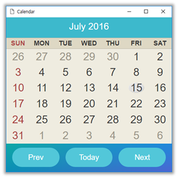
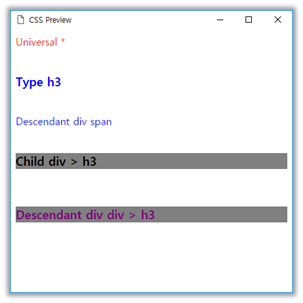

# Previewing Pages in a Browser

To test a Web application, or a single Web page as part of a client application, use the previewer window.

Not only can you preview the source code you have developed, you can also visually define the type and hierarchy of the selector to help development.

## About the Previewer

The Tizen Studio provides a previewer window for instantly previewing the entire look and feel of the application.

The previewer for HTML and CSS is a tool that can check the content of a file in the browser. All changes made in the HTML and CSS file editor are automatically reflected in the previewer.

The following limitations apply to the HTML previewer:

- The Device API cannot be run in the emulator.
- Some network environments do not support live editing.

## Using the HTML and CSS Previewer

To use the HTML and CSS previewer:

1. In the **Project Explorer** view, right-click an HTML or CSS file.
2. In the context menu, select **Preview** (or use the hotkey **Ctrl + 4**).

**Figure: HTML previewer (calendar application in mobile Web) and CSS previewer**

 

You can configure the previewer to suit your own preferences.

You can [set the preview](ide-preferences.md#live) in **Window > Preferences > Tizen Studio > Web > Live Editing**.

> **Note**  
> The previewer is based on the Google Chrome&trade; browser.
>
> The CSS preview can differ from the actual product. It allows you to see the overall outline.
>
> Some selectors and elements do not work on the CSS previewer.

## Related Information
* Dependencies
  - Tizen Studio 1.0 and Higher
