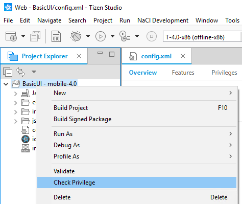
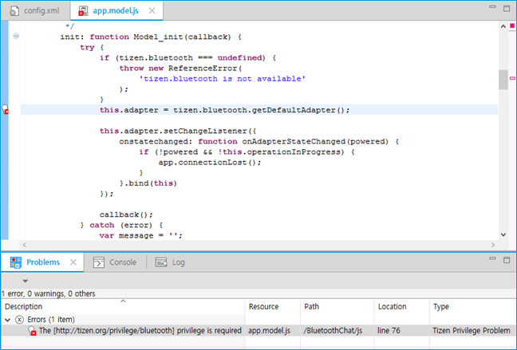
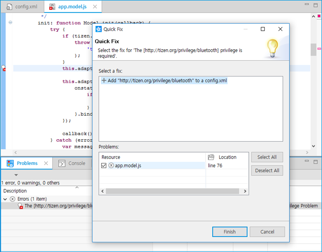

# Verifying Privilege Usage

The Tizen Studio provides a checker to identify potential [privilege](../../web/tutorials/sec-privileges.md) violation problems in the application code. This check is performed automatically, and you can easily verify the source code in your project.

## Using the Privilege Checker

The Privilege Checker is enabled by default. It is automatically performed during the [build process](../../web/tutorials/process/app-dev-process.md#build) or code editing.

To perform the check manually:

1. In the **Project Explorer** view, select the project.
2. Right-click the project folder, and select **Check Privilege**.

**Figure: Privilege Checker**

## Setting the Options

To set the Privilege Checker options, go to **Menu > Preferences > Tizen Studio > Web > Editor > Privilege**.

You can select the options for validation times:

- Build (default)
- Reconcile (default)

You can set the following check levels:

- Ignore
- Warning
- Error (default)

You can exclude JS files from parsing by specifying pattern strings, separated by a comma, in the **Exclude files that match these patterns from validation** field. The default value in this field is **min, jquery, jqm-docs, phonegap, sencha, tizen-web-ui-fw, dowhide, globalize, coderdeck, modernizr, tau**. For instance, since parsing the `jquery.min.js` file generates many warnings, the default pattern string values exclude the parsing of this JS file.

The check results are displayed in the **Problems** view and vertical ruler. To resolve an alarm, click the annotation on the vertical ruler and select an entry from the proposal list. The required privilege is automatically added into the `config.xml` file (for a quick fix, use the **Ctrl + 1** keyboard shortcut).

**Figure: Check results displayed in the Problems view**

**Figure: Required privilege is automatically added**

**Table: Privilege check alarm example**

| Alarm type                | Description                              | Message format                           | Required actions                         |
|-------------------------|----------------------------------------|----------------------------------------|----------------------------------------|
| Undefined privilege alarm | The application uses a method whose privilege is not specified in the configuration file. | **The [tizen:Privilege name] privilege is required.**  For example (in a mobile Web application): **[`http://tizen.org/privilege/application.launch`] privilege is required.** | Assign the privilege in the configuration file in the Tizen Studio. Privilege violation is a strong reason for the rejection of an application in the certification process. |

> **Note**  
> The Privilege Checker tool is based on the [Content Assist](content-assist.md) engine in the Tizen Studio. It is used for code that is not supported by Content Assist and cannot be checked. Therefore, the check results can possibly have missing (unsound) values.

## Related Information
* Dependencies
  - Tizen Studio 1.0 and Higher
