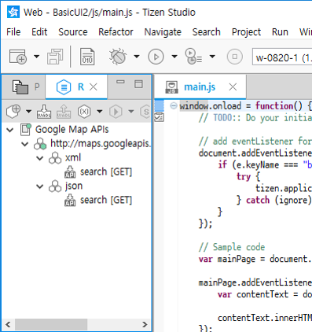
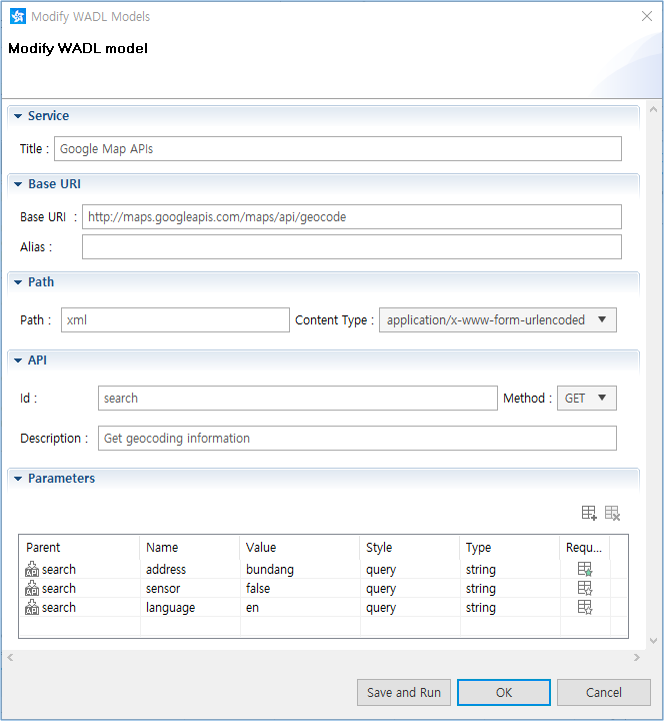
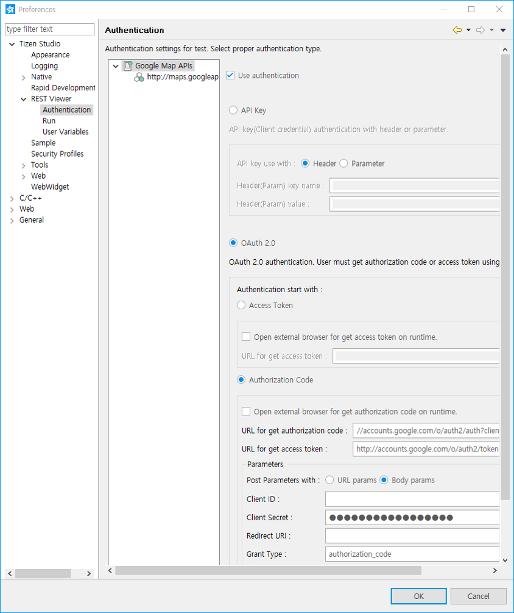
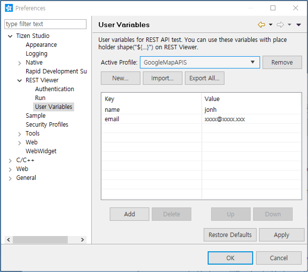
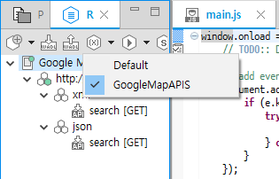
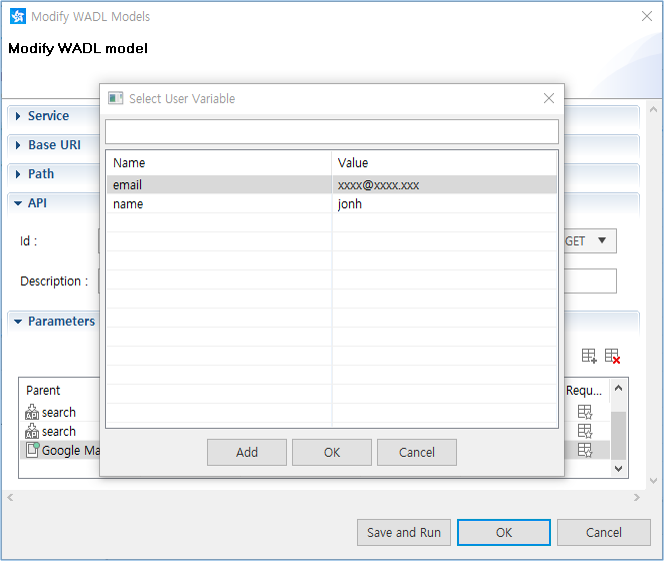
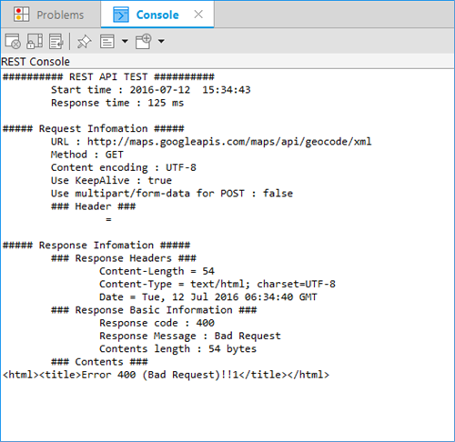
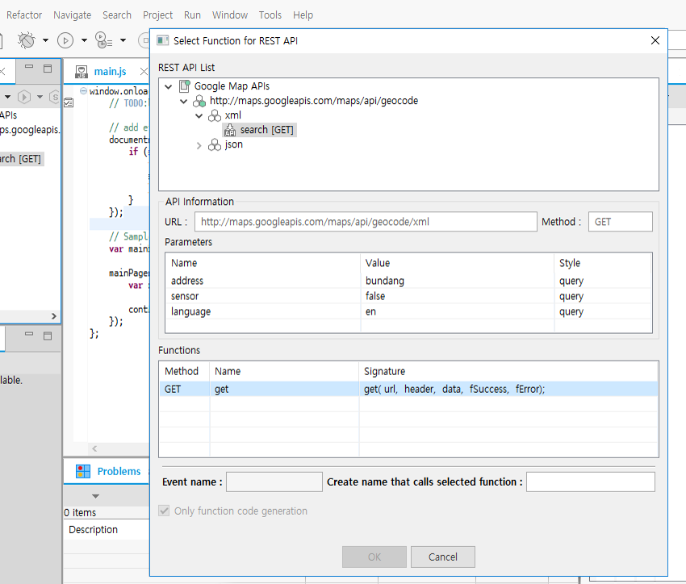

# Using the REST Viewer

With the Tizen Studio, you can use RESTful Web services. The REST Viewer allows you to emulate interaction with a Web service by composing and running requests as if it were an application actually calling the service.

The REST Viewer supports the testing, test case management, and the automatic code generation features of the REST API. You can easily develop Web applications using the REST API.

The REST Viewer offers the following benefits:

- It addresses an inconvenience of the existing development process.

- It provides a complete basic testing and test history management tool, without the need for additional testing tools.

- The automatic code generation features improve coding productivity.

  You do not need to implement a REST API call unit code. It automatically updates whenever the specification of the REST API changes.

There are 2 main use cases when you need to compose and run requests to a RESTful Web service:

- When you have developed a RESTful Web service and want to make sure it works as expected: that it is accessible in compliance with the specification and that it responds correctly.
- When you are developing an application that addresses a RESTful Web service. In this case, it is helpful to investigate the access to the service and the required input data before you start development. During development, you can also call the Web service from outside your application. This can help locate errors where your application gives unexpected output even though no logical errors are detected in your code, and you suspect that the bottleneck is the interaction with the Web service.

## Using the REST Viewer

The REST Viewer displays the components of the [WADL](http://www.w3.org/Submission/wadl/) (Web Application Description Language) document in a hierarchical structure.

The viewer loads the documents from a specific location and classifies them as 4-typed WADL components.

**Figure: REST Viewer**

The WADL document can contain 4 types of WADL components:

-  Service (application): The application element forms the root of a WADL description.
-  Base URI (resources): The resources element acts as a container for the resources provided by the application.
-  Path (resource): The resource element describes a set of resources, each identified by a URI that follows a common pattern.
-  API (method): The method element describes the input to and output from an HTTP protocol method that can be applied to a resource.

To open the REST Viewer settings, go to **Preferences > Tizen Studio > REST Viewer**, or click the  icon on the **REST Viewer** view toolbar.

## Creating and Managing WADL Components

To use the REST Viewer, you need a WADL document. If a WADL document is provided by the REST API service provider, you can import it. You can also export a test case so that others can use it.

With the REST Viewer, you can make new WADL components, and import and export WADL files. You can handle a selected WADL component only if you open a dialog to modify it. You cannot modify the selected component's parent or child components at the same time.

> **Note**  
> Some attributes are required to make a structure for the tree viewer even if they are optional in the WADL schema.

To manage the WADL components, in the **REST Viewer** view toolbar, click the following icons:

- : Add new WADL components.
- : Import a WADL file and show the WADL models from a local WADL file or URL.
- : Export the selected WADL models as a `.wadl` file.

When you add a new WADL component, you must define its place in the WADL structure in the addition dialog. The WADL structure is "Service > Base URI > Path [> Path] > API".

**Figure: Adding a WADL component**

Fill in the necessary details:

- **Service**

  **Title** (required): Short plain text description of the element being documented

- **Base URI**

  **Base URI** (required): Base URI for each child resource identifier

  **Alias** (optional)

- **Path**

  **Path** (required): Relative URI template for the resource identifier

  **Content Type** (default): Media type for the query component of the resource URI

- **API**

  **Id** (required): Method identifier

  **Method** (default): Used HTTP method

  **Description** (optional)

- **Parameters**

  Describe the input to the method as a collection of parameters:
  - **Parent**: Name of component to manage the parameters
  - **Name**: Parameter name
  - **Value**
  - **Style**: Parameter style:
    - **Header**: HTTP header for use in the request
    - **Query**: URI query parameter for the method
    - **File**
  - **Type**: Parameter type as an XML-qualified name
  - **Required**: Whether the parameter is required to be present

## Authenticating the Application

The REST Viewer can help you test applications that require authentication services.

To test the authentication, go to **Preferences > Tizen Studio > REST Viewer > Authentication**, and select **Use authentication**.

In the same location, you can define the authentication details:

- API Key authentication with a header or parameter
- OAuth 2.0 authentication information for a RESTful API

**Figure: Authentication details**

## Testing the APIs

You can test the selected API on the REST Viewer and view the results.

You can run a test using 1 of the following options:

- Click the  icon on the **REST Viewer** view toolbar. The view displays the run history.
- Right-click the selected API and run the test from the context menu.
- Click **Save and Run** in the dialog when adding or modifying components.

APIs that work with variables need specified values for testing. Each profile has its own user variables (key and value). You can manage the profiles and user variables in the Preferences window. After the user variables are set, you can use them with a placeholder to test the API (for example, `${email}`).

**Figure: User variables**

You can select an active profile in the REST Viewer user variable toolbar menu. When you test the APIs in the REST Viewer, the user variables of the selected profile are used.

**Figure: Selecting a profile**

The user variables of the active profile are shown when you set the values for an API.

**Figure: Selecting a user variable**

After setting the variables and running the test, the result is displayed in the **Console** view. You can save the response structure.

**Figure: Test result**

## Automatic Code Generation

You can use the REST Viewer to send asynchronous requests with the REST APIs.

There are 2 ways to use automatic code generation:

- Use the content assist feature.

  You can activate the content assist with the prefix `rest.`.

- Drag and drop:

  1. Select the API model in the REST Viewer, and drag and drop it to the Web HTML Editor.
  2. Select the functions at the bottom of the dialog to get the code.

**Figure: Selecting functions for the REST API**

## Related information
* Dependencies
  - Tizen Studio 1.0 and Higher
