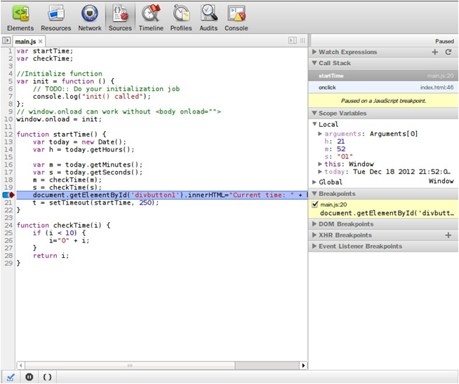
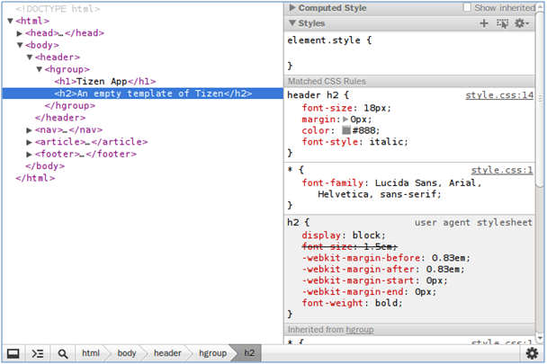
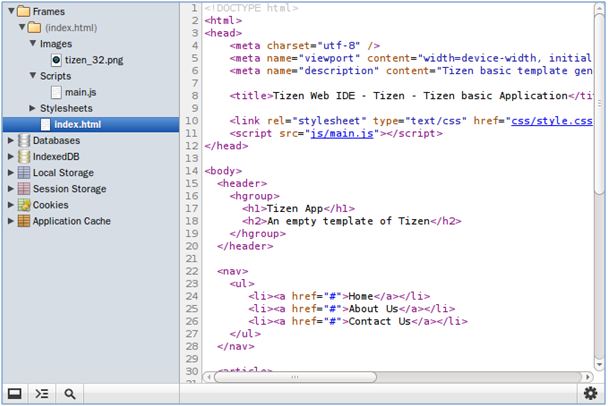
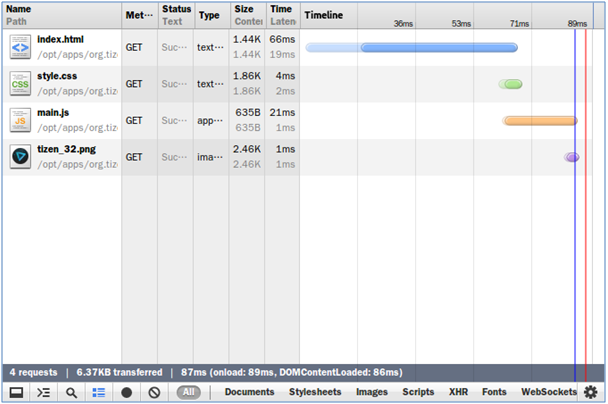
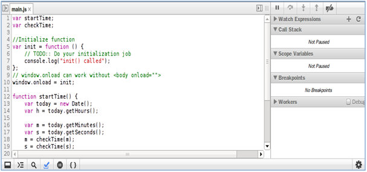
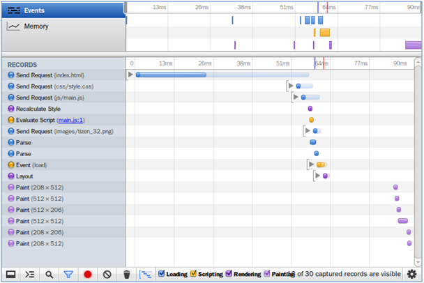
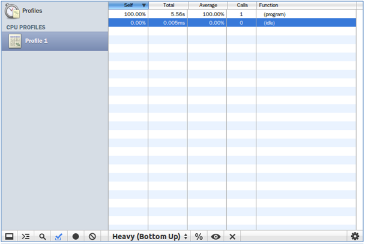
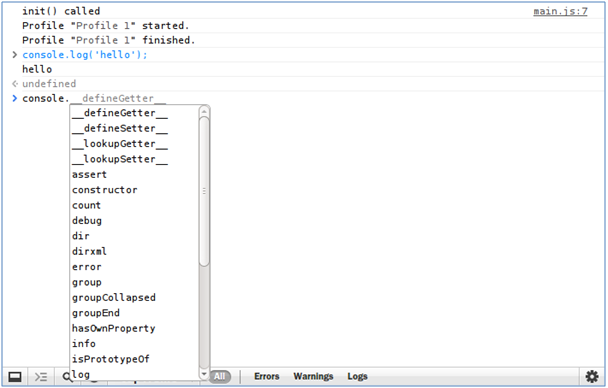

# Debugging with Web Inspector

You can [debug Web applications](../../web/tutorials/process/run-debug-app.md) using the JavaScript Debugger tool. The JavaScript Debugger is based on Webkit Web Inspector, and has been modified to support remote debugging.

The JavaScript Debugger supports the following panels:

- [Elements Panel](#element)
- [Resources Panel](#resource)
- [Network Panel](#network)
- [Sources Panel](#source)
- [Timeline Panel](#time)
- [Profiles Panel](#profile_panel)
- [Console Panel](#console)

**Figure: JavaScript Debugger panels**

When debugging with the [emulator](../common-tools/emulator.md), the emulator communicates with the Google Chrome&trade; browser through the HTTP protocol.

When the JavaScript Debugger is started, the **Network** panel is off. To enable the **Network** panel and start monitoring the resource loading status, press the F5 key. This reloads the current page and displays the load time on the **Network** panel.

## Elements Panel

The **Elements** panel of the JavaScript Debugger allows you to see the Web page components (the DOM tree, CSS style, and Document Object Model).

**Figure: Elements panel**

## Resources Panel

The **Resources** panel of the JavaScript Debugger allows you to inspect resources. You can interact with frames containing resources, such as HTML, JavaScript, CSS, images, and fonts. You can also inspect HTML5 databases, local storage, cookies, and application cache.

**Figure: Resources panel**

## Network Panel

The **Network** panel of the JavaScript Debugger allows you to inspect resources downloaded over the network. You can also inspect the HTTP header, response, cookies, and preview.

**Figure: Network panel**

## Sources Panel

The **Sources** panel of the JavaScript Debugger allows you to inspect the JavaScript source page. You can debug your JavaScript code. This panel supports watch expressions, callstack, scope variables, and break point operation. In addition, it supports basic debugging operations: continue, step over, step into, and step out.

**Figure: Sources panel**

## Timeline Panel

The **Timeline** panel of the JavaScript Debugger allows you to perform advanced timing and speed analysis. You can see how long the browser takes to handle DOM events, and render and paint windows.

**Figure: Timeline panel**

## Profiles Panel

The **Profiles** panel of the JavaScript Debugger allows you to inspect the JavaScript performance analyses. You can inspect CPU profiles or CSS Select profiles.

**Figure: Profiles panel**

## Console Panel

The **Console** panel of the JavaScript Debugger allows you to inspect the JavaScript console operation. You can interact with your page programmatically. Any errors or warnings on your page are shown in the console.

**Figure: Console panel**

## Related Information
* Dependencies
  - Tizen Studio 1.0 and Higher
