# Localizing Web Applications

Localization is the process of adapting your application for a specific region or language. Localization allows the application access to different resources without source code changes.

Because a single language can be used in multiple parts of the world, your application must adapt to the regional and cultural conventions of where the application users reside.

The Tizen Studio provides several technologies to help you develop an internationalized application. The **Web Localization** view is a tool which helps you localize strings, resources, and content of a Tizen Web project.

This topic describes how to localize your application.

## Opening the Web Localization View

To open the **Web Localization** view:

1. Right-click the selected project in the **Project Explorer** view.
2. Click **Localization**.

**Figure: Opening the Web Localization view**

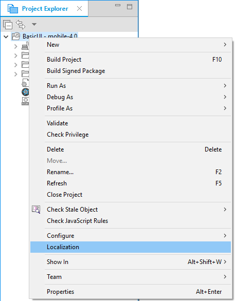

## Adding Locales

To use localized strings and resource content, you must add locales for them:

1. Click the **Add locale(s)** button ().

   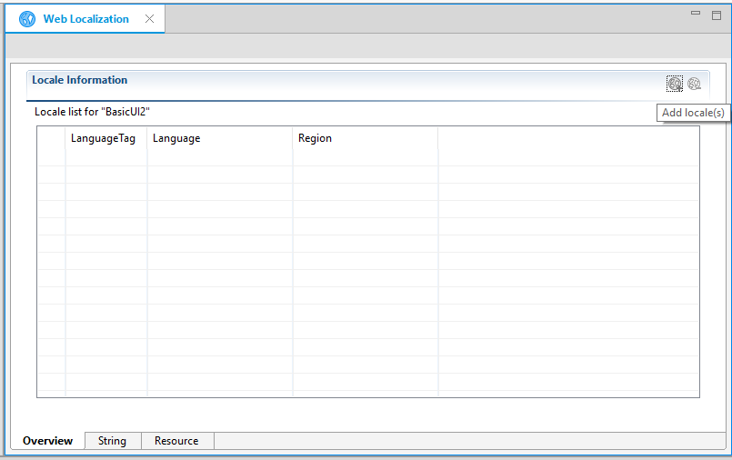

2. In the **New Target Locale** table, select the locales you want.

   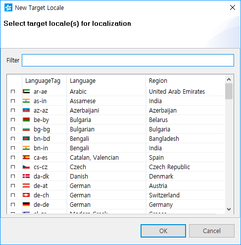

3. To confirm the selected locale information, click **OK**.

**Figure: Added locales**

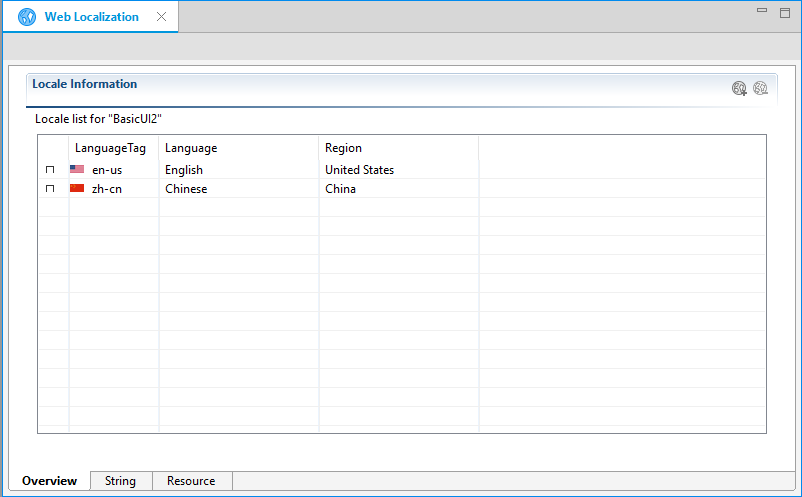

A container named locales is created for the localized content. Under the container, a subfolder for a locale is added when you set a locale. For example, `/locales/en-us` and `/locales/zn-cn`.

## Creating and Managing Localized Strings

To localize and handle strings, use the **String** tab:

1. To add a localized string, click the **Add localization** button () on the toolbar.

   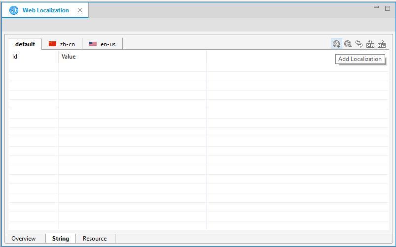

2. In the **New Localization** dialog, enter the identifier for the localized string content. In the table, enter values for the default locale and all the locales you have specified in the **Overview** tab. 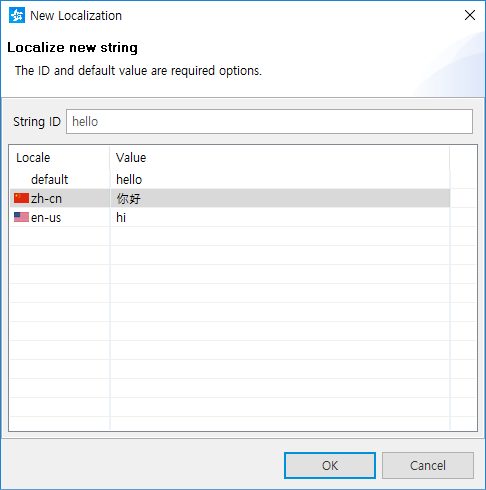

3. To save the localized string content, click **OK**.

You can check the defined strings in the **String** tab.

**Figure: Defined strings**

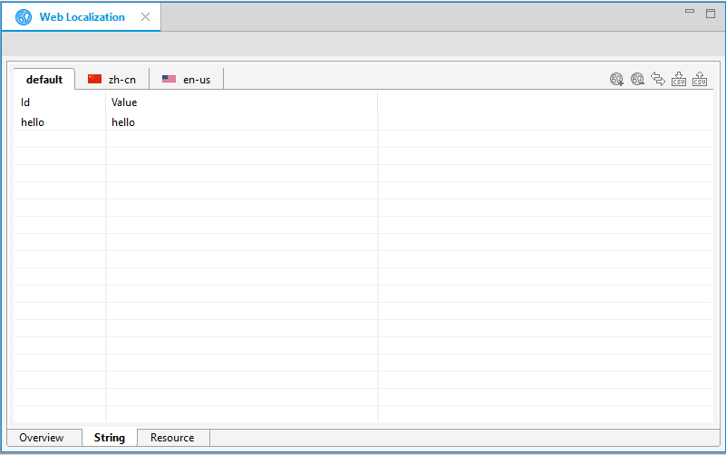

You can add more items to the table or remove them, as needed.

You can change the table tab configuration between ID and Locale by clicking the **Change ViewMode** button ().

**Figure: String-based viewmode**

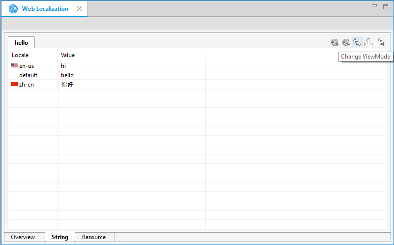

When the string localization is complete, the following modifications are made in the project:

- `language.js` file is created in the application's top-level folder and in each locale folder under `locales`, containing the localized string content.

  **Figure: language.js**

  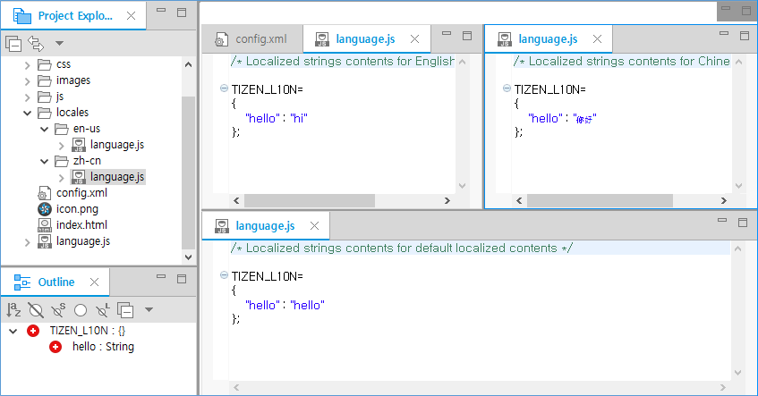

- The `<script>` element, whose `src` attribute is `language.js`, is added to the `index.html` file.

  **Figure: src element in index.html**

  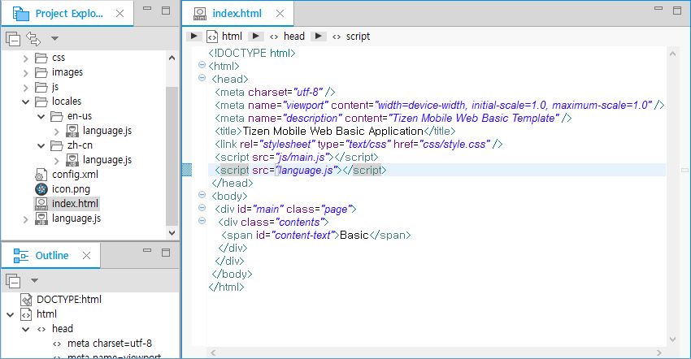

  > **Note**  
  > For more information on using localized string content, see [Localization](https://developer.tizen.org/development/guides/web-application/localization).

### Using Resources for Localization

In the **Resource** tab, you can localize resource files, such as images, sound, video, HTML, and JavaScript more efficiently. The **Resource** tab displays the resources of the project in a tile form.

**Figure: Resource tab**

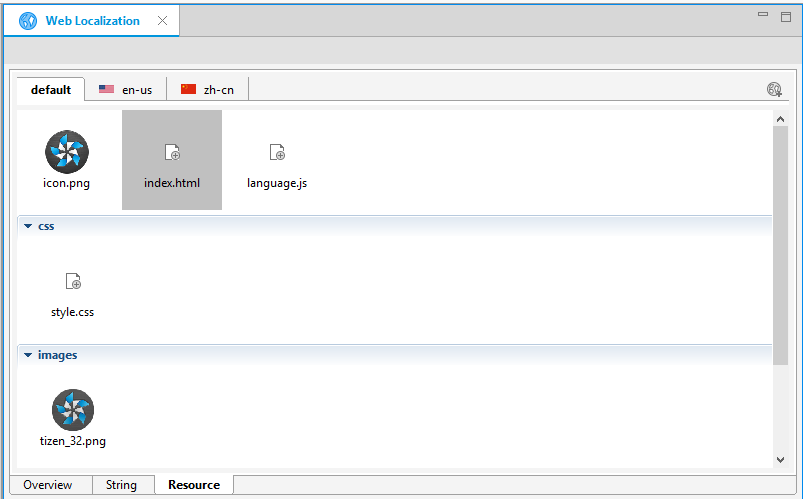

If a resource is not localized, the **+** button appears on the resource tile.

**Figure: Missing resource file**

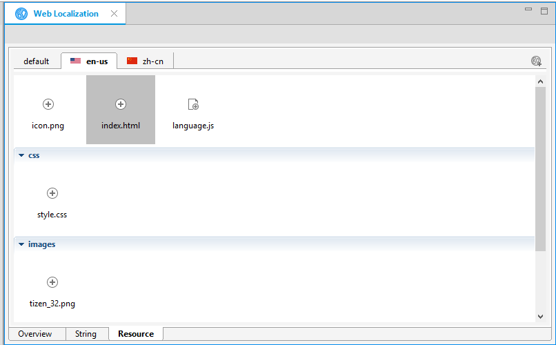

To localize the missing resource:

1. Click the **+** button on the resource tile.

2. In the **Select a file to set** dialog, select a new resource to replace the default resource, and click **OK**.

   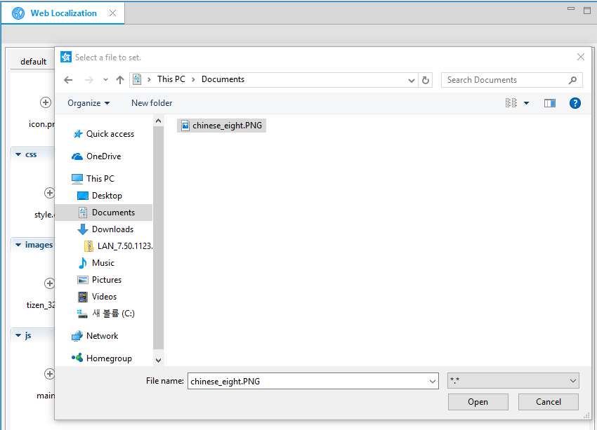

   The complex folder structures are created and the names of the resource files are replaced.

## Folder-based Localization

Folder-based localization places the resources inside locale folders with names determined by the language tag, such as **en-us** and **ko-kr**. The locale folders are located under a container folder named `locales`. The localized resources are used depending on the location settings of the device. If there are no localized resources, the default resource is used.

For example, if the locale of a device is **ko-kr**, the  `images/a.png` and `images/c.png` images are replaced with the `locales/ko-kr/images/a.png` and `locales/ko-kr/images/c.png` images. However, the `images/b.png` image is not replaced, because there is no applicable resource in the `locales/ko-kr/images/` folder.

```
root/
   images/
      a.png
      b.png
      c.png
   locales/
      ko-kr/
         images/
            a.png
            c.png
```

## Related information
* Dependencies
  - Tizen Studio 1.0 and Higher
