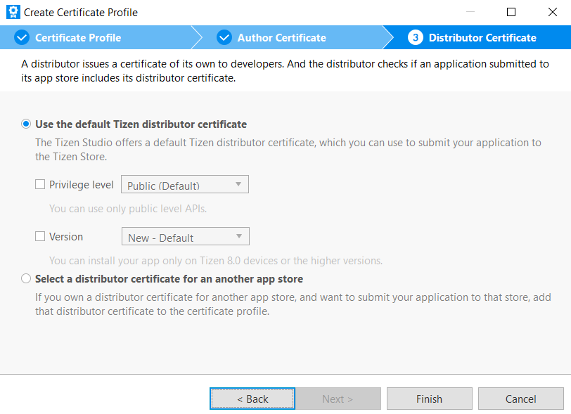
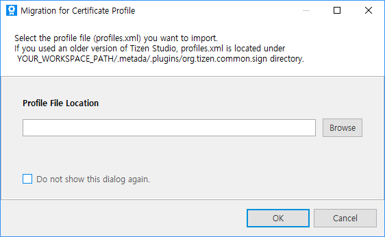

# Working with the Certificate Profile

Before installing your application on a device or submitting it to the Tizen Store, it must be signed with a certificate profile. The signature verifies the source of the application and makes sure it has not been tampered with since its publication. A certificate profile is a combination of the certificates used for signing, and it can be created, edited, removed, and set as active with the Certificate Manager. The active certificate profile is used when packaging your application.

## Certificate Profile and Certificates

The certificate profile consists of an author certificate and 1 or 2 distributor certificates. To distribute your application, you must create a certificate profile and sign the application with it:

- An author certificate includes information about the author of the application. It is used to create an author signature, which ensures the integrity of the application from the author since the publication of the application.
- A distributor certificate includes information about the distributor of the application, such as a store. It is used to create a distributor signature, which ensures the integrity of the application from the distributor since the distribution of the application.

## Creating a Certificate Profile

You can create a new certificate profile with the Certificate Manager:

1. In the Tizen Studio menu, select **Tools > Certificate Manager**.

   

2. In the Certificate Manager window, click **+** to create a new profile.

   

   The certificate profile creation wizard opens.

3. Enter a name for the profile and click **Next**.

   

4. Add the author and distributor certificates:

   1. Select whether to create a new author certificate or use a previously created author certificate, and click **Next**.

      

      Define the existing author certificate or enter the required information for a new certificate, and click **Next**.

      

   2. You can use the default Tizen distributor certificate or another distributor certificate if you have one. In general, the default Tizen distributor certificate is used and you do not need to modify the distributor certificates. You can also select the privilege level of the distributor certificate (in [native](../../native/tutorials/details/sec-privileges.md) and [Web](../../web/tutorials/sec-privileges.md) applications).

      

   3. Click **Finish**.

## Managing Certificate Profiles

You can view, edit, and remove the certificate profiles you have created.

**Figure: Managing certificate profiles**

To manage a certificate profile:

- To see the details of an individual certificate within the selected certificate profile, click the info button .

  **Figure: Certificate information**

  

- To change the author or distributor certificate of the selected certificate profile, click the pencil button .

  **Figure: Changing the certificate**

  

- To remove the selected certificate profile, click the trash button ().

- To set the selected certificate profile as active, click the check button .

  The active profile is used when you package your application.

  **Figure: Removing the certificate profile or setting it active**

  

## Migrating Certificate Profiles

You can migrate existing certificate profiles by importing a `profiles.xml` file.

To migrate a certificate profile:

1. Click the migrate button () in the Certificate Manager.

2. Select the profile file you want to import and click **OK**.

   

3. If the certificate profile being imported has the same name as one already in use, you can select 1 of 3 ways of resolving the situation: overwrite the existing profile with the imported one, preserve the existing profile, or keep both profiles. Select the option you want and click **OK**.

   

## Related Informatioin
- Dependencies  
  - Tizen Studio 1.0 and Higher
