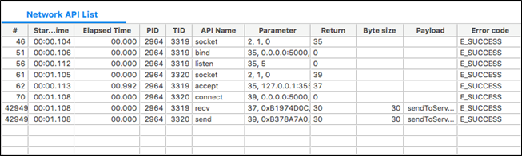

# Performing Network Analysis

The **Network** tab of the Dynamic Analyzer displays network information. It only supports the socket APIs of glibc.

The tab consists of the following views:

- [Network chart](#chart) shows socket operations (open/close, using, failed) as a time flow chart.
- [Network API List](#api_list) table shows the socket APIs that are associated with the socket selected in the socket chart.
- [Network Details](#details) view shows detailed information about the socket selected in the socket chart.

**Figure: Network analysis**

## Network Chart

The network chart displays the socket object in a tree format using a graph.

**Figure: Network chart**

The color of the horizontal bar in the chart indicates the state of the socket:

- Yellow area indicates the socket state is open.
- Green area indicates the socket is closed.

The line in the bar indicates the status of the API of the socket:

- The upper line:
  - Blue line indicates that the API has been used.
  - Red line indicates that the API has failed.
- The lower line:
  - Purple area or line indicates the read area of the socket.
  - Lime green area or line indicates the write area of the socket.

## Network API List

The Network API List table displays the APIs associated with the socket object selected in the network chart.

**Figure: Network API List table**

The table contains the following columns:

- **#** (integer): Unique log index
- **Start Time** (time): Time when the API was called
- **Elapsed Time** (time): Time to return after the call
- **PID** (integer): API process ID
- **TID** (integer): API thread ID
- **API Name** (text): API name
- **Parameter**: Input parameter of the API
- **Return** (integer): Return value
- **Byte size** (integer): Byte size received from the destination address
- **Payload** (text): Content of the data transfer
- **Error code** (text): Error description of the API; a normal end return is **E_SUCCESS**

## Network Details

The Network Details view displays detailed information about the network socket object selected in the network chart.

**Figure: Network Details view**

The view contains the following fields:

- **Address**: Destination address
- **Receive size**: Byte size received from the destination address
- **Send size**: Byte size sent to the destination address
- **Usage time**: Time using the socket object API
- **API count**: Total API count that is associated with the destination address
- **Failed API count**: Number of failed APIs
- **send ack time**: Received time after sending to the destination address
- **Payload (ASCII)**: Content of the data transfer as ASCII
- **Payload (hex Code)**: Content of the data transfer as Hex code

## Related information
* Dependencies
  - Tizen Studio 1.0 and Higher
