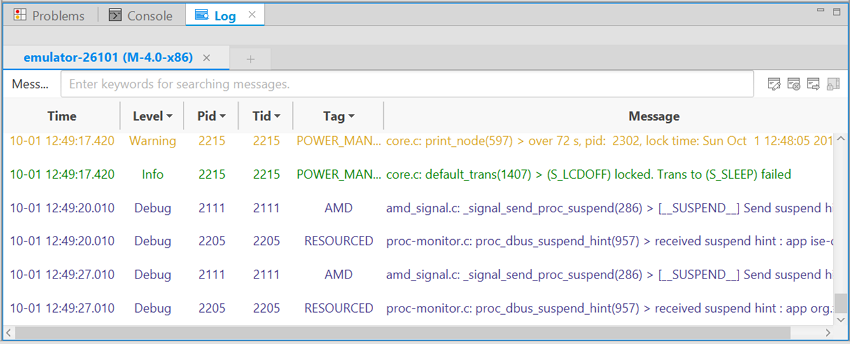

# Checking Logs with Log View

This topic explains how to insert logging methods to your code and check the logs of your application in the **Log** view.

## Viewing Logs in Log Tabs

By default, the **Log** view is located at the bottom of the **Native** perspective. If you want to open the **Log** view manually, go to **Window > Show View > Other > Log** in the Tizen Studio menu.

The **Log** view helps you debug your application by capturing all the events logged by the platform and your application. The **Log** view shows the logs through the [dlog logging service](../../native/guides/error/system-logs.md). The service consists of the dlogutil and dlog library. You can also see logs with the `dlogutil` command in the CLI environment, and create log entries with the dlog library.

**Figure: Log view**

### Creating a Log Message

You can create a log message in your application with the dlog library. Before using the dlog library, make sure you know which priorities and tags to use and how to send the message to the log device. With appropriate properties and tags, it is easy to filter and check messages.

For more information, see the [System Logs](../../native/guides/error/system-logs.md) guide.

### Adding and Removing the Log Tab

Each device has at least 1 default log tab associated with it. If a device is connected, the default log tab is not editable or removable. However, you can add a new log tab with more filtering options. The added log tabs are editable and removable.

- Adding a log tab:

  1. Click the **Add LogTab** button ().

  2. Enter the tab name in the **Name** field and select a device in the **Device** list.

  3. Enter the search keywords in the **Tag**, **Pid**, and **Message** fields.

  4. Click **OK**.

     

- Removing a log tab:

  1. Click the log tab to be removed.

  2. Click the **Remove LogTab** button ().

## Understanding and Filtering Logs

The log table consists of the following fields:

- **Time**: log time
- **Level**: priority level indicates the urgency of the log message
- **Pid**: process ID
- **Tid**: thread ID
- **Tag**: identification of the log message source
- **Message**: log message

**Figure: Log table fields**

In the log table, you have the following options and functions:

- Log level filtering option

  In the **Log** view, you can filter the log messages using the **V** (verbose), **D** (debug), **I** (info), **W** (warning), **E** (error), and **F** (fatal) buttons to show the log messages matching the selected type.

- Keyword filtering option

  You can filter the log messages by selecting one of the **PID**, **Tag**, and **Message** options, or entering keywords in the bottom of the **Log** view. The keywords must be separated by a space or a comma.

- Scroll lock

  The log table shows the latest logs by default. While the application is running, the log table scrolls as new logs are added to the table. To stop the table from scrolling while you are checking a specific log, click the **Scroll Lock** button ().

- Clearing the table

  You can remove all log messages from the log tab by clicking the **Clear the log** button ().

- Exporting logs to a file

  You can export the current log messages in the log tab and save them as a log file by clicking the **Export the log** button ().

## Related information
* Dependencies  
  - Tizen Studio 1.0 and Higher
