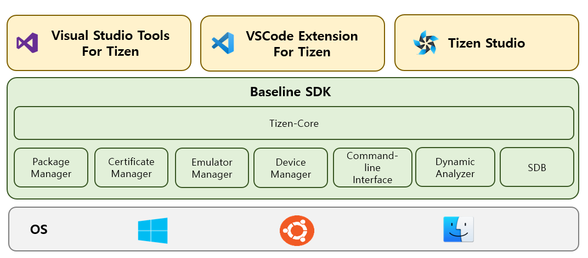

# Overview Tizen SDK

Tizen SDK supports IDE Extensions for Tizen App development based on three IDEs(Eclipse based Tizen Studio, Visual Studio, Visual Studio Code).

IDE Extensions share Baseline SDK, which is a common tool required for Tizen application development.

Baseline SDK includes the following standalone tools.

* Tizen-Core : Consistent Tizen SDK interface to use baseline tools and CLI from various IDE and external tools.
* Package Manager : a comprehensive package management tool for installing, updating, and removing tizen platform and sdk components
* Certificate Manager : Tizen certificate management tools to store developer's certificates for singing Tizen application.
* Emulator Manager : Tool to create and manage emulator instances.
* Device Manager : Standalone tool that manages device and allows you to access your internal file systems and logs.
* Command-line Interface : CLI provides functionalities for entire Tizen application development process by using the terminal.
* Dynamic Analyzer : Native profiling tool for Tizen application
* SDB (Smart Device Bridge) : Command line tool that communicates with a conneted target device (It can be an emulator instance of a real Tizen devce like TV)

**Figure : Overview Tizen SDK Components**

  

Tizen SDK provides various development tools and platform resources for native (c, c++), web(HTML, JS, CSS), and .NET(c#) application and also supports hybrid application packaging tool.

Developers can use "Visual Studio Code Extension for Tizen" or "Visual Studio Tools for Tizen" for developing all types of application supported by Tizen platform from project creation to onboarding debug and tests on actual devices.

> **Note**
> Tizen Studio does not currently support .NET application development.

| Development Tools              | Native                                      | Web                                         | .NET                                                                                                                                                              |
| ------------------------------ | ------------------------------------------- | ------------------------------------------- | ----------------------------------------------------------------------------------------------------------------------------------------------------------------- |
| Project Creation               | Project wizard & Templates                  | Project wizard & Templates                  | Project wizard & Templates                                                                                                                                        |
| Build Tools                    | GCC, Ninja/Make                             | -                                           | `dotnet sdk` or `MSBuild`                                                                                                                                     |
| Configuration Tool             | Manifest Editor                             | Web Config Editor                           | -                                                                                                                                                                 |
| Code Edit Tool                 | Content Assist API & Privilege Checker | Content Assist API & Privilege Checker | Content Assist                                                                                                                                                    |
| Debugger                       | GDB                                         | Web Inspector                               | Netcoredbg                                                                                                                                                        |
| Static Analyzer                | Static Analyzer                             | JavaScript Analyzer                         | -                                                                                                                                                                 |
| Unit Test & Code Coverage Tool | gtest & gcov                                | `<QUnit>`                                 | `<NUnit>` ※ .NET Unit Test Tool is provided by .NET CLI. You can refer to [LINK](https://learn.microsoft.com/en-us/dotnet/core/testing/#testing-tools) |
| Address & Leak Sanitizer       | ASAN/LSAN                                   | -                                           | -                                                                                                                                                                 |
| Profiler                       |  Dynamic Analyzer T-Trace         | Web Inspector                               | Core Profiler Memory Profiler .NET Diagnostics (dotnet dummp/Trace, GC dump)                                                                      |
