# Tizen Doctor
Tizen Doctor is a CLI tool to **verify Tizen App Development setup** across various environments like:
- Tizen Studio
- Visual Studio (VS)
- Visual Studio Code (VS Code)
- .NET
- Native
- Web

The tool checks the installation status and version of Tizen Studio, Tizen Extesnions, Visual Studio, Visual Studio Code, .NET, .NET workload, Google Chrome etc. Additionally, it verifies the status of key components such as the Samsung Certificate Extension, HTTP proxy configuration, and hardware acceleration support.

### 🛠️ Usage

```bash
tizendoctor [command] [options]
```

---

### 🔧 Options

| Option        | Description               |
|---------------|---------------------------|
| `-V`, `--version` | Show tool version        |
| `-h`, `--help`    | Show help instructions  |

---

### 📂 Commands

| Command                             | Description                                                 |
|-------------------------------------|-------------------------------------------------------------|
| `set-tizen-studio <dir>`           | Set the Tizen Studio installation path                       |
| `set-tizen-studio-data <dir>`      | Set the Tizen Studio data path                               |
| `set-http-proxy <url>`             | Configure HTTP proxy server                                  |
| `verify [tool-name]`               | Verify development environment for a specific tool           |
| `report-issue`                     | Report setup-related issues or bugs                          |

---

### 🔍 Verify Environment

| Command                                             | Description                                                                 |
|-----------------------------------------------------|-----------------------------------------------------------------------------|
| `tizendoctor verify tizen-studio`                   | Verify Tizen Studio setup (default: includes native checks)                  |
| `tizendoctor verify tizen-studio web`               | Verify Tizen Studio setup for Web app development                           |
| `tizendoctor verify vs`                             | Verify Visual Studio setup for Tizen (default: includes .NET checks)        |
| `tizendoctor verify vs native`                      | Verify Visual Studio setup for Tizen Native app development                 |
| `tizendoctor verify vs web`                         | Verify Visual Studio setup for Tizen Web app development                    |
| `tizendoctor verify vscode`                         | Verify VS Code setup for Tizen (default: includes .NET checks)              |
| `tizendoctor verify vscode native`                  | Verify VS Code setup for Tizen Native app development                       |
| `tizendoctor verify vscode web`                     | Verify VS Code setup for Tizen Web app development                          |
| `tizendoctor verify dotnet`                         | Verify Tizen .NET app development setup                                     |
| `tizendoctor verify native`                         | Verify Tizen native app development setup                                   |
| `tizendoctor verify web`                            | Verify Tizen web app development setup                                      |


---

### 📝Command Output Examples
* #### tizendoctor --help
  This command displays all available options and commands.
  

* #### tizendoctor verify --help
  To get detailed help for a specific command, use the `--help` option after the command name. For example, here it shows the explanation of what the `verify` command does.
  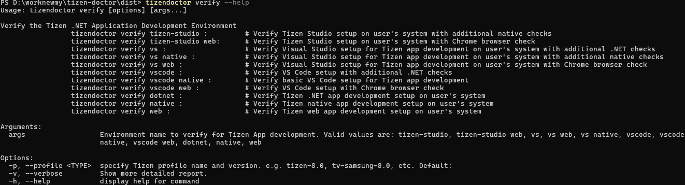

* #### tizendoctor set-tizen-studio
   This command sets the Tizen Studio root directory path.
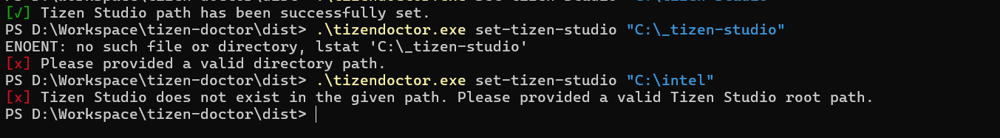

* #### tizendoctor set-tizen-studio-data
  This command sets the Tizen studio data root directory path.
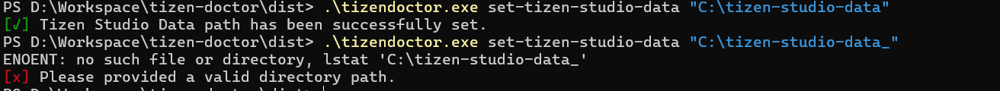

* #### tizendoctor set-http-proxy
  This command sets the HTTP proxy URL.
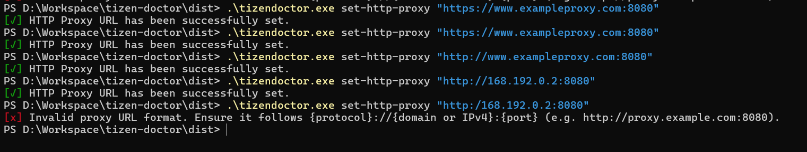

* #### tizendoctor verify tizen-studio
  Performs essential checks for Tizen Studio setup and integrity, with a focus on Native app development by default:
  
  1. **Tizen Studio Path & SDK Version**  
   Ensures Tizen Studio is correctly configured and retrieves SDK version.
  2. **Tizen Distribution Version**  
   Checks the distribution version of the installed Tizen Studio.
  3. **Tizen Profile Installation**  
   Confirms if the required Tizen profile for Native development is fully installed.

  > ⚠️ If any check fails, Tizen Doctor provides guidance to fix the issue.

  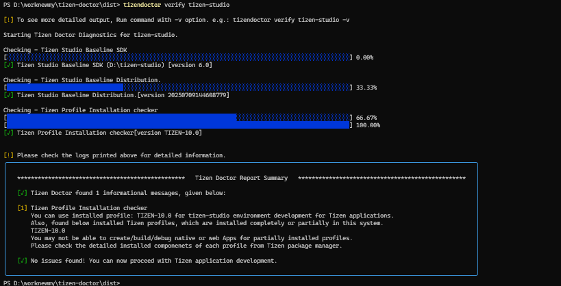

* #### tizendoctor verify tizen-studio web
  Performs essential checks for Tizen Studio setup and integrity, with a focus on Web app development:
  
  1. **Tizen Studio Path & SDK Version**  
   Ensures Tizen Studio is correctly configured and retrieves SDK version.
  2. **Tizen Distribution Version**  
   Checks the distribution version of the installed Tizen Studio.
  3. **Tizen Profile Installation**  
   Confirms if the required Tizen profile for Web development is fully installed.
  4. **Google Chrome Checker**  
   Checks Google Chrome is installed, reports its path if found, and identifies the system’s default web browser.

  > ⚠️ If any check fails, Tizen Doctor provides guidance to fix the issue.

  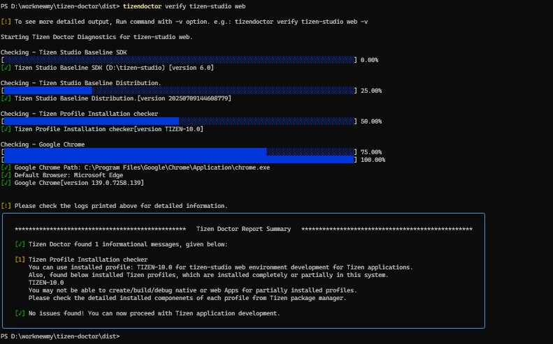

* #### tizendoctor verify vs
  > 🔒 Note: Visual Studio is only available on Windows OS. This command must be executed on Windows to function properly.

  Performs verification checks to ensure both Visual Studio and Tizen Studio are properly set up for Tizen .NET app development by default.  

  1. **Visual Studio**  
   Verifies installation and version of Visual Studio.
  2. **Visual Studio Workloads**  
   Checks for required workloads:
     * .NET Desktop Development  
     * .NET MAUI  
     * Desktop Development with C++
  3. **VS Tizen Extension Checker**  
   Verifies "Visual Studio Tools for Tizen" extension is installed.
  4. **Tizen Studio Path & SDK Version**  
   Ensures Tizen Studio is correctly configured and retrieves SDK version.
  5. **Tizen Profile Installation**  
   Confirms if the required Tizen profile for .NET development is fully installed.
  6. **.NET SDK Checker**  
   Verifies .NET SDK installation and ensures it meets the minimum version requirements.
  7. **.NET Workload Checker**  
   Checks if the Tizen .NET workload is installed and retrieves its version.
  8. **HTTP Proxy Checker**  
   Detects if proxy settings are needed and provides setup guidance.

  > ⚠️ If any check fails, Tizen Doctor provides guidance to fix the issue.

  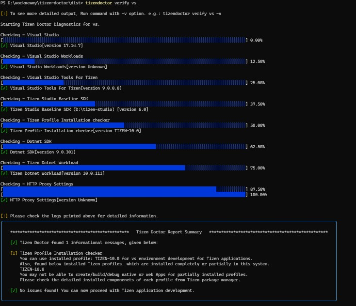

* #### tizendoctor verify vs native
  Performs verification checks to ensure both Visual Studio and Tizen Studio are properly set up for Tizen Native app development.  

  1. **Visual Studio**  
   Verifies installation and version of Visual Studio.
  2. **Visual Studio Workloads**  
   Checks for required workloads:
     * .NET Desktop Development  
     * .NET MAUI  
     * Desktop Development with C++
  3. **VS Tizen Extension Checker**  
   Verifies "Visual Studio Tools for Tizen" extension is installed.
  4. **Tizen Studio Path & SDK Version**  
   Ensures Tizen Studio is correctly configured and retrieves SDK version.
  5. **Tizen Profile Installation**  
   Confirms if the required Tizen profile for Native development is fully installed.

  > ⚠️ If any check fails, Tizen Doctor provides guidance to fix the issue.

  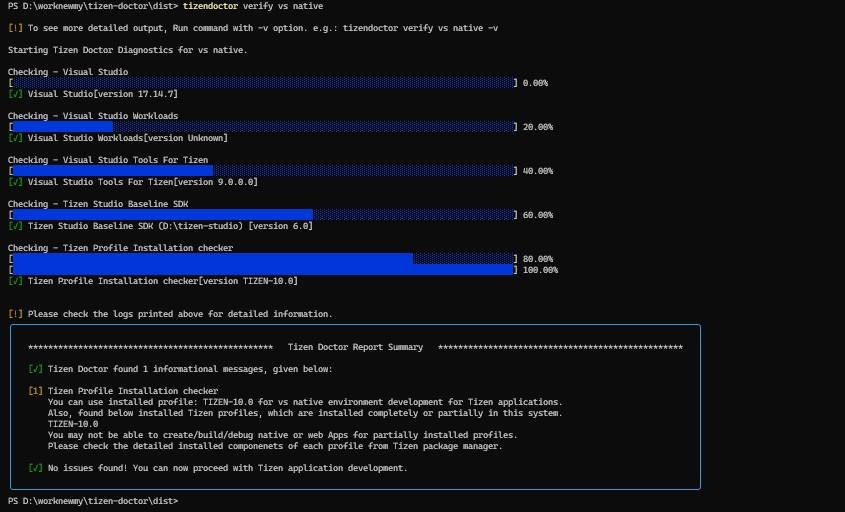

* #### tizendoctor verify vs web

  Performs verification checks to ensure both Visual Studio and Tizen Studio are properly set up for Tizen Web app development.  

  1. **Visual Studio**  
   Verifies installation and version of Visual Studio.
  2. **Visual Studio Workloads**  
   Checks for required workloads:
     * .NET Desktop Development  
     * .NET MAUI  
     * Desktop Development with C++
  3. **VS Tizen Extension Checker**  
   Verifies "Visual Studio Tools for Tizen" extension is installed.
  4. **Tizen Studio Path & SDK Version**  
   Ensures Tizen Studio is correctly configured and retrieves SDK version.
  5. **Tizen Profile Installation**  
   Confirms if the required Tizen profile for Web development is fully installed.
  6. **Google Chrome Checker**  
   Checks Google Chrome is installed, reports its path if found, and identifies the system’s default web browser.

  > ⚠️ If any check fails, Tizen Doctor provides guidance to fix the issue.

  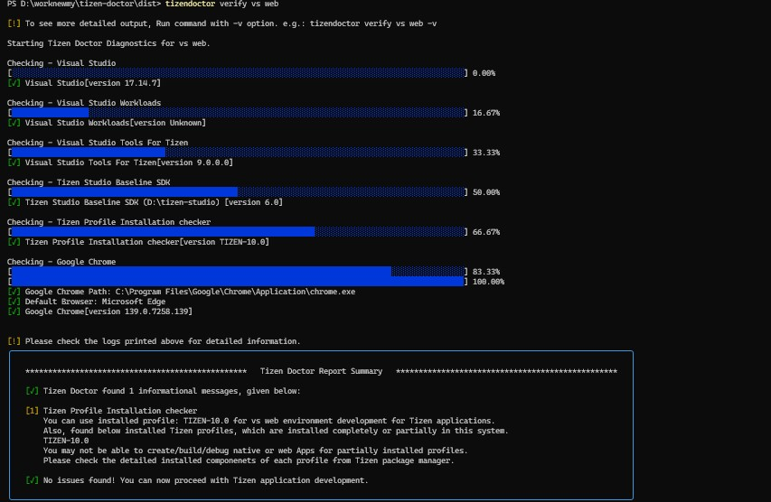

* #### tizendoctor verify vscode
  Performs verification checks to ensure both Visual Studio Code and Tizen Studio are properly set up for Tizen .NET app development by default.  

  1. **Visual Studio Code**  
   Verifies installation and version of VS Code.
  2. **VS Code Tizen Extension Checker**  
   Confirms if the Tizen extension for VS Code is installed.
   Confirms if the “Tizen Extension” is installed and retrieves its version.
  3. **Tizen Studio Path & SDK Version**  
   Ensures Tizen Studio is correctly configured and retrieves SDK version.
  4. **Tizen Profile Installation**  
   Confirms if the required Tizen profile for .NET development is fully installed.
  5. **.NET SDK Checker**  
   Verifies .NET SDK installation and ensures it meets the minimum version requirements.
  6. **.NET Workload Checker**  
   Checks if the Tizen .NET workload is installed and retrieves its version.
  7. **HTTP Proxy Checker**  
   Detects if proxy settings are needed and provides setup guidance.

  > ⚠️ If any check fails, Tizen Doctor provides guidance to fix the issue.

  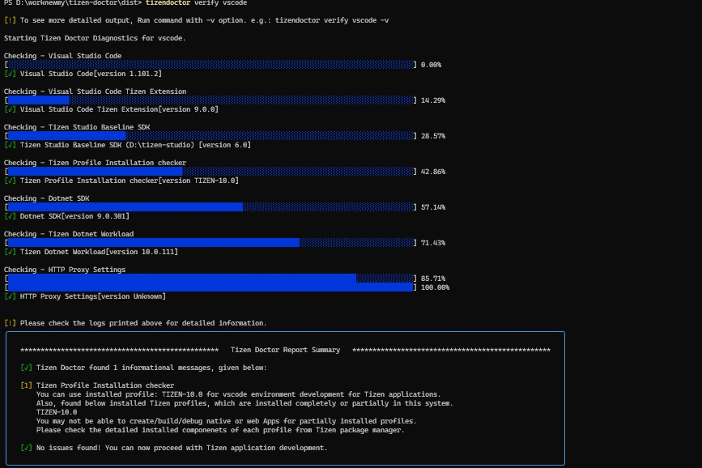

* #### tizendoctor verify vscode native
  Performs verification checks to ensure both Visual Studio Code and Tizen Studio are properly set up for Tizen Native app development.  

  1. **Visual Studio Code**  
   Verifies installation and version of VS Code.
  2. **VS Code Tizen Extension Checker**  
   Confirms if the Tizen extension for VS Code is installed.
   Confirms if the “Tizen Extension” is installed and retrieves its version.
  3. **Tizen Studio Path & SDK Version**  
   Ensures Tizen Studio is correctly configured and retrieves SDK version.
  4. **Tizen Profile Installation**  
   Confirms if the required Tizen profile for Native development is fully installed.

  > ⚠️ If any check fails, Tizen Doctor provides guidance to fix the issue.

  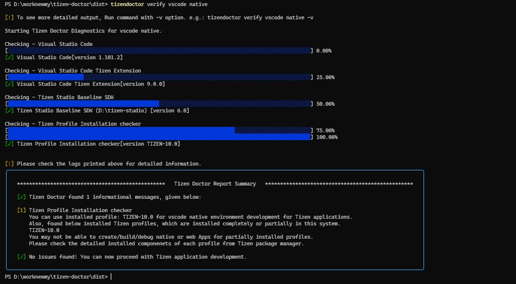

* #### tizendoctor verify vscode web
  Performs verification checks to ensure both Visual Studio Code and Tizen Studio are properly set up for Tizen Web app development.  

  1. **Visual Studio Code**  
   Verifies installation and version of VS Code.
  2. **VS Code Tizen Extension Checker**  
   Confirms if the Tizen extension for VS Code is installed.
   Confirms if the “Tizen Extension” is installed and retrieves its version.
  3. **Tizen Studio Path & SDK Version**  
   Ensures Tizen Studio is correctly configured and retrieves SDK version.
  4. **Tizen Profile Installation**  
   Confirms if the required Tizen profile for Web development is fully installed.
  5. **Google Chrome Checker**  
   Checks Google Chrome is installed, reports its path if found, and identifies the system’s default web browser.

  > ⚠️ If any check fails, Tizen Doctor provides guidance to fix the issue.
  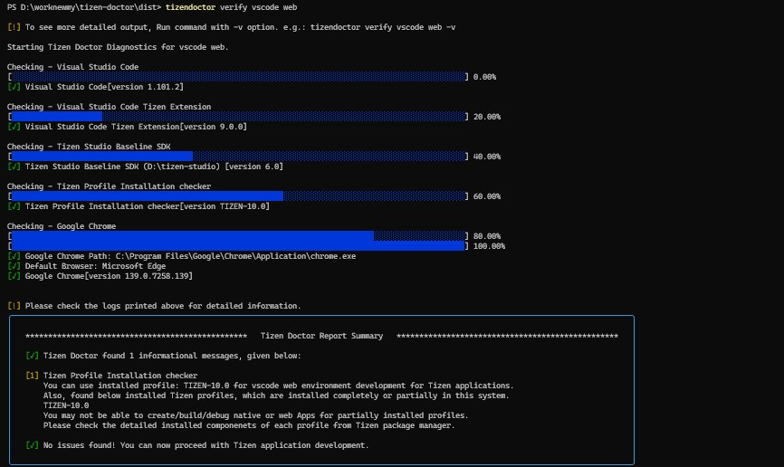

* ####  tizendoctor verify dotnet
  Performs multiple system-level checks to ensure your system is ready for Tizen .NET app development.

  1. **Tizen Studio Path & SDK Version**  
   Ensures Tizen Studio is correctly configured and retrieves SDK version.
  2. **Tizen Profile Installation**  
   Confirms if the required Tizen profile is fully installed.
  3. **.NET SDK Checker**  
   Verifies .NET SDK installation and ensures it meets the minimum version requirements.
  4. **.NET Workload Checker**  
   Checks if the Tizen .NET workload is installed and retrieves its version.
  5. **Visual Studio Code**  
   Verifies installation and version of VS Code.
  6. **VS Code Tizen Extension Checker**  
   Confirms if the Tizen extension for VS Code is installed.
  7. **Visual Studio**  
   Verifies installation and version of Visual Studio.
  8. **Visual Studio Workloads**  
   Checks for required workloads:
     * .NET Desktop Development  
     * .NET MAUI  
     * Desktop Development with C++
  9. **VS Tizen Extension Checker**  
   Verifies "Visual Studio Tools for Tizen" extension is installed.
  10. **Samsung Certificate Extension**  
    Checks if the Samsung Certificate Extension is present.
  11. **HTTP Proxy Checker**  
    Detects if proxy settings are needed and provides setup guidance.
  12. **Hardware Acceleration Checker**  
    Validates virtualization setup:
    - **Windows**: Checks Hyper-V and HAXM (for Intel); Hyper-V only (for AMD)  
    - **Linux**: Checks KVM installation

  > ⚠️ If any check fails, Tizen Doctor provides guidance to fix the issue.


  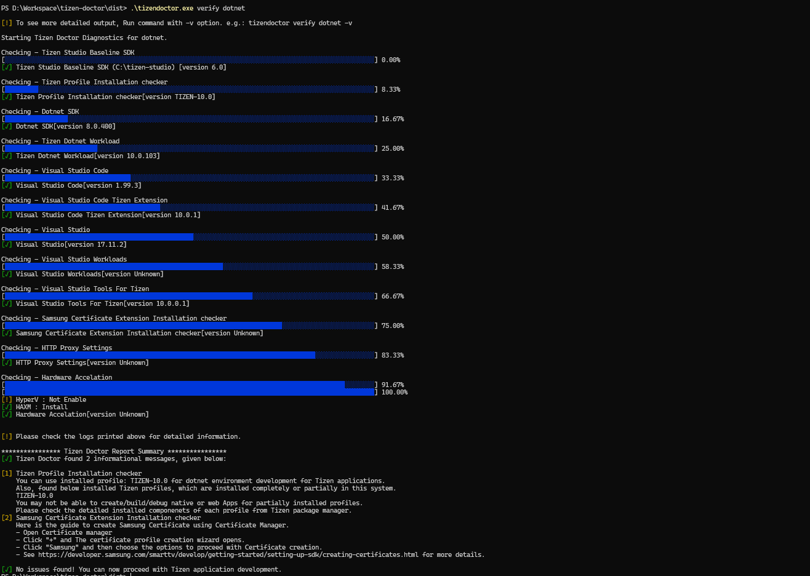

* #### tizendoctor verify native
  Performs multiple system-level checks to ensure your system is ready for Tizen Native app development.

  1. **Tizen Studio Path & SDK Version**  
   Ensures Tizen Studio is correctly configured and retrieves SDK version.
  2. **Tizen Profile Installation**  
   Confirms if the required Tizen profile is fully installed.
  3. **Visual Studio Code**  
   Verifies installation and version of VS Code.
  4. **VS Code Tizen Extension Checker**  
   Confirms if the Tizen extension for VS Code is installed.
  5. **Visual Studio**  
   Verifies installation and version of Visual Studio.
  6. **Visual Studio Workloads**  
   Checks for required workloads:
     * .NET Desktop Development  
     * .NET MAUI  
     * Desktop Development with C++
  7. **VS Tizen Extension Checker**  
   Verifies "Visual Studio Tools for Tizen" extension is installed.
  8. **Samsung Certificate Extension**  
    Checks if the Samsung Certificate Extension is present.
  9. **Hardware Acceleration Checker**  
    Validates virtualization setup:
      - **Windows**: Checks Hyper-V and HAXM (for Intel); Hyper-V only (for AMD)  
      - **Linux**: Checks KVM installation

  > ⚠️ If any check fails, Tizen Doctor provides guidance to fix the issue.

  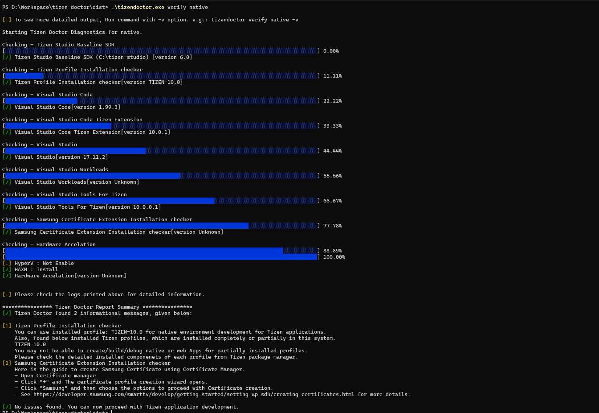

* #### tizendoctor verify web
  Performs multiple system-level checks to ensure your system is ready for Tizen Web app development.

  1. **Tizen Studio Path & SDK Version**  
   Ensures Tizen Studio is correctly configured and retrieves SDK version.
  2. **Tizen Profile Installation**  
   Confirms if the required Tizen profile is fully installed.
  3. **Visual Studio Code**  
   Verifies installation and version of VS Code.
  4. **VS Code Tizen Extension Checker**  
   Confirms if the Tizen extension for VS Code is installed.
  5. **Visual Studio**  
   Verifies installation and version of Visual Studio.
  6. **Visual Studio Workloads**  
   Checks for required workloads:
     * .NET Desktop Development  
     * .NET MAUI  
     * Desktop Development with C++
  7. **VS Tizen Extension Checker**  
   Verifies "Visual Studio Tools for Tizen" extension is installed.
  8. **Samsung Certificate Extension**  
    Checks if the Samsung Certificate Extension is present.
  9. **Google Chrome Checker**  
    Checks Google Chrome is installed, reports its path if found, and identifies the system’s default web browser.
  10. **Hardware Acceleration Checker**  
    Validates virtualization setup:
      - **Windows**: Checks Hyper-V and HAXM (for Intel); Hyper-V only (for AMD)  
      - **Linux**: Checks KVM installation

  > ⚠️ If any check fails, Tizen Doctor provides guidance to fix the issue.

  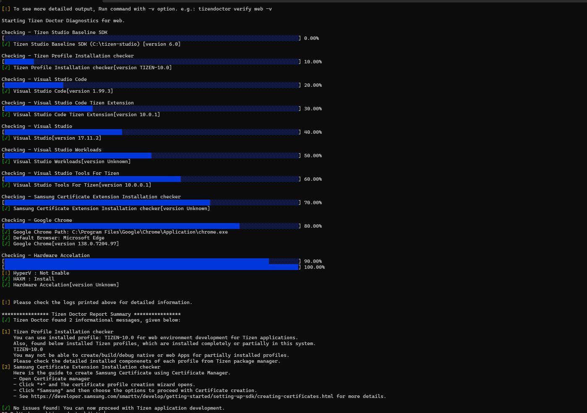
	
* #### tizendoctor report-issue
  Used to report any issues or bugs related to the Tizen App development environment setup. This command opens the issue creation page for Tizen on GitHub in your default browser.

    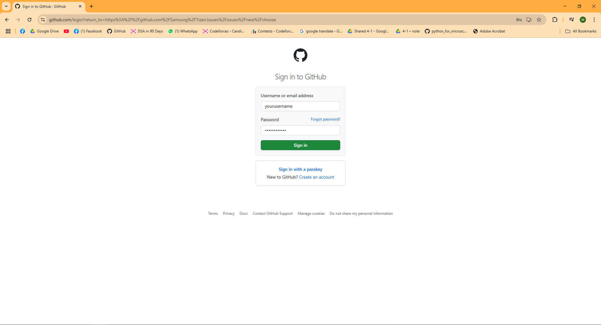
  Create new issue using the following templates
    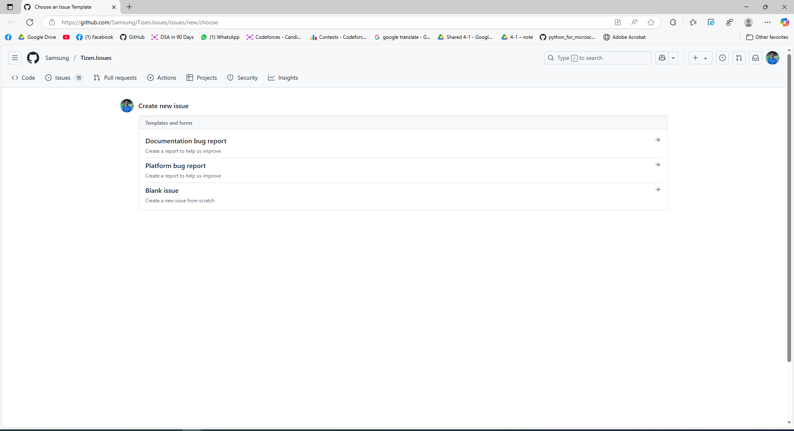