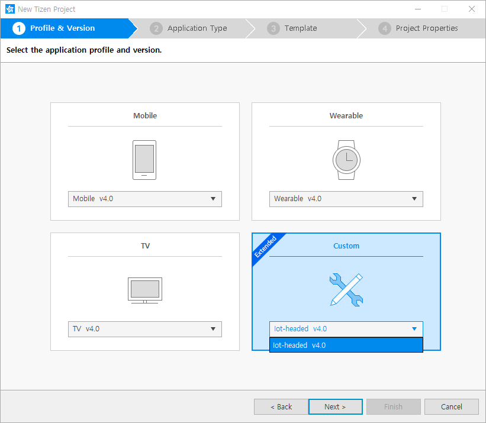
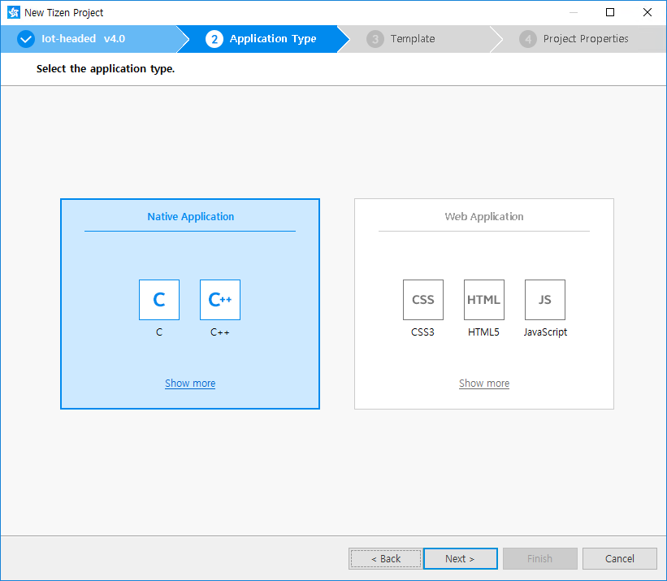
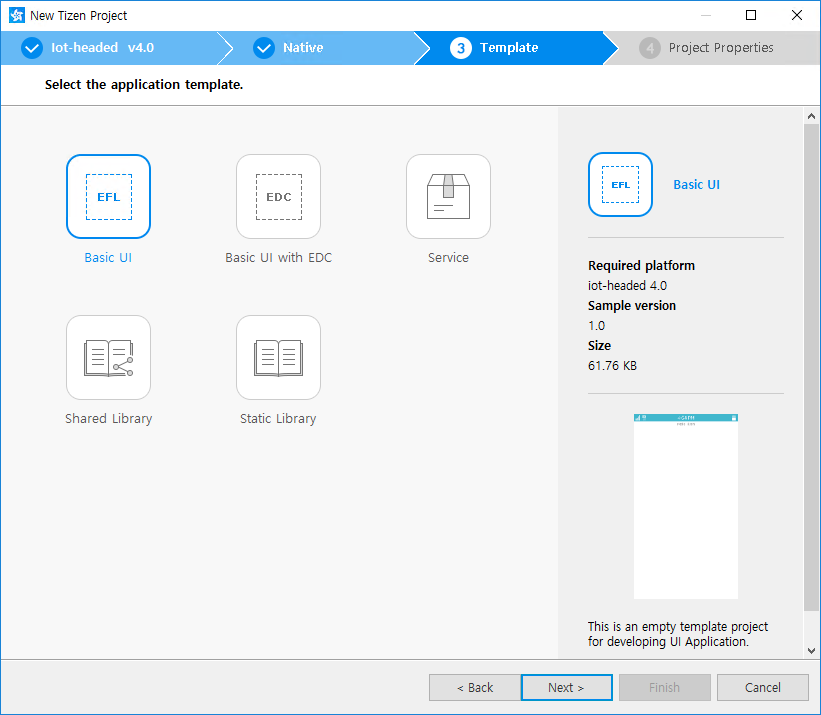
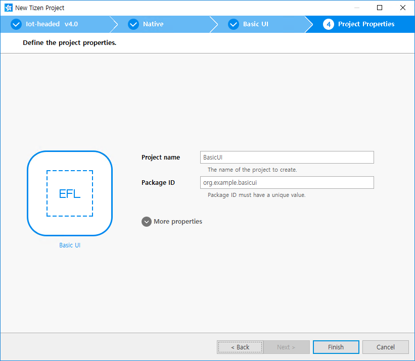
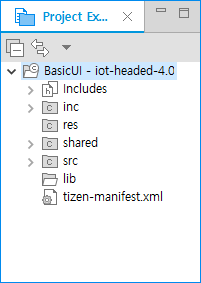
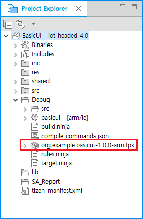

Configurable SDK
================

One of the main goals of Tizen 4.0 is configurability. The platform is not limited to a specific device type or profile, so vendors and platform developers can customize Tizen to support the functionalities they need.

The main features of the Tizen mobile, wearable, and TV application life-cycles are extended to support configurable SDK platforms.

**Figure: Configurable Tizen platform**

The Tizen Studio allows you to develop applications in a customizable Tizen platform environment. You can use the application development features of the Tizen Studio with configurable SDKs in the same way as with the existing mobile, wearable, and TV profiles. You can create new projects, validate `config.xml` and `manifest.xml` files, and take advantage of the API code assist features. You can also build, package, run, and debug your projects.

In the following instructions, the IoT Headed 4.0 platform is used as an example of a configurable SDK.

Installing Configurable SDK Platforms 
-------------------------------------

Configurable SDKs are installed and managed as extensions in the Package Manager **Extension SDK** tab.

To install the IoT Headed 4.0 platform SDK:

1.  Launch the Package Manager.
2.  In the Package Manager, select the **Extension SDK** tab.
3.  Click **install** next to the extensions you want.

    

Creating Configurable SDK Projects 
----------------------------------

After you have installed the IOT Headed 4.0 platform, you can create an IOT Headed 4.0 native project in the Tizen Studio:

1.  In the Tizen Studio menu, select **File &gt; New &gt; Tizen Project**.
2.  In the Project Wizard, in the **Custom** drop-down menu, select **Iot-headed v4.0**, and click **Next**.

    

3.  Select the **Native Application** application type, and click **Next**.

    

4.  Select the **Basic UI** template, and click **Next**.

    

5.  Define the project name and click **Finish**.

    

  You can see the created project in the **Project Explorer** view.

  

Building and Packaging Applications 
-----------------------------------

When you have finished developing your application, build and test it.

To build and package your application, right-click the project in the **Project Explorer** view, and select **Build Signed Package**.

**Figure: Building the application**

The package is created in the `Debug` subdirectory.

**Figure: Created package**

## Related Information
* Dependencies
  -  Tizen Studio 2.0 and Higher
