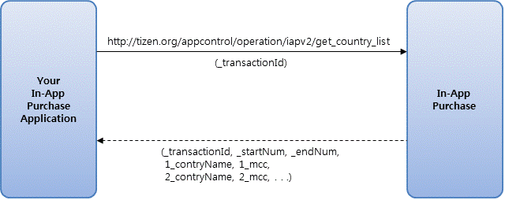

# In-app Purchase Programming Guide

By selling items from within your application, you can get a large revenue. You can implement In-Application Purchases (IAP) in your application using the AppControl mechanism for Tizen native and Web applications.

You can use the IAP in the following scenarios, for example:

- An application that enables additional features
- Any application that allows the user to remove ads
- An audio-book application that allows the user to purchase and download new books
- A game which offers new levels to play
- An RPG game that allows to buy virtual items

## What is the In-App Purchase AppControl Mechanism?

To sell items inside your applications such as in-game coins, levels and others, you need to set servers up to communicate with billing server and user authentications server, and many other infra servers. In-App Purchase simply handles all those things for you. To use In-App Purchase, you need to prepare your applications for communicating with it. For example, with in-app purchase of items, your application finds the proper AppControl, starts the purchase method, and receives the result of the purchase in the method of the listener method. IAP shows dialogs in case of errors, communicates with the Tizen Stores server, and invokes the listener methods to return the result of the request.

This document explains the process of using the IAP. Read this document thoroughly before using the IAP.

## Supported Item Types

IAP supports the following item types:

**Table: Supported item types**

| Table          | Description                              |
|--------------|----------------------------------------|
| Consumable     | If you purchase an item of this type and use it, it is consumed. These items can be repurchased.Example: Consumable items, such as bullets in games. |
| Non-consumable | Once purchased, you can use an item of this type permanently. These items cannot be repurchased.Example: Non-consumable items, including books, that do not need to be repurchased. |

## Terms and Abbreviations

The following table lists the terminology used in the context of IAP.

**Table: Terms and abbreviations**

| Term               | Description                              |
|------------------|----------------------------------------|
| **IAP**            | In-App Purchase                          |
| **MCC**            | This code (3 digits) identifies the mobile country code. |
| **MNC**            | This code (characters or digits) identifies the carrier in the current country. |
| **AppControl**     | A standard mechanism in Tizen for using specific operations exported by other applications. |
| **Operation ID**   | Defines the behavior of the AppControl.  |
| **Application ID** | Used to identify each application control supplier. |
| **Item Group ID**  | Collection of items identified by a single ID (item list). |
| **Item**           | A single piece of content.               |

## Applying IAP to Your Application

Applying IAP to your application is easy. The process contains the following steps:

1. Register your items to the [Tizen Store Seller Office](http://seller.tizenstore.com/).
2. Program your application to work with IAP.
3. Test and upload your application.

The following sections describe the process in more detail.

## 1. Registering Your Items to Tizen Store Seller Office

Before you set up and program your application for IAP, you need to register your item group and items to the Tizen Store Seller Office.

An item group is a collection of items connected to your application in the Tizen Store Seller Office. For example, if there are 10 kinds of special items you need for your game, you need to create 1 item group for your game and 10 individual items. Registering the items is really simple.

### 1.1. Connect to Tizen Store Seller Office

Log in to the [Tizen Store Seller Office](http://seller.tizenstore.com/). If you do not have an account for the Tizen Store Seller Office, create a new account. After you have logged in to the Tizen Store, register as a private seller if you want to sell applications under your personal name, or as a corporate seller if you want to sell applications under your company name.

### 1.2. Register a New Item Group

The following steps explain how to register a new item group on Seller Office:

1. Click **Applications > Item** to navigate to the selected menu option.
2. Click **Add Item Group**.
3. Fill in the fields for the **Item Group Title** and **Description**, and click **OK** to register your item group.
4. When the item group is registered, you can click **Edit** to modify its information.
5. Select a checkbox and click **Delete** to delete an item group. When you delete an item group, all items included in that group are also deleted.
6. You can copy registered item groups from the item group list. When you copy an item group, all items included in that group are also copied.

An item group can be modified, deleted, or copied when the application has the temporary status.

### 1.3. Add a New Item (Temporary Status)

From the item list, select the name of a registered item group to navigate to its information page. After an item group is created, a list of temporary tabs appears on the information screen when you first access it.

- Click **Add Item** on the temporary tab on the view page to enter basic information, such as title, price, and description. Click **OK** to add items. For more information on price setting, see the **Application Registration Guide**.
- You can batch register items by clicking **Item Bulk Upload** to upload an Excel file.

When the item has been added, you can click its title in the item list to view the added content.

#### 1.3.1. Edit an Item (Temporary Status)

You can add, modify, or delete an item if there is an application listed in the item group, or if registered or revised applications in the item group are listed under Pre-Certification.

- To view and edit the item title, price, description, and image, click the title of the item on the temporary tab list in the **View** popup window.
- If all the applications containing the item are listed under Pre-Certification, select the checkbox and click **Delete** to delete the item from all of them. However, if the statuses of items mapped for applications are for sale, it cannot be deleted.
- All changes are applied when all the mapped applications are validated. The **On Standby** button is displayed until validation is complete.

#### 1.3.2. Item Sales (Sales Status)

To register the item with the sales status:

1. Items are registered and modified and you can view them in sales.
2. If all the mapped applications that are being registered or revised in the item group are listed under Pre-Certification, click the **Modify Item(s)** button to create a temporary tab that allows you to modify the applications.

## 2. Setting Your Application Project up to Use IAP

IAP uses an AppControl mechanism, and as such requires no updates to the application project. Working with IAP means simply getting the proper AppControl.

For more information, see the Application Controls guide (in [native](../../native/guides/app-management/app-controls.md) and [Web](../../web/guides/app-management/app-controls.md) applications) and AppControl API (in [native](../../../org.tizen.native.mobile.apireference/group__CAPI__APP__CONTROL__MODULE.html) and [Web](../../../org.tizen.web.apireference/html/device_api/mobile/tizen/application.html) applications).

## 3. Programming Your Application to Work with IAP

Programming with IAP is very similar to programming with the Tizen native API and other AppControls supported in the system. Before you implement your code you must edit the configuration file (`tizen-manifest.xml` in native applications or `config.xml` in Web applications) first.

Section 3.1. explains more about the configuration file.

Note that the IAP allows 2 modes of operation (key name `"_mode"`):

- Normal mode or commercial mode: To be used with the finished application that is released on the market. Proper data is obtained and returned from the IAP server.
- Developer mode: This can be used while development of the application for testing purpose. Payment always succeeds.

The following table describes the interfaces list.

**Table: Interfaces list**
<table>
	<thead>
		<tr>
			<th>Application ID</th>
			<th>Operation ID</th>
			<th>Description</th>
		</tr>
	</thead>
	<tbody>
		<tr>
			<td><code>org.tizen.inapppurchase.iapclient</code></td>
			<td><code>http://tizen.org/appcontrol/operation/iapv2/purchase</code></td>
			<td>The operation purchases the item.
			<p>During this step a purchase screen is displayed, and the user needs to provide details (e-mail, password) to make a purchase.</p>
			<p>The output value indicates the result of purchase (success or failure), and is used to verify the purchase.</p>
			</td>
		</tr>
		<tr>
			<td rowspan="3"><code>org.tizen.inapppurchase.iapservice</code></td>
			<td><code>http://tizen.org/appcontrol/operation/iapv2/get_item_list</code></td>
			<td>The operation returns a list of items available for purchase.
			<p>The output data values are used to send a list of items available for purchase.</p>
			</td>
		</tr>
		<tr>
			<td><code>http://tizen.org/appcontrol/operation/iapv2/get_purchased_item_list</code></td>
			<td>The operation returns a list of already purchased items.</td>
		</tr>
		<tr>
			<td><code>http://tizen.org/appcontrol/operation/iapv2/get_country_list</code></td>
			<td>The operation returns a list of countries' MCC and MNC codes to be used in developer mode during testing in-app purchases.</td>
		</tr>
	</tbody>
</table>


### Purchasing Items

The following steps describe the process of item purchase:

1. Get the item list.

   Use the `org.tizen.inapppurchase.iapservice` application ID to retrieve a list items from the Tizen Store IAP server for a given group ID:

   

2. Display a list of items in your In-App Purchase application.

3. Purchase the item.

   Use the `org.tizen.inapppurchase.iapclient` application ID to make a purchase of a particular item:

   

### Getting a List of Countries

In developer mode, you are able to test In-App Purchase with different country servers. To get a list of available servers, you can use the `http://tizen.org/appcontrol/operation/iapv2/get_country_list` operation.

**Figure: Country list**



### 3.1. Adding Permissions to the Configuration File

IAP uses AppControl interface to handle purchases. You need to add the `http://tizen.org/privilege/appmanager.launch` privilege to your application's configuration file:

- In native applications:

  The following example shows the `tizen-manifest.xml` file which contains the required permissions:

  ```
  <?xml version="1.0" encoding="UTF-8" standalone="no"?>
  <manifest xmlns="http://tizen.org/ns/packages" package="org.tizen.iapsample"
            version="1.0.0">
     <privileges>
        <privilege>http://tizen.org/privilege/appmanager.launch</privilege>
     </privileges>
  </manifest>
  ```

- In Web applications:

  The following example shows the `config.xml` file which contains the required permissions:

  ```
  <?xml version="1.0" encoding="UTF-8"?>
  <widget xmlns="http://www.w3.org/ns/widgets"
          xmlns:tizen="http://tizen.org/ns/widgets" id=...>
     <tizen:privilege name = "http://tizen.org/privilege/application.launch"/>
  </widget>
  ```

### 3.2. IAP Service Control (Get Item List, Purchased Item List, Country List)

The IAP Service instance allows you to get a list of items available for purchase and to get a list of already purchased item. It also allows you to get a list of countries available for testing in developer mode.

- **Application ID**

  This application control can be accessed using an aliased application ID of the `org.tizen.inapppurchase.iapservice` application ID.

- **Operation ID**

  This application supports the `http://tizen.org/appcontrol/operation/iapv2/get_item_list` and `http://tizen.org/appcontrol/operation/iapv2/get_purchased_item_list` operations. It also supports the `http://tizen.org/appcontrol/operation/iapv2/get_country_list` operation.

- **Get item list operation**

  This operation returns a list of items available for purchase.

- **Input data**

  The following table shows the key-value pairs required in the input extra data for the `http://tizen.org/appcontrol/operation/iapv2/get_item_list` operation.

**Table: Input data for getting a list of items**
<table>
		<thead>
			<tr>
				<th>Key</th>
				<th>Value</th>
				<th>Description</th>
			</tr>
		</thead>
		<tbody>
			<tr>
				<td><code>_mode</code></td>
				<td>0 or 1</td>
				<td>
				<p>Mode type:</p>
				<ul>
					<li>
					<p>0: Normal (commercial) mode</p>
					<p>This mode needs to be used in an application submitted to the Tizen Store.</p>
					</li>
					<li>
					<p>1: Developer mode</p>
					<p>This mode can be used for testing purposes while developing the application. Payment always succeeds.</p>
					</li>
				</ul>
				<p>The default value is 0.</p>
				<p>This information is optional.</p>
				</td>
			</tr>
			<tr>
				<td><code>_transactionId</code></td>
				<td>Transaction ID</td>
				<td>
				<p>Transaction ID, such as 1 or 2.</p>
				<p>The ID is used to track a transaction between requests.</p>
				<p>This information is mandatory.</p>
				</td>
			</tr>
			<tr>
				<td><code>_startNumber</code></td>
				<td>Start number</td>
				<td>
				<p>Index of the first item in the list.</p>
				<p>Start downloading items from this index number.</p>
				<p>This information is mandatory.</p>
				</td>
			</tr>
			<tr>
				<td><code>_endNumber</code></td>
				<td>End number</td>
				<td>
				<p>Index of the last item in the list.</p>
				<p>Stop downloading items after this index number.</p>
				<p>This information is mandatory.</p>
				</td>
			</tr>
			<tr>
				<td><code>_itemGroupId</code></td>
				<td>Group ID</td>
				<td>
				<p>Group ID, such as 100000001455.</p>
				<p>A group ID is associated with a specific collection of items in Tizen Store Seller Office. You need to register your group ID in Tizen Store Seller Office first.</p>
				<p>This information is mandatory.</p>
				</td>
			</tr>
			<tr>
				<td><code>_languageCd</code></td>
				<td>Language code</td>
				<td>
				<p>Language code, such as <code>eng</code> or <code>rus</code>.</p>
				<p>The language code conforms to ISO 639-2, which uses 3-character codes.</p>
				<p>The language code is associated with the display language of the item details in Tizen Store Seller Office.</p>
				<p>The output parameters (<code>itemName, itemDescription, reserved1, reserved2</code>) are changed according to the language code.</p>
				<p>This information is optional.</p>
				</td>
			</tr>
			<tr>
				<td><code>_itemTypeCd</code></td>
				<td>00, 01, 02, or 10</td>
				<td>
				<p>Item type code:</p>
				<ul>
					<li>
					<p>00: Non-consumable</p>
					</li>
					<li>
					<p>01: Consumable</p>
					</li>
					<li>
					<p>10: All</p>
					</li>
				</ul>
				<p>This information is optional.</p>
				<p>&nbsp;</p>
				</td>
			</tr>
			<tr>
				<td>
				<p>&nbsp;</p>
				<p><code>_mcc</code></p>
				<p>(deprecated)</p>
				</td>
				<td>Mobile country code (MCC)</td>
				<td>
				<p><span>Mobile country code, such as 250.</span></p>
				<p>MMCs can only be used in developer mode. You can retrieve a list of available MCCs using the get country list operation.</p>
				<p>This information is optional.</p>
				<p><span>(18th Oct. by Tizen Store Dev. - </span>deprecated parameter)</p>
				</td>
			</tr>
			<tr>
				<td>
				<p><code>_mnc</code></p>
				<p>(deprecated)</p>
				</td>
				<td>Mobile network code (MNC)</td>
				<td>
				<p>Mobile network code, such as 01.</p>
				<p>MNCs can only be used in developer mode.</p>
				<p>This information is optional.</p>
				<p><span>(18th Oct. by Tizen Store Dev. - </span><span>deprecated parameter)</span></p>
				</td>
			</tr>
		</tbody>
	</table>

- **Example code for get item list**
  ```
  app_control_h app_control;
  int rt = app_control_create(&app_control);
  if (rt == APP_CONTROL_ERROR_NONE) {
      app_control_set_app_id(app_control, " org.tizen.inapppurchase.iapservice");
      app_control_set_operation(app_control,
               "http://tizen.org/appcontrol/operation/iapv2/get_item_list");
      app_control_add_extra_data(app_control, "_mode", "0");
      app_control_add_extra_data(app_control, "_transactionId", "123");
      app_control_add_extra_data(app_control, "_startNumber", "1");
      app_control_add_extra_data(app_control, "_endNumber", "10");
      app_control_add_extra_data(app_control, "_itemGroupId", "100000000012");
      app_control_add_extra_data(app_control, "_languageCd", "ENG");
      app_control_add_extra_data(app_control, "_itemTypeCd", "00");

      rt = app_control_send_launch_request(app_control, get_item_list_cb, NULL);
  }
  if (app_control != NULL)
      app_control_destroy(app_control);
  ```
- **Output Data**

  The results of the operation are returned in the app control callback.

  The following table shows the output data for the `http://tizen.org/appcontrol/operation/iapv2/get_item_list` operation.

  **Table: Output data for getting a list of items**

  | Key                  | Value                           | Description                              |
  |----------------------|---------------------------------|------------------------------------------|
  | `_method`            | `OnItemInformationListReceived` | Method to be called as a purchase request result. |
  | `_result`            | Result code                     | [Result codes are described at the end of this section.](#result_code) |
  | `_resultDescription` | Result code/Function ID         | Result code/Function ID when `_result` value is not 0 (success). [Result codes are described at the end of this section.](#result_code) |
  | `_transactionId`     | Transaction ID                  | This is the same ID as the transaction ID that is used in the request. |
  | `_startNumber`       | Start number                    | Index of the first item in the list.     |
  | `_endNumber`         | End number                      | Index of the last item in the list.      |
  | `_totalCount`        | Total items count               | Total number of items based on the start number and end number. |
  | `_itemTotalCount`    | Total registered items count    | Total number of registered items in the group ID. |

  There is also a `_totalCount` number of items in the output data. Each key consists of a `PREFIX` (list item index value) and a key (such as `12_itemId`).

  **Table: Item keys in the output data**

  | Key                                     | Value                                    | Description                              |
  |-----------------------------------------|------------------------------------------|------------------------------------------|
  | `PREFIX_itemId`                         | Item ID                                  | This is the same number as an item ID that is used in the request. |
  | `PREFIX_itemGroupId`                    | Item group ID                            | ID of a collection of items. The collection is linked to your application in Tizen Store Seller Office. |
  | `PREFIX_itemName`                       | Item name                                | Name provided during item registration in Tizen Store Seller Office. |
  | `PREFIX_currencyUnit`                   | Currency unit                            | Device user's currency unit, such as $, Won, or Pound. |
  | `PREFIX_unitPrecedes`                   | 0 or 1                                   | Currency unit position:<br/> - 0: Tail (2.99 TL)<br/> - 1: Front ($ 2.99) |
  | `PREFIX_hasPenny`                       | 0 or 1  | Information whether the currency unit has penny representation:<br/> - 0: No<br/> - 1: Yes  |
  | `PREFIX_itemPrice`                      | Item price                               | Price of the item in the local currency. |
  | `PREFIX_itemDownloadUrl`                | Item download URL                        | URL provided during item registration in the Tizen Store Seller Office. |
  | `PREFIX_itemImageUrl`                   | Item image URL                           | URL provided during item registration in Tizen Store Seller Office. |
  | `PREFIX_itemDescription`                | Item description                         | A description provided during item registration. |
  | `PREFIX_reserved1`                      | Reserved field 1                         | Reserved field 1                         |
  | `PREFIX_reserved2`                      | Reserved field 2                         | Reserved field 2                         |
  | `PREFIX_itemTypeCd`                     | 00, 01, or 02                            | Item type code:00: Non-consumable01: Consumable02: Subscription (non-renewing - to be developed) |
  | `PREFIX_itemSubsBillDurationCd`         | 00, 01, 02, or 03                        | To be developed (reserved field)         |
  | `PREFIX_subscriptionDurationMultiplier` | Subscription duration multiplier         | To be developed (reserved field)         |
  | `PREFIX_timeStamp`                      | Time stamp                               | Based on GMT +0, server time.(yyyyMMddHHmmss) |

- **Example code for retrieving a list of items**

  ```
  void
  get_item_list_cb(app_control_h request, app_control_h reply,
	     app_control_result_e result, void *user_data)
  {
     char* rt_method = NULL;
     char* rt_result = NULL;
     char* rt_resultDescription = NULL;
     char* rt_transactionId = NULL;
     char* rt_startNumber = NULL;
     char* rt_endNumber = NULL;
     char* rt_totalCount = NULL;
     char* rt_itemTotalCount = NULL;
     char* rt_itemId = NULL;
     char* rt_itemGroupId = NULL;
     char* rt_itemName = NULL;
     char* rt_currencyUnit = NULL;
     char* rt_unitPrecedes = NULL;
     char* rt_hasPenny = NULL;
     char* rt_itemPrice = NULL;
     char* rt_itemDownloadUrl = NULL;
     char* rt_itemImageUrl = NULL;
     char* rt_itemDescription = NULL;
     char* rt_reserved1 = NULL;
     char* rt_reserved2 = NULL;
     char* rt_itemTypeCd = NULL;
     char* rt_itemSubsBillDurationCd = NULL;
     char* rt_subscriptionDurationMultiplier = NULL;
     char* rt_timeStamp = NULL;
    
     if (result == APP_CONTROL_RESULT_SUCCEEDED) {
	    rt = app_control_get_extra_data(reply, "_method", &rt_method);
	    rt = app_control_get_extra_data(reply, "_result", &rt_result);
    
	    /* Success */
	    if (!strcmp("0", rt_result)) {
	       rt = app_control_get_extra_data(reply, "_resultDescription",
						     &rt_resultDescription);
	       rt = app_control_get_extra_data(reply, "_transactionId",                                                                                          &rt_transactionId);
	       rt = app_control_get_extra_data(reply, "_startNumber", &rt_startNumber);
	       rt = app_control_get_extra_data(reply, "_endNumber", &rt_endNumber);
	       rt = app_control_get_extra_data(reply, "_totalCount", &rt_totalCount);
	       rt = app_control_get_extra_data(reply, "_itemTotalCount",                                                                                          &rt_itemTotalCount);
    
	       int start = atoi(rt_startNumber);
	       int end = atoi(rt_endNumber);
    
	       char keyId[100] = {0,};
	       for (; start <= end; start++) {
		      snprintf(key_id, sizeof(keyId), "%d%s", start, "_itemId");
		      rt = app_control_get_extra_data(reply, key_id, &rt_itemId);
    
		      snprintf(key_id, sizeof(keyId), "%d%s", start, "_itemGroupId);");
		      rt = app_control_get_extra_data(reply, key_id, &rt_itemGroupId);
		      snprintf(key_id, sizeof(keyId), "%d%s", start, "_itemName");
    
		      rt = app_control_get_extra_data(reply, keyId, &rt_itemName);
		      snprintf(key_id, sizeof(keyId), "%d%s", start, "_currencyUnit");
    
		      rt = app_control_get_extra_data(reply, keyId, &rt_currencyUnit);
		      snprintf(key_id, sizeof(keyId), "%d%s", start, "_unitPrecedes");
    
		      rt = app_control_get_extra_data(reply, keyId, &rt_unitPrecedes);
		      snprintf(key_id, sizeof(keyId), "%d%s", start, "_hasPenny");
    
		      rt = app_control_get_extra_data(reply, keyId, &rt_hasPenny);
		      snprintf(key_id, sizeof(keyId), "%d%s", start, "_itemPrice");
    
		      rt = app_control_get_extra_data(reply, keyId, &rt_itemPrice);
		      snprintf(key_id, sizeof(keyId), "%d%s", start, "_itemDownloadUrl");
    
		      rt = app_control_get_extra_data(reply, keyId, &rt_itemDownloadUrl);
		      snprintf(key_id, sizeof(keyId), "%d%s", start, "_itemImageUrl");
    
		      rt = app_control_get_extra_data(reply, keyId, &rt_itemImageUrl);
		      snprintf(key_id, sizeof(keyId), "%d%s", start, "_itemDescription");
    
		      rt = app_control_get_extra_data(reply, keyId, &rt_itemDescription);
		      snprintf(key_id, sizeof(keyId), "%d%s", start, "_reserved1");
    
		      rt = app_control_get_extra_data(reply, keyId, &rt_reserved1);
		      snprintf(key_id, sizeof(keyId), "%d%s", start, "_reserved2");
    
		      rt = app_control_get_extra_data(reply, keyId, &rt_reserved2);
		      snprintf(key_id, sizeof(keyId), "%d%s", start, "_itemTypeCd");
    
		      rt = app_control_get_extra_data(reply, keyId, &rt_itemTypeCd);
		      snprintf(key_id, sizeof(keyId), "%d%s", start,"_itemSubsBillDurationCd");
    
		      rt = app_control_get_extra_data(reply, keyId, &rt_itemSubsBillDurationCd);
		      snprintf(key_id, sizeof(keyId), "%d%s", start,"_subscriptionDurationMultiplier");
    
		      rt = app_control_get_extra_data(reply, keyId, &rt_subscriptionDurationMultiplier);
 		      snprintf(key_id, sizeof(keyId), "%d%s", start, "_timeStamp");
		      rt = app_control_get_extra_data(reply, keyId, &rt_timeStamp);
	       }
	    }
     }
  }
  ```
  
- **`GetPurchasedItemList` operation**

  This operation returns a list of already purchased items.

- **Input data**

  The following table shows the key and value pairs required in the input extra data for the `http://tizen.org/appcontrol/operation/iapv2/get_purchased_item_list` operation.

  **Table: Input data for getting a list of purchased items**

	<table>
		<thead>
			<tr>
				<th>Key</th>
				<th>Value</th>
				<th>Description</th>
			</tr>
		</thead>
		<tbody>
			<tr>
				<td><code>_mode</code></td>
				<td>0 or 1</td>
				<td>
				<p>Mode type:</p>
				<ul>
					<li>
					<p>0: Normal (commercial) mode</p>
					<p>This mode needs to be used in an application submitted to the Tizen Store.</p>
					</li>
					<li>
					<p>1: Developer mode</p>
					<p>This mode can be used for testing purposes while developing the application. Payment always succeeds.</p>
					</li>
				</ul>
				<p>The default value is 0.</p>
				<p>This information is optional.</p>
				</td>
			</tr>
			<tr>
				<td><code>_transactionId</code></td>
				<td>Transaction ID</td>
				<td>
				<p>Transaction ID, such as 1 or 2.</p>
				<p>The ID is used to track a transaction between requests.</p>
				<p>This information is mandatory.</p>
				</td>
			</tr>
			<tr>
				<td><code>_startNumber</code></td>
				<td>Start number</td>
				<td>
				<p>Index of the first item in the list.</p>
				<p>Start downloading items from this index number.</p>
				<p>This information is mandatory.</p>
				</td>
			</tr>
			<tr>
				<td><code>_endNumber</code></td>
				<td>End number</td>
				<td>
				<p>Index of the last item in the list.</p>
				<p>Stop downloading items after this index number.</p>
				<p>This information is mandatory.</p>
				</td>
			</tr>
			<tr>
				<td><code>_startDate</code></td>
				<td>Start date</td>
				<td>
				<p>The start date of the requested inbox list, such as 20131031.</p>
				<p>This information is optional.</p>
				</td>
			</tr>
			<tr>
				<td><code>_endDate</code></td>
				<td>End date</td>
				<td>
				<p>The end date of the requested inbox list, such as 20131031.</p>
				<p>This information is optional.</p>
				</td>
			</tr>
			<tr>
				<td><code>_itemGroupId</code></td>
				<td>Group ID</td>
				<td>
				<p>Group ID, such as 100000002501.</p>
				<p>A group ID is associated with a specific collection of items in Tizen Store Seller Office. You need to register your group ID in Tizen Store Seller Office first.</p>
				<p>This information is mandatory.</p>
				</td>
			</tr>
			<tr>
				<td><code>_languageCd</code></td>
				<td>Language code</td>
				<td>
				<p>Language code, such as <code>eng</code> or <code>rus</code>.</p>
				<p>The language code conforms to ISO 639-2, which uses 3-character codes.</p>
				<p>The language code is associated with the display language of the item details in Tizen Store Seller Office.</p>
				<p>The output parameters (<code>itemName, itemDescription, reserved1, reserved2</code>) are changed according to the language code.</p>
				<p>This information is optional.</p>
				</td>
			</tr>
			<tr>
				<td>
				<p><code>_mcc</code></p>
				<p><code>(deprecated)</code></p>
				</td>
				<td>Mobile country code (MCC)</td>
				<td>
				<p>Mobile country code, such as 250.</p>
				<p>MMCs can only be used in developer mode. You can retrieve a list of available MCCs using the get country list operation.</p>
				<p>This information is optional.</p>
				<p><span>(18th Oct. by Tizen Store Dev. - </span><span>deprecated parameter)</span></p>
				</td>
			</tr>
			<tr>
				<td>
				<p><code>_mnc</code></p>
				<p><font face="monospace, serif"><span>(deprecated)</span></font></p>
				</td>
				<td>Mobile network code (MNC)</td>
				<td>
				<p>Mobile network code, such as 01.</p>
				<p>MNCs can only be used in developer mode.</p>
				<p>This information is optional.</p>
				<p><span>(18th Oct. by Tizen Store Dev. - </span><span>deprecated parameter)</span></p>
				</td>
			</tr>
		</tbody>
	</table>

- **Example code for retrieving a list of purchased items**
  ```
  app_control_h app_control;
  int rt = app_control_create(&app_control);
  if (rt == APP_CONTROL_ERROR_NONE) {
    app_control_set_app_id(app_control, " org.tizen.inapppurchase.iapservice");
    app_control_set_operation(app_control,
					    "http://tizen.org/appcontrol/operation/iapv2/get_purchased_item_list");
    app_control_add_extra_data(app_control, "_mode", "0");
    app_control_add_extra_data(app_control, "_transactionId", "123");
    app_control_add_extra_data(app_control, "_startNumber", "1");
    app_control_add_extra_data(app_control, "_endNumber", "10");
    app_control_add_extra_data(app_control, "_startDate", "20140101");
    app_control_add_extra_data(app_control, "_endDate", "20141231");
    app_control_add_extra_data(app_control, "_itemGroupId", "100000000012");
    app_control_add_extra_data(app_control, "_languageCd", "ENG");
  
    rt = app_control_send_launch_request(app_control, get_purchased_item_list_cb, NULL);
  }
  if (app_control != NULL)
    app_control_destroy(app_control);
  ```

- **Output Data**

  The results of the operation are returned in the app control callback.

  The following table shows the output data for the `http://tizen.org/appcontrol/operation/iapv2/get_purchased_item_list` operation.

  **Table: Output data for getting a list of purchased items**

  | Key                  | Value                                    | Description                              |
  |--------------------|----------------------------------------|----------------------------------------|
  | `_method`            | `OnPurchasedItem` or `InformationListReceived` | Method to be called as a purchase request result. |
  | `_result`            | Result code                              | [Result codes are described at the end of this section.](#result_code) |
  | `_resultDescription` | Result code/Function ID                  | Result code/Function ID when `_result` value is not 0 (success). [Result codes are described at the end of this section.](#result_code) |
  | `_transactionId`     | Transaction ID                           | This is the same ID as the transaction ID that is used in the request. |
  | `_startNumber`       | Start number                             | Index of the first item in the list.     |
  | `_endNumber`         | End number                               | Index of the last item in the list.      |
  | `_totalCount`        | Total items count                        | Total number of items based on the start number and end number. |
  | `_itemTotalCount`    | Total purchased items count              | Total number of purchased items in the group ID. |

  There is also a `_totalCount` number of items in the output data. Each key consists of a `PREFIX` (list item index value) and a key (such as `12_itemId`).

  **Table: Item keys in the output data**
  <table>
		<thead>
			<tr>
				<th>Key</th>
				<th>Value</th>
				<th>Description</th>
			</tr>
		</thead>
		<tbody>
			<tr>
				<td><code>PREFIX_itemId</code></td>
				<td>Item ID</td>
				<td>This is the same number as an Item ID that is used in the request.</td>
			</tr>
			<tr>
				<td><code>PREFIX_itemGroupId</code></td>
				<td>Item group ID</td>
				<td>ID of a collection of items. The collection is linked to your application in Tizen Store Seller Office.</td>
			</tr>
			<tr>
				<td><code>PREFIX_itemName</code></td>
				<td>Item name</td>
				<td>Name provided during item registration in Tizen Store Seller Office.</td>
			</tr>
			<tr>
				<td><code>PREFIX_currencyUnit</code></td>
				<td>Currency unit</td>
				<td>Device user's currency unit, such as $, Won, or Pound.</td>
			</tr>
			<tr>
				<td><code>PREFIX_unitPrecedes</code></td>
				<td>0 or 1</td>
				<td>Currency unit position:
				<ul>
					<li>0: Tail (2.99 TL)</li>
					<li>1: Front ($ 2.99)</li>
				</ul>
				</td>
			</tr>
			<tr>
				<td><code>PREFIX_hasPenny</code></td>
				<td>0 or 1</td>
				<td>Information whether the currency unit has penny representation:
				<ul>
					<li>0: No</li>
					<li>1: Yes</li>
				</ul>
				</td>
			</tr>
			<tr>
				<td><code>PREFIX_itemPrice</code></td>
				<td>Item price</td>
				<td>Price of the item in the local currency.</td>
			</tr>
			<tr>
				<td><code>PREFIX_itemDownloadUrl</code></td>
				<td>Item download URL</td>
				<td>URL provided during item registration in Tizen Store Seller Office.</td>
			</tr>
			<tr>
				<td><code>PREFIX_itemImageUrl</code></td>
				<td>Item image URL</td>
				<td>URL provided during item registration in Tizen Store Seller Office.</td>
			</tr>
			<tr>
				<td><code>PREFIX_itemDescription</code></td>
				<td>Item description</td>
				<td>A description provided during item registration.</td>
			</tr>
			<tr>
				<td><code>PREFIX_reserved1</code></td>
				<td>Reserved field 1</td>
				<td>Reserved field 1</td>
			</tr>
			<tr>
				<td><code>PREFIX_reserved2</code></td>
				<td>Reserved field 2</td>
				<td>Reserved field 2</td>
			</tr>
			<tr>
				<td><code>PREFIX_paymentId</code></td>
				<td>Payment ID</td>
				<td>Payment ID</td>
			</tr>
			<tr>
				<td><code>PREFIX_purchaseDate</code></td>
				<td>Date of purchase</td>
				<td>Date of purchase</td>
			</tr>
			<tr>
				<td><code>PREFIX_itemTypeCd</code></td>
				<td>00, 01, or 02</td>
				<td>Item type code:
				<ul>
					<li>00: Non-consumable</li>
					<li>01: Consumable</li>
					<li>02: Subscription (non-renewing)</li>
				</ul>
				</td>
			</tr>
			<tr>
				<td><code>PREFIX_itemSubsBillDurationCd</code></td>
				<td>00, 01, 02, or 03</td>
				<td>Item subs bill duration code:
				<ul>
					<li>00: Year</li>
					<li>01: Month</li>
					<li>02: Week</li>
					<li>03: Day</li>
				</ul>
				<p>The <code>_itemTypeCd</code> value is 02.</p>
				<p>If the product type is subscription, the available 4 units for the validity period of the product are YEAR, MONTH, WEEK, and DAY. The units must be typed in capitals.</p>
				</td>
			</tr>
			<tr>
				<td><code>PREFIX_subscriptionDurationMultiplier</code></td>
				<td>Subscription duration multiplier</td>
				<td>If the <code>_itemTypeCd</code> is subscription (02), this is the item duration. Combined with <code>PREFIX_itemSubsBillDurationCd</code>, it means 1 month.</td>
			</tr>
			<tr>
				<td><code>PREFIX_timeStamp</code></td>
				<td>Time stamp</td>
				<td>Based on GMT +0, server time.
				<p>(yyyyMMddHHmmss)</p>
				</td>
			</tr>
		</tbody>
	</table>

- **Example code for retrieving a list of purchased items**
  ```
  void
  get_purchased_item_list_cb(app_control_h request, app_control_h reply,
				     app_control_result_e result, void *user_data)
  {
      char* rt_method = NULL;
      char* rt_result = NULL;
      char* rt_resultDescription = NULL;
      char* rt_transactionId = NULL;
      char* rt_startNumber = NULL;
      char* rt_endNumber = NULL;
      char* rt_totalCount = NULL;
      char* rt_itemTotalCount = NULL;
      char* rt_itemId = NULL;
      char* rt_itemGroupId = NULL;
      char* rt_itemName = NULL;
      char* rt_currencyUnit = NULL;
      char* rt_unitPrecedes = NULL;
      char* rt_hasPenny = NULL;
      char* rt_itemPrice = NULL;
      char* rt_itemDownloadUrl = NULL;
      char* rt_itemImageUrl = NULL;
      char* rt_itemDescription = NULL;
      char* rt_reserved1 = NULL;
      char* rt_reserved2 = NULL;
      char* rt_paymentId = NULL;
      char* rt_purchaseDate = NULL;
      char* rt_itemTypeCd = NULL;
      char* rt_itemSubsBillDurationCd = NULL;
      char* rt_subscriptionDurationMultiplier = NULL;
      char* rt_timeStamp = NULL;
   
      if (result == APP_CONTROL_RESULT_SUCCEEDED) {
	      rt = app_control_get_extra_data(reply, "_method", &rt_method);
	      rt = app_control_get_extra_data(reply, "_result", &rt_result);
   
	      /* Success */
	      if (!strcmp("0", rt_result)) {
		      rt = app_control_get_extra_data(reply, "_resultDescription", rt_resultDescription);
		      rt = app_control_get_extra_data(reply, "_transactionId", &rt_transactionId);
		      rt = app_control_get_extra_data(reply, "_startNumber", &rt_startNumber);
		      rt = app_control_get_extra_data(reply, "_endNumber", &rt_endNumber);
		      rt = app_control_get_extra_data(reply, "_totalCount", &rt_totalCount);
		      rt = app_control_get_extra_data(reply, "_itemTotalCount", &rt_itemTotalCount);
    
		      int start = atoi(rt_startNumber);
		      int end = atoi(rt_endNumber);
    
		      char keyId[100] = {0,};
		      for (; start <= end; start++) {
			      snprintf(key_id, sizeof(keyId), "%d%s", start, "_itemId");
			      rt = app_control_get_extra_data(reply, key_id, &rt_itemId);
    
			      snprintf(key_id, sizeof(keyId), "%d%s", start, "_itemGroupId);");
			      rt = app_control_get_extra_data(reply, key_id, &rt_itemGroupId);
    
			      snprintf(key_id, sizeof(keyId), "%d%s", start, "_itemName");
			      rt = app_control_get_extra_data(reply, keyId, &rt_itemName);
    
			      snprintf(key_id, sizeof(keyId), "%d%s", start, "_currencyUnit");
			      rt = app_control_get_extra_data(reply, keyId, &rt_currencyUnit);
    
			      snprintf(key_id, sizeof(keyId), "%d%s", start, "_unitPrecedes");
			      rt = app_control_get_extra_data(reply, keyId, &rt_unitPrecedes);
    
			      snprintf(key_id, sizeof(keyId), "%d%s", start, "_hasPenny");
			      rt = app_control_get_extra_data(reply, keyId, &rt_hasPenny);
    
			      snprintf(key_id, sizeof(keyId), "%d%s", start, "_itemPrice");
			      rt = app_control_get_extra_data(reply, keyId, &rt_itemPrice);
    
			      snprintf(key_id, sizeof(keyId), "%d%s", start, "_itemDownloadUrl");
			      rt = app_control_get_extra_data(reply, keyId, &rt_itemDownloadUrl);
    
			      snprintf(key_id, sizeof(keyId), "%d%s", start, "_itemImageUrl");
			      rt = app_control_get_extra_data(reply, keyId, &rt_itemImageUrl);
    
			      snprintf(key_id, sizeof(keyId), "%d%s", start, "_itemDescription");
			      rt = app_control_get_extra_data(reply, keyId, &rt_itemDescription);
    
			      snprintf(key_id, sizeof(keyId), "%d%s", start, "_reserved1");
			      rt = app_control_get_extra_data(reply, keyId, &rt_reserved1);
    
			      snprintf(key_id, sizeof(keyId), "%d%s", start, "_reserved2");
			      rt = app_control_get_extra_data(reply, keyId, &rt_reserved2);
    
			      snprintf(key_id, sizeof(keyId), "%d%s", start, "_paymentId");
			      rt = app_control_get_extra_data(reply, keyId, &rt_paymentId);
    
			      snprintf(key_id, sizeof(keyId), "%d%s", start, "_purchaseDate");
			      rt = app_control_get_extra_data(reply, keyId, &rt_purchaseDate);
    
			      snprintf(key_id, sizeof(keyId), "%d%s", start, "_itemTypeCd");
			      rt = app_control_get_extra_data(reply, keyId, &rt_itemTypeCd);
    
			      snprintf(key_id, sizeof(keyId), "%d%s", start, "_itemSubsBillDurationCd");
			      rt = app_control_get_extra_data(reply, keyId, &rt_itemSubsBillDurationCd);
    
			      snprintf(key_id, sizeof(keyId), "%d%s", start, "_subscriptionDurationMultiplier");
			      rt = app_control_get_extra_data(reply, keyId, &rt_subscriptionDurationMultiplier);
    
			      snprintf(key_id, sizeof(keyId), "%d%s", start, "_timeStamp");
			      rt = app_control_get_extra_data(reply, keyId, &rt_timeStamp);
		      }
	      }
      }
  }
  ```
- **GetCountryList operation**

  This operation returns a list of countries available for testing in-application purchase.

- **Input data**

  The following table show the key and value pairs required in the input extra data for the `http://tizen.org/appcontrol/operation/iapv2/get_country_list` operation.

  **Table: Input data for getting a list of countries**

  | Key              | Value          | Description                              |
  |----------------|--------------|----------------------------------------|
  | `_transactionId` | Transaction ID | Transaction ID, such as 1 or 2.This information is mandatory.The ID is used to track a transaction between requests. |

- **Example code for get country list**
   ```
   app_control_h app_control;
   int rt = app_control_create(&app_control);
   if (rt == APP_CONTROL_ERROR_NONE) {
     app_control_set_app_id(app_control, " org.tizen.inapppurchase.iapservice");
     app_control_set_operation(app_control,
					    "http://tizen.org/appcontrol/operation/iapv2/get_country_list");
     app_control_add_extra_data(app_control, "_mode", "0");
     app_control_add_extra_data(app_control, "_transactionId", "123");
     rt = app_control_send_launch_request(app_control, get_country_list_cb, NULL);
   }
   if (app_control != NULL)
     app_control_destroy(app_control);
   ```

- **Output Data**

  The results of the operation are returned in the app control callback.

  The following table shows the output data for the `http://tizen.org/appcontrol/operation/iapv2/get_country_list` operation.

   **Table: Output data for getting a list of countries**

   | Key                  | Value                   | Description                              |
   |----------------------|--- ---------------------|------------------------------------------|
   | `_method`            | `OnCountryListReceived` | Method to be called as a purchase request result. |
   | `_result`            | Result code             | [Result codes are described at the end of this section.](#result_code) |
   | `_resultDescription` | Result code/Function ID | Result code/Function ID when `_result` value is not 0 (success). [Result codes are described at the end of this section.](#result_code) |
   | `_transactionId`     | Transaction ID          | This is the same ID as the transaction ID that is used in the request. |
   | `_startNumber`       | Start number            | Index of the first item on the list.     |
   | `_endNumber`         | End number              | Index of the last item on the list.      |
   | `_totalCount`        | Total items count       | Total number of items based on the start number and end number. |

   There is also a `_totalCount` number of countries in the output data. Each key consists of a `PREFIX` (list item index value) and a key (such as `1_countryName`).

   **Table: Country keys in the output data**

   | Key                  | Value                     | Description                              |
   |--------------------|-------------------------|----------------------------------------|
   | `PREFIX_countryName` | Country name              | Name of a country.                       |
   | `PREFIX_mcc`         | MCC (mobile country code) | MCC (mobile country code) as a string value. |

- **Example code for retrieving a list of get country list**
  ```
  void
  get_country_list_cb(app_control_h request, app_control_h reply,
			    app_control_result_e result, void *user_data)
  {
     char* rt_method = NULL;
     char* rt_result = NULL;
     char* rt_resultDescription = NULL;
     char* rt_transactionId = NULL;
     char* rt_startNumber = NULL;
     char* rt_endNumber = NULL;
     char* rt_totalCount = NULL;
     char* rt_countryName = NULL;
     char* rt_mcc = NULL;
     if (result == APP_CONTROL_RESULT_SUCCEEDED) {
	     rt = app_control_get_extra_data(reply, "_method", &rt_method);
	     rt = app_control_get_extra_data(reply, "_result", &rt_result);

	     /* Success */
	     if (!strcmp("0", rt_result)) {
		    rt = app_control_get_extra_data(reply, "_resultDescription",                                                                                       &rt_resultDescription);
		    rt = app_control_get_extra_data(reply, "_transactionId",                                                                                           &rt_transactionId);
		    rt = app_control_get_extra_data(reply, "_startNumber", &rt_startNumber);
		    rt = app_control_get_extra_data(reply, "_endNumber", &rt_endNumber);
		    rt = app_control_get_extra_data(reply, "_totalCount", &rt_totalCount);
		    int start = atoi(rt_startNumber);
		    int end = atoi(rt_endNumber);
		    char keyId[100] = {0,};
		    for (; start <= end; start++) {
			    snprintf(key_id, sizeof(keyId), "%d%s", start, "_countryName");
			    rt = app_control_get_extra_data(reply, key_id, &rt_countryName);
			    snprintf(key_id, sizeof(keyId), "%d%s", start, "_mcc");
			    rt = app_control_get_extra_data(reply, key_id, &rt_mcc);
		    }
	     }
     }
  }
  ```

<a name="result_code"></a>
- **Result code values**

  The following table lists the possible values of the `_result` key for the `org.tizen.inapppurchase.iapservice` application ID.

  **Table: Result code values**

  | Value | String Representation     | Description                              |
  |-----|-------------------------|----------------------------------------|
  | 0     | `Succeed`                 | The status code for success.             |
  | 200   | `NetworkError`            | The status code for network errors.      |
  | 1000  | `ProcessError`            | The status code for process errors.      |
  | 2001  | `NoApplicationStore`      | The status code if application store not present for the country. |
  | 9201  | `ItemGroupIdNotFound`     | The status code if the item group ID is not found. |
  | 9207  | `ItemIdNotFound`          | The status code if the item ID is not found. |
  | 9502  | `InvalidRequestParameter` | The status code if the wrong request parameter is passed. |

### 3.3. IAP Client Control (Purchase of Item)

The IAP Client instance allows you to initialize a purchase of item and to complete the purchase.

- **Application ID**

  This application control can be accessed using aliased application ID of `org.tizen.inapppurchase.iapclient`.

- **Operation ID**

  This application supports the `http://tizen.org/appcontrol/operation/iapv2/purchase` operation only.

- **Purchase operation**

  This operation launches the purchase application and allows purchasing of In-App items. The input data passed in this operation are used to display a purchase form for particular item. The device user can choose between available payment methods, register his credit card, and confirm the purchase.

- **Input data**

  The following table shows the key and value pairs required in the input extra data for the `http://tizen.org/appcontrol/operation/iapv2/purchase` operation.

  **Table: Input data for launching the purchase application**
	<table>
		<thead>
			<tr>
				<th>Key</th>
				<th>Value</th>
				<th>Description</th>
			</tr>
		</thead>
		<tbody>
			<tr>
				<td><code>_mode</code></td>
				<td>0 or 1</td>
				<td>
				<p>Mode type:</p>
				<ul>
					<li>
					<p>0: Normal (commercial) mode</p>
					<p>This mode needs to be used in an application submitted to the Tizen Store.</p>
					</li>
					<li>
					<p>1: Developer mode</p>
					<p>This mode can be used for testing purposes while developing the application. Payment always succeeds.</p>
					</li>
				</ul>
				<p>The default value is 0.</p>
				<p>This information is optional.</p>
				</td>
			</tr>
			<tr>
				<td><code>_transactionId</code></td>
				<td>Transaction ID</td>
				<td>
				<p>Transaction ID, such as 1 or 2.</p>
				<p>The ID is used to track a transaction between requests.</p>
				<p>This information is mandatory.</p>
				</td>
			</tr>
			<tr>
				<td><code>_itemId</code></td>
				<td>Item ID</td>
				<td>
				<p>Item ID, such as 000000003501.</p>
				<p>An item ID is associated with a specific item in Tizen Store Seller Office.</p>
				<p>You can retrieve a list of items available for purchase using the <code>org.tizen.inapppurchase.iapservice</code> application ID.</p>
				<p>This information is mandatory.</p>
				</td>
			</tr>
			<tr>
				<td><code>_itemGroupId</code></td>
				<td>Group ID</td>
				<td>
				<p>Group ID, such as 100000001455.</p>
				<p>A group ID is associated with a specific collection of items in Tizen Store Seller Office. You need to register your group ID in Tizen Store Seller Office first.</p>
				<p>This information is mandatory.</p>
				</td>
			</tr>
			<tr>
				<td><code>_languageCd</code></td>
				<td>Language code</td>
				<td>
				<p>Language code, such as <code>eng</code> or <code>rus</code>.</p>
				<p>The language code conforms to ISO 639-2, which uses 3-character codes.</p>
				<p>The language code is associated with the display language of the item details in Tizen Store Seller Office.</p>
				<p>This information is optional.</p>
				<blockquote><strong>Note</strong><br><code>_itemName</code> is higher priority than <code>_languageCd</code>.</blockquote>
				</td>
			</tr>
			<tr>
				<td><code>_itemName</code></td>
				<td>Item name</td>
				<td>
				<p>Item name, such as "Sword" or "칼".</p>
				<p>Specify your item name with this key, or leave the key empty to use the default name on the seller site's purchase page.</p>
				<p>This information is optional.</p>
				</td>
			</tr>
			<tr>
				<td>
				<p><code>_mcc</code></p>
				<p><code>(deprecated)</code></p>
				</td>
				<td>Mobile country code (MCC)</td>
				<td>
				<p>Mobile country code, such as 250.</p>
				<p>MMCs can only be used in developer mode. You can retrieve a list of available MCCs using the get country list operation.</p>
				<p>This information is optional.</p>
				<p><span>(18th Oct. by Tizen Store Dev. - </span><span>deprecated parameter)</span></p>
				</td>
			</tr>
			<tr>
				<td>
				<p><code>_mnc</code></p>
				<p><code>(deprecated)</code></p>
				</td>
				<td>Mobile network code (MNC)</td>
				<td>
				<p>Mobile network code, such as 01.</p>
				<p>MNCs can only be used in developer mode.</p>
				<p>This information is optional.</p>
				<p><span>(18th Oct. by Tizen Store Dev. - </span><span>deprecated parameter)</span></p>
				</td>
			</tr>
		</tbody>
	</table>

- **Example code for Purchase**
  ```
  app_control_h app_control;
  int rt = app_control_create(&app_control);
  if (rt == APP_CONTROL_ERROR_NONE) {
     app_control_set_app_id(app_control, " org.tizen.inapppurchase.iapclient");
     app_control_set_operation(app_control, "http://tizen.org/appcontrol/operation/iapv2/purchase");
     app_control_add_extra_data(app_control, "_mode", "0");
     app_control_add_extra_data(app_control, "_itemId", "000000000001");
     app_control_add_extra_data(app_control, "_itemGroupId", "100000000012");
     app_control_add_extra_data(app_control, "_languageCd", "ENG"); /* Optional */
     app_control_add_extra_data(app_control, "_itemName", "Item 1"); /* Optional */
     rt = app_control_send_launch_request(app_control, get_purchase_cb, NULL);
  }
  
  if (app_control != NULL)
     app_control_destroy(app_control);
  ```

- **Output Data**

  The results of the operation are returned in the app control callback.

  This data can be used to verify the payment with Tizen Store IAP Server.

  The following table shows the output data for the `http://tizen.org/appcontrol/operation/iapv2/purchase` operation during process of purchase.

  **Table: Output data for launching the purchase application**

  | Key                  | Value                                    | Description                              |
  |--------------------|----------------------------------------|----------------------------------------|
  | `_method`            | `OnPurchaseItemReceived`                 | Method to be called as a purchase request result. |
  | `_result`            | Result code                              | [Result codes are described at the end of this section.](#result_code_2) |
  | `_resultDescription` | Result code/Function ID or HTML tags     | Display the `_resultDescription` value as a pop-up using Web-Control when you receive a `_result` value of 5600.[Result codes are described at the end of this section.](#result_code_2) |
  | `_itemId`            | Item ID                                  | This is the same number as an item ID that is used in the request. |
  | `_itemGroupId`       | Item group ID                            | ID of a collection of items. The collection is linked to your application in Tizen Store Seller Office. |
  | `_itemName`          | Item name                                | Name provided during item registration in Tizen Store Seller Office. |
  | `_ticketPurchaseId`  | Purchased ticket ID                      | This ID can be used to verify the purchase with Tizen Store IAP Server. |
  | `_currencyUnit`      | Currency unit                            | Device user's currency unit, such as $, Won, or Pound. |
  | `_unitPrecedes`      | 0 or 1                                   | Currency unit position:<br/> - 0: Tail (2.99 TL)<br/> - 1: Front ($ 2.99) |
  | `_hasPenny`          | 0 or 1  | Information whether the currency unit has penny representation:<br/> - 0: No<br/> - 1: Yes                                           |
  | `_itemPrice`         | Item price                               | Price of the item in the local currency. |
  | `_itemDownloadUrl`   | Item download URL                        | URL provided during item registration in Tizen Store Seller Office. |
  | `_itemImageUrl`      | Item image URL                           | URL provided during item registration in Tizen Store Seller Office. |
  | `_itemDescription`   | Item description                         | A description provided during item registration. |
  | `_reserved1`         | Reserved field 1                         | Reserved field 1                         |
  | `_reserved2`         | Reserved field 2                         | Reserved field 2                         |
  | `_paymentId`         | Payment ID                               | Payment ID                               |
  | `_ticketVerifyUrl`   | Server URL                               | Server URL, such as `http://tizen.org/appcontrol/operation/iap/purchase`.This URL can be used in combination with other parameters to verify the purchase with Tizen Store IAP Server. |
  | `_ticketPurchaseId`  | Purchased ticket ID                      | This ID can be used to verify the purchase with Tizen Store IAP Server. |
  | `_ticketParam1`      | Ticket parameter 1                       | This parameter is used with the server URL. |
  | `_ticketParam2`      | Ticket parameter 2                       |  This parameter is used with the server URL.                                        |
  | `_ticketParam3`      | Ticket parameter 3                       |  This parameter is used with the server URL.                                        |
  | `_ticketParam4`      | Ticket parameter 4                       | This parameter is used with the server URL.                                         |
  | `_ticketParam5`      | Ticket parameter 5                       | This parameter is used with the server URL.                                         |
  | `_purchaseDate`      | Date of purchase                         | Date of purchase                         |
  | `_timeStamp`         | Time stamp                               | Based on GMT +0, server time.<br/> (yyyyMMddHHmmss) |

- **Example code for Purchase result**
  ```
  void
  get_purchase_cb(app_control_h request, app_control_h reply,
		     app_control_result_e result, void *user_data)
  {
     char* rt_method = NULL;
     char* rt_result = NULL;
     char* rt_resultDescription = NULL;
     char* rt_transactionId = NULL;
     char* rt_itemId = NULL;
     char* rt_itemGroupId = NULL;
     char* rt_itemName = NULL;
     char* rt_currencyUnit = NULL;
     char* rt_unitPrecedes = NULL;
     char* rt_hasPenny = NULL;
     char* rt_itemPrice = NULL;
     char* rt_itemDownloadUrl = NULL;
     char* rt_itemImageUrl = NULL;
     char* rt_itemDescription = NULL;
     char* rt_reserved1 = NULL;
     char* rt_reserved2 = NULL;
     char* rt_paymentId = NULL;
     char* rt_ticketVerifyUrl = NULL;
     char* rt_ticketPurchaseId = NULL;
     char* rt_ticketParam1 = NULL;
     char* rt_ticketParam2 = NULL;
     char* rt_ticketParam3 = NULL;
     char* rt_ticketParam4 = NULL;
     char* rt_ticketParam5 = NULL;
     char* rt_purchaseDate = NULL;
     char* rt_itemTypeCd = NULL;
     char* rt_itemSubsBillDurationCd = NULL;
     char* rt_subscriptionDurationMultiplier = NULL;
     char* rt_timeStamp = NULL;

     if (result == APP_CONTROL_RESULT_SUCCEEDED) {
	     rt = app_control_get_extra_data(reply, "_method", &rt_method);
	     rt = app_control_get_extra_data(reply, "_result", &rt_result);

	     /* Success */
	     if (!strcmp("0", rt_result)) {
		    rt = app_control_get_extra_data(reply, "_resultDescription", &rt_resultDescription);
		    rt = app_control_get_extra_data(reply, "_transactionId", &rt_transactionId);
		    rt = app_control_get_extra_data(reply, "_itemId", &rt_itemId);
		    rt = app_control_get_extra_data(reply, "_itemGroupId", &rt_itemGroupId);
		    rt = app_control_get_extra_data(reply, "_itemName", &rt_itemName);
		    rt = app_control_get_extra_data(reply, "_currencyUnit", &rt_currencyUnit);
		    rt = app_control_get_extra_data(reply, "_unitPrecedes", &rt_unitPrecedes);
		    rt = app_control_get_extra_data(reply, "_itemPrice", &rt_itemPrice);
		    rt = app_control_get_extra_data(reply, "_itemDownloadUrl", &rt_itemDownloadUrl);
		    rt = app_control_get_extra_data(reply, "_itemImageUrl", &rt_itemImageUrl);
		    rt = app_control_get_extra_data(reply, "_itemDescription", &rt_itemDescription);
		    rt = app_control_get_extra_data(reply, "_reserved1", &amp;rt_reserved1);
		    rt = app_control_get_extra_data(reply, "_reserved2", &rt_reserved2);
		    rt = app_control_get_extra_data(reply, "_paymentId", &rt_paymentId);
		    rt = app_control_get_extra_data(reply, "_ticketVerifyUrl", &rt_ticketVerifyUrl);
		    rt = app_control_get_extra_data(reply, "_ticketPurchaseId", &rt_ticketPurchaseId);
		    rt = app_control_get_extra_data(reply, "_ticketParam1", &rt_ticketParam1);
		    rt = app_control_get_extra_data(reply, "_ticketParam2", &rt_ticketParam2);
		    rt = app_control_get_extra_data(reply, "_ticketParam3", &rt_ticketParam3);
		    rt = app_control_get_extra_data(reply, "_ticketParam4", &rt_ticketParam4);
		    rt = app_control_get_extra_data(reply, "_ticketParam5", &rt_ticketParam5);
		    rt = app_control_get_extra_data(reply, "_purchaseDate", &rt_purchaseDate);
		    rt = app_control_get_extra_data(reply, "_itemTypeCd", &rt_itemTypeCd);
		    rt = app_control_get_extra_data(reply, "_itemSubsBillDurationCd", &rt_itemSubsBillDurationCd);
		    rt = app_control_get_extra_data(reply, "_subscriptionDurationMultiplier",
								    &rt_subscriptionDurationMultiplier);
		    rt = app_control_get_extra_data(reply, "_timeStamp", &rt_timeStamp);
	     }
     }
  }
  ```

<a name="result_code_2"></a>
- **Result code values**

  The following table lists the possible values of the `_result` key for the `org.tizen.inapppurchase.iapclient` application ID.

  **Table: Result code values**

  | Value | String Representation                 | Description                              |
  |-----|-------------------------------------|----------------------------------------|
  | 0     | `Succeed`                             | The status code for success.             |
  | 100   | `Cancel`                              | The status code if the user cancels.     |
  | 200   | `NetworkError`                        | The status code for network errors.      |
  | 1000  | `ProcessError`                        | The status code for process errors.      |
  | 5600  | `PGError`                             | The status code for the payment gateway error. Display the pop-up by using web-control. |
  | 9201  | `ItemGroupIdNotFound`                 | The status code if the item group ID is not found. |
  | 9207  | `ItemIdNotFound`                      | The status code if the item ID is not found. |
  | 9502  | `InvalidRequestParameter`             | The status code if the request parameter is invalid. |
  | 9291  | `RepurchaseError`                     | The status code for the repurchase error. This error occurs only on consumable items. |
  | 9292  | `Update is progressing`               | The status code if the application is updating. |
  | 9293  | `Account validation is not Completed` | The status code if the Samsung account validation is not completed. |

## 4. Verifying with Tizen Store IAP Server

After the purchase operation, `http://tizen.org/appcontrol/operation/iapv2/purchase`, you can use the values in the output data to verify a purchase on the Tizen Store IAP Server in a simple process. You can send a query to the output data's `_ticketVerifyUrl` address. The query can be made with a combination of the output data's `_ticketPurchaseId`, `_ticketParam1`, `_ticketParam2`, `ticketParam3`, `_ticketParam4`, and `_ticketParam5` parameters.

The following example shows the syntax. In the above syntax, `(_parameterName)` indicates the value of the parameter.

```
(_ticketVerifyUrl)?purchaseID=(_ticketPurchaseId)&param1=(_ticketParam1)&param2=(_ticketParam2)&param3=(_ticketParam3)&param4=(_ticketParam4)&param5=(_ticketParam5)
```

The following code shows an example request:

```
http://iap.tizenstore.com/appsItemVerifyIAPReceipt.as?purchaseID=2bf8fe4fdef1dae29974e5400c106bfced6a650793efa3ce68a79e026481193d&param1=abe87f635bf41aae0178b5384cbc09c1083026e93e44bd0efd69e66a9cc2ace6&param2=d49e3385783366868999e17bae3410597c0b6bcf69a92cd74cab17454cf9d4d6&param3=af8050beb9c0f63c773fb86f7218bb6cbd6cf78a5cdff281c2e22a229f9a1485&param4=1&param5=I20131115RU00001243
```

If a request is processed successfully, the JSON response is received as shown. The status value of `true` means a verifying the purchase is successful and `false` when it has failed.

If your application uses a server-client model, the following server-to-server purchase verification is recommended.

The JSON example of successful result:

```
{
    "paymentID":"TPMTID20131115RU00001243",
    "paymentAmount":"105.02",
    "itemName":"ttttttt","itemID":"000000000072",
    "status":"true",
    "purchaseDate":"2013-11-15 10:31:23",
    "itemDesc":"dkfldfldkfl",
    "paymentMethod":"Tizen RBS Russia CreditCard",
    "mode":"1"
}
```

The following code shows a JSON example of a failed result:

```
{"status":"false"}
```

## Appendixes

### 1. Sample Native Application

The sample native application allows a user to show a list of items for purchase, purchase an item, show purchased items, and make a purchase.

In developer mode, the top of the screen, it is possible to scroll up and down direction.

[Download the sample native application.](media/native_sample_application_source_code_20151222.zip)


### 2. Sample Web Application

The sample Web application allows a user to show a list of items for purchase, purchase an item, show purchased items, and make a purchase.

[Download the sample Web application.](media/web_sample_application_source_code_20150113.zip)
