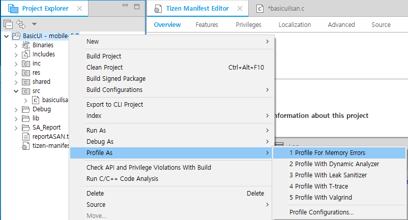
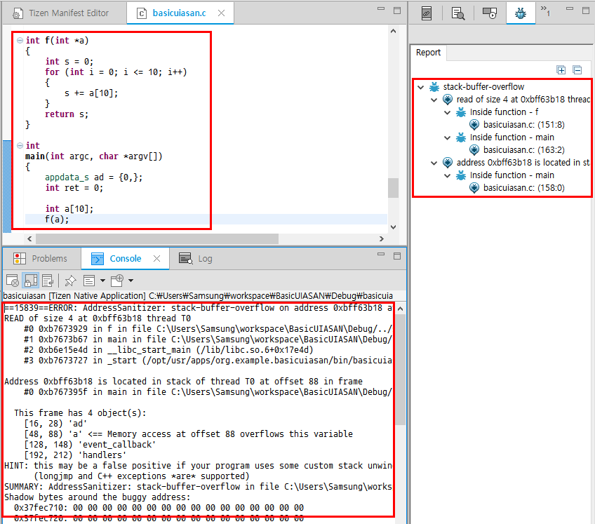

# Detecting Runtime Memory Errors with Address Sanitizer

The Address Sanitizer is a profiling tool used to detect runtime memory errors in Tizen native applications. With it, you can discover whether specific parts of code can potentially cause memory corruption at runtime. You can also avoid crashes or bugs during application execution. The Address Sanitizer tool detects memory corruption at runtime by instrumenting the code during the application compilation. A program with no bugs does not crash when the Address Sanitizer tool is used, suggesting that the code is safe from potential memory corruption.

The Address Sanitizer tool can detect the following types of bugs:

- Out-of-bounds accesses to heap and stack
- Use-after-free
- Use-after-return (to some extent)
- Double free and invalid free

## Using the Address Sanitizer

> **Note**  
> Before you run the Address Sanitizer:Make sure that you have an emulator or a connected target device running.
>
> If you want to try out the tool and do not have an applicable project to test, create a test project with the Project Wizard using a template or sample. For more information on creating a project, see [Creating Your First Tizen Mobile Native Application](../../native/getting-started/mobile/first-app.md).

To use the Address Sanitizer:

1. In the **Project Explorer** view, right-click the project and select **Profile As > Profile With Address Sanitizer**.

   The profiling instruments the code and compiles the project for the Address Sanitizer. Finally, it launches the application on the connected target or emulator.

2. After the application is launched, run the application scenario you want to test.

   The Tizen Studio shows the profiling result after the application crashes, as illustrated in the following figure.

   In the example shown in the figure, the application crashes as soon as it is launched because the memory corruption happens in the `main()` function.

   

## Related information
* Dependencies   
   - Tizen Studio 1.1 and Higher
