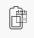
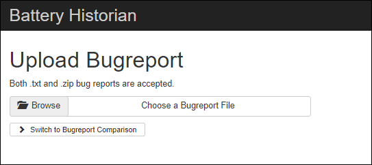
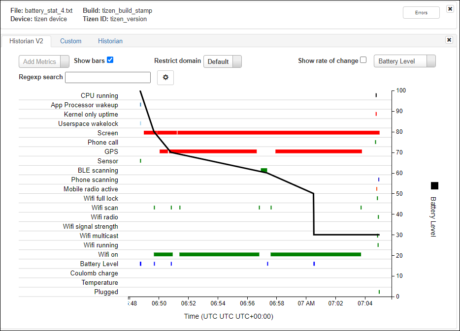
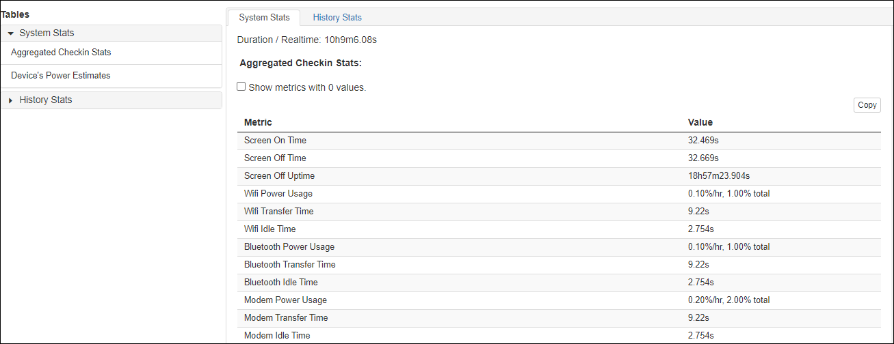
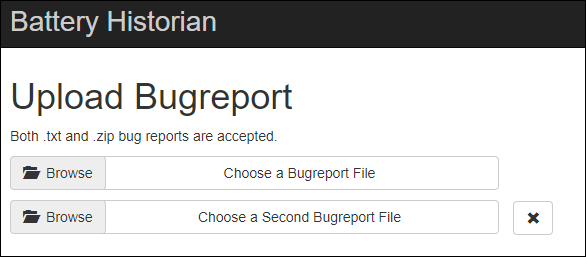
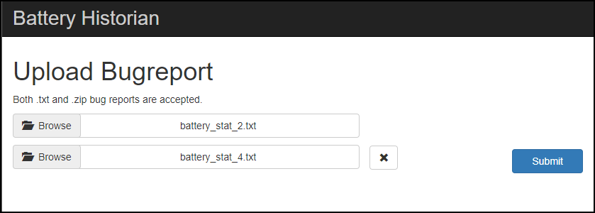
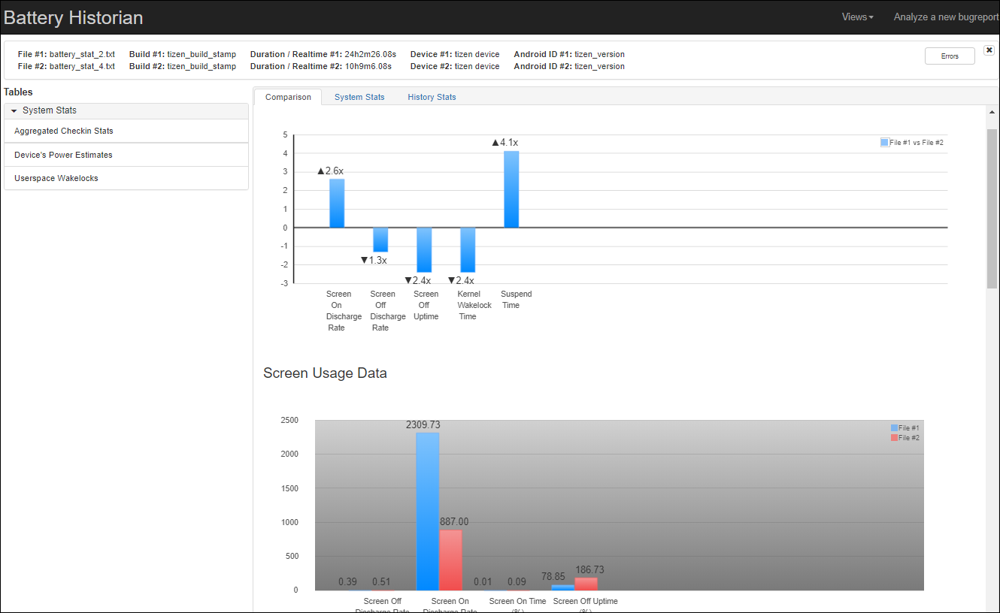

# Battery Historian

This page explains how you can use the Battery Historian tool to analyze the battery-consumption patterns, and also helps you to understand, interpret, and evaluate the reports generated by the Battery Historian tool.

Battery Historian tool helps you to increase the productivity of Tizen devices by maximizing the performance with efficient use of resources. Battery Historian tool enables you to analyze and audit the behavior and consumption of battery in the Tizen devices. It is an expert analysis tool that precisely reviews information and events related to the battery. It includes various metrics and insights, such as radio cells, communication, and so on. Battery Historian tool generates a report that helps you to diagnose and troubleshoot the device behavior related to battery consumption. The generated report also helps you to identify precise battery-draining elements so that you can fine-tune and augment Tizen device productivity and efficiency.

Battery Historian tool also allows an A/B comparison of two bug reports, highlighting the key differences in the battery-related metrics.

> [!NOTE]
> To use the Battery Historian feature, ensure that the Smart Development Bridge (SDB) is enabled to issue commands to Tizen devices. 

## Access Battery Historian

To access and open the Battery Historian tool, use one of the following:

 - In the Tizen Studio menu, select **Tools \> Battery Historian.**
 - In the Tizen Studio toolbar, click **Battery Historian**  .
 - In Tizen Studio main window, press the combination of the **Alt+Shift+B** keys. 

The **Battery Historian** window appears. 



The Battery Historian tool window comprises of the following components:

 - **Browse**: This component allows you to browse and select a bug report file.
 - **Switch to Bug Report Comparison**: This component allows you to compare and analyze two different bug report files.

> [!NOTE]
> The Battery Historian tool only supports **.txt** or **.zip** format for bug report file.

## Use Battery Historian Tool

The Battery Historian tool essentially requires a bug report file to process the battery consumption stats of a Tizen device. This bug report file contains all the relevant data regarding the battery consumption. You can generate the bug report using the SDB that dumps the battery data to your development machine and creates a report.

The Battery Historian tool takes the bug report file as an input to analyze and compare the stats. After processing the report data, the Battery Historian uses HTML format to visualize the stats in a web browser.

To use the Battery Historian tool, ensure that you have the bug report files readily available. If you do not have the bug report file with, you can generate one using the following procedure:

### Generate Bug Report File

To generate a bug report file, follow these steps:

1. From your Linux Terminal, enter the following commands:

    ```

    $] sdb root on

    $] sdb shell

    ```

2. From your Tizen device terminal, enter the following commands:

    ```

    sh-3.2] dumpsys batterstats \&gt; /tmp/battery\_dump.txt

    sh-3.2] exit

    ```

3. From Linux Terminal, enter the following commands::

    ```

    $] sdb pull /tmp/battery\_dump.txt

    ```

After you execute the commands, the `batterystats.txt` file is generated in the specified directory using the optional path argument.

> [!NOTE]
> If no path is specified, the file gets created in your home directory.

### View and Analyze Battery Data

To view and analyze your data, follow these steps:

1. In Battery Historian Main Window, click **Browse**.

2. Select the appropriate bug report file.

3. Click **Submit.**

Battery Historian takes a few seconds to analyze the data in the file. After the analysis is done, a battery stats chart appears:

**Figure: Battery Historian Chart**



The Battery Historian chart graph illustrates the battery consumption events over time, where usage of the various device components correlates to battery consumption.

#### Interpret the Graph

 - The vertical axis represents the battery percentage, while the horizontal axis represents time.
 - The sloping black bar indicates your battery percentage level throughout the day.
 - The colored line segments represent the various apps, services, and other elements that have used battery life.
   - For instance, a green bar denotes an active time for WiFi.
 - You can add more metrics, by clicking on Add Metric and the corresponding metric will appear on the chart. Some of the available metrics are  Charging status, Voltage, Device active, Plug and so on.
 - The chart generated is intuitive, hovering over any metric name in the first column shows you more information about that metric.

**Figure: System Stats**



The **System Stats** tab includes overall system statistics, such as screen on time, WiFi idle time, and so on. It gives an overview of what is happening with your Tizen device. For example, you can analyze the impact of a particular application on the battery during its use.

### Compare Bug Reports 

The battery Historian also allows comparative analysis of two bug reports. The analysis can be viewed in the graphs that highlights the key differences in the battery-related metrics. 

It also helps you to compare and contrast the metrics for battery consumption, and explains differences or similarities for any two key battery metrics of the Tizen device. 

The compare feature of the Battery Historian tool helps you understand which metric is responsible for battery drainage, and diagnose the problem more efficiently. 

To compare the bug report files, follow these steps:

1. In Battery Historian Main Window, click **Switch to Bug Report Comparison**.

    The bug report compare window appears: 

    

    The bug report compare window comprises of the    
     **Browse** components that allows you to browse and select bug report files. 

2. Click **Browse.**
   
   Select the respective bug report files. 
   
   The **Submit** button appears. 
  
   

4. Click **Submit.**

   Battery Historian takes a few seconds to analyze the data in both the files, and a comparison chart appears: 

   

   The chart illustrates the metrics from both the bug reports as the coloured bars.

## Related Information

- Dependencies  
  - Tizen Studio 3.8 and Higher