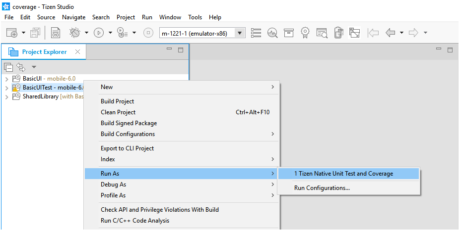
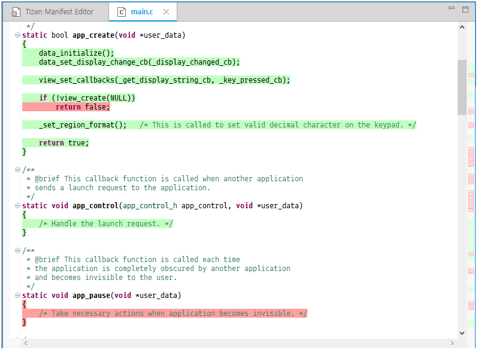
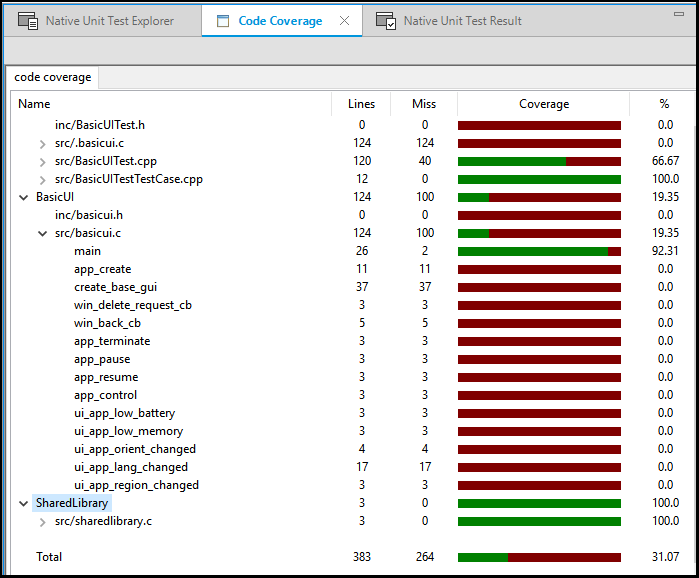

# Getting Code Execution Information with Code Coverage

The Code Coverage is a profiling tool used to determine the coverage details of Tizen native applications. It finds the parts of code that are executed during a particular scenario. A program with high code coverage, measured as a percentage, has had more of its source code executed during testing. This suggests it has a lower chance of containing undetected software bugs.

The Code Coverage tool is based on the llvm-cov tool. With it, you can detect parts of code that are not covered by a scenario and make sure that the uncovered code does not cause errors at runtime. Functional, statement, and branch coverage are supported in the Code Coverage tool.

## Using Code Coverage

> **Note**  
> Before you run the Code Coverage:
>
> - Make sure that you have an emulator or a connected target device running.
> - If you want to try out the tool and do not have an applicable project to test, create a test project with the Project Wizard using a template or sample. For more information on creating a project, see [Creating Your First Tizen Mobile Native Application](../../native/getting-started/mobile/first-app.md).

To use the Code Coverage tool:
 
1. In the **Project Explorer** view, right-click the project and select **Profile As > Profile for Code Coverage**.

   The profiling instruments the code and compiles the project for Code Coverage. Finally, it launches the application on the connected target or emulator.

   

2. After the application is launched, run the application scenario you want to test.

   

3. To get the coverage report, press the **Stop/Cancel Operation** button in the **Progress** view of the Tizen Studio.

   

4. The Tizen Studio shows the code coverage information in the editor after the application has closed. A **Code Coverage** view also opens to give a summary of the code coverage percentage for each file.

   The code covered during the scenario has a green highlight and the uncovered code has a red highlight.

   

   Each row of the **Code Coverage** view can be expanded to show the function level coverage information.

   

## Related Information
* Dependencies
  - Tizen Studio 1.1 and Higher
