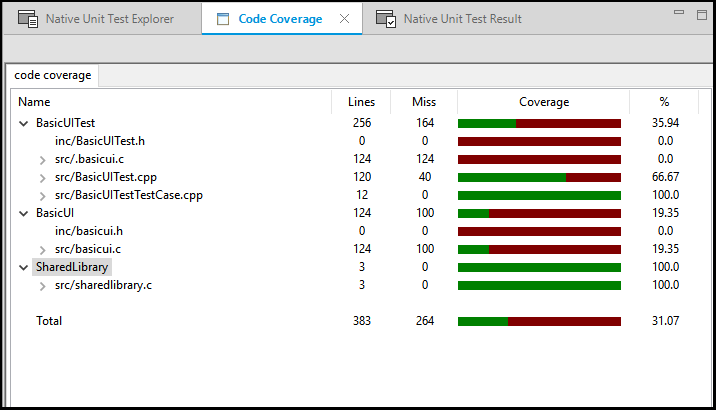
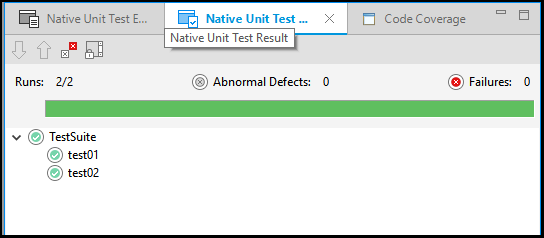
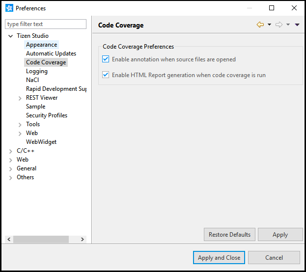
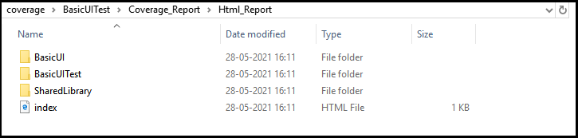
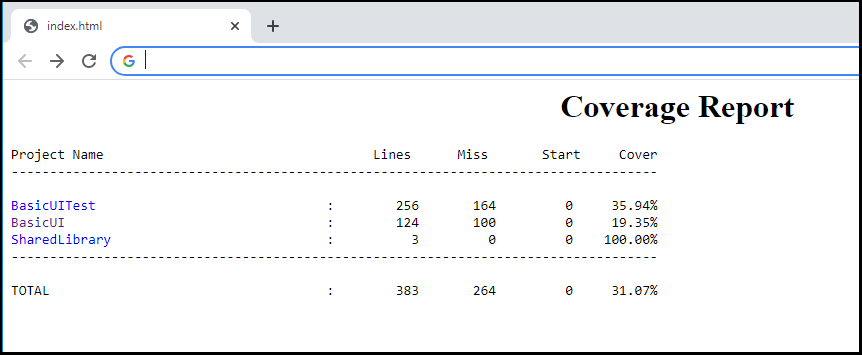
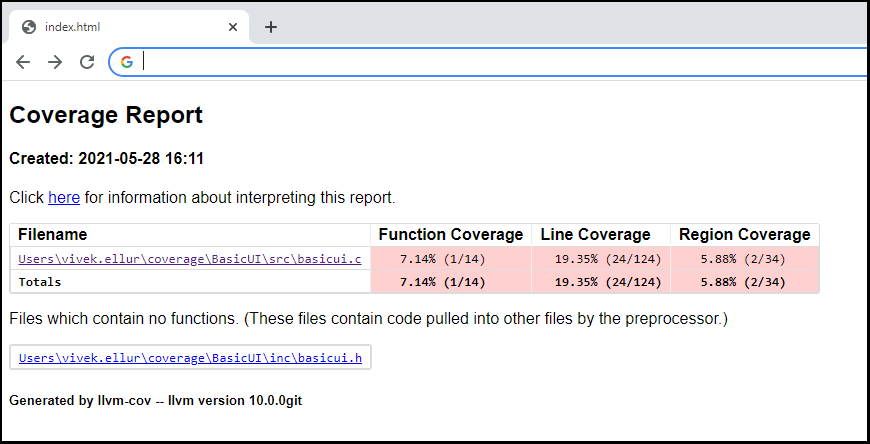

# Get Code execution information with Code Coverage

The Code Coverage is a profiling tool used to determine the coverage details of Tizen native applications. The Code Coverage tool finds the parts of the code covered during the execution of the unit test cases. A program with high code coverage (measured in percentage) implies that most of the source code is covered during testing and the source code has a lower chance of containing undetected software bugs.

The Code Coverage tool is based on the **llvm-cov** tool. Using the Code Coverage tool, you can detect parts of code that are not covered by a unit test and ensure that the uncovered code does not cause errors at runtime. The Code Coverage tool supports functional, statement, and branch coverage.

## Use Unit Test and Code Coverage

> [!NOTE]  
> Before you run the Unit Test and Code Coverage:
> - Make sure that you have an emulator or a connected target device running.
> - If you want to try out the tool and do not have an applicable project to test, create a project with the Project Wizard using a template or sample. For more information on creating a project, see [Creating Your First Tizen Mobile Native Application](../../native/get-started/mobile/first-app.md).
> - Add a Unit Test project to the newly created template or sample. For more information on adding Unit Test project, see [Building Unit Test Projects](./unit-test.md).

To use the Unit Test and Code Coverage tool:
 
1. In the **Project Explorer** view, right-click the Unit Test project and select **Run As > Tizen Native Unit Test and Coverage**.

   All the unit tests present in the Unit Test project are executed and coverage is determined based on the code covered by the unit tests:

   

2. After the Unit Test project completes its execution, Tizen Studio displays the code coverage information in the editor. The **Unit Test Result** and **Code Coverage** views provide a summary of the unit test results and code coverage percentage for each file.

   The code covered during the test execution has a green highlight and the uncovered code has a red highlight as shown in the following figures:

   **Figure: Covered code highlighted with green and uncovered code with red**

   
   
   **Figure: Detailed view of Code Coverage**

   

    Each row of the **Code Coverage** view can be expanded to view the function level coverage information as shown in the following figure:

    **Figure: Code Coverage result on a function level**

   

   The Unit Test results are shown in **Native Unit Test Result** view as shown in the following figure:
    
    **Figure: Unit Test Result**

   

## Generate HTML Code Coverage report

To Enable HTML code coverage report generation: 

1. Enable the checkbox option **Enable HTML Report generation when code coverage is run** from menu **Window > Preferences > Tizen Studio > Code Coverage** as shown in the following figure:

    
    
    > [!NOTE]
    > To annotate the source files when opened from **Project Explorer**, select the checkbox **Enable annotation when source files are opened** in the preferences dialog box.

2. Run the Code coverage again by following the steps mentioned in previous section. After the execution completes, the HTML reports are generated under **<Unit_test_project_path>/Coverage_Report/Html_Report**, where **<Unit_test_project_path>** is the path where the Unit Test project is created:

    

3. Open the **index.html** page in the browser to view the Code Coverage:

    

4. Click on any of the projects to get the coverage at file level:

     

## Related information

- Dependencies
  - Tizen Studio 4.0 and Higher
