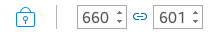
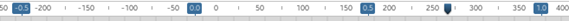
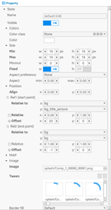
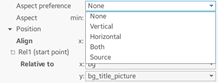
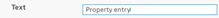
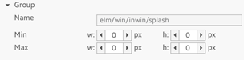
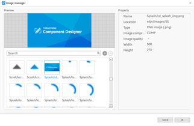

# Designing UIs with the Component Designer

The Component Designer is a rich graphical tool that provides a UI for EDC markup. It is aimed to simplify the creation and editing of UI component styles, avoiding the need to learn the EDC syntax.

The Component Designer was designed with the idea that the target users are both programmers and designers. Besides styles, you can also create and edit custom layouts with the Component Designer.

**Figure: Component Designer**

## UI Layout

The Component Designer contains a few different blocks, which interact with each other to show, for example, groups, parts, and EDJ collections.

In the following figure:

- Block in the middle (yellow rectangle) is a workspace. It is used to show group parts.

- Blocks on the left (green and blue) are navigation blocks.

  The top one contains a list of groups, while the bottom one usually shows parts, programs, data, and other things related to the group (a group usually consists of parts, programs working with and sometimes manipulating a part, and some simple data).

  All navigation controls are represented by tree-view lists. While the group navigation at the top mostly represents all groups inside a project and allows manipulating them (such as deleting, copying, and creating), the part/program navigation at the bottom has some behavior. The part/program list depends on the currently loaded group (selected from the group list), the type of the group, and the workspace mode.

- Block on the right is **Property**. It shows the properties of the item currently selected in the navigation bottom block, and it can be a part, program, or data.

- Violet bar at the top contains tabs. Each tab has its own workspace.

- Red bar at the bottom of the window is a status bar.

  **Figure: Component Designer window blocks**

  

## Group Navigation

The list of groups is located on the left side of the Component Designer, and holds all groups from the loaded project, with items sorted alphabetically.

**Figure: Group navigation**

On the top of the navigation bar, 2 icons allow you to add a new group into the project or delete an existing group. If you add a new group, a simple dialog wizard opens, and sets a name for new group and selects a source group, if one is required to create a copy or alias.

> **Note**  
> Copy and alias are different entities. A copied group is an independent group with all parameters copied from the source group. An alias, however, is only a link. The alias group has a specific icon () and the opened alias group does not allow you to work with the part/program navigation or with parts on the workspace.

The group list is a tree view, whose structure is based on the group name tokens (separated by "/" characters). For example, the default Elementary theme contains a lot of groups with styles for Elementary components, such as `elm/check/base/default`:

- All groups related to Elementary are organized below the root token, `elm`.
- The next level is organized by component name, such as `check`.
- The lowest level leafs of this tree are the style names, such as `default`.

For comfortable visual navigation, the tree leafs have a "document" icon, and the nodes are represented by a "folder" icon.

## Part/program Navigation

The Component Designer provides a navigation bar for primitives that are stored inside groups. The primitives are parts, programs, and data. They are placed on the right side of the main work area as 2 root nodes.

**Figure: Part/program navigation**

The controls placed at the top of the navigation bar make it possible to add new primitives or change the order of the parts inside the group. Click the **+** icon to see the names of the available primitive types. Depending on the selected context, some of the entities can be disabled.

**Figure: Available primitive types**

For example, to add a new state for an existing part:

1. Select the part name in the list and add a new state by clicking the **+** icon.
2. A wizard guides you through adding the new primitives with the necessary attributes required by the selected primitive type.
3. To update the attribute properties, select the primitive item in the list. You can switch the part state by double-clicking the state name. The state is updated in the workspace view.

To manage primitives:

- Parts

  There is an eye icon () on the left side of the part name. If the group has too many parts, and it is too complicated to work with them on the workspace, you can hide some parts by clicking the eye icon. To show the part again, click the empty check that replaces the eye icon.

  To identify the part type in the tree, an icon representing the part type is shown on the right side of the part name. The following table shows the currently available part types.

  **Table: Part types**

  | Icon                                     | Type      | Icon                                     | Type    |
  |----------------------------------------|---------|----------------------------------------|-------|
  |  | Rectangle |  | Text    |
  |  | Image     |  | Swallow |
  |  | Textblock |  | Group   |
  |   | Box       |  | Table   |
  |  | Proxy     |  | Spacer  |

  Some parts can contain items in addition to states, for example, a box or table. Such items are shown as a different list, which is expandable and shows the number of items already inside the part. When such item (box or table) is selected, you can add new items to it. You cannot add any items to any other part typ
  > **Note**
  > To explore the tree, double-click a node or press the right arrow icon.

- Programs

  The parts/programs list only allows you to add or remove programs. To show the modifiable program parameters in the Property block, click a program name.

- Data items

  Data items contain raw data information (data name and raw value) that is encased inside the current group. Sometimes, the data item information is very important; for example, genlist items contain data items needed for setting the text and content. You can add and delete data items by using the controls at the top of the navigation bar.

## Workspace

The workspace is placed in the middle of the Component Designer window. It shows a visual representation of the group being edited.

**Figure: Workspace**

You can open multiple groups at the same time, and switch between them using the tab bar placed above the workspace.

Each workspace has a history (for undo and redo actions).

The workspace component can demonstrate 2 possible behaviors: normal and demo.

### Group View

The workspace group view is a scrollable view where the background is preset by using certain tools. It contains a visual representation of the group, showing its parts and applied properties:

- Parts stay within a specific container that can be resized.
- Parts can be manipulated by a mouse pointer.
- Parts can be selected and highlighted, and also resized using the [highlight handlers](#highlight).

> **Note**  
> Clicking a part selects it and loads the part properties. Clicking an already selected part switches between the part state and the part (and switches their properties as well).

If you right-click the group view background, a context menu opens. You can select actions, such as undo, redo, and show/hide rulers and certain scales (or both). The group view also contains rulers to show the relative and absolute sizes.

### Tools

The workspace has various tools that allow you to manipulate it:

- The size of the previewed group can be changed through the container border. The container has a small rectangle at the bottom-right corner: use it to change the size with the mouse.

  Another way is to use the spinners placed at the beginning of the toolbar to set the container size. The chain between the spinners determines whether the width and height changes are made simultaneously. The toggle on the left blocks all size changes.

  In the following figure, the setting at the bottom blocks all size changes, and the width and height changes are not linked. At the top, the size changes are not blocked, and the width and height changes are linked.

  **Figure: Container size**

  

  

- If the group is too small or too big, you can zoom in and out with a slider. To set an accurate zoom value, use the zoom spinner.

  **Figure: Zooming**

  

- To fit the group view with the currently opened group, use the  icon. It makes the group smaller or larger, as needed, to fit the size of the group view.When the fit is selected, it blocks all size changes until the fit is unselected.

- You can undo and redo all changes that happen during group editing. The change history is cleared when you close the tab of the edited group in the workspace.

  **Figure: Undo and redo**

  

- A combo box allows quick access to the resource libraries. All available libraries are shown in the drop-down list.

  **Figure: Resource library access**

  

### Highlight

When working with parts on a workspace and setting min, max, or other attributes, you can simply change the sizes and alignments in the group view directly. The group view provides part and object area highlights to assist you:

- Part highlight

  When you click a part, a highlight with the same size as the clicked part appears. You can change the size of the selected part by dragging the handlers at each corner.

  **Figure: Part highlight**

  

  Remember that a part changes its size and position relative to the part's alignments. In addition, the part size cannot reduce lower than its min values, or grow above the object area size.

- Object area highlight

  An object area is the area between relative points set in the part properties. There are 2 relative points (start and end points) and the part is positioned between those points. The relative points are usually the main opened group or another part.

  To show or hide the object area in the group view, select **View** > **Show object area** in the menu bar. The object area highlight is a shaded rectangle.

  **Figure: Object area highlight**

  

  While **Show object area** is activated, the part highlight has an additional handler in its middle. By dragging the middle handler, you can change the alignment of the selected part.

### Modes

The workspace can demonstrate 2 possible behaviors:

- Normal

  This mode is used to manipulate the group primitives in the development stage. All parts are represented on the workspace, including containers and spacers. Each of the non-visible primitive types has their own pattern and color. This makes it possible to understand the markup of the group and the dependencies between primitives. Text parts are bordered to show the area from the top-left to bottom-right corners. In addition, text parts set the part name as content if there is no preset text in that part (it can be set in the text block in the properties).

  You can select primitives directly on the workspace in this mode. You can also select parts inside the part/program navigation panel, as usual. The selected part is covered by the resizing control element, which shows handlers that change the maximum size of the primitive.

  **Figure: Normal mode**

  

- Demo

  To activate the demo mode, click the demo mode button (). While the normal mode is used during the implementation process, the demo mode is used to see the end result. Objects displayed in this mode look the same as in the runtime application.

  You can enter text into text parts and set container part content. Predefined components (such as button, check, slider, entry, and progress bar) can be used as content. You can also use a simple rectangle or an image file stored in the file system as content. You can set different colors and minimum/maximum sizes for content.

  The demo mode can also emit signals to objects. When the programs inside a group are created, you want to check how the objects react to those signals. The list of signals that can be emitted in the demo mode exclude the programs that depend on mouse events, because it is easier to click (or mouse in/out, double-click) on a real object.

  **Figure: Demo mode**

  

> **Important**  
> Most Elementary components are loaded as fully functional UI components. This means that the behavior of the loaded component depends on the Elementary source code. The group is loaded with a default layout if the group has no Elementary component style or is a still unsupported component.

### Rulers

Rulers are parts of the group view, which can be used to show the part sizes and their relatives. Both vertical and horizontal rulers have an indicator that shows the current mouse position, and can be used to make some general measurements of the part size and position. Zooming the group view in or out also changes the rulers, showing zoomed sizes.

**Figure: Rulers**

To hide the rulers, click the group view background and clear the **Show rulers** option.

You can show 2 scales on rulers:

**Figure: Ruler scales**

- Absolute scale (gray text and dashes): rulers show the decent sizes in pixels of the entire group shown and loaded into the container.
- Relative scale (blue bubble with value inside): rulers show the relatives of the selected part (or the entire group if a part is not selected). The relative scale works well with the object area, showing all relatives of the current object on a group view.

You can use and show both scales on rulers.

## Properties

The panel on the right side of the Component Designer window can be used to modify the properties and parameters of the current context (such as an opened group, workspace mode, or selected part, state, or program). You can see and modify the values of a large number of properties, such as min, relative, map, part name, and content type (for demo).

**Figure: Properties**

All general properties that can be modified are described in the following sections. There are different properties for an opened group, demo mode, selected items, data, program, state, and part. Some user-friendly general behaviors, such as list filtering (hide other controls on certain values), popups, and highlights are covered as well.

### Property Controls

Properties consist of different controls:

- The properties are generally grouped into a tree structure containing the attributes (controls) and related values together. For example, the **Color** block contains the color classes and general color, while the **Position** block contains all controls to work with relatives (such as relative to and offsets).

- Most properties have a description (title) text, which is highlighted with bold when it has a non-default value. Every property has 1 or 2 controls (like min and max in the **Picture** property), and the property can show a subparam (subtitle) and measure (for example, px).  
**Figure: Property title and value**  

- If the attribute can have a value within a range, a spinner control is used. These attributes can be, for example, offsets (which can be up to 9999 pixels), borders, and sizes.

- Some attributes can be negative and positive, while some are positive only. All of that depends on the attribute characteristics described by [Edje Data Collection reference](https://docs.enlightenment.org/efl/current/edcref.html).

- If the attribute can be only in ON or OFF state (such as **Visible**, **Smooth**, and **Map**), a check control is used to show them.  
**Figure: Check control**  

- If the attribute has a constant number of text-based values, a combo box control is used. It is commonly used for, for example, **Aspect preference**, **Clip to**, and **Relative**. That control is also widely used for those attributes which require you to select one of the parts existing inside the opened group.  
**Figure: Combo box**  

- If the attribute defines a color, a button that shows a color palette is used. This is widely used inside the textblock style library. If you click the button, a popup is shown. After you select the color, it is immediately applied to the selected part.

  **Figure: Color palette**

  

- Entry control is commonly used to set up text attributes, such as name, text, and fonts. Sometimes the entry is modified, for example, the image path has an entry control with a button. If you click it, an image selector (similar to the color selector) is shown, with a grid of all images added through the image manager and already existing in the project. Select the image by double-clicking it.

  **Figure: Entry**

  

- The **Tween** block has a variable set of images. You can add images by clicking the **+** button, or delete all selected images with the - button. The **+** button shows a list of images, and you can select any number of them before clicking **OK**. All selected images are added to the tween.  
**Figure: Tween**  

### Non-default Highlight

The property highlights to show non-default values in bold. The highlight makes it easier to look at the entire set of properties and see which of them have been changed and differ from the default values. Whenever a non-default value is changed back to its default, the description text of that property is unbolded.

**Figure: Non-default highlight**

### Group Block Properties

The **Group** block shows itself only when a group is loaded and its tab is activated, but nothing is selected yet. It contains only a few properties, such as the group name (which is unedited for now) and some general group min and max sizes.

**Figure: Group block properties**

### Part Block Properties

The **Part** block is usually the same for most part types. More properties are available for the text and textblock types, and the source for the part type called **GROUP**. Generally, the block contains some general part attributes, such as mouse pointer attributes (pointer mode, events repeating), scale, and draggable attributes.

**Figure: Part block properties**

### State Block Properties

The **State** block is large, and its content varies depending on the part type and the selected part state. Generally all part types contain 4 blocks:

- **Colors** (selected color class for this state or general color)
- **Size** (such as min, max, and aspects)
- **Position** (relatives, offsets, and align)
- **Map** (everything related to map, perspective, colors, and rotations)

Some types have specific blocks in their states. The image part has the **Image** block (properties, such as tweens, image, and borders) and the **Fill** block. The text and textblock parts have some text attributes inside every state. The container parts (box and table) have some container attributes (such as align and weight).

### Program Block Properties

The program usually has 1 important block that contains some attributes, such as the program name, action type, signal, source, and filters. Usually, it also contain a list of after's - programs that are run together with the selected program in a certain queue.

**Figure: Program block properties**

Based on the program action type, the block can contain more attributes. For example, the **Action params** can have a state name and value for the **STATE_SET** program type, or it can be a sample, channel, and duration for **SOUND_SAMPLE**. For programs like **STATE_SET**, there is also a block used to set **Targets** (for example, the **STATE_SET** program applies changes to the parts listed in the **Targets** block).

### Item Block Properties

The item properties are shown only when the items of the box or table part are selected. They have simple attributes, such as the source group to be loaded into the item, and sizes, positions, and paddings.

**Figure: Item block properties**

### Data Item Block Properties

The **Data item** block contains only a key and value pair.

**Figure: Data item block properties**

### Demo Block Properties

The **Demo** block appears only when the workspace is in the demo mode, and the navigation list of parts contains only signals, text, textblock, and swallow parts. The demo properties vary depending on what kind of part or signal is selected:

- For selected signals, information is shown about the signal, such as the emitter, signal, and type of program to be called.

- For selected text and textblock parts, simple property attributes are shown, such as uneditable part name and content. When you enter text into content, the text is sent to the demo object, showing how the loaded demo object acts when certain text gets into the text parts.

- For selected swallows, more attributes are shown. If you use the swallow properties, you can set up objects in the selected swallow, and see the resulting layout.

  The demo mode shows how the end result looks like when a specific component or layout is used inside different programs or as a theme.

The **Demo** properties allows you to set a rectangle (and its color), image (with a path to the image file to load the picture from the system), or UI component (predefined list of components to put into the swallow, for example, check, button, and gengrid). In addition, you can set up a certain style for the selected component, from inside the group.

For any kind of content (UI component, image, or rectangle), you can set up the min and max size, which also helps to determine the resulting behavior of the loaded group.

**Table: Demo block properties**

| Content type | Properties                               |
|------------|----------------------------------------|
| Rectangle    |  |
| Image        |  |
| UI component |  |

## Managers

Component styles in one theme usually share a lot of common resources. These include images, sounds, text styles, and color classes. The Component Designer provides a set of resource managers that allow you to add, view, edit, and delete existing resources.

### Images

The image manager shows all images in the project as a grid. Unused images are marked with an exclamation mark . When you select an image, you can see its preview and basic info (name, type, location, and size compression type and rate).

**Figure: Images**

To add an image into the project, click the **+** button and select it in the file selector. You can add multiple images at once by holding the **Shift** key.

To delete the selected images, press the **-** button. Only unused images can be deleted, because deleting used images damages all styles where they are used.

### Sounds

The sound manager is very similar to the image manager. It shows all sounds and tones in the project and allows adding and removing them. Instead of an image preview, there is a simple sound player.

**Figure: Sounds**

### Textblock Styles

The style manager shows all textblock styles in the project. You can expand the style to see all its elements.

**Figure: Textblock styles**

**DEFAULT** is a virtual element that defines the properties of the text not enclosed in any element. The element's attributes can be edited after selecting it. In the left side, you can see how the selected element affects the text in the textblock.

### Colorclasses

Color classes are designed to simplify color adjustment in your theme. Changing colors in the color class manager affects all parts in all styles that are using it.

**Figure: Colorclasses**

For most part types, only the first color matters. Only the text parts can use all 3 colors.

> **Note**  
> If you want some part to have a slightly different color, you can specify both a color and color class. In this case, their values are multiplied. For example, if you have a background color class with the green main color (255, 0, 0, 255) and a part with this color class and a half-transparent white color (255, 255, 255, 127), the resulting part color is (255, 0, 0, 127).

## Shortcuts

The following table lists the shortcut keys available for the Component Designer.

**Table: Shortcuts**

| Key                                      | Description                              |
|----------------------------------------|----------------------------------------|
| Global                                   |                                          |
| **F1**                                   | Show the shortcut list                   |
| **F2**                                   | Normal mode                              |
| **F3**                                   | Code mode                                |
| **F4**                                   | Demo mode                                |
| **F7**                                   | Open the image manager                   |
| **F8**                                   | Open the sound manager                   |
| **F9**                                   | Open the style manager                   |
| **F10**                                  | Open the colorclass manager              |
| **Alt + F4**                             | Quit                                     |
| Workspace                                |                                          |
| **Ctrl + S**                             | Save                                     |
| **Ctrl + Z**                             | Undo                                     |
| **Ctrl + Y**                             | Redo                                     |
| **Ctrl + N**                             | Add a new group                          |
| **Q**                                    | Add a new part                           |
| **W**                                    | Add a new state                          |
| **E**                                    | Add a new item                           |
| **R**                                    | Add a new program                        |
| **T**                                    | Add a new data item                      |
| **Delete**                               | Delete the selected part, state, item, program, or data item |
| **S**                                    | Select the next state of the active part |
| **Z**                                    | Select the previous part                 |
| **X**                                    | Select the next part                     |
| **Esc**                                  | Unselect                                 |
| **O**                                    | Show or hide the object area             |
| **Ctrl + Mouse wheel up**                | Zoom in                                  |
| **Ctrl + Mouse wheel down**              | Zoom out                                 |
| **KP_DIV**                               | Set the zoom to 100%                     |
| Tabs                                     |                                          |
| **Ctrl + W**                             | Close the tab                            |
| **Ctrl + Number keys**                   | Switch to tab 1-10                       |
| **(Ctrl + Tab) or (Ctrl + Page Down)**   | Switch to the next tab                   |
| **(Ctrl + Shift + Tab) or (Ctrl + Page Up)** | Switch to the previous tab               |
| Popups                                   |                                          |
| **Enter**                                | OK                                       |
| **Esc**                                  | Cancel                                   |

## Related information
* Dependencies
  - Tizen Studio 1.1 and Higher
