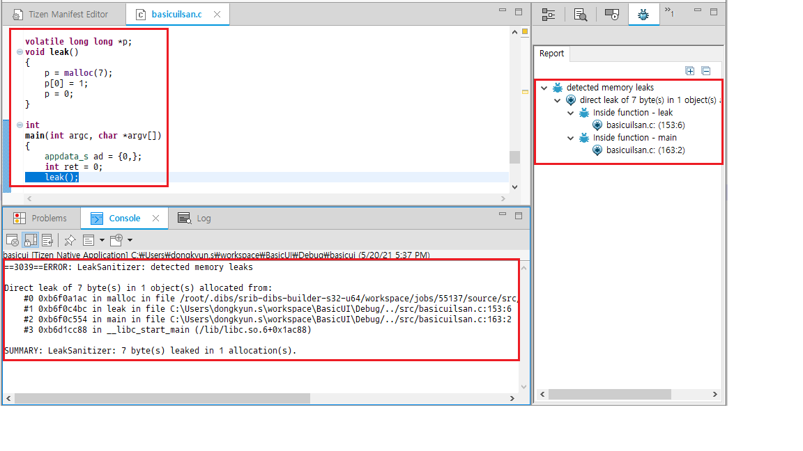

# Detect runtime memory leaks with Leak Sanitizer

The Leak Sanitizer is a profiling tool used to detect runtime memory leaks in Tizen native applications. The Leak Sanitizer lets you discover whether specific parts of code can potentially cause memory leaks at runtime. You can also avoid leaks in memory after application execution. The Leak Sanitizer tool detects memory leaks at runtime by instrumenting the code during the application compilation. A program with no bugs does not crash when the Leak Sanitizer tool is used, suggesting that the code is safe from potential memory leaks.

## Using the Leak Sanitizer

> [!NOTE]
> Before you run the Leak Sanitizer:
> - Make sure that you have an emulator or a connected target device running.
> - If you want to try out the tool and do not have an applicable project to test, create a test project with the Project Wizard using a template or sample. For more information on creating a project, see [Creating Your First Tizen Mobile Native Application](../../native/get-started/mobile/first-app.md).

To use the Leak Sanitizer:

1. In the **Project Explorer** view, right-click the project and select **Profile As > Profile With Leak Sanitizer**.

   The profiler links your program to a runtime library containing the bare necessities required for Leak Sanitizer to work by setting option `-fsanitize` to `leak`,  and no compile-time instrumentation is applied. Whilst the option is set, the application launches on the connected target or emulator to detect runtime memory leaks: 
  
   

2. After the application launches, run the application scenario that you want to test. Unlike Address Sanitizer, Tizen Studio checks and shows the profiling result when you exit the application, as illustrated in the following figure.

   In the example shown in the following figure, the application crashes after `main()` exits:

   

## Related information
- Dependencies
   - Tizen Studio 1.1 and Higher
