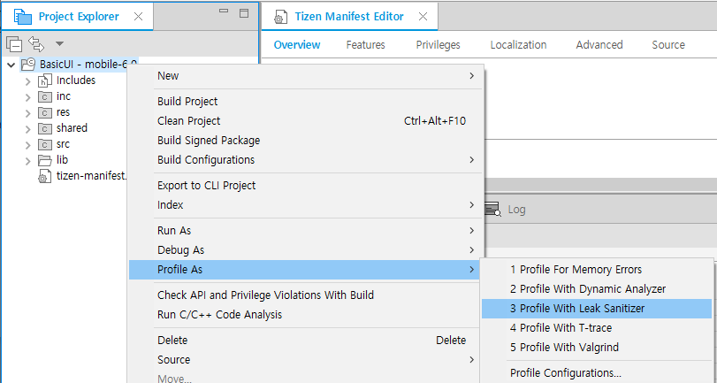

# Detecting Runtime Memory Leaks with Leak Sanitizer

The Leak Sanitizer is a profiling tool used to detect runtime memory leaks in Tizen native applications. With it, you can discover whether specific parts of code can potentially cause memory leak at runtime. You can also avoid leaks in memory after application execution. The Leak Sanitizer tool detects memory leak at runtime by instrumenting the code during the application compilation. A program with no bugs does not crash when the Leak Sanitizer tool is used, suggesting that the code is safe from potential memory leak.

## Using the Leak Sanitizer

> **Note**
>
> Before you run the Leak Sanitizer:
>
> - Make sure that you have an emulator or a connected target device running.
> - If you want to try out the tool and do not have an applicable project to test, create a test project with the Project Wizard using a template or sample. For more information on creating a project, see [Creating Your First Tizen Mobile Native Application](../../native/get-started/mobile/first-app.md).

To use the Leak Sanitizer:

1. In the **Project Explorer** view, right-click the project and select **Profile As > Profile With Leak Sanitizer**.

   The profiling instruments the code and compiles the project for the Leak Sanitizer. Finally, it launches the application on the connected target or emulator.

   

2. After the application is launched, run the application scenario you want to test.

   Unlike Address Sanitizer, Tizen Studio checks and shows the profiling result at the application exit, as illustrated in the following figure.

   In the example shown in the figure, the application crashes after `main()` function is exited.

   

## Related information
* Dependencies
   - Tizen Studio 1.1 and Higher
