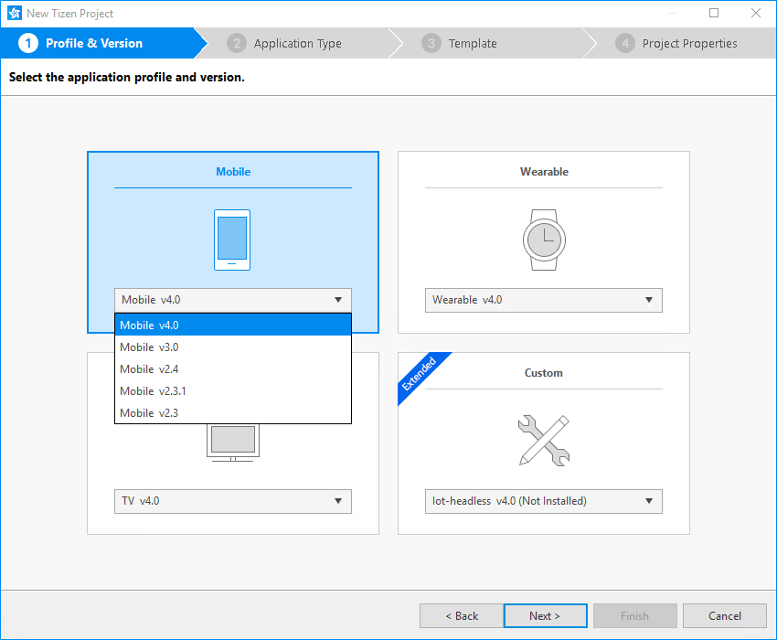
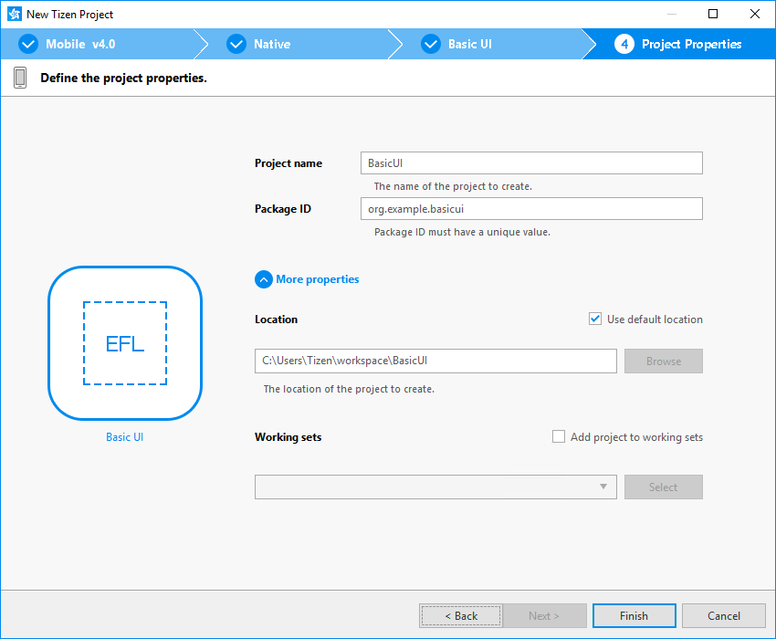

# Creating Tizen Projects with Tizen Project Wizard

The Tizen Project Wizard is a Tizen Studio tool that is used to create a native application project.

The Tizen Studio provides various project templates and samples that make it easier for you to start coding your application. When you create a new project, you can select a specific template, which the Tizen Project Wizard uses to automatically create basic functionalities for the application. The default project files and folders are also created.

In the Tizen Project Wizard, you can select a profile and version, application type, and template or sample to create the project. In addition, you can set basic project properties, such as the project name, location, and working sets.

To open the Tizen Project Wizard, use one of the following:

- In the Tizen Studio menu, select **File > New > Tizen Project**.
- In the Tizen Studio toolbar, click the **New** icon ().
- Right-click in the **Project Explorer** view, and select **New > Tizen Project**.
- If there is no project in the workspace, click the **New** icon () in the **Project Explorer** view toolbar.

## Project Type

When the Tizen Project Wizard opens, you must first select the project type.

**Figure: Selecting the project type**

The Tizen Studio provides various project templates and samples for mobile and wearable devices according to the installed platform. The Tizen Project Wizard helps you select a template or sample for your project.

The **Template** option provides a list of templates with a basic structure where you can start the native application project:

- **Common**
  - **Basic UI/Basic UI with EDC**: Empty template projects for developing UI applications using EFL.
  - **Basic UI with DALi**: Empty template project for developing 3D graphic applications using DALi (Dynamic Animation Library).
  - **Input Method Editor**: Simple template project for an IME application, which helps to create your own input method editor.
  - **Service**: Empty template project for developing applications with no graphical user interface that run in the background. They can be very useful in performing activities that need to run periodically or continuously, but do not require any user intervention, such as getting sensor data in the background.
  - **Shared Library/Static Library**: Empty template projects for developing libraries.
  - **Widget**: Empty template project for developing widget applications.

- **Mobile**
  - **Basic UI with Viewmgr**: Empty template project for developing UI applications with multiple views.
  - **Downloadable Font**: Empty template project for developing a downloadable font. You can create your own font resources in the Tizen Studio to be distributed as a downloadable font package.
  - **UI Builder - Navigation View/Single View**: Empty template projects for developing UI applications supported by the UI Builder, such as navigation or single view applications.

- **Wearable**
  - **UI Builder - Navigation View (Circle)/Single View (Circle)/Widget (Circle)**: Empty template projects for developing UI applications supported by the UI Builder, such as circular navigation view, circular single view, and circular widget applications.
  - **Watch/Watch Application with DALi**: Empty template projects for developing circular watch applications.

The **Sample** option provides a list of sample applications demonstrating various API usage and UI design.

To move to the next step, select the project type and click **Next**.

## Profile and Version

You can select the profile and version supported by your project, such as a mobile or wearable device. In addition, the Tizen Studio shows you which platforms among the supported platforms have been installed.

Based on the selected profile and version, a list of templates is shown in the template selection step.

**Figure: Selecting the profile and version**

To move to the next step, select the profile and version, and click **Next**.

## Application Type

You can select the native or Web application type for your project. For more information, see [Native Application](../../native/tutorials/process/app-dev-process.md) and [Web Application](../../web/tutorials/process/app-dev-process.md).

Based on the selected application type, a list of templates is shown in the template selection step.

**Figure: Selecting the application type**

To move to the next step, select the application type and click **Next**.

## Template

You can select the template for your project while viewing information about a variety of templates. The Tizen Project Wizard creates the project based on the selected template.

**Figure: Selecting the template**

To move to the next step, select the template and click **Next**.

## Project Properties

You can set basic project properties, such as the project name, location, and working sets.

**Figure: Setting project properties**

The options you can set are listed in the following table.

**Table: Project properties**

| Property                 | Description                              |
|------------------------|----------------------------------------|
| **Project name**         | A name for the project to be created.    |
| **Package ID**           | The ID for the package of the project.   |
| **Use default location** | If you check this option, the project is created in the `$<workspace_location>/<project_name>` directory. |
| **Location**             | Manually select the location of the project.  If you check the **Use default location** checkbox, this option is disabled. |
| **Working sets**         | If you want to include the project to a specific working set, select the **Add project to working sets** checkbox. For more information, see the [Working sets help page](http://help.eclipse.org/mars/index.jsp?topic=%2Forg.eclipse.platform.doc.user%2Fconcepts%2Fcworkset.htm). |

After specifying the options, click **Finish** to create the new project.

## Related information
* Dependencies
  - Tizen Studio 1.0 and Higher
