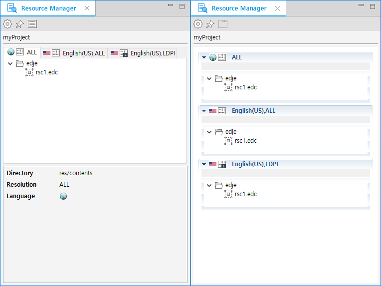
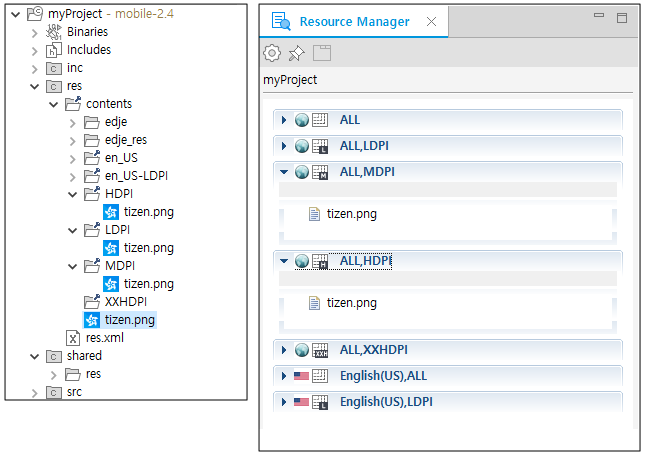

# Providing Resources for Multiple Device Types

Tizen native applications can run on different types of devices, such as wearable, phone, tablets, and TVs. Tizen also supports various resolutions (WVGA ~ XQXGA) and resources.

When you take advantage of the above features, remember that you must always polish your work to create an optimal application for each device. The Tizen Studio provides a tool (**Resource Manager** view) for developing applications for multiple device types and resolutions.

> **Note**  
> The Resource Manager is supported in the 2.4 platform only. If you cannot access the **Resource Manager** view, check the `version` and `api-version` attributes in the `<manifest>` element of the application manifest file.

## Resource Directory Hierarchy

An application must provide a different UI depending on a specific device configuration, such as the screen size and screen orientation. When developing the application, provide alternative resources for each device display state by grouping them in resource directories.

The `res/contents` directory contains predefined directories for specific alternative resources, and the `res.xml` file that is referenced at application runtime. The following example of a Basic UI project shows how to group the resources in your project. Place resources, such as images and sounds, in a specific subdirectory of the project's `res/contents` directory or the root directory of the `contents` directory.

**Figure: Resource directory hierarchy**

> **Note**  
> Always include the default resources in the root directory (not in a subdirectory of the `contents` directory) to ensure that your application has no dependencies on a specific device configuration.

A specific subdirectory is named with a **configuration-qualifier**. The configuration-qualifier is an indicator that represents each device configuration, and more content can be appended to it with a dash (-). The following table shows the 2 configuration-qualifier types currently supported by the Tizen Studio.

**Table: Configuration-qualifiers**

| Configuration-qualifier type | Type value                        | Description                              |
|----------------------------|---------------------------------|----------------------------------------|
| Language and region code     | For example, `en_US` or `en_UK`   | The type values have the form `ll_CC`, where `ll` stands for an [ISO 639](https://www.gnu.org/software/gettext/manual/html_node/Usual-Language-Codes.html) 2-letter language code, and the optionally followed `CC` stands for an [ISO 3166](https://www.gnu.org/software/gettext/manual/html_node/Country-Codes.html#Country-Codes) 2-upper-letter region code. |
| DPI (Dot Per Inch) density   |`LDPI` `MDPI` `HDPI` `XHDPI` `XXHDPI` | `LDPI`: low-dpi from 0 to 240 `MDPI`: medium-dpi from 241 to 300 `HDPI`: high-dpi from 301 to 380 `XHDPI`: extra-high-dpi from 381 to 480 `XXHDPI`: extra-extra-high-dpi from 481 to 600 |

Each application base scale can be applied to each DPI through a relation modification between the DPI and profile factor. For example, in the mobile profile, the Z device has a small screen (profile factor: 0.7) and the 1.8 base scale value, so the proper DPI is LDPI. The Z3 device has a large screen (profile factor: 0.8) and the 2.6 base scale value, so the proper DPI is MDPI.

**Table: DPI and profile factor**

| DPI type | Base scale in a small screen mobile(profile factor: 0.7) | Base scale in a large screen mobile(profile factor: 0.8) |
|--------|----------------------------------------|----------------------------------------|
| LDPI     | 0 ~ 1.9                                  | 0 ~ 2.1                                  |
| MDPI     | 1.9 ~ 2.3                                | 2.1 ~ 2.7                                |
| HDPI     | 2.3 ~ 3.0                                | 2.7 ~ 3.4                                |
| XHDPI    | 3.0 ~ 3.7                                | 3.4 ~ 4.3                                |
| XXHDPI   | 3.7 ~                                    | 4.3 ~                                    |

The `res.xml` file is composed of XML elements, and describes where each alternative resource is grouped into a device configuration. The following example shows a `res.xml` file based on the BasicUI project.

**Figure: res.xml file**

The `res.xml` file is automatically generated as part of the build packaging process by the Tizen Studio. Since editing the `res.xml` file manually is not easy, the Tizen Studio helps to minimize this difficulty by supporting the **Resource Manager** view.

## Alternative Resources with the Resource Manager

The **Resource Manager** view helps you to place resources in your application to support specific device configurations, such as different screen densities.

In the **Resource Manager** view, you can:

- Show all resource configurations that the project provides (see the [Tab view and Folding list view](#tablist) figure).
- Create multiple configuration-qualifier directories and remove them.
- Copy resources to an alternative directory by dragging and dropping in the view area. You can also remove resources.
- Generate code snippets by dragging and dropping in the source editor area.

> **Note**  
> If the **Resource Manager** view is not visible, open it by selecting **Window > Show View > Other > Tizen > Resource Manager** from the Tizen Studio menu.

To place resource files (`rsc1.edc` file and the images referenced by it) for en_US and en_US-LDPI configurations:

1. Open the **Resource Configuration** dialog by clicking  in the **Resource Manager** view toolbar.
2. Add a configuration by selecting LDPI and MDPI in the DPI combo box.
3. Drag the `edje` folder and drop it into the proper tab list view area in the **Resource Manager** view. The following figure shows the Tab list view (on the left) and the Folding list view (on the right) of the **Resource Manager** view. You can switch between the views using the buttons in the **Resource Manager** view toolbar ( to switch to folding lists and  to switch to tab lists).

**Figure: Tab view and Folding list view**

> **Note**  
> All images used by the EDC file must be placed in the `edje_res` folder created by the Tizen Studio. The `edje_res` folder is excluded from the `.tpk` package file.

### Managing Resources

To quickly manage resources in the Tizen Studio:

1. Create a project with the **Basic UI** template.

2. Create a resource directory hierarchy and copy images into it.

   

3. Create a `res.xml` file by building the project package.

4. Check the `res.xml` file content.

5. Add code for loading alternative resources by using the Resource Manager API (in [mobile](../../../org.tizen.native.mobile.apireference/group__CAPI__RESOURCE__MANAGER__MODULE.html) applications).

6. Build and run the project.

## Related Information
* Dependencies
  - Tizen Studio 1.0 and Higher
