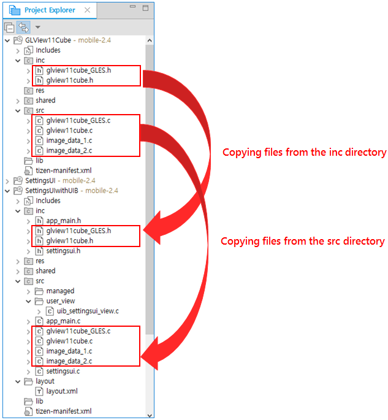
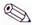
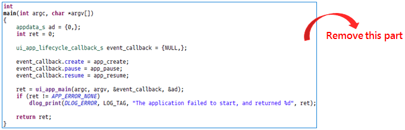
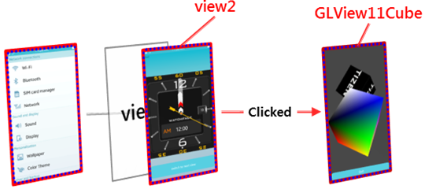
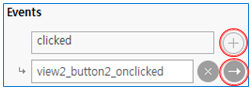
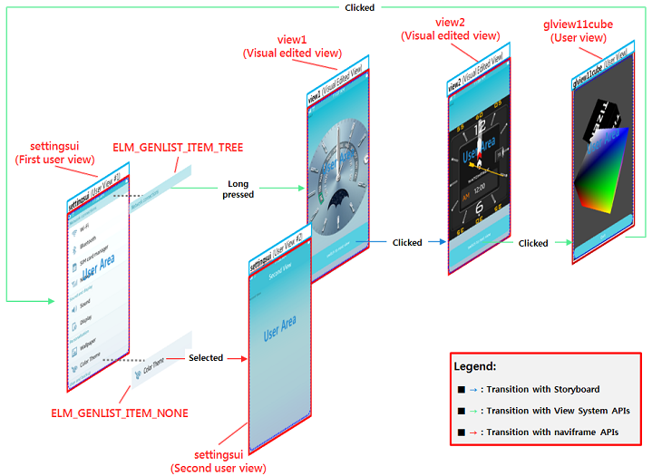

# Combining Screens from Multiple Applications

Due to the project migration features of the UI Builder, you can reuse the screens of your existing applications and the Tizen Studio samples by porting their screens to your new application. You can create screens by using EFL code or the UI Builder, or by porting screens from other applications. The basic principles of migrating an EFL application to the UI Builder and creating screens using the UI Builder are introduced in [Migrating Projects for UI Builder](convert-projects.md).

This topic shows how to add screens from other applications to existing applications. The example is based on the SettingsUIwithUIB project created in [Converting to a UI Builder Project](convert-projects.md#converting-to-a-ui-builder-project). A screen from the [GLView11Cube sample application](https://developer.tizen.org/development/sample/native/Graphics/GLView11Cube) is ported to the SettingsUIwithUIB application.

**Figure: Combining screens from multiple applications**

## Porting a Screen

To port a GLView11Cube project screen to the SettingsUIwithUIB project:

1. Create the GLView11Cube sample application project:

   1. In the Tizen Studio, go to **File > New > Tizen Project**.

   2. Select the **Sample** project type, **Mobile v2.4** profile and version, and the **Native Application** application type.

   3. In the list of samples, select **Graphics > GLView11Cube**.

      

   4. Click **Next**, give the project a name and ID, and click **Finish**.

2. Port the GLView11Cube screen to the SettingsUIwithUIB project:

   1. Copy the related files in the `inc`, `src`, and `res` subfolders.

      

   2. Set hardware acceleration on in the SettingsUIwithUIB project's manifest file as it is in the GLView11Cube project.

      

## Adding a User View for the Ported View

To add a user view for the ported GLView11Cube application screen through the **User View Manager**:

1. Right-click the **SettingsUIwithUIB** project in the **Project Explorer** view and select **User View Manager**.

2. Add a **glview11cube** view.

   

  1. Enter **glview11cube** in the field as a name for the new user view.

  2. Click **Add**.

  3. Click **Finish**.

> **Note**  
> The pencil () icon in the list refers to an existing user view. If you remove an existing user view, the logic based on that view is also removed. This cannot be undone.

## Designing the Ported View

The following figure shows the new view structure when the core UI components of the GLView11Cube screen are changed to those of the UI Builder.

**Figure: GLView11Cube view structure**

The GLView11Cube application (single screen) does not have the naviframe in the core UI component layer. Thus, the UI components that make up the screen are connected to the first Elementary window object. Similarly, the UI Builder view system also creates the `root_container` through the window; however, it defines the structure to manage the view in the naviframe of the window object.

To design the ported view, you must modify the ported source file (`SettingsUIwithUIB/src/glview11cube.c`) and the new user view file (`SettingsUIwithUIB/src/user_view/uib_glview11cube_view.c`).

To modify the ported file (`SettingsUIwithUIB/src/glview11cube.c`):

1. In the **Project Explorer** view, open the `glview11cube.c` file.

2. To use the `app_create()` function as the constructor of the `root_container`, make the following change to the function prototype.

   

3. To use the UI Builder window object, remove the creation part of the core UI component in the `glview11cube_create()` function.

   

4. Add a conditional statement that prevents the `root_container` from being duplicated, which happens when you transition between the views in the UI Builder view system.

5. Change the return value from the `bool` type `true` to the `Evas_Object*` type `table`.

6. Remove the `main()` function from the `glview11cube.c` file, as it is not needed anymore.

   

The following figure shows the modified definition of the `glview11cube_create()` function.

**Figure: Modified glview11cube_create() function**

To modify the new user view file (`SettingsUIwithUIB/src/user_view/uib_glview11cube_view.c`):

1. Include the `glview11cube.h` file for referencing the UI component structure (`appdata_s`).

2. Define the `appdata_s` structure as `ad` to be used in the `glview11cube_create()` function.

3. Add a declaration for calling an external function.

4. Assign the UI Builder's window object to the `ad` structure.

5. Pass the UI Builder's window object as a parameter to the `glview11cube_create()` function and assign the created `glview` object to the view context's `root_container`. At runtime, the GLView11Cube screen is displayed through the `root_container`.

**Figure: Designing the GLView11Cube view**

## Adding View Transitions

To implement view transitions to and from the ported view:

- To switch from the GLView11Cube view to the SettingsUI view (start-up view):

  **Figure: Transitioning from the ported view**

  

  1. Include the `uib_util.h` header file at the top of the `glview11cube.c` file.

     

  2. Modify the `_close_cb()` function by replacing the `ui_app_exit()` function with the `uib_util_push_view()` function.

     The `uib_util_push_view()` function is a view transition function provided by the UI Builder view system.

     

- To switch from view2 to the GLView11Cube view:

  **Figure: Transitioning to the ported view**

  

  1. In the UI Builder **Outline** view, select the **button2** item.

     

  2. In the **Properties** view, click  and  to add a new `clicked` event.

     

     The `uib_view2_event_handler.c` file is opened.

  3. In the `view2_button2_onclicked()` function, call the `uib_util_push_view()` function to switch to the GLView11Cube view.

     

**Figure: SettingsUIwithUIB event flow**

## Related Information
- Dependencies
  - Tizen Studio 1.1 and Higher
