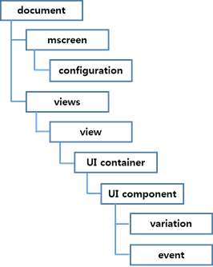
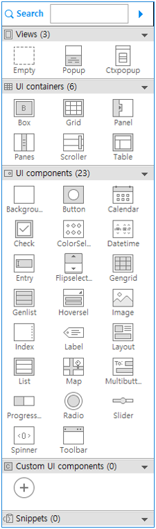
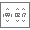
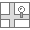

# Managing UI Component Attributes in layout.xml

This document describes the meta schema of the `layout.xml` file, which can be used in the native UI Builder. You can edit the `layout.xml` file through the [Source editor](ui-builder.md) of the UI Builder.

## Element Hierarchy of the layout.xml File

The `layout.xml` file has a hierarchical organization, which consists of XML elements. The tree structure in the following figure shows the relationship between the elements of the `layout.xml` file.

**Figure: Elements in the layout.xml file**



The following example illustrates the content and structure of the `layout.xml` file. The usage format is `<attribute_name=value>`.

```
<?xml version="1.0" encoding="UTF-8" standalone="no"?>
<document>
    <mscreen>
        <configuration device="HD" id="config1" name="common" orientation="portrait" type="common"/>
        <configuration orientation="landscape" name="sd" id="configuration1" type="specific" device="HD"/>
    </mscreen>
    <views startup="view1">
        <view id="view1" indicator="true" page_location_x="0" page_location_y="0" screen_orientation="full_sensor" type="view">
            <grid align_h="fill" vsize_w="1000" align_v="fill" visible="true" weight_v="1"
                  id="grid1" weight_h="1" vsize_h="1000">
                <button align_v="fill" visible="true" weight_v="1" pack_h="49" weight_h="1" align_h="fill"
                        pack_w="210" disable="false" pack_x="406" pack_y="219" style="default" id="button1" text="Button">
                    <event connection_wrapper="connection_view1_button1_onclicked"
                           function_name="view1_button1_onclicked" signal="clicked" target="view2"/>
                    <variation config_ref="configuration1" visible="true" pack_w="210" pack_x="515"
                               pack_h="49" pack_y="753"/>
                </button>
            </grid>
        </view>
        <view indicator="true" screen_orientation="full_sensor" id="view2" type="view"></view>
    </views>
</document>
```

## Attributes for Multiple Screens

The multiple screen feature is intended for creating an application that works in various screen sizes and densities. For more information, see [Supporting Multiple Screens](multiple-screens.md).

### Configuration

The `<configuration>` element represents a specific screen configuration, as shown in the following example:

```
<mscreen>
   <configuration device="HD" id="config1" name="common" orientation="portrait" type="common"/>
</mscreen>
```

The `<configuration>` element is placed as a child of the `<mscreen>` element. The following attributes are used for all configurations.

**Table: Common configuration attributes**

| Attribute     | Value                                    |
|---------------|------------------------------------------|
| `id`          | Identification for the configuration     |
| `name`        | Name of the display                      |
| `type`        | Whether the configuration is `specific` or `common` |
| `device`      | Supported device:<br> - Mobile: `HD`, `WVGA`<br> - Wearable square: `SQUARE_320x320`<br> - Wearable circle: `CIRCLE_360x360` |
| `orientation` | `portrait` or `landscape`                |

### Variation

The `<variation>` element represents a set of the variation properties. The following is an example:

```
<button align_v="fill" visible="true" weight_v="1" pack_h="49" weight_h="1"
        align_h="fill" pack_w="210" disable="false" pack_x="406"
        pack_y="219" style="default" id="button1" text="Button">
    <variation config_ref="configuration1" visible="true" pack_w="210" pack_x="515" pack_h="49" pack_y="753"/>
</button>
```

The `<variation>` element is placed as a child of the `<UI component>` element. The `<variation>` element has `visible` and `pack` attributes. The value of the `pack` attribute depends on the parent container of the UI component. The following attributes are used for all variations.

**Table: Variation attributes**

| Attribute                                | Value                                    |
|------------------------------------------|------------------------------------------|
| `config_ref`                             | Screen configuration ID                  |
| `visible`                                | `true` or `false`                        |
| `pack_x, pack_y, pack_w, pack_h`         | Absolute coordinates when the parent container is a grid.0 ~ |
| `pack_col, pack_row, row_span, col_span` | Position when the parent container is a table.<br> `pack_col/pack_row`: 0 ~<br> `row_span/col_span`: 1 ~ |
| `pack`                                   | Position when the parent container is a pane.<br> `left` or `right` |

## Palette of the Native UI Builder

By using various UI containers and components in the **Palette** of the native UI Builder, you can create your application UI layout. Each component can be set in various styles. For a detailed list of component styles, see the related guides ([mobile](../../../native/guides/ui/efl/ui-components.md) and [wearable](../../../native/guides/ui/efl/ui-components.md)).

**Figure: Native UI Builder Palette**



## Component Attributes - Common

The following attributes are used for all UI components.

**Table: Common component attributes**

| Attribute               | Value                          | Function                             |
|-------------------------|--------------------------------|--------------------------------------|
| `align_h`               | `left, right, center, 0 ~ 1.0` | `evas_object_size_hint_align_set()`  |
| `align_v`               | `top, bottom, center, 0 ~ 1.0` | `evas_object_size_hint_align_set()`  |
| `weight_h` or `eight_v` | `0 ~ 1.0`                      | `evas_object_size_hint_weight_set()` |

Some UI component attributes depend on the type of the UI container. For example, if the `<button>` element is a child of a `<grid>` element, the `<button>` element must have `pack_x`, `pack_y`, `pack_w`, and `pack_h` attributes.

**Table: Specific component attributes**

| UI container | Attribute                                | Function                        |
|--------------|------------------------------------------|---------------------------------|
| Grid         | `pack_x, pack_y, pack_w, pack_h`         | `elm_grid_pack()`               |
| Table        | `pack_col, pack_row, row_span, col_span` | `elm_table_pack()`              |
| Panes        | `pack`                                   | `elm_object_part_content_set()` |

### Event

An `<event>` element represents a set of the event attributes. The following is an example:

```
<button align_v="fill" visible="true" weight_v="1" pack_h="49" weight_h="1"
        align_h="fill" pack_w="210" disable="false" pack_x="406"
        pack_y="219" style="default" id="button1" text="Button">
    <event connection_wrapper="connection_view1_button1_onclicked" function_name="view1_button1_onclicked"
           signal="clicked" target="view2"/>
</button>
```

The `<event>` element is placed as a child of the `<UI component>` element.

The following attributes are used for all `<event>` elements.

**Table: Event attributes**

| Attribute            | Value                                    |
|----------------------|------------------------------------------|
| `function_name`      | Name of the function                     |
| `signal`             | Unique component signal. See the component documentation for details |
| `source`             | Source of accepted signal. Only used for the custom UI component. |
| `connection_wrapper` | Connection wrapper function&apos;s name       |
| `target`             | Target view ID to transform              |

## Component Attributes - UI Container

The [\<UI container\>](../../../native/guides/ui/efl/ui-layouts.md#ui-containters) is an element that has the `<UI component>` elements as children. In the `layout.xml` file, containers, such as View, Box, Grid, Panel, Panes, Scroller, and Table, are supported.

### View

A `<view>` element is a basic unit that represents a layout of the application UI. It contains a `<UI container>` component as a child.

The following attributes are used for `<view>` element.

**Table: View attributes**

| Attribute            | Value                                    |
|----------------------|------------------------------------------|
| `id`                 | Automatically incrementing and editable. Duplicates are not allowed. |
| `indicator`          | `true` or `false`                        |
| `screen_orientation` | `no_sensor`, `only_portrait`, `only_landscape`, or `full_sensor` |
| `type`               | `view` or `popup`                        |
| `page_location_x`    | `#number`                                |
| `page_location_y`    | `#number`                                |

### Box ()

A [box](../../../native/guides/ui/efl/container-box.md) is a basic and simple EFL container.

```
<box homogeneous="false" align_h="fill" align_v="fill" visible="true" weight_v="1" padding_v="0"
     id="box2" padding_h="0" weight_h="1" direction="vertical">
</box>
```

The following attributes are used for the box container.

**Table: Box attributes**

| Attribute                  | Value                                    | Function                    |
|----------------------------|------------------------------------------|-----------------------------|
| `id`                       | Automatically incrementing and editable. Duplicates are not allowed. | `elm_box_add()`             |
| `direction`                | `horizontal` or `vertical`               | `elm_box_horizontal_set()`  |
| `homogeneous`              | `true` or `false`                        | `elm_box_homogeneous_set()` |
| `padding_h` or `padding_v` | `0`                                      | `elm_box_padding_set()`     |
| `visible`                  | `true` or `false`                        | `evas_object_show()`        |

### Grid ()

In a [grid](../../../native/guides/ui/efl/container-grid.md) container, objects are placed at specific positions along a fixed grid.

```
<grid align_h="fill" vsize_w="1000" align_v="fill" visible="true" weight_v="1"
      id="grid1" weight_h="1" vsize_h="1000">
    <button align_v="fill" visible="true" weight_v="1" pack_h="48" weight_h="1" align_h="fill"
            pack_w="210" disable="false" pack_x="365" pack_y="197" style="default" id="button1" text="Button">
    </button>
</grid>
```

The child element of the grid container has the `pack_w`, `pack_h`, `pack_x`, and `pack_y` attributes to indicate the positions in the grid. The following attributes are used for the grid container.

**Table: Grid attributes**

| Attribute | Value                                    | Function              |
|-----------|------------------------------------------|-----------------------|
| `id`      | Automatically incrementing and editable. Duplicates are not allowed. | `elm_grid_add()`      |
| `vsize_w` | 0 ~                                      | `elm_grid_size_set()` |
| `vsize_h` | 0 ~                                      | `elm_grid_size_set()` |
| `visible` | `true` or `false`                        | `evas_object_show()`  |

### Panel () in Mobile Applications

A [panel](../../../native/guides/ui/efl/mobile/component-panel.md) container is an animated object that contains child objects. It can be expanded or collapsed by clicking the button on its edge.

```
<panel align_h="fill" align_v="fill" visible="true" orient="top" hidden="false" weight_v="1"
       id="panel1" weight_h="1">
</panel>
```

The following attributes are used for the panel container.

**Table: Panel attributes**

| Attribute | Value                                    | Function                 |
|-----------|------------------------------------------|--------------------------|
| `id`      | Automatically incrementing and editable. Duplicates are not allowed. | `elm_panel_add()`        |
| `visible` | `true` or `false`                        | `evas_object_show()`     |
| `orient`  | `top`, `bottom`, `left`, or `right`      | `elm_panel_orient_set()` |
| `hidden`  | `true` or `false`                        | `elm_panel_hidden_set()` |

### Panes () in Mobile Applications

A [panes](../../../native/guides/ui/efl/container-panes.md) container adds a draggable bar between 2 sections of content. The sections are resized when the bar is dragged.

```
<panes align_h="fill" align_v="fill" visible="true" weight_v="1" fixed="false" id="panes1"
       weight_h="1" right_size="0.5" direction="vertical">
    <button align_h="fill" align_v="fill" visible="true" weight_v="1" disable="false" style="default"
            id="button1" text="Button" weight_h="1" pack="left">
    </button>
    <button align_h="fill" align_v="fill" visible="true" weight_v="1" disable="false" style="default"
            id="button2" text="Button" weight_h="1" pack="right">
    </button>
</panes>
```

The child element of the panes container has the `pack` attribute to indicate the positions in the panes. The following attributes are used for the panes container.

**Table: Panes attributes**

| Attribute    | Value                                    | Function                             |
|--------------|------------------------------------------|--------------------------------------|
| `id`         | Automatically incrementing and editable. Duplicates are not allowed. | `elm_panes_add()`                    |
| `visible`    | `true` or `false`                        | `evas_object_show()`                 |
| `direction`  | `horizontal` or `vertical`               | `elm_panes_horizontal_set()`         |
| `fixed`      | `true` or `false`                        | `elm_panes_fixed_set()`              |
| `right_size` | 0 ~ 1                                    | `elm_panes_content_right_size_set()` |

### Scroller ()

A [scroller](../../../native/guides/ui/efl/container-scroller.md) container holds (and clips) a single object and allows you to scroll across it.

```
<scroller scrollbar_v="auto" align_v="fill" visible="true" weight_v="1" pack_h="123"
          content_min_h="false" weight_h="1" scrollbar_h="auto" align_h="fill" propagate_events="true"
          pack_w="276" pack_x="v433" pack_y="173" style="default" id="scroller1" content_min_w="false">
</scroller>
```

The following attributes are used for the scroller container.

**Table: Scroller attributes**

| Attribute                          | Value                                    | Function                              |
|------------------------------------|------------------------------------------|---------------------------------------|
| `id`                               | Automatically incrementing and editable. Duplicates are not allowed. | `elm_scroller_add()`                  |
| `style`                            | See the [supported properties](#properties-supported-for-each-component) for each profile and version | `elm_object_style_set()`              |
| `colors`                           | `#000000 ~ #ffffff`<br> See the [supported properties](#properties-supported-for-each-component) for each profile and version. | `elm_object_color_class_color_set()`  |
| `content_min_w` or `content_min_h` | `true` or `false`                        | `elm_scroller_content_min_limit()`    |
| `propagate_events`                 | `true` or `false`                        | `elm_scroller_propagate_events_set()` |
| `visible`                          | `true` or `false`                        | `evas_object_show()`                  |
| `scrollbar_h` or `scrollbar_v`     | `auto`, `true`, or `false`               | `elm_scroller_policy_set()`           |

### Table ()

A [table](../../../native/guides/ui/efl/container-table.md) container is like the box but with 2 dimensions.

```
<table align_v="fill" visible="true" weight_v="1" pack_h="244" padding_h="0" weight_h="1" rows="2"
       homogeneous="false" align_h="fill" pack_w="417" pack_x="164" pack_y="166" padding_v="0" id="table1" cols="2">
    <button align_v="fill" visible="true" weight_v="1" weight_h="1" col_span="1" align_h="fill"
            pack_row="0" row_span="1" disable="false" style="default" pack_col="1" id="button2" text="Button">
    </button>
</table>
```

The child element of the table container has the `pack_col`, `pack_row`, `row_span`, and `col_span` attributes to indicate the position in the table. The following attributes are used for the table container.

**Table: Table attributes**

| Attribute                  | Value                                    | Function                      |
|----------------------------|------------------------------------------|-------------------------------|
| `id`                       | Automatically incrementing and editable. Duplicates are not allowed. | `elm_table_add()`             |
| `homogeneous`              | `true` or `false`                        | `elm_table_homogeneous_set()` |
| `padding_h` or `padding_v` | 0 ~ 50                                   | `elm_table_padding_set()`     |
| `visible`                  | `true` or `false`                        | `evas_object_show()`          |
| `cols` or `rows`           | 1 ~ 10                                   | `elm_table_pack()`            |

## Component Attributes - UI Component

### Background ()

A background component (in [mobile](../../../native/guides/ui/efl/mobile/component-background.md) and [wearable](../../../native/guides/ui/efl/wearable/component-background.md) applications) is used to set a solid background decoration to a window or a container object. It works like an image, but has some background-specific properties, such as setting it to a tiled, centered, scaled, or stretched mode.

```
<bg align_v="fill" visible="true" color="" src="" weight_v="1" pack_h="162" weight_h="1" align_h="fill"
    pack_w="278" pack_x="338" pack_y="244" id="bg1" option="scale">
</bg>
```

The following attributes are used for the background component.

**Table: Background attributes**

| Attribute | Value                                    | Function              |
|-----------|------------------------------------------|-----------------------|
| `id`      | Automatically incrementing and editable. Duplicates are not allowed. | `elm_bg_add()`        |
| `option`  | `center`, `scale`, `stretch`, or `tile`  | `elm_bg_option_set()` |
| `color`   | `#000000 ~ #ffffff`                      | `elm_bg_color_set()`  |
| `src`     | `#string`                                | `elm_bg_file_set()`   |
| `visible` | `true` or `false`                        | `evas_object_show()`  |

### Button ()

A button component (in [mobile](../../../native/guides/ui/efl/mobile/component-button.md) and [wearable](../../../native/guides/ui/efl/wearable/component-button.md) applications) is a simple push button. It is composed of a label icon and an icon object, and has an auto-repeat feature.

```
<button align_v="fill" visible="true" weight_v="1" pack_h="49" weight_h="1" align_h="fill" pack_w="210"
        disable="false" pack_x="290" pack_y="364" style="default" id="button1" text="Button">
</button>
```

The following attributes are used for the button component.

**Table: Button attributes**

| Attribute | Value                                    | Function                             |
|-----------|------------------------------------------|--------------------------------------|
| `id`      | Automatically incrementing and editable. Duplicates are not allowed. | `elm_button_add()`                   |
| `disable` | `true` or `false`                        | `elm_object_disabled_set()`          |
| `visible` | `true` or `false`                        | `evas_object_show()`                 |
| `text`    | `#string`                                | `elm_object_text_set()`              |
| `style`   | See the [supported properties](#properties-supported-for-each-component) for each profile and version | `elm_object_style_set()`             |
| `colors`  | `#000000 ~ #ffffff` <br>See the [supported properties](#properties-supported-for-each-component) for each profile and version. | `elm_object_color_class_color_set()` |

### Calendar ()

A [calendar](../../../native/guides/ui/efl/mobile/component-calendar.md) component displays and manipulates month views. **(Since 2.4, this component is supported in mobile applications only.)**

```
<calendar align_v="fill" visible="true" weight_v="1" pack_h="365" weight_h="1" max_year="-1"
          align_h="fill" select_mode="default" pack_w="668" disable="false" pack_x="207" pack_y="247"
          interval="0.85" id="calendar1" min_year="1902">
</calendar>
```

The following attributes are used for the calendar component.

**Table: Calendar attributes**

| Attribute                | Value                                    | Function                          |
|--------------------------|------------------------------------------|-----------------------------------|
| `id`                     | Automatically incrementing and editable. Duplicates are not allowed. | `elm_calendar_add()`              |
| `disable`                | `true` or `false`                        | `elm_object_disabled_set()`       |
| `visible`                | `true` or `false`                        | `evas_object_show()`              |
| `min_year` or `max_year` | `integer`                                | `elm_calendar_min_max_year_set()` |
| `select_mode`            | `default`, `always`, `none`, or `ondemand` | `elm_calendar_select_mode_set()`  |
| `interval`               | `double`                                 | `elm_calendar_interval_set()`     |

### Check ()

A check component (in [mobile](../../../native/guides/ui/efl/mobile/component-check.md) and [wearable](../../../native/guides/ui/efl/wearable/component-check.md) applications) toggles the Boolean value between `true` and `false`.

```
<check align_v="fill" visible="true" weight_v="1" pack_h="48" weight_h="1" align_h="fill" pack_w="208"
       disable="false" pack_x="429" pack_y="356" style="default" id="check1" text="Check" state="false">
</check>
```

The following attributes are used for the check component.

**Table: Check attributes**

| Attribute | Value                                    | Function                    |
|-----------|------------------------------------------|-----------------------------|
| `id`      | Automatically incrementing and editable. Duplicates are not allowed. | `elm_check_add()`           |
| `state`   | `true` or `false`                        | `elm_check_state_set()`     |
| `disable` | `true` or `false`                        | `elm_object_disabled_set()` |
| `visible` | `true` or `false`                        | `evas_object_show()`        |
| `text`    | `#string` <br>See the [supported properties](#properties-supported-for-each-component) for each profile and version. | `elm_object_text_set()`     |
| `style`   | See the [supported properties](#properties-supported-for-each-component) for each profile and version | `elm_object_style_set()`    |

### Colorselector () in Mobile Applications

A [colorselector](../../../native/guides/ui/efl/mobile/component-colorselector.md) component provides a color selection solution to the user. It has different modes, each of them showing a different configuration of selectable colors.

```
<colorselector align_h="fill" align_v="fill" visible="true" weight_v="1" pack_w="667" pack_x="386"
               pack_h="131" pack_y="565" id="colorselector1" weight_h="1">
</colorselector>
```

The following attributes are used for the colorselector component.

**Table: Colorselector attributes**

| Attribute | Value                                    | Function                  |
|-----------|------------------------------------------|---------------------------|
| `id`      | Automatically incrementing and editable. Duplicates are not allowed. | `elm_colorselector_add()` |
| `visible` | `true` or `false`                        | `evas_object_show()`      |

### Ctxpopup

A ctxpopup component (in [mobile](../../../native/guides/ui/efl/mobile/component-ctxpopup.md) and [wearable](../../../native/guides/ui/efl/wearable/component-ctxpopup.md) applications) is a contextual popup that shows a small list of items.

```
<view indicator="true" screen_orientation="full_sensor" id="view2" type="popup">
    <ctxpopup align_h="fill" align_v="fill" visible="true" weight_v="1" disable="false"
              id="ctxpopup1" weight_h="1" direction="vertical">
        <ctxpopupitem id="ctxpopupitem1" text="CtxPopupItem"></ctxpopupitem>
    <ctxpopupitem id="ctxpopupitem2" text="CtxPopupItem"></ctxpopupitem>
    </ctxpopup>
</view>
```

The `<ctxpopup>` element must be placed as a child of the `<view>` element, and the `type` attribute in the view must be `popup`. The following attributes are used for the ctxpopup component.

**Table: Ctxpopup attributes**

| Attribute   | Value                                    | Function                        |
|-------------|------------------------------------------|---------------------------------|
| `id`        | Automatically incrementing and editable. Duplicates are not allowed. | `elm_ctxpopup_add()`            |
| `direction` | `horizontal` or `vertical`               | `elm_ctxpopup_horizontal_set()` |
| `style`     | See the [supported properties](#properties-supported-for-each-component) for each profile and version | `elm_object_style_set()`        |
| `disable`   | `true` or `false`                        | `elm_object_disabled_set()`     |
| `visible`   | `true` or `false`                        | `evas_object_show()`            |

### Ctxpopupitem

A ctxpopup item component can be placed as a child of the ctxpopup component. Each item can have a label, an icon, or both. The following attributes are used for the ctxpopup item component.

**Table: Ctxpopup item attributes**

| Attribute | Value                                    | Function                     |
|-----------|------------------------------------------|------------------------------|
| `id`      | Automatically incrementing and editable. Duplicates are not allowed. | `elm_ctxpopup_item_append()` |
| `text`    | `#string`                                | `elm_ctxpopup_item_append()` |

### Datetime ()

A datetime component (in [mobile](../../../native/guides/ui/efl/mobile/component-datetime.md) and [wearable](../../../native/guides/ui/efl/wearable/component-datetime.md) applications) can display and accept input for date and time values.

```
<datetime align_h="fill" align_v="fill" visible="true" weight_v="1" pack_w="528" disable="false" pack_x="232"
          pack_h="171" pack_y="433" style="default" id="datetime1" weight_h="1">
</datetime>
```

The following attributes are used for the datetime component.

**Table: Datetime attributes**

| Attribute | Value                                    | Function                             |
|-----------|------------------------------------------|--------------------------------------|
| `id`      | Automatically incrementing and editable. Duplicates are not allowed. | `elm_datetime_add()`                 |
| `disable` | `true` or `false`                        | `elm_object_disabled_set()`          |
| `visible` | `true` or `false`                        | `evas_object_show()`                 |
| `style`   | See the [supported properties](#properties-supported-for-each-component) for each profile and version | `elm_object_style_set()`             |
| `colors`  | `#000000 ~ #ffffff`<br> See the [supported properties](#properties-supported-for-each-component) for each profile and version. | `elm_object_color_class_color_set()` |

### Entry ()

An entry component (in [mobile](../../../native/guides/ui/efl/mobile/component-entry.md) and [wearable](../../../native/guides/ui/efl/wearable/component-entry.md) applications) is a box to which the user can enter text.

```
<entry context_menu="true" align_v="fill" visible="true" src="" weight_v="1" editable="true" pack_h="82"
       scroll="false" weight_h="1" single_line="false" align_h="fill" password="false"
       file_text_format="plain_utf8" pack_w="208" disable="false" pack_x="289" pack_y="268"
       id="entry1" text="Entry">
</entry>
```

The following attributes are used for the entry component.

**Table: Entry attributes**

| Attribute          | Value                                    | Function                                |
|--------------------|------------------------------------------|-----------------------------------------|
| `id`               | Automatically incrementing and editable. Duplicates are not allowed. | `elm_entry_add()`                       |
| `scroll`           | `true` or `false`                        | `elm_entry_scrollable_set()`            |
| `single_line`      | `true` or `false`                        | `elm_entry_single_line_set()`           |
| `password`         | `true` or `false`                        | `elm_entry_password_set()`              |
| `editable`         | `true` or `false`                        | `elm_entry_editable_set()`              |
| `context_menu`     | `true` or `false`                        | `elm_entry_context_menu_disabled_set()` |
| `file_text_format` | `plain_utf8` or `markup_utf8`            | `elm_entry_file_text_format_set()`      |
| `disable`          | `true` or `false`                        | `elm_object_disabled_set()`             |
| `visible`          | `true` or `false`                        | `evas_object_show()`                    |
| `text`             | `#string`                                | `elm_object_text_set()`                 |
| `src`              | `#string`                                | `elm_entry_file_set()`                  |

### Flipselector ()

A [flipselector](../../../native/guides/ui/efl/mobile/component-flipselector.md) component shows a set of text items one at a time. The user can flip the selector up or down to change the text on it. It can contain a small number of items. **(Since 2.4, this component is supported in mobile applications only.)**

```
<flipselector align_h="fill" align_v="fill" visible="true" weight_v="1" pack_w="196" disable="false" pack_x="210"
              pack_h="146" pack_y="312" id="flipselector1" weight_h="1">
    <flipselectoritem id="flipselectoritem1" text="item"></flipselectoritem>
</flipselector>
```

The following attributes are used for the flipselector component.

**Table: Flipselector attributes**

| Attribute | Value                                    | Function                    |
|-----------|------------------------------------------|-----------------------------|
| `id`      | Automatically incrementing and editable. Duplicates are not allowed. | `elm_flipselector_add()`    |
| `disable` | `true` or `false`                        | `elm_object_disabled_set()` |
| `visible` | `true` or `false`                        | `evas_object_show()`        |

### Flipselectoritem

A flipselector item component can be placed as a child of the flipselector container. Each item can have a label. **(Since 2.4, this component is supported in mobile applications only.)**

**Table: Flipselector item attributes**

| Attribute | Value                                    | Function                         |
|-----------|------------------------------------------|----------------------------------|
| `id`      | Automatically incrementing and editable. Duplicates are not allowed. | `elm_flipselector_item_append()` |
| `text`    | `#string`                                | `elm_flipselector_item_append()` |

### Gengrid () in Mobile Applications

A [gengrid](../../../native/guides/ui/efl/mobile/component-gengrid.md) component displays objects on a grid layout and renders only the visible objects. The gengrid can contain a small number of items.

```
<gengrid scrollbar_v="auto" align_v="fill" visible="true" weight_v="1" pack_h="324" item_size_w="200"
         weight_h="1" scrollbar_h="auto" align_h="fill" select_mode="default" multi_select="false"
         item_size_h="200" pack_w="554" disable="false" pack_x="206" pack_y="316" style="default"
         id="gengrid1" direction="vertical">
    <gengriditem src="" style="default" disabled="false" id="gengriditem1"
                 text="item" selected="false"></gengriditem>
    <gengriditem src="" style="default" disabled="false" id="gengriditem2"
                 text="item" selected="false"></gengriditem>
</gengrid>
```

The following attributes are used for the gengrid component.

**Table: Gengrid attributes**

| Attribute                      | Value                                    | Function                         |
|--------------------------------|------------------------------------------|----------------------------------|
| `id`                           | Automatically incrementing and editable. Duplicates are not allowed. | `elm_gengrid_add()`              |
| `visible`                      | `true` or `false`                        | `evas_object_show()`             |
| `disable`                      | `true` or `false`                        | `elm_object_disabled_set()`      |
| `style`                        | See the [supported properties](#properties-supported-for-each-component) for each profile and version | `elm_object_style_set()`         |
| `select_mode`                  | `default`, `always`, `none`, or `display_only` | `elm_gengrid_select_mode_set()`  |
| `direction`                    | `horizontal` or `vertical`               | `elm_gengrid_horizontal_set()`   |
| `item_size_w` or `item_size_h` | `integer`                                | `elm_gengrid_item_size_set()`    |
| `multi_select`                 | `true` or `false`                        | `elm_gengrid_multi_select_set()` |
| `scrollbar_h` or `scrollbar_v` | `auto`, `true`, or `false`               | `elm_scroller_policy_set()`      |

### Gengriditem in Mobile Applications

A gengrid item component can be placed as a child of the gengrid component. Each item can have a label and image, depending on the style. The following attributes are used for the gengrid item component.

**Table: Gengrid item attributes**

| Attribute  | Value                                    | Function                                 |
|------------|------------------------------------------|------------------------------------------|
| `id`       | Automatically incrementing and editable. Duplicates are not allowed. | `elm_gengrid_item_append()`              |
| `style`    | See the [supported properties](#properties-supported-for-each-component) for each profile and version | `elm_gengrid_item_append()`              |
| `colors`   | `#000000 ~ #ffffff` <br>See the [supported properties](#properties-supported-for-each-component) for each profile and version. | `elm_object_item_color_class_color_set()` |
| `text`     | `#string`                                | `elm_gengrid_item_append()`              |
| `src`      | `#string`                                | `elm_gengrid_item_append()`              |
| `selected` | `true` or `false`                        | `elm_gengrid_item_selected_set()`        |
| `disabled` | `true` or `false`                        | `elm_object_item_disabled_set()`         |

### Genlist ()

A genlist component (in [mobile](../../../native/guides/ui/efl/mobile/component-genlist.md) and [wearable](../../../native/guides/ui/efl/wearable/component-genlist.md) applications) displays a scrollable list of items.

```
<genlist scrollbar_v="auto" align_v="fill" visible="true" weight_v="1" pack_h="244" weight_h="1"
         homogeneous="false" scrollbar_h="auto" align_h="fill" select_mode="default" pack_w="668"
         disable="false" pack_x="134" pack_y="204" style="solid/default" id="genlist1">
    <genlistitem sub_text="Sub Text" end_image_path="" item_type="none" image_path="" style="default"
                 id="genlistitem1" text="List item" end_standard_icon="" selected="false"
                 standard_icon=""></genlistitem>
    <genlistitem sub_text="Sub Text" end_image_path="" item_type="none" image_path="" style="default"
                 id="genlistitem2" text="List item" end_standard_icon="" selected="false"
                 standard_icon=""></genlistitem>
</genlist>
```

The following attributes are used for the genlist component.

**Table: Genlist attributes**

| Attribute                      | Value                                    | Function                        |
|--------------------------------|------------------------------------------|---------------------------------|
| `id`                           | Automatically incrementing and editable. Duplicates are not allowed. | `elm_genlist_add()`             |
| `select_mode`                  | `default`, `always`, `none`, or `display_only`<br> See the [supported properties](#properties-supported-for-each-component) for each profile and version. | `elm_genlist_select_mode_set()` |
| `style`                        | See the [supported properties](#properties-supported-for-each-component) for each profile and version | `elm_object_style_set()`        |
| `disable`                      | `true` or `false`                        | `elm_object_disabled_set()`     |
| `visible`                      | `true` or `false`                        | `evas_object_show()`            |
| `homogeneous`                  | `true` or `false` <br>See the [supported properties](#properties-supported-for-each-component) for each profile and version. | `elm_genlist_homogeneous_set()` |
| `scrollbar_h` or `scrollbar_v` | `auto`, `true`, or `false`               | `elm_scroller_policy_set()`     |

### Genlistitem

A genlist item component can be placed as a child of the genlist component. Each item can have a label and image, depending on the style. The following attributes are used for the genlist item component.

**Table: Genlist item attributes**

| Attribute           | Value                                    | Function                                 |
|---------------------|------------------------------------------|------------------------------------------|
| `id`                | Automatically incrementing and editable. Duplicates are not allowed. | `elm_genlist_item_append()`              |
| `end_image_path`    | `#string`                                | `elm_genlist_item_append()`              |
| `end_standard_icon` | See the [supported properties](#properties-supported-for-each-component) for each profile and version | `elm_genlist_item_append()`              |
| `image_path`        | `#string`                                | `elm_genlist_item_append()`              |
| `style`             | See the [supported properties](#properties-supported-for-each-component) for each profile and version | `elm_object_style_set()`                 |
| `colors`            | `#000000 ~ #ffffff` <br>See the [supported properties](#properties-supported-for-each-component) for each profile and version. | `elm_object_item_color_class_color_set()` |
| `text`              | `#string`                                | `elm_genlist_item_append()`              |
| `selected`          | `true` or `false` <br> See the [supported properties](#properties-supported-for-each-component) for each profile and version. | `elm_genlist_item_selected_set()`        |
| `standard_icon`     | See the [supported properties](#properties-supported-for-each-component) for each profile and version | `elm_genlist_item_append()`              |
| `sub_text`          | `#string`                                | `elm_genlist_item_append()`              |

### Hoversel () in Mobile Applications

A [hoversel](../../../native/guides/ui/efl/mobile/component-hoversel.md) component is a button that pops up a list of items.

```
<hoversel align_h="fill" align_v="fill" visible="true" disable="false" weight_v="1"
          pack_h="41" weight_h="1" pack_w="69" pack_x="308" pack_y="341"
          id="hoversel1" text="Hoversel">
    <hoverselitem id="hoverselitem1" text="Hoverselitem"></hoverselitem>
    <hoverselitem id="hoverselitem2" text="Hoverselitem"></hoverselitem>
</hoversel>
```

The following attributes are used for the hoversel component.

**Table: Hoversel attributes**

| Attribute | Value                                    | Function                    |
|-----------|------------------------------------------|-----------------------------|
| `id`      | Automatically incrementing and editable. Duplicates are not allowed. | `elm_hoversel_add()`        |
| `text`    | `#string`                                | `elm_object_text_set()`     |
| `disable` | `true` or `false`                        | `elm_object_disabled_set()` |
| `visible` | `true` or `false`                        | `elm_object_disabled_set()` |

### Hoverselitem in Mobile Applications

A hoversel item component can be placed as a child of the hoversel component. Each item can have a text. The following attributes are used for the hoversel item component.

**Table: Hoversel item attributes**

| Attribute | Value                                    | Function                     |
|-----------|------------------------------------------|------------------------------|
| `id`      | Automatically incrementing and editable. Duplicates are not allowed. | `elm_hoversel_item_append()` |
| `text`    | `#string`                                | `elm_hoversel_item_append()` |

### Image ()

An image component (in [mobile](../../../native/guides/ui/efl/mobile/component-image.md) and [wearable](../../../native/guides/ui/efl/wearable/component-image.md) applications) loads and displays an image from a file or memory.

```
<image resizable_up="true" resizable_down="true" align_v="fill" visible="true" src="" weight_v="1"
       pack_h="41" weight_h="1" align_h="fill" aspect_fixed="false" pack_w="69" pack_x="308" pack_y="341"
       no_scale="false" id="image1" fill_outside="false">
</image>
```

The following attributes are used for the image component.

**Table: Image attributes**

| Attribute                          | Value                                    | Function                       |
|------------------------------------|------------------------------------------|--------------------------------|
| `id`                               | Automatically incrementing and editable. Duplicates are not allowed. | `elm_image_add()`              |
| `src`                              | `#string`                                | `elm_image_file_set()`         |
| `aspect_fixed`                     | `true` or `false`                        | `elm_image_aspect_fixed_set()` |
| `fill_outside`                     | `true` or `false`                        | `elm_image_fill_outside_set()` |
| `resizable_up` or `resizable_down` | `true` or `false`                        | `elm_image_resizable_set()`    |
| `no_scale`                         | `true` or `false`                        | `elm_image_no_scale_set()`     |
| `visible`                          | `true` or `false`                        | `evas_object_show()`           |

### Index ()

An index component (in [mobile](../../../native/guides/ui/efl/mobile/component-index.md) and [wearable](../../../native/guides/ui/efl/wearable/component-index.md) applications) provides an index for quick access to another group of UI items. The index can contain a small number of items.

```
<index indicator="true" align_v="fill" visible="true" weight_v="1" pack_h="122" weight_h="1" align_h="fill"
       pack_w="276" disable="false" pack_x="368" pack_y="385" id="index1" autohide="false">
    <indexitem id="indexitem1" text="item"></indexitem>
    <indexitem id="indexitem2" text="item"></indexitem>
</index>
```

The following attributes are used for the index component.

**Table: Index attributes**

| Attribute   | Value                                    | Function                             |
|-------------|------------------------------------------|--------------------------------------|
| `id`        | Automatically incrementing and editable. Duplicates are not allowed. | `elm_index_add()`                    |
| `autohide`  | `true` or `false`                        | `elm_index_autohide_disabled_set()`  |
| `indicator` | `true` or `false`                        | `elm_index_indicator_disabled_set()` |
| `visible`   | `true` or `false`                        | `evas_object_show()`                 |

### Indexitem

An index item component can be placed as a child of the index component. Each item can have a label. The following attributes are used for the index item component.

**Table: Index item attributes**

| Attribute | Value                                    | Function                  |
|-----------|------------------------------------------|---------------------------|
| `id`      | Automatically incrementing and editable. Duplicates are not allowed. | `elm_index_item_append()` |
| `text`    | `#string`                                | `elm_index_item_append()` |

### Label ()

A label component (in [mobile](../../../native/guides/ui/efl/mobile/component-label.md) and [wearable](../../../native/guides/ui/efl/wearable/component-label.md) applications) displays text with a simple HTML-like markup.

```
<label align_v="fill" visible="true" weight_v="1" line_wrap="none" pack_h="24" weight_h="1"
       ellipsis="false" align_h="fill" wrap_width="0" pack_w="139" disable="false"
       pack_x="282" pack_y="415" id="label1" text="Label">
</label>
```

The following attributes are used for the label component.

**Table: Label attributes**

| Attribute    | Value                                    | Function                     |
|--------------|------------------------------------------|------------------------------|
| `id`         | Automatically incrementing and editable. Duplicates are not allowed. | `elm_label_add()`            |
| `ellipsis`   | `true` or `false`                        | `elm_label_ellipsis_set()`   |
| `wrap_width` | 0 ~                                      | `elm_label_wrap_width_set()` |
| `line_wrap`  | `none`, `char`, `word`, or `mixed`       | `elm_label_line_wrap_set()`  |
| `visible`    | `true` or `false`                        | `evas_object_show()`         |
| `text`       | `#string`                                | `elm_object_text_set()`      |

### Layout ()

A [layout](../../../native/guides/ui/efl/container-layout.md) is a container component that takes a standard Edje design file and wraps it very thinly in a UI component.

```
<layout align_v="fill" visible="true" src="edc.edj" weight_v="1" pack_h="122" weight_h="1" align_h="fill"
        pack_w="210" disable="false" pack_x="329" pack_y="398" id="layout1" group="main">
</layout>
```

The following attributes are used for the layout component.

**Table: Layout attributes**

| Attribute        | Value                                    | Function                    |
|------------------|------------------------------------------|-----------------------------|
| `id`             | Automatically incrementing and editable. Duplicates are not allowed. | `elm_layout_add()`          |
| `disable`        | `true` or `false`                        | `elm_object_disabled_set()` |
| `visible`        | `true` or `false`                        | `evas_object_show()`        |
| `src` or `group` | `#string`                                | `elm_layout_file_set()`     |

### List ()

A list component (in [mobile](../../../native/guides/ui/efl/mobile/component-list.md) and [wearable](../../../native/guides/ui/efl/wearable/component-list.md) applications) is a very simple list for managing a small number of items. If you need to manage a lot of items, use the genlist component instead.

```
<list scrollbar_v="auto" align_v="fill" visible="true" weight_v="1" pack_h="244" weight_h="1" mode="scroll"
      scrollbar_h="auto" align_h="fill" select_mode="default" multi_select="false" pack_w="667"
      disable="false" pack_x="307" pack_y="272" id="list1">
    <listitem id="listitem1" text="List item" selected="false"></listitem>
    <listitem id="listitem2" text="List item" selected="false"></listitem>
</list>
```

The following attributes are used for the list component.

**Table: List attributes**

| Attribute                      | Value                                    | Function                      |
|--------------------------------|------------------------------------------|-------------------------------|
| `id`                           | Automatically incrementing and editable. Duplicates are not allowed. | `elm_list_add()`              |
| `direction`                    | `horizontal` or `vertical`               | `elm_list_horizontal_set()`   |
| `select_mode`                  | `default`, `always`, `none`, or `display_only` | `elm_list_select_mode_set()`  |
| `multi_select`                 | `true` or `false`                        | `elm_list_multi_select_set()` |
| `mode`                         | `compress`, `scroll`, `limit`, or `expand` | `elm_list_mode_set()`         |
| `disable`                      | `true` or `false`                        | `elm_object_disabled_set()`   |
| `visible`                      | `true` or `false`                        | `evas_object_show()`          |
| `scrollbar_h` or `scrollbar_v` | `auto`, `true`, or `false`               | `elm_scroller_policy_set()`   |

### Listitem

A list item component can be placed as a child of the list component. Each item can have a label. The following attributes are used for the list item component.

**Table: List item attributes**

| Attribute  | Value                                    | Function                       |
|------------|------------------------------------------|--------------------------------|
| `id`       | Automatically incrementing and editable. Duplicates are not allowed. | `elm_list_item_append()`       |
| `text`     | `#string`                                | `elm_list_item_append()`       |
| `selected` | `true` or `false`                        | `elm_list_item_selected_set()` |

### Map ()

A map component can display a geographic map. The default map data is provided by the **OpenStreetMap** project.

```
<map align_v="fill" visible="true" weight_v="1" pack_h="244" latitude="0" zoom_level="15" weight_h="1"
     align_h="fill" pack_w="417" pack_x="221" pack_y="318" id="map1" longitude="0">
</map>
```

The following attributes are used for the map component.

**Table: Map attributes**

| Attribute    | Value                                    | Function                |
|--------------|------------------------------------------|-------------------------|
| `id`         | Automatically incrementing and editable. Duplicates are not allowed. | `elm_map_add()`         |
| `zoom_level` | `integer (0~)`                           | `elm_map_zoom_set()`    |
| `longitude`  | `double`                                 | `elm_map_region_show()` |
| `latitude`   | `double`                                 | `elm_map_region_show()` |
| `visible`    | `true` or `false`                        | `evas_object_show()`    |

### Multibuttonentry () in Mobile Applications

A multibutton entry component allows the user to enter text so that the text is divided into chunks and managed as a set of buttons.

```
<multibuttonentry align_v="fill" visible="true" weight_v="0" editable="true" pack_h="40" weight_h="0"
                  align_h="fill" expanded="false" pack_w="210" disable="false" pack_x="329"
                  pack_y="360" id="multibuttonentry1">
    <multibuttonentryitem id="multibuttonentryitem1" text="item"/>
</multibuttonentry>
```

The following attributes are used for the multibutton entry component.

**Table: Multibutton entry attributes**

| Attribute  | Value                                    | Function                              |
|------------|------------------------------------------|---------------------------------------|
| `id`       | Automatically incrementing and editable. Duplicates are not allowed. | `elm_multibuttonentry_add()`          |
| `editable` | `true` or `false`                        | `elm_multibuttonentry_editable_set()` |
| `expanded` | `true` or `false`                        | `elm_multibuttonentry_expanded_set()` |
| `disable`  | `true` or `false`                        | `elm_object_disabled_set()`           |
| `visible`  | `true` or `false`                        | `evas_object_show()`                  |

### Multibuttonentryitem in Mobile Applications

A multibutton entry item component can be placed as a child of the multibutton entry component. The following attributes are used for the multibutton entry item component.

**Table: Multibutton entry item attributes**

| Attribute | Value                                    | Function                             |
|-----------|------------------------------------------|--------------------------------------|
| `id`      | Automatically incrementing and editable. Duplicates are not allowed. | `elm_multibuttonentry_item_append()` |
| `text`    | `#string`                                | `elm_multibuttonentry_item_append()` |

### Popup

A popup component (in [mobile](../../../native/guides/ui/efl/mobile/component-popup.md) and [wearable](../../../native/guides/ui/efl/wearable/component-popup.md) applications) shows a pop-up area that contains a title, content, and action area. The following attributes are used for the popup component.

**Table: Popup attributes**

| Attribute | Value                                    | Function                             |
|---------|----------------------------------------|------------------------------------|
| `id`      | Automatically incrementing and editable. Duplicates are not allowed. | `elm_popup_add()`                    |
| `title`   | `#string`                                | `elm_object_part_text_set()`         |
| `style`   | See the [supported properties](#properties-supported-for-each-component) for each profile and version | `elm_object_style_set()`             |
| `colors`  | `#000000 ~ #ffffff`<br>See the [supported properties](#properties-supported-for-each-component) for each profile and version. | `elm_object_color_class_color_set()` |
| `height`  | `integer`                                | `evas_object_size_hint_min_set()`    |
| `timeout` | `double`                                 | `elm_popup_timeout_set()`            |
| `disable` | `true` or `false`                        | `elm_object_disabled_set()`          |
| `visible` | `true` or `false`                        | `evas_object_show()`                 |

### Progressbar ()

A progressbar component (in [mobile](../../../native/guides/ui/efl/mobile/component-progressbar.md) and [wearable](../../../native/guides/ui/efl/wearable/component-progressbar.md) applications) is used to display the progress status of a given job.

```
<progressbar align_v="fill" visible="true" weight_v="1" pack_h="24" weight_h="1" align_h="fill" span_size="0"
             pack_w="210" disable="false" pack_x="579" pack_y="432" style="default" id="progressbar1"
             inverted="false" value="0" direction="horizontal">
</progressbar>
```

The following attributes are used for the progressbar component.

**Table: Progressbar attributes**

| Attribute      | Value                                    | Function                                 |
|----------------|------------------------------------------|------------------------------------------|
| `id`           | Automatically incrementing and editable. Duplicates are not allowed. | `elm_progressbar_add()`                  |
| `span_size`    | 0 ~                                      | `elm_progressbar_span_size_set()`        |
| `value`        | 0 ~ 1                                    | `elm_progressbar_value_set()`            |
| `inverted`     | `true` or `false`                        | `elm_progressbar_inverted_set()`         |
| `disable`      | `true` or `false`                        | `elm_object_disabled_set()`              |
| `visible`      | `true` or `false`                        | `evas_object_show()`                     |
| `style`        | See the [supported properties](#properties-supported-for-each-component) for each profile and version | `elm_object_style_set()`                 |
| `colors`       | `#000000 ~ #ffffff`<br>See the [supported properties](#properties-supported-for-each-component) for each profile and version. | `elm_object_color_class_color_set()`     |
| `min` or `max` | See the [supported properties](#properties-supported-for-each-component) for each profile and version | `eext_circle_object_value_min_max_set()` |

### Radio ()

A radio component (in [mobile](../../../native/guides/ui/efl/mobile/component-radio.md) and [wearable](../../../native/guides/ui/efl/wearable/component-radio.md) applications) can display 1 or more options, while the user can only select one of them. The UI component is composed of an indicator (selected or unselected), an optional icon, and an optional label. Even though it is usually grouped with 2 or more other radio components, it can also be used alone.

```
<radio align_v="fill" visible="true" weight_v="1" pack_h="49" weight_h="1" align_h="fill" pack_w="208"
       disable="false" pack_x="318" pack_y="478" id="radio1" text="Radio" state_value="0" value="0">
</radio>
```

The following attributes are used for the radio component.

**Table: Radio attributes**

| Attribute     | Value                                    | Function                      |
|---------------|------------------------------------------|-------------------------------|
| `id`          | Automatically incrementing and editable. Duplicates are not allowed. | `elm_radio_add()`             |
| `state_value` | `#number`                                | `elm_radio_state_value_set()` |
| `value`       | `#number`                                | `elm_radio_value_set()`       |
| `text`        | `#string`<br>See the [supported properties](#properties-supported-for-each-component) for each profile and version. | `elm_object_text_set()`       |
| `disable`     | `true` or `false`                        | `elm_object_disabled_set()`   |
| `visible`     | `true` or `false`                        | `evas_object_show()`          |

### Slider ()

A slider component (in [mobile](../../../native/guides/ui/efl/mobile/component-slider.md) and [wearable](../../../native/guides/ui/efl/wearable/component-slider.md) applications) is a draggable bar that is used to select a value from a range of values.

```
<slider indicator="false" align_v="fill" visible="true" max="1.0" weight_v="1" pack_h="25" indicator_format=""
        weight_h="1" align_h="fill" min="0.0" pack_w="276" disable="false" pack_x="318" pack_y="424"
        style="default" step="0.05" id="slider1" inverted="false" value="0.0" direction="horizontal">
</slider>
```

The following attributes are used for slider component.

**Table: Slider attributes**

| Attribute          | Value                                    | Function                             |
|--------------------|------------------------------------------|--------------------------------------|
| `id`               | Automatically incrementing and editable. Duplicates are not allowed. | `elm_slider_add()`                   |
| `indicator`        | `true` or `false`<br>See the [supported properties](#properties-supported-for-each-component) for each profile and version. | `elm_slider_indicator_show_set()`    |
| `min`              | 0 ~                                      | `elm_slider_min_max_set()`           |
| `step`             | 0 ~                                      | `elm_slider_step_set()`              |
| `max`              | 0 ~                                      | `elm_slider_min_max_set()`           |
| `value`            | 0 ~                                      | `elm_slider_value_set()`             |
| `inverted`         | `true` or `false` <br>See the [supported properties](#properties-supported-for-each-component) for each profile and version. | `elm_slider_inverted_set()`          |
| `indicator_format` | `#string` <br>See the [supported properties](#properties-supported-for-each-component) for each profile and version. | `elm_slider_indicator_format_set()`  |
| `direction`        | `horizontal` or `vertical` <br>See the [supported properties](#properties-supported-for-each-component) for each profile and version. | `elm_slider_horizontal_set()`        |
| `disable`          | `true` or `false`                        | `elm_object_disabled_set()`          |
| `visible`          | `true` or `false`                        | `evas_object_show()`                 |
| `style`            | See the [supported properties](#properties-supported-for-each-component) for each profile and version | `elm_object_style_set()`             |
| `colors`           | `#000000 ~ #ffffff` <br>See the [supported properties](#properties-supported-for-each-component) for each profile and version. | `elm_object_color_class_color_set()` |

### Spinner ()

A [spinner](../../../native/guides/ui/efl/mobile/component-spinner.md) component enables the user to increase or decrease a numeric value by using arrow buttons. **(This component is not supported in wearable circle applications.)**

```
<spinner align_v="fill" visible="true" max="100" weight_v="1" editable="true" pack_h="123" weight_h="1"
         align_h="fill" min="0" pack_w="210" disable="false" pack_x="279" pack_y="377"
         style="horizontal" step="1" id="spinner1">
</spinner>
```

The following attributes are used for the spinner component.

**Table: Spinner attributes**

| Attribute  | Value                                    | Function                             |
|------------|------------------------------------------|--------------------------------------|
| `id`       | Automatically incrementing and editable. Duplicates are not allowed. | `elm_spinner_add()`                  |
| `editable` | `true` or `false`                        | `elm_spinner_editable_set()`         |
| `step`     | 0 ~                                      | `elm_spinner_step_set()`             |
| `min`      | 0 ~                                      | `elm_spinner_min_max_set()`          |
| `max`      | 0 ~                                      | `elm_spinner_min_max_set()`          |
| `disable`  | `true` or `false`                        | `elm_object_disabled_set()`          |
| `visible`  | `true` or `false`                        | `evas_object_show()`                 |
| `style`    | See the [supported properties](#properties-supported-for-each-component) for each profile and version | `elm_object_style_set()`             |
| `colors`   | `#000000 ~ #ffffff`<br>See the [supported properties](#properties-supported-for-each-component) for each profile and version. | `elm_object_color_class_color_set()` |

### Toolbar () in Mobile Applications

A [toolbar](../../../native/guides/ui/efl/mobile/component-toolbar.md) component is a small scrollable list of items. It can also show a menu when an item is selected. Only one item can be selected at a time.

```
<toolbar shrink_mode="none" align_v="fill" visible="true" weight_v="0"
         pack_h="41" weight_h="0" homogeneous="true" align_h="fill"
         select_mode="default" pack_w="668" pack_x="113" pack_y="190"
         icon_size="32" style="default" id="toolbar1"
         transverse_expand="false" direction="horizontal">
    <toolbaritem src="" disable="false" id="toolbaritem1" text="item"
                 selected="false"/>
    <toolbaritem src="" disable="false" id="toolbaritem2" text="item"
                 selected="false"/>
</toolbar>
```

The following attributes are used for the toolbar component.

**Table: Toolbar attributes**

| Attribute           | Value                                    | Function                                |
|-------------------|----------------------------------------|---------------------------------------|
| `id`                | Automatically incrementing and editable. Duplicates are not allowed. | `elm_toolbar_add()`                     |
| `homogeneous`       | `true` or `false`                        | `elm_toolbar_homogeneous_set()`         |
| `select_mode`       | `default`, `always`, `none`, or `display_only` | `elm_toolbar_select_mode_set()`         |
| `icon_size`         | `0 ~`                                    | `elm_toolbar_icon_size_set()`           |
| `direction`         | `horizontal` or `vertical`               | `elm_toolbar_horizontal_set()`          |
| `shrink_mode`       | `none`, `hide`, `scroll`, `menu`, or `expand` | `elm_toolbar_shrink_mode_set()`         |
| `transverse_expand` | `true` or `false`                        | `elm_toolbar_transverse_expanded_set()` |
| `visible`           | `true` or `false`                        | `evas_object_show()`                    |

### Toolbaritem in Mobile Applications

A toolbar item component can be placed as a child of the toolbar component. Each item can have a label and image. The following attributes are used for the toolbar item component.

**Table: Toolbar item attributes**

| Attribute  | Value                                    | Function                          |
|----------|----------------------------------------|---------------------------------|
| `id`       | Automatically incrementing and editable. Duplicates are not allowed. | `elm_toolbar_item_append()`       |
| `disable`  | `true` or `false`                        | `elm_object_item_disabled_set()`  |
| `text`     | `#string`                                | `elm_toolbar_item_append()`       |
| `src`      | `#string`                                | `elm_toolbar_item_icon_set()`     |
| `selected` | `true` or `false`                        | `elm_toolbar_item_selected_set()` |

### Properties Supported for Each Component

Some properties are supported only in specific profiles. The following table lists the UI components with attributes that only apply to specific profiles.

**Table: Properties supported in specific profiles**

| Component               | Attribute                  | Mobile  2.3/2.3.1 | Mobile 2.4 | Mobile 3.0/4.0 | Wearable square  2.3.1 | Wearable circle  2.3.1/2.3.2 | Wearable circle  3.0/4.0 |
|-----------------------|--------------------------|-----------------|----------|--------------|----------------------|----------------------------|------------------------|
| Panel                   | id                         | Yes               | Yes        | Yes            | No                     | No                           | No                       |
| Panel                   | visible                    | Yes               | Yes        | Yes            | No                     | No                           | No                       |
| Panel                   | orient                     | Yes               | Yes        | Yes            | No                     | No                           | No                       |
| Panel                   | hidden                     | Yes               | Yes        | Yes            | No                     | No                           | No                       |
| Panes                   | id                         | Yes               | Yes        | Yes            | No                     | No                           | No                       |
| Panes                   | visible                    | Yes               | Yes        | Yes            | No                     | No                           | No                       |
| Panes                   | direction                  | Yes               | Yes        | Yes            | No                     | No                           | No                       |
| Panes                   | fixed                      | Yes               | Yes        | Yes            | No                     | No                           | No                       |
| Panes                   | right_size                 | Yes               | Yes        | Yes            | No                     | No                           | No                       |
| Scroller                | id                         | Yes               | Yes        | Yes            | Yes                    | Yes                          | Yes                      |
| Scroller                | style                      | No                | Yes        | Yes            | No                     | No                           | No                       |
| Scroller                | colors                     | No                | No         | Yes            | No                     | No                           | No                       |
| Scroller                | content_min_w              | Yes               | Yes        | Yes            | Yes                    | Yes                          | Yes                      |
| Scroller                | content_min_h              | Yes               | Yes        | Yes            | Yes                    | Yes                          | Yes                      |
| Scroller                | propagate_events           | Yes               | Yes        | Yes            | Yes                    | Yes                          | Yes                      |
| Scroller                | visible                    | Yes               | Yes        | Yes            | Yes                    | Yes                          | Yes                      |
| Scroller                | scrollbar_h                | Yes               | Yes        | Yes            | Yes                    | Yes                          | Yes                      |
| Scroller                | scrollbar_v                | Yes               | Yes        | Yes            | Yes                    | Yes                          | Yes                      |
| Button                  | id                         | Yes               | Yes        | Yes            | Yes                    | Yes                          | Yes                      |
| Button                  | disable                    | Yes               | Yes        | Yes            | Yes                    | Yes                          | Yes                      |
| Button                  | visible                    | Yes               | Yes        | Yes            | Yes                    | Yes                          | Yes                      |
| Button                  | text                       | Yes               | Yes        | Yes            | Yes                    | Yes                          | Yes                      |
| Button                  | style                      | Yes               | Yes        | Yes            | Yes                    | Yes                          | Yes                      |
| Button                  | colors                     | No                | No         | Yes            | No                     | No                           | No                       |
| Calendar                | id                         | No                | Yes        | Yes            | No                     | No                           | No                       |
| Calendar                | disable                    | No                | Yes        | Yes            | No                     | No                           | No                       |
| Calendar                | visible                    | No                | Yes        | Yes            | No                     | No                           | No                       |
| Calendar                | min_year or max_year       | No                | Yes        | Yes            | No                     | No                           | No                       |
| Calendar                | select_mode                | No                | Yes        | Yes            | No                     | No                           | No                       |
| Calendar                | interval                   | No                | Yes        | Yes            | No                     | No                           | No                       |
| Check                   | id                         | Yes               | Yes        | Yes            | Yes                    | Yes                          | Yes                      |
| Check                   | state                      | Yes               | Yes        | Yes            | Yes                    | Yes                          | Yes                      |
| Check                   | disable                    | Yes               | Yes        | Yes            | Yes                    | Yes                          | Yes                      |
| Check                   | visible                    | Yes               | Yes        | Yes            | Yes                    | Yes                          | Yes                      |
| Check                   | text                       | No                | Yes        | Yes            | No                     | No                           | No                       |
| Check                   | style                      | Yes               | Yes        | Yes            | Yes                    | Yes                          | Yes                      |
| Colorselector           | id                         | Yes               | Yes        | Yes            | No                     | No                           | No                       |
| Colorselector           | visible                    | Yes               | Yes        | Yes            | No                     | No                           | No                       |
| Ctxpopup                | id                         | Yes               | Yes        | Yes            | Yes                    | Yes                          | Yes                      |
| Ctxpopup                | direction                  | Yes               | Yes        | Yes            | Yes                    | Yes                          | Yes                      |
| Ctxpopup                | style                      | Yes               | No         | No             | No                     | Yes                          | Yes                      |
| Ctxpopup                | disable                    | Yes               | Yes        | Yes            | Yes                    | Yes                          | Yes                      |
| Ctxpopup                | visible                    | Yes               | Yes        | Yes            | Yes                    | Yes                          | Yes                      |
| Datetime                | id                         | Yes               | Yes        | Yes            | Yes                    | Yes                          | Yes                      |
| Datetime                | disable                    | Yes               | Yes        | Yes            | Yes                    | Yes                          | Yes                      |
| Datetime                | visible                    | Yes               | Yes        | Yes            | Yes                    | Yes                          | Yes                      |
| Datetime                | style                      | Yes               | Yes        | Yes            | Yes                    | Yes                          | Yes                      |
| Datetime                | colors                     | No                | No         | Yes            | No                     | No                           | No                       |
| Entry                   | id                         | Yes               | Yes        | Yes            | Yes                    | Yes                          | Yes                      |
| Entry                   | scroll                     | Yes               | Yes        | Yes            | Yes                    | Yes                          | Yes                      |
| Entry                   | single_line                | Yes               | Yes        | Yes            | Yes                    | Yes                          | Yes                      |
| Entry                   | password                   | Yes               | Yes        | Yes            | Yes                    | Yes                          | Yes                      |
| Entry                   | editable                   | Yes               | Yes        | Yes            | Yes                    | Yes                          | Yes                      |
| Entry                   | context_menu               | Yes               | Yes        | Yes            | No                     | No                           | No                       |
| Entry                   | file_text_format           | Yes               | Yes        | Yes            | Yes                    | Yes                          | Yes                      |
| Entry                   | disable                    | Yes               | Yes        | Yes            | Yes                    | Yes                          | Yes                      |
| Entry                   | visible                    | Yes               | Yes        | Yes            | Yes                    | Yes                          | Yes                      |
| Entry                   | text                       | Yes               | Yes        | Yes            | Yes                    | Yes                          | Yes                      |
| Entry                   | src                        | Yes               | Yes        | Yes            | Yes                    | Yes                          | Yes                      |
| Flipselector            | id                         | No                | Yes        | Yes            | No                     | No                           | No                       |
| Flipselector            | disable                    | No                | Yes        | Yes            | No                     | No                           | No                       |
| Flipselector            | visible                    | No                | Yes        | Yes            | No                     | No                           | No                       |
| Flipselector  item      | id                         | No                | Yes        | Yes            | No                     | No                           | No                       |
| Flipselector  item      | text                       | No                | Yes        | Yes            | No                     | No                           | No                       |
| Gengrid                 | id                         | Yes               | Yes        | Yes            | No                     | No                           | No                       |
| Gengrid                 | visible                    | Yes               | Yes        | Yes            | No                     | No                           | No                       |
| Gengrid                 | disable                    | Yes               | Yes        | Yes            | No                     | No                           | No                       |
| Gengrid                 | style                      | No                | Yes        | Yes            | No                     | No                           | No                       |
| Gengrid                 | select_mode                | Yes               | Yes        | Yes            | No                     | No                           | No                       |
| Gengrid                 | direction                  | Yes               | Yes        | Yes            | No                     | No                           | No                       |
| Gengrid                 | item_size_w or item_size_h | Yes               | Yes        | Yes            | No                     | No                           | No                       |
| Gengrid                 | multi_select               | Yes               | Yes        | Yes            | No                     | No                           | No                       |
| Gengrid                 | scrollbar_h or scrollbar_v | Yes               | Yes        | Yes            | No                     | No                           | No                       |
| Gengrid  item           | id                         | Yes               | Yes        | Yes            | No                     | No                           | No                       |
| Gengrid  item           | style                      | Yes               | Yes        | Yes            | No                     | No                           | No                       |
| Gengrid  item           | colors                     | No                | No         | Yes            | No                     | No                           | No                       |
| Gengrid  item           | text                       | Yes               | Yes        | Yes            | No                     | No                           | No                       |
| Gengrid  item           | src                        | Yes               | Yes        | Yes            | No                     | No                           | No                       |
| Gengrid  item           | selected                   | Yes               | Yes        | Yes            | No                     | No                           | No                       |
| Gengrid  item           | disabled                   | Yes               | Yes        | Yes            | No                     | No                           | No                       |
| Genlist                 | id                         | Yes               | Yes        | Yes            | Yes                    | Yes                          | Yes                      |
| Genlist                 | select_mode                | Yes               | Yes        | Yes            | Yes                    | No                           | No                       |
| Genlist                 | style                      | No                | Yes        | Yes            | No                     | No                           | No                       |
| Genlist                 | disable                    | Yes               | Yes        | Yes            | Yes                    | Yes                          | Yes                      |
| Genlist                 | visible                    | Yes               | Yes        | Yes            | Yes                    | Yes                          | Yes                      |
| Genlist                 | homogeneous                | Yes               | Yes        | Yes            | Yes                    | No                           | No                       |
| Genlist                 | scrollbar_h or scrollbar_v | Yes               | Yes        | Yes            | Yes                    | No                           | No                       |
| Genlist  item           | id                         | Yes               | Yes        | Yes            | Yes                    | Yes                          | Yes                      |
| Genlist  item           | end_image_path             | Yes               | Yes        | Yes            | Yes                    | Yes                          | Yes                      |
| Genlist  item           | end_standard_icon          | Yes               | Yes        | Yes            | Yes                    | No                           | No                       |
| Genlist  item           | image_path                 | Yes               | Yes        | Yes            | Yes                    | Yes                          | Yes                      |
| Genlist  item           | style                      | Yes               | Yes        | Yes            | Yes                    | Yes                          | Yes                      |
| Genlist  item           | colors                     | No                | No         | Yes            | No                     | No                           | No                       |
| Genlist  item           | text                       | Yes               | Yes        | Yes            | Yes                    | Yes                          | Yes                      |
| Genlist  item           | selected                   | Yes               | Yes        | Yes            | Yes                    | No                           | No                       |
| Genlist  item           | standard_icon              | Yes               | Yes        | Yes            | No                     | No                           | No                       |
| Genlist  item           | sub_text                   | Yes               | Yes        | Yes            | Yes                    | Yes                          | Yes                      |
| Hoversel                | id                         | No                | Yes        | Yes            | No                     | No                           | No                       |
| Hoversel                | text                       | No                | Yes        | Yes            | No                     | No                           | No                       |
| Hoversel                | disable                    | No                | Yes        | Yes            | No                     | No                           | No                       |
| Hoversel                | visible                    | No                | Yes        | Yes            | No                     | No                           | No                       |
| Hoversel  item          | id                         | No                | Yes        | Yes            | No                     | No                           | No                       |
| Hoversel  item          | text                       | No                | Yes        | Yes            | No                     | No                           | No                       |
| Index  item             | id                         | Yes               | Yes        | Yes            | Yes                    | Yes                          | Yes                      |
| Index  item             | text                       | Yes               | Yes        | Yes            | No                     | No                           | No                       |
| List                    | id                         | Yes               | Yes        | Yes            | Yes                    | Yes                          | Yes                      |
| List                    | direction                  | No                | No         | No             | Yes                    | Yes                          | Yes                      |
| List                    | select_mode                | Yes               | Yes        | Yes            | Yes                    | Yes                          | Yes                      |
| List                    | multi_select               | Yes               | Yes        | Yes            | No                     | No                           | No                       |
| List                    | mode                       | Yes               | Yes        | Yes            | Yes                    | Yes                          | Yes                      |
| List                    | disable                    | Yes               | Yes        | Yes            | Yes                    | Yes                          | Yes                      |
| List                    | visible                    | Yes               | Yes        | Yes            | Yes                    | Yes                          | Yes                      |
| List                    | scrollbar_h                | Yes               | Yes        | Yes            | Yes                    | Yes                          | Yes                      |
| List                    | scrollbar_v                | Yes               | Yes        | Yes            | Yes                    | Yes                          | Yes                      |
| Multibutton  entry      | id                         | Yes               | Yes        | Yes            | No                     | No                           | No                       |
| Multibutton  entry      | editable                   | Yes               | Yes        | Yes            | No                     | No                           | No                       |
| Multibutton  entry      | expanded                   | Yes               | Yes        | Yes            | No                     | No                           | No                       |
| Multibutton  entry      | disable                    | Yes               | Yes        | Yes            | No                     | No                           | No                       |
| Multibutton  entry      | visible                    | Yes               | Yes        | Yes            | No                     | No                           | No                       |
| Multibutton  entry item | id                         | Yes               | Yes        | Yes            | No                     | No                           | No                       |
| Multibutton  entry item | text                       | Yes               | Yes        | Yes            | No                     | No                           | No                       |
| Progressbar             | id                         | Yes               | Yes        | Yes            | Yes                    | Yes                          | Yes                      |
| Progressbar             | span_size                  | Yes               | Yes        | Yes            | Yes                    | No                           | No                       |
| Progressbar             | value                      | Yes               | Yes        | Yes            | Yes                    | Yes                          | Yes                      |
| Progressbar             | inverted                   | Yes               | Yes        | Yes            | Yes                    | No                           | No                       |
| Progressbar             | disable                    | No                | No         | No             | No                     | Yes                          | Yes                      |
| Progressbar             | visible                    | Yes               | Yes        | Yes            | Yes                    | Yes                          | Yes                      |
| Progressbar             | style                      | No                | Yes        | Yes            | Yes                    | No                           | No                       |
| Progressbar             | min or max                 | No                | No         | No             | No                     | Yes                          | Yes                      |
| Popup                   | id                         | Yes               | Yes        | Yes            | Yes                    | Yes                          | Yes                      |
| Popup                   | title                      | Yes               | Yes        | Yes            | Yes                    | Yes                          | Yes                      |
| Popup                   | style                      | Yes               | Yes        | Yes            | Yes                    | Yes                          | Yes                      |
| Popup                   | colors                     | No                | No         | Yes            | No                     | No                           | No                       |
| Popup                   | height                     | Yes               | Yes        | Yes            | Yes                    | Yes                          | Yes                      |
| Popup                   | timeout                    | Yes               | Yes        | Yes            | Yes                    | Yes                          | Yes                      |
| Popup                   | disable                    | Yes               | Yes        | Yes            | Yes                    | Yes                          | Yes                      |
| Popup                   | visible                    | Yes               | Yes        | Yes            | Yes                    | Yes                          | Yes                      |
| Radio                   | id                         | Yes               | Yes        | Yes            | Yes                    | Yes                          | Yes                      |
| Radio                   | state_value                | Yes               | Yes        | Yes            | Yes                    | Yes                          | Yes                      |
| Radio                   | value                      | Yes               | Yes        | Yes            | Yes                    | Yes                          | Yes                      |
| Radio                   | text                       | No                | Yes        | Yes            | No                     | No                           | No                       |
| Radio                   | disable                    | Yes               | Yes        | Yes            | Yes                    | Yes                          | Yes                      |
| Radio                   | visible                    | Yes               | Yes        | Yes            | Yes                    | Yes                          | Yes                      |
| Slider                  | id                         | Yes               | Yes        | Yes            | Yes                    | Yes                          | Yes                      |
| Slider                  | indicator                  | Yes               | Yes        | Yes            | No                     | No                           | No                       |
| Slider                  | min                        | Yes               | Yes        | Yes            | Yes                    | Yes                          | Yes                      |
| Slider                  | step                       | Yes               | Yes        | Yes            | Yes                    | Yes                          | Yes                      |
| Slider                  | max                        | Yes               | Yes        | Yes            | Yes                    | Yes                          | Yes                      |
| Slider                  | value                      | Yes               | Yes        | Yes            | Yes                    | Yes                          | Yes                      |
| Slider                  | inverted                   | Yes               | Yes        | Yes            | No                     | No                           | No                       |
| Slider                  | indicator_format           | Yes               | Yes        | Yes            | No                     | No                           | No                       |
| Slider                  | direction                  | Yes               | Yes        | Yes            | No                     | No                           | No                       |
| Slider                  | disable                    | Yes               | Yes        | Yes            | Yes                    | Yes                          | Yes                      |
| Slider                  | visible                    | Yes               | Yes        | Yes            | Yes                    | Yes                          | Yes                      |
| Slider                  | style                      | Yes               | Yes        | Yes            | Yes                    | No                           | No                       |
| Slider                  | colors                     | No                | No         | Yes            | No                     | No                           | No                       |
| Spinner                 | id                         | Yes               | Yes        | Yes            | Yes                    | No                           | No                       |
| Spinner                 | editable                   | Yes               | Yes        | Yes            | Yes                    | No                           | No                       |
| Spinner                 | step                       | Yes               | Yes        | Yes            | Yes                    | No                           | No                       |
| Spinner                 | min                        | Yes               | Yes        | Yes            | Yes                    | No                           | No                       |
| Spinner                 | max                        | Yes               | Yes        | Yes            | Yes                    | No                           | No                       |
| Spinner                 | disable                    | Yes               | Yes        | Yes            | Yes                    | No                           | No                       |
| Spinner                 | visible                    | Yes               | Yes        | Yes            | Yes                    | No                           | No                       |
| Spinner                 | style                      | Yes               | Yes        | Yes            | No                     | No                           | No                       |
| Spinner                 | colors                     | No                | No         | Yes            | No                     | No                           | No                       |
| Toolbar                 | id                         | Yes               | Yes        | Yes            | No                     | No                           | No                       |
| Toolbar                 | homogeneous                | Yes               | Yes        | Yes            | No                     | No                           | No                       |
| Toolbar                 | select_mode                | Yes               | Yes        | Yes            | No                     | No                           | No                       |
| Toolbar                 | icon_size                  | Yes               | Yes        | Yes            | No                     | No                           | No                       |
| Toolbar                 | direction                  | Yes               | No         | No             | No                     | No                           | No                       |
| Toolbar                 | shrink_mode                | Yes               | Yes        | Yes            | No                     | No                           | No                       |
| Toolbar                 | transverse_expand          | Yes               | Yes        | Yes            | No                     | No                           | No                       |
| Toolbar                 | visible                    | Yes               | Yes        | Yes            | No                     | No                           | No                       |
| Toolbar  item           | id                         | Yes               | Yes        | Yes            | No                     | No                           | No                       |
| Toolbar  item           | disable                    | Yes               | Yes        | Yes            | No                     | No                           | No                       |
| Toolbar  item           | text                       | Yes               | Yes        | Yes            | No                     | No                           | No                       |
| Toolbar  item           | src                        | Yes               | Yes        | Yes            | No                     | No                           | No                       |
| Toolbar item            | selected                   | Yes               | Yes        | Yes            | No                     | No                           | No                       |

## Component Attributes - Custom UI Component

The `<customcomponent>` is a customized element.

### Custom UI Component ()

A [custom UI component](custom-ui-component.md) is a component you can create through EDC.

```
<customcomponent visible="true" resize_mode="none"
                 src="custom-components/Switch.edj" name="Switch" id="customcomponent1"
                 colors="off_track_color:off_track_color.#C8C8C8; on_track_color:on_track_color.#008AEE; off_thumb_color:off_thumb_color.#ffffff; on_thumb_color:on_thumb_color.#ffffff; "
                 group="main" states="state:off.to,state,default,0.; " pack_x="508"
                 pack_y="447" pack_w="140" pack_h="81"/>
```

The following attributes are used for the custom UI component.

**Table: Custom UI component attributes**

| Attribute        | Value                                    | Function                             |
|----------------|----------------------------------------|------------------------------------|
| `id`             | Automatically incrementing and editable. Duplicates are not allowed. | `edje_object_add()`                  |
| `name`           | The identifier of the component          | -                                    |
| `src` or `group` | `#string`                                | `edje_object_file_set()`             |
| `resize_mode`    | `both`, `horizontal`, `vertical`, or `none` | `evas_object_size_hint_aspect_set()` |
| `visible`        | `true` or `false`                        | `evas_object_show()`                 |
| `colors`         | Set of `color_name:class_name.#000000 ~ #ffffff` | `edje_object_color_class_set()`      |
| `states`         | Set of `state_name:value_name.signal.source` | `edje_object_signal_emit()`          |
| `texts`          | Set of `text_name:part_name.#string`     | `edje_object_part_text_set()`        |

## Related information
* Dependencies
  - Tizen Studio 1.0 and Higher
