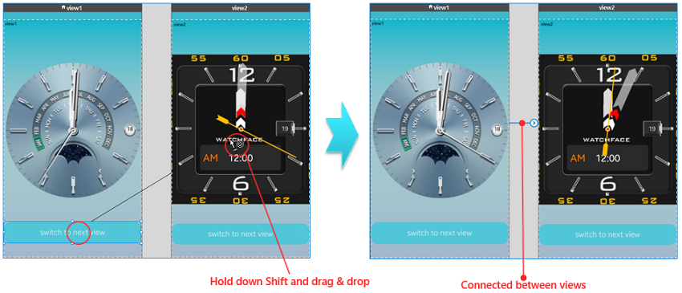
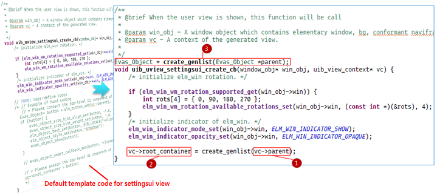
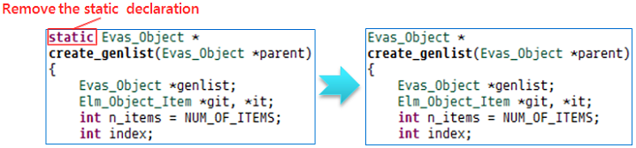
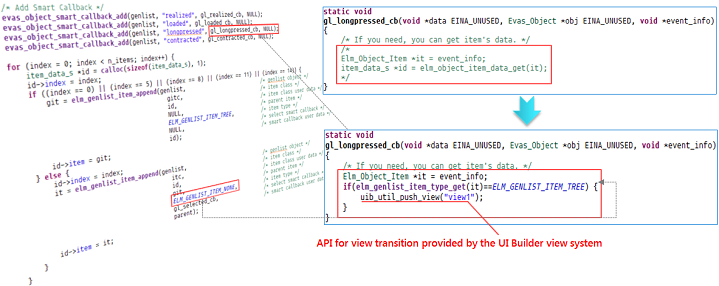

# Converting Projects for UI Builder

You can create UI applications based on pure EFL code. However, when expanding the UI view of the application or developing an optimized application for a new device, code maintenance and development productivity can slow down. For efficiency, consider converting your application to a UI Builder application. The Tizen native UI Builder supports UI layouts and visual editing methods for creating new UI screens for various devices.

> **Note**  
> You cannot convert EFL widget applications or DALi UI applications to UI Builder projects. Only EFL basic UI and watch application projects can be converted (based on the `tizen-manifest.xml` file).

## Conversion Advantages

If you convert your project to a UI Builder project, you can use the visual editing tool of the UI Builder with the following advantages:

- [Low entry barriers](#low-entry-barriers)
- [Rapid response to requirements](#rapid-response-to-requirements)
- [Application optimization and maintenance](#application-optimization-and-maintenance)
- [Recognition of user views created with EFL code](#recognition-of-user-views-created-with-efl-code)

### Low Entry Barriers

Even a beginner can develop a UI Builder project easily:

- With the **Design** editor:  
  - You can create and place UI components by dragging and dropping them from the **Palette** to the design area.
  - You can lay out the UI components by, for example, moving and sizing.
  - You can preview the application screen in real time without running the emulator.

- With the **Source** editor:  
  - You can author a view (screen) using only the name and attributes of the UI component, without knowing the Elementary API.
  - You can use the auto-completion function for XML grammar in the XML editor.

### Rapid Response to Requirements

You can handle development requirements quickly:

- With the **Storyboard**:  
  - You do not need to handle the flow of views through Elementary API code editing.
  - You can see the flow and connection status of each screen at a glance, and add connections between views with a single click (**Shift + Mouse drag**).

- With the **Outline** view:  
  * You can see the entire UI component hierarchy of the application at a glance.
  * You can configure an appropriate view by selecting from among an empty view, various view templates, and a popup style view.

### Application Optimization and Maintenance

The UI Builder is an integrated development environment for various screen sizes. You can use the multiple screen support feature with the Screen Configurator:

1. Implement a single business logic, such as uploading a file or taking pictures.
2. Author different UI layouts based on device type.
3. With the Resource Manager, check which resources are displayed depending on the device's locale setting.

The UI Builder supports visual editing, which is more intuitive than code developing, and helps you to understand the UI design of an application quickly. It also provides traditional development tools, such as the **Layout Editor** view, and several migration features to manage the EFL-code-based application UI:

- You can convert a project that was created without the UI Builder into a UI Builder project.
- The UI Builder provides a conceptual view (user view) to recognize screens created with EFL code.
- The UI Builder provides life-cycle management between the EFL-code-based user views and the newly-created UI Builder views.

### Recognition of User Views Created with EFL Code

At runtime, the UI Builder view system recognizes screens created with EFL code. The system contains core UI components that are similar to common Tizen applications. The naviframe of the top-level layer is responsible for managing the life-cycle for each of the screens (views), and a single screen is managed by the view context that the system provides. The following figure shows how the screens from the SettingsUI sample application are recognized in the UI Builder environment.

**Figure: Relationship between UI Builder view system and views**

The main roles of the view context are:

- **Root container**: A top-level UI component for each screen (in the SettingsUI application, the genlist is the top-level UI component). The root container is referenced in the view system when the **settingsui** view is displayed.
- **Parent**: The object needed when adding the root container of the view. When the view is displayed on the screen, the naviframe object of the window object is assigned as the parent of the view context by the view system. The naviframe is of the Evas Object type, and is the top-level UI component of the view.

The user view recognizes a view (screen) created by the EFL C code that you have written. To see the views at runtime, edit the user views by using the window objects of the UI Builder view system.

To display visually-edited views (created in the UI Builder) and code-based user views (created with EFL code) on the device screen, the UI Builder view system refers to the root container of the view context. It also supports screen-to-screen transitions through the naviframe of the window object.

**Table: Window object components**

| Name       | Type                                     | Description                              |
|------------|------------------------------------------|------------------------------------------|
| window     | Elementary window (in [mobile](../../../org.tizen.native.mobile.apireference/group__Elm__Win.html) and [wearable](../../../org.tizen.native.wearable.apireference/group__Elm__Win.html) applications) | Forms the first window of the application. |
| bg         | Background (in [mobile](../../../org.tizen.native.mobile.apireference/group__Elm__Bg.html) and [wearable](../../../org.tizen.native.wearable.apireference/group__Elm__Bg.html) applications) | Sets a background for a window or any container object. |
| conformant | Conformant (in [mobile](../../../org.tizen.native.mobile.apireference/group__Elm__Conformant.html) and [wearable](../../../org.tizen.native.wearable.apireference/group__Elm__Conformant.html) applications) | Provides space for indicators, virtual keypads, and softkey windows. |
| naviframe  | Naviframe (in [mobile](../../../org.tizen.native.mobile.apireference/group__Elm__Naviframe.html) and [wearable](../../../org.tizen.native.wearable.apireference/group__Elm__Naviframe.html) applications) | Manages UI Builder views.                |

## Converting to a UI Builder Project

You can convert a native EFL UI project to a UI Builder project with the **Convert to UI Builder Project** wizard.

### Creating a SettingsUI Sample Project

If there is no native EFL UI project in the **Project Explorer** view, create a sample project for testing purposes:

1. In the Tizen Studio menu, select **File > New > Tizen Project**.

2. Select **Sample** and click **Next**.

3. Select the **Mobile v2.4** application, **Native Application** type, and **UI > SettingsUI** application sample.

   

4. Click **Finish**.

   The sample project is created.

   

### Converting the SettingsUI Project to a UI Builder Project

To convert the project:

1. Open the **Convert to UI Builder Project** wizard.

   Right-click the **SettingsUI** project in the **Project Explorer** view, and select **Convert to UI Builder Project**.

   

2. Confirm the conversion by clicking **Next**.

   

   > **Note**  
   > When a wearable project is converted, the shape type selection appears after the opening step. The UI Builder provides different shape designs according to the shape type. Select the appropriate one for the converted project.
   >
   > 

3. Select the application entry point:

   

   1. Click **Browse**.

   2. Select the `settingsui.c` file (path: `SettingsUI/src`) and click **Next**.

      > **Note**  
	  > The `settingsui.c` file has a `main()` function corresponding to the application entry point. If you select the wrong file, a warning message appears and the **Next** button is disabled.

4. Add a user view:

   

   1. Enter the name (**settingsui**) for the user view:
      - You cannot enter a name that already exists in the list.
      - Use only English lowercase letters, numbers, and underscore characters. The name cannot start with a number.

   2. Click **Add** (or press the **Enter** key on the keyboard).

   3. If needed, click **Delete** to delete the user view.

      By clicking **Manage User View** in the context menu of the converted project, you can open the wizard again.

   4. Click **Start-up**:
      - An arrow appears at the end of the selected user view name. If the start-up view already exists in the **Outline** view, it is replaced by the selected user view.
      - If you want to cancel the selection, click **Start-up** again. The start-up view is changed to the previously selected user view.

   5. Click **Finish**.

The converted project (**SettingsUIwithUIB**) appears in the **Project Explorer** view, the perspective is changed to **UI Builder**, and the **Design** editor is opened. You can now develop the project using the UI Builder features.

**Figure: Structure of a converted project**

> **Note**  
> The converted project follows specific naming conventions:
> - A suffix ("withUIB") is added at the end of the original project name.
> - If the same name with the same suffix already exists on the workspace, an empty serial number is appended to the end of the filename.

## Using UI Builder Features

In the converted UI Builder project, you can use the UI Builder's visual editing functions. The following examples show how to visually edit the views and define transitions between them.

### Designing Views with Visual Editing

To edit view1:

1. Add a **Grid** UI component by dragging and dropping a grid from the **Palette** to the view.

2. Add a **Label** UI component by dragging and dropping a label from the **Palette** to the grid.

   Enter **view1** in the **Text** attribute of the label.

3. Add a **Layout** UI component by dragging and dropping a layout from the **Palette** to the grid:
   1. Double-click the layout UI component to open the **New EDC File** dialog.
   2. In the **File name** field, enter **watchface1**.
   3. Click **Finish** to open the EDC Editor.
   4. Select **Watchface** from the template list and click **OK**.
   5. In the **Project Explorer** view, select the **SettingsUIwithUIB** project and press **F5** on the keyboard to refresh.

4. Add a **Button** UI component by dragging and dropping a button from the **Palette** to the grid.

   Enter **switch to next view** in the **Text** attribute of the button.

**Figure: Editing view1**

To edit view2:

1. Add a **Grid** UI component by dragging and dropping a grid from the **Palette** to the view.

2. Add a **Label** UI component by dragging and dropping a label from the **Palette** to the grid.

   Enter **view2** in the **Text** attribute of the label.

3. Add a **Layout** UI component by dragging and dropping a layout from the **Palette** to the grid:

   1. Double-click the layout UI component to open the **New EDC File** dialog.
   2. In the **File name** field, enter **watchface2**.
   3. Click **Finish** to open the EDC Editor.
   4. Select **Watchface2** from the template list and click **OK**.
   5. In the **Project Explorer** view, select the **SettingsUIwithUIB** project and press **F5** on the keyboard to refresh.

4. Add a **Button** UI component by dragging and dropping a button from the **Palette** to the grid.

   Enter **switch to next view** in the **Text** attribute of the button.

**Figure: Editing view2**

### Defining Transitions Between Views

By using the **Storyboard**, you can easily switch between the views. To define transitions between views:

1. In the **Layout Editor** view, select the **Storyboard**.

2. Click the button in view1, hold down the **Ctrl** key and drag and drop the mouse cursor over view2.

**Figure: Connecting views**

## Designing the User View

The file registered as a user view is located in the `src/user_view` folder. The following figure shows how to design the **settingsui** view screen.

The `uib_uview_settingsui_create_cb()` function is called automatically when the user view is displayed on the screen. The `win_obj` (window object) and `vc` (view context) are parameters [passed from the UI Builder view system](#relationship). If you uncomment the existing template code and execute it with the passed parameters, a **Hello Tizen** button appears on the screen.

**Figure: Designing the settingsui view**

To design the **settingsui** view:

1. Generate the genlist UI component from the parent object of the view context:
   - The genlist is a top-level UI component of the **settingsui** view.
   - The `vc` is a specific view context corresponding to the **settingsui** view.
   - The `vc->parent` is the naviframe of the window object allocated from the view system when the view context is created.

2. Assign the generated genlist to a `root_container` member variable of the view context.

   The `root_container` is a top-level UI component of the screen, which is referenced when the UI Builder view system displays the first screen of the **settingsui** view.

3. Add the declaration for calling the `create_genlist()` function.

4. In the **Project Explorer** view, open the `settingsui.c` file in the `src` folder.

5. Remove the `static` keyword from the `create_genlist()` function to be called from other files.

**Transition from the first view of SettingsUI to view1:**

If you press the `item_type_none` (`ELM_GENLIST_ITEM_NONE`) of the genlist in the first view of the **settingsui**, the view in the screen switches to the second view of **settingsui**. You can also switch from the user view to the visually-edited view.

The following example shows the transition from the genlist to view1 when the `tree_item_type` (`ELM_GENLIST_ITEM_TREE`) is long-pressed in the genlist. In the `settingsui.c` file, modify the `gl_longpressed_cb()` function as shown in the following figure.

**Figure: View transition**

The following figure shows the resulting event flow between the SettingsUI views.

**Figure: Event flow of settingsui views**

To add screens from other applications as user views, see [Combining Screens from Multiple Applications](combine-screens.md).

## Related Information
- Dependencies
  - Tizen Studio 1.1 and Higher
