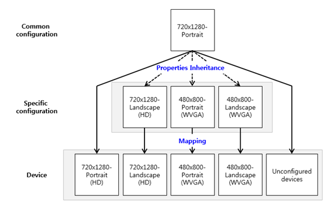
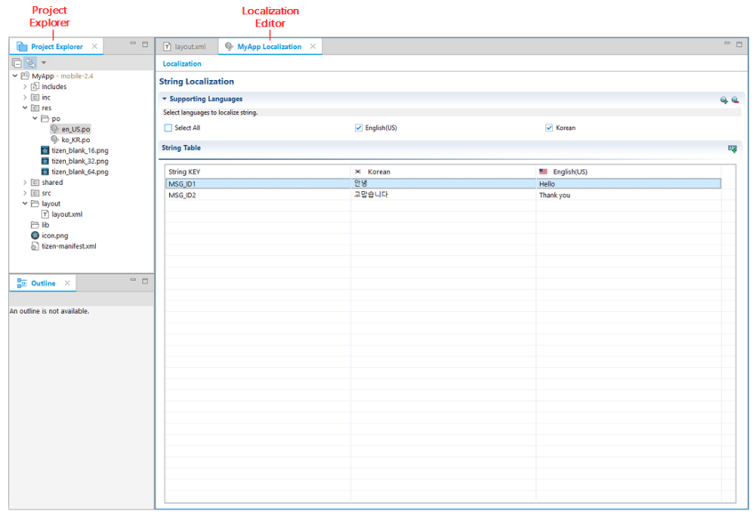

# Supporting a UI for Multiple Screens

Tizen runs on a variety of mobile, wearable, and TV devices that offer different screen sizes and densities. On the screen of the various devices, the application user interface (UI) must be adjusted to different screen configurations. For scaling and resizing, the Tizen Studio provides several features that help you to control your application UI:

- Auto-scaling the UI layout based on the screen density
- Auto-resizing the UI layout based on the screen size
- Auto-setting UI resources based on the screen size
- Internationalization (i18n)

> **Note**  
> **Screen density**  
> Screen density is usually referred to as DPI (dots per inch), which means the number of individual dots that can be placed in a line within the span of 1 inch (2.54 cm).
>
> **Resource**  
> Resources are, for example, images, strings, application binary, and references of external places (such as files and networks). They are used only on runtime in Tizen.
>
> When you support multiple screens, you must use the resources with the application binary:
> - File types - images, EDJ, text, video, and audio
> - Strings for localization
>
> **Internationalization and localization**  
> Tizen provides localized resources to make your application usable for different countries. The Tizen Studio supports the **Resource Manager**
> view and string localization (with the PO file editor). By using the Resource Manager, you can make an application that contains a variety of languages.

## Configuring Multiple Screens

You can design a UI layout unit by using a screen configuration. The screen configuration consists of qualifiers, which determine the supported device specifications and conditions.

There are 2 screen configuration types:

- Common configuration (provided by default)

  **Table: Common configuration**

  | Qualifier            | Default value        | Description                         |
  |--------------------|--------------------|-----------------------------------|
  | Screen resolution    | HD (High Definition) | Screen width and height: 720 x 1280 |
  | Screen density (DPI) | Medium Dots Per Inch | Range: 241~300                      |
  | Screen orientation   | Portrait             | -                                   |

- Specific configuration

  You can make your own custom screen configuration, which has a specific density and screen orientation.

### Designing UI Layouts Based on the Screen Configuration

Auto-scaling, auto-resizing, and auto-setting features enable the UI layout of an application to adapt to different screen resolutions, screen sizes, and screen orientations.

You must prepare screen configurations for your application. By default, the common configuration is used for the adaptation. If your application is designed for a specific screen, you must make a custom configuration for it.

**Figure: Configuration relationships**

You can also make a specific configuration for various Tizen devices.

**Table: Device-specific configurations**

| Screen resolution                  | Orientation         |
|----------------------------------|-------------------|
| Mobile HD (720x1280)               | Portrait, Landscape |
| Mobile WVGA (480x800)              | Portrait, Landscape |
| Wearable Square (320x320, 360x480) | N/A                 |
| Wearable Circle (360x360)          | N/A                 |

Many devices need different screens for portrait and landscape orientations. In that case, the orientations are considered alternatives of each other. Since each screen consists of its own resources and UI layouts, you must configure which resources and UI layouts are alternatives of each other.

The screen configuration consists of resources and UI layouts. The resources consist of the screen density and locale, while the UI layout consists of the screen resolution and screen orientation.

> **Note**  
> **Screen resolution**  
> The total number of physical pixels on a screen.
>
> **Screen orientation**  
> The way in which a rectangular screen is oriented for normal viewing:
> - Landscape: the width of the display area is greater than the height.
> - Portrait: the height of the display area is greater than the width.

The following table shows the components for multiple screens.

**Table: Components for multiple screens**

| Category       | Component                          | Description                              |
|--------------|----------------------------------|----------------------------------------|
| Tizen Studio   | Resource Manager                   | Provides the features to add, delete, or change the resources for the screen configuration and supports drag and drop for placing the UI layout.  Paths of alternative resources used for multiple screens are written in the `res.xml` file, which is referenced at runtime. |
|                | PO file editor                     | Supports string editing. You can add a localized string in the editor. |
|                | Multiple UI layout                 | Supports the device-specific UI layout.  |
| Tizen platform | Application module                 | Manages the application life-cycle. Using a callback function, it notifies you about application state change events. When the screen orientation or locale changes, this event must be sent to the module which handles multiple screens. For more information, see the [Applications](../../../native/guides/app-management/applications.md) guide. |
|                | Resource Management module         | Displays the appropriate resource file on the screen by using a resource key. |
|                | Internationalization module (i18n) | Provides the localized string at runtime. |
|                | EFL library                        | Is a graphics engine responsible for the UI representation in the UI component that makes up the application screen. This supports the [automatic scaling](../../../native/guides/ui/efl/multiple-screens.md) function to express the natural screen without distortion on a variety of devices. |

## Designing Applications with Multiple Screens

With the default resources only, you can make an application without alternative resources. The default resource is displayed on the screen through automatic scaling of the EFL libraries at runtime.

If you want to increase the quality of the resources or provide device-specific screens in the application, use the **Resource Manager** view, which supports alternative resources.

### Localized Strings

If you develop an application for a locale, you must register the localized strings displayed at runtime before preparing the multiple screens. The PO file editor is needed for this. To open the editor, right-click the PO file in the **Project Explorer** view and select **Localization**.

**Figure: PO file editor**

For more information, see [Localizing Applications](../po-file-editor.md).

The naming convention for string resources in the **Properties** view is `@resource/<Resource ID>`, where `@resource` is an annotation symbol as an alternative resource definition to replace the resource file, and the `<Resource ID>` is the resource key.

The following figure shows how to set an alternative resource string in the **Properties** view.

**Figure: Localizing a string in the Properties view**

To localize a string:

1. Add a Grid UI component by dragging and dropping a grid from the **Palette** to the view.

2. Add a Background UI component by dragging and dropping a background from the **Palette** to the grid.

3. Add 2 Button UI components by dragging and dropping a button from the **Palette** to the grid.

4. Input a string key.

   If you enter '@' at the **Text** property of the **Properties** view, the auto-completion shows a list of available resource keys.

5. Change a locale.

   If you change a locale on the toolbar, the view shows a preview of the localized string.

> **Note**  
> **Variation property of the UI component**  
> UI component properties are classified based on the screen configuration type into basic and variable properties. The variable properties consist of the following:  
> - Visibility: Whether the UI component is shown (`true`) or hidden (`false`).  
> - Packing: Position and size of the UI component attached to the parent container. The packing information has different meanings in different kinds of UI containers. For more information, see [Meta Schema in layout.xml](component-attributes.md) (Grid section).

### Alternative Resources

To use alternative resources on the application, you must create subdirectories with reserved names in the `res/contents` directory of your project.

To use alternative resources, you must follow the naming configuration rules.

**Table: Configuration rules for the alternative resources**

| Qualifier | Description                              |
|-----------|------------------------------------------|
| Locale    | Target locale of the resource localization.  Language region selected by the user at editing and runtime. |
| DPI       | Screen density of the device.            |

For example, the resource naming for the English locale and medium density is defined as `en_US-MDPI`.

> **Note**  
> If there is no alternative resource corresponding to a specific locale, the default resource is displayed on the screen.
>
> If there is no default resource, a blank is displayed on the screen. To avoid blanks, set a default resource.

By using the **Resource Manager** view, you can set specific resources for the locale and screen density:

1. Select English (US) in the **Language** box.

2. Select MDPI in the **DPI** box.

3. Click **Add**.

4. Click **OK**.

 

The alternative resource files located in each directory are visible in the UI Builder **Layout Editor** view during application development. During runtime, the resource files are displayed based on the screen configuration of the device.

#### Using Alternative Resources

The following figure shows how to use an alternative resource image from the **Resource Manager** view.

**Figure: Using an alternative resource image from the Resource Manager view**

To use alternative resources:

1. Add a Grid UI component by dragging and dropping a grid from the **Palette** to the view.

2. Add a Background UI component by dragging and dropping a background from the **Palette** to the grid.

3. Add an Image UI component by dragging and dropping an image from the **Palette** to the grid.

4. Add the image resource for the image component by dragging and dropping the applicable image file from the **Resource Manager** view to the image.  The resource is set on the current configuration of screen.

You must also specify the selected alternative resource in the **Properties** view.

**Figure: Specifying the alternative resource in the Properties view**

The naming rule for alternative resources in the **Properties** view is `@resource/key`, where `@resource` is the annotation symbol specifying the resource file for the alternative resource, and `key` is the resource key.

When you enter '@' at the **Image path** in the **Properties** view, the auto-completion shows a list of resource keys.

## Using Alternative UI Layouts

To use multiple UI layouts for each screen configuration:

1. In the **Screen Configurator**, configure the specific screen.

   Open the **Screen Configurator** window by clicking the applicable icon on the **Layout Editor** toolbar.

     

   To add layouts:  
   1. Click **Add** to add a specific configuration.  

   2. Edit the qualifiers for the configuration.  

      To set the qualifiers:  
      -  Use as short a name as possible in the **Name** property.
      - Use only English lowercase letters, numbers, and underscore characters. The name cannot start with a number.
      - Select the resolution and density of the device screen.
      - Set the screen orientation to portrait or landscape.

   3. If needed, click the trash icon to delete the configuration.  

   4. Apply your modifications to the configuration list and close the **Screen Configurator** by clicking **Finish**.  

   5. If you do not want to save the modifications, click **Cancel** to close the **Screen Configurator** without saving.

2. Map a specific configuration to your application.

   To apply the specific configuration, you must map the configuration to the application screen.

   

   To map the configuration:

   1. Add a UI component to the common configuration.

      If you change the properties in the common configuration, the changes are applied to all other specific configurations.

   2. Edit the **Variation** property of the UI component.

      When the size of the UI component in a specific configuration is modified, the default screen configuration is separated and mapped to the new screen configuration. The **Variation** property of the UI component is created and set only for the modified specific configuration.

   3. Add a UI component to the specific configuration.

      If you check a UI component in the common configuration, the **Visibility** of the UI component is changed to `false` and it does not appear in the UI design area.

In the Tizen Studio, UI components are in the same memory space. If you delete a UI component in one configuration, the **Variation** properties of the component are removed from all other screen configurations too. Therefore, to design a UI for each screen configuration, the **Variation** properties of the UI components must be set differently for visibility.

## Related information
- Dependencies
  - Tizen Studio 1.0 and Higher
