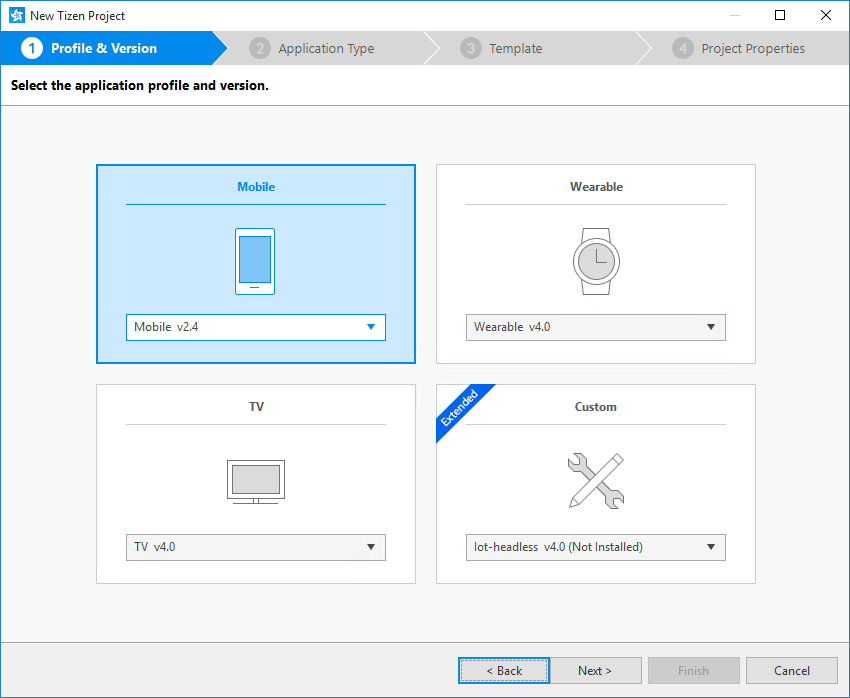
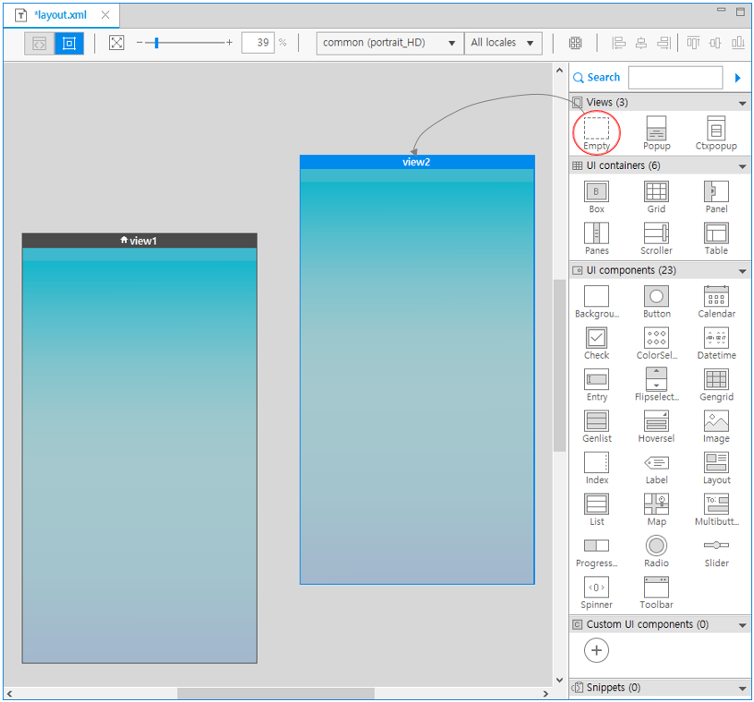
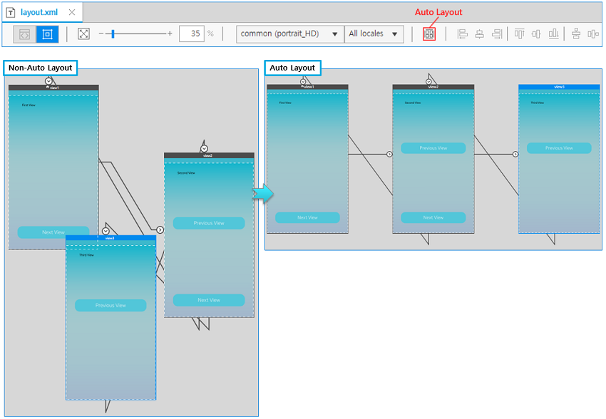
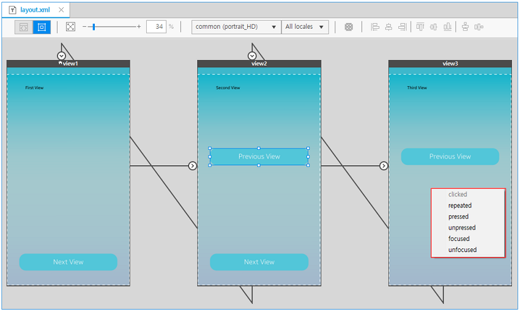
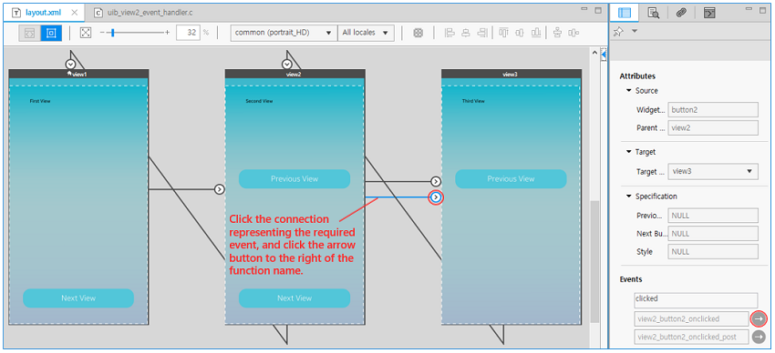

# Defining Page Transitions with the Storyboard

The Tizen Storyboard is a feature included in the UI Builder Layout editor. It provides an interactive view to help in the design of the page transitions.

The Storyboard provides a bird's eye picture of all the views present in the application, along with a flowchart of event-based transitions between views. You can visualize page transition in the native application, and form a better understanding of the application functionality. You can also use the Storyboard as a control panel to manage the application views.

The Storyboard consists of a collection of the application views, inter-connected by arrows depicting the change of the view when an event is fired by a user action on a UI component. The Storyboard automatically generates the necessary logic to handle the view transformation, and also provides you auto-generated stubs for defining event handlers for various events of the existing UI components.

The Storyboard is available for applications created with a UI Builder template.

## Creating a UI Builder Application

To use the Storyboard, you must create a Tizen native project using a UI Builder template:

1. In the Project Wizard, select the application profile and version.

   

2. Select the native application type.

   

3. Select one of the UI Builder templates.

   

## Adding Views

When you select the **Design** editor in the top toolbar area of the **Layout** editor, the opening graphical viewer provides the **Storyboard** feature. If the **UI Builder - Navigation View** application template is used, the viewer contains 3 default views with some default connections between them. Otherwise, the viewer contains a single view.

**Figure: Views shown in the Design editor**

The **Layout** editor offers 3 ways to add a new view:

-   Right-click the editor, select **Add View**, and select the applicable view.

**Figure: Adding a new view**

-   In the **Outline** view, click the **Empty View** icon in the toolbar (marked by a red circle in the following figure), or right-click the **Outline** view area and select **Add View** and the applicable view.

    

- Drag and drop a view from the **Palette** to the canvas.

    The **Ctxpopup** view and **Popup** view are available in mobile applications only.

    

If you select a title bar area containing the view name and drag the view to a new location, you can see that direct manipulation changes the view position on the canvas in real time. In addition, you can use the real-time Pan and Scan function by dragging the empty space of the **Design** editor by holding down with the mouse wheel button.

## Using Auto Layout

If it is difficult to understand the flow between multiple views, use the **Storyboard**'s **Auto Layout** function. It relocates your views to an easily-readable position.

## Creating Connections

To create a connection between 2 views:

1. Press the **Shift** key and click the UI component from which the page transition is to happen.

2. Drag the component to the page where the transition is supposed to lead.

   

3. When the dragging is finished, a context menu opens listing the corresponding events of the object. If a connection already exists for some event of the UI component, that event is shown as disabled.

   Select an appropriate event from the menu.

   

   After you select the event, the new connection is displayed and code is generated in the `layout.xml` file. The event handler code is also generated in the C file.

   

4. To edit the event code, click the connection, and select the event function in the **Properties** view.

   To delete the connection, right-click the connection and select **Delete**.

   

5. In the source code, 2 functions are generated:

   - `view1_button1_onclicked()` is called before the transition is performed to the target view.
   - `view1_button1_onclicked_post()` is called after the transition has been performed.

   Write whatever operation you want to perform during the pre and post transition.

   

## Changing Component and Connection Properties

When you select a component or connection in the **Design** editor, the editable properties related to it are displayed in the **Properties** view. You can view the transition properties and change the connection target view.

**Figure: Component properties**

**Figure: Connection properties**

## Maximizing and Normalizing Views

You can maximize and normalize a view by double-clicking the title bar area. Maximizing zooms the view to the height of the design area and moves the view position to center. Normalizing returns the view zoom state and position back.

Use this feature to reduce the clutter of multiple views present in the application without compromising or losing sight of the overall application project.

The startup view can be identified by a **house** symbol in the title bar of the view.

**Figure: Maximizing and normalizing views**

## Related Information
- Dependencies
  - Tizen Studio 1.0 and Higher
