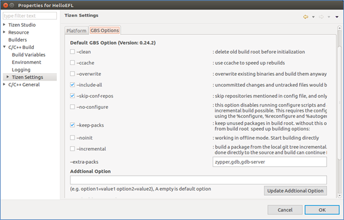
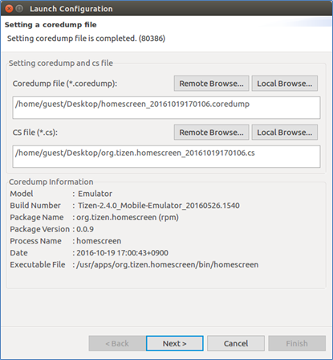
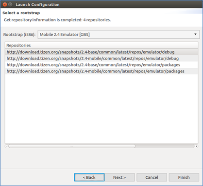

# Developing Tizen Platform with the Tizen Studio

The Tizen Studio provides a platform development environment that helps you develop preloaded platform applications, platform libraries, and device drivers in Ubuntu.

> **Note**  
> Platform development is supported in Ubuntu 14.04 and higher (32- or 64-bit) only.

By using the Tizen Studio for Ubuntu, you can, for example:

- Compile the platform modules with appropriate architecture and rootstrap.
- Debug the platform modules with the correct rootstrap.
- Update the rootstrap automatically.

To use the Tizen Studio, download it from [https://developer.tizen.org/development/tizen-studio/download](https://developer.tizen.org/development/tizen-studio/download). For more information on the development tools, see [Platform Development Tools](platform-tools.md).

## Prerequisites for Using the Platform IDE

To use the platform IDE, you must install the GBS and MIC development tools and set up the development environment, including the git, gerrit, and proxy configuration. For more information, see [Installing Development Tools](https://source.tizen.org/documentation/developer-guide/getting-started-guide/installing-development-tools).

- Git Build System (GBS): command line tool that supports Tizen package development.
- Image Creator (MIC): command line tool that supports Tizen image creation.

For more information on the following issues, see [Setting up Development Environment](https://source.tizen.org/documentation/developer-guide/environment-setup):

- How to register a user account to gain access to tizen.org
- How to configure Secure Shell (SSH) for the gerrit access
- How to configure the git

If your system is using a proxy server, you must configure your proxy server environment. For more information, see [Network Connections](http://help.eclipse.org/mars/index.jsp?topic=%2Forg.eclipse.platform.doc.user%2Freference%2Fref-net-preferences.htm).

## Platform Development Process

The platform development process consists of the following steps:

1. Creating a platform project
2. Building the platform project
3. Running the platform module
4. Debugging the platform module

### Creating a Platform Project

The Tizen Studio provides functionality for creating projects from templates using the Platform Project Wizard.

To use the Platform Project Wizard:

1. In the Tizen Studio menu, select **File > New > Other > Tizen > Tizen Platform Project**.

2. In the Tizen Platform Project Wizard, select a sample (for example, **Hello EFL**).

   If the project option you want does not appear, check that you are using the correct perspective (Tizen Platform). To switch perspectives, go to **Window > Perspective > Open Perspective > Other** and select the perspective you want.

3. Fill in the project details and click **Finish**.

   

### Building the Platform Project

After building your Tizen platform project, you can run and debug the platform. To build and package your Tizen platform project:

1. Select a project in the **Project Explorer** view.

2. Select a rootstrap in the **Rootstrap View**.

3. In the **Project Explorer** view, right-click the project and select **Build Project**.

   A dialog box appears and monitors the progress of building and packaging the project.

   After packaging is completed, the package file is located in the `$<PROJECT_NAME>\Debug` or `$<PROJECT_NAME>\Release` folder within the project folder.

If an error message appears in the **Console** view due to dependency problems, open the Package Manager and install the needed packages for building the project. After the installation is completed, rebuild the platform project to confirm that the dependency problems have been solved.

#### GBS Options

The Git Build System (GBS) builds a platform project internally. You can set the GBS options in the IDE.

For more information on GBS, see [Git Build System](https://source.tizen.org/documentation/reference/git-build-system).

**Figure: GBS options**

To set the GBS options:

1. In the **Project Explorer** view, right-click the project and select **Properties > C/C++ Build > Tizen Settings > GBS Options**.

2. Set the options.

3. Click **OK**.

### Running the Platform Module

To run the platform project:

1. Connect a device to your computer and select the device in the **Device Manager**.

2. In the **Project Explorer** view, right-click the project and select **Run As > Tizen Platform Project**.

3. Choose the install command, such as **RPM** or **pkgcmd**.

4. In the **Launch Configuration** dialog, click **Next**.

5. Type the command and arguments, and click **Finish**.

### Debugging the Platform Module

The Platform IDE provides 3 different solutions to debug a platform project: basic, attach, and coredump debug.

#### Basic Debug Process

To debug the project:

1. Connect a device to your computer and select the device in the **Device Manager**.

2. Select a project to debug in the **Project Explorer** view.

3. Set breakpoints in the source code.

4. In the **Project Explorer** view, right-click the project and select **Debug As > Tizen Platform Project**.

5. Choose the install command, such as **RPM** or **pkgcmd**, for the device and rootstrap.

6. In the **Launch Configuration** dialog, click **Next**.

7. Type a command or select the executable file with the **Remote Browse** button, and click **Finish**.

#### Attaching a Debug Process

To attach a debug process to the project:

1. Connect a device to your computer and select the device in the **Device Manager**.

2. Select a project to debug in the **Project Explorer** view.

3. Set breakpoints in the source code.

4. In the **Project Explorer** view, right-click the project and select **Debug As > Tizen Platform Project - Attach**.

5. In the **Launch Configuration** dialog, select a process:

   1. Click **Browse**, and select the process to attach.
   2. Click **Finish**.

#### Coredump Debug Process

To debug a coredump archive:

1. Connect a device to your computer.

2. In the **Device Manager**, select the device for which a coredump archive to debug exists (for example, `/opt/usr/share/crash/`).

3. In the **Project Explorer** view, right-click the project and select **Debug As > Tizen Platform Project - Coredump**.

4. In the **Launch Configuration** dialog, select a core dumped file (`*.coredump`) and CS file (`*.cs`) by clicking **Remote Browse** or **Local Browse**.

   

   If the coredump information is displayed, click **Next**, select a rootstrap, and click **Next** again. (It takes about 1~5 minutes when installing the required libraries.)

   

5. Manage the packages:

   1. Check whether the packages are installed successfully.

   2. If there is package problem, click **Package Manager** and install packages.

      

   3. Click **Finish**, if it is enabled.

## Related information
- Dependencies
   - Tizen Studio 1.0.1 and Higher
   - Ubuntu Only
