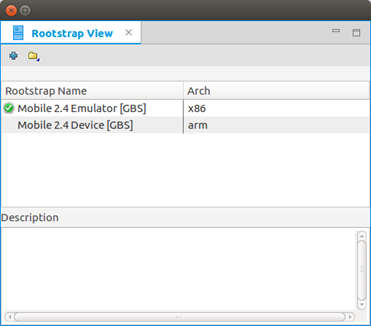
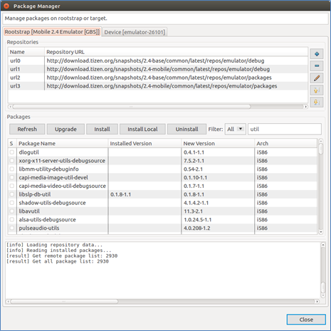
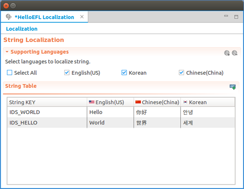
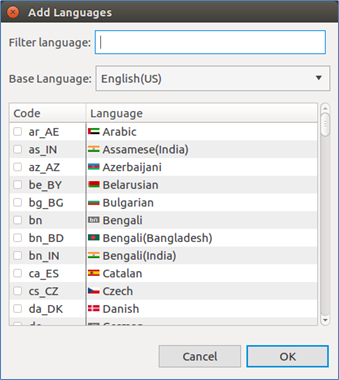

# Platform Development Tools

The Tizen Platform IDE provides several tools to help your platform development tasks: **Rootstrap View**, Package Manager, Specfile Editor, content assist features, and PO file editor.

## Rootstrap View

The **Rootstrap View** displays available rootstraps and the currently selected rootstrap. In the view, you can select, create, and remove a rootstrap, and also manage packages.

**Figure: Rootstrap View**

- To set a rootstrap to the project, right-click the desired rootstrap and select **Select**.

- To export a rootstrap as a compressed TAR file, right-click the desired rootstrap and select **Export**.

- To create a rootstrap based on a remote repository:

  1. In the **Rootstrap View** toolbar, click **+**.

  2. In the Rootstrap Generation wizard, you can add, remove, and modify the repositories. You can also change the repository order.

     Select the **Architecture** value and click **Finish**. If the **Generate Immediately** check box is selected, the rootstrap is created immediately.

- To remove the rootstrap, right-click the desired rootstrap and select **Remove**.

- To manage the rootstrap packages, use the Package Manager.

  To run the Package Manager for a rootstrap, right-click the desired rootstrap and select **Manage Packages**.

## Package Manager

To run the Package Manager, right-click the desired rootstrap and select **Manage Packages**. By selecting the applicable tab in the Package Manager, you can install packages to the rootstrap or the device.

**Figure: Package Manager**

On both tabs:

- **Repositories** panel:
  - **Add**: Add a new package repository to the list.
  - **Modify**: Modify the selected repository.
  - **Remove**: Remove the selected repository from the list.
  - **Move**: Move the selected repository up and down on the list.

- **Packages** panel:  
  - **Refresh**: Resynchronize the package index files from the package repositories. If the repositories are changed, the package index is refreshed.
  - **Upgrade**: Perform a distribution upgrade.
  - **Install**: Install selected packages.
  - **Install Local**: Install the selected package files (`.rpm`).
  - **Uninstall**: Uninstall selected packages.
  - **Filter**: Search for a package.

  To view detailed information about each package, right-click the package name and select **Properties**.

- **Log** panel shows the logs for the packaging commands.

## Specfile Editor

The Specfile Editor Plug-in for the Eclipse provides useful features to help you manage `.spec` files. The plug-in allows you to leverage several Eclipse GUI features in editing the `.spec` files, including an outline view in the editor, auto-completion, highlighting, file hyperlinks, and folding.

> **Note**  
> The Tizen platform IDE does not support features relevant to **rpmlint** and **createrepo**.

To set the Specfile Editor configuration, go to **Window > Preferences > Others > Specfile Editor** in the IDE toolbar. For more information, see **Help Contents > Specfile Editor User Guide > Configuring Specfile Editor Settings**.

**Figure: Specfile Editor**

## Content Assist

The Tizen Platform IDE provides the API assist and API hover features to make writing content in the Platform editor quick and efficient:

- API assist

  This feature is used for writing and editing source code. It helps to create content faster by providing suggestions for the APIs that are already present. A list of API methods, keywords, and macros defined in the Platform API Reference is displayed when you enter prefix words that match related items.

- API hover

  This features displays information about API methods and API-related types and macros for the platform framework.

## PO File Editor

The PO file editor is used to edit `.po` files to generate compiled gettext `.mo` files, which are used by Tizen platform applications to localize the user interface.

> **Note**  
> There is no specific wizard to create the `.po` files. To create a `.po` file, go to **New > Other > General > File** and save the file with the `.po` extension.

**Figure: PO file editor**

- To open the PO file editor, double-click the `.po` file in the **Project Explorer** view.

- To add a new string key, click the **Add String Key** icon.

  An empty row is added to the string table. Fill in the details for the row.

- To remove a string key, right-click the key and select **Remove**.

- To add a language, click the **Add Language** icon.

  In the **Add Languages** dialog, select the language code item you want.

  **Figure: Adding a language**

  

- To remove a language, in the **Supporting Languages** pane, click the **Remove Language** icon and select the applicable language code item in the **Remove Languages** dialog.

## Related Information
* Dependencies
  - Tizen Studio 1.0.1 and Higher
  - Ubuntu Only
