# Managing a Project

You can create an RT project in Tizen Studio. Additionally, you can create application resources within the project and build the project.

## Creating a Project

The Tizen RT Project Wizard is a Tizen Studio for RT tool that is used to create an RT project.

You can create projects from a remote Git repository.

### Creating Projects from a Remote Git Repository

To create a project from a remote Git repository:

1. To open the Tizen RT Git Project Wizard, use one of the following:  
    - In the Tizen Studio for RT menu, select **File > New > TizenRT Project from Git**.
    - In the Tizen Studio for RT toolbar, click the **New** icon () drop-down list and select **TizenRT Project from Git**.
    - Right-click in the **Project Explorer** view, and select **New > TizenRT Project from Git**.  
   
      

2. In the TizenRT Git Project Wizard, you can select the Git import method:  
    - If you want to import from a new repository, [clone its URI](#using-the-clone-uri-option).
    - If you already cloned the Git repository you want, use an [existing local repository](#using-the-existing-local-repository-option).

#### Using the Clone URI Option

To import a project from a new repository:

1. Select a **Clone URI** and click **Next**.  

    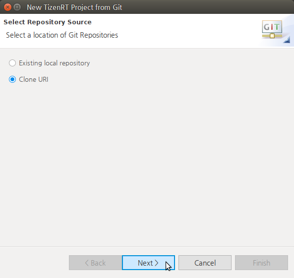

2. Enter the basic location information to connect to the Git repository and click **Next**.  
    You can use a public Git URL, such as [https://github.com/Samsung/TizenRT.git](https://github.com/Samsung/TizenRT.git) or git://github.com/Samsung/TizenRT.  
  
    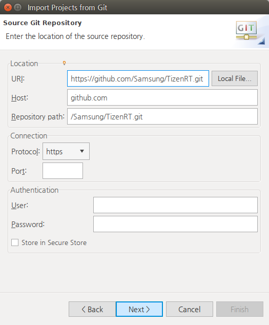

3. Select branches to clone from the remote repository and click **Next**.  
  
    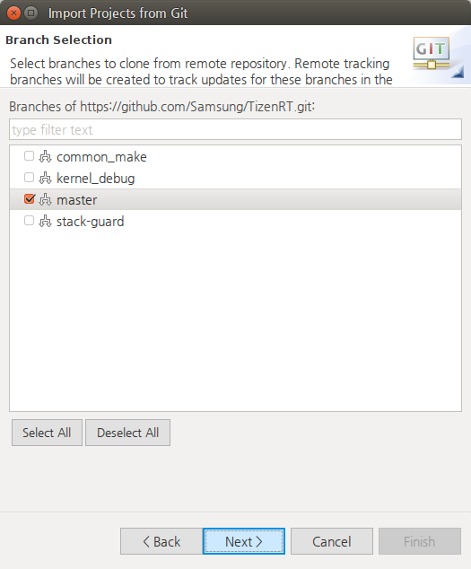

4. Configure the local storage location and the initial branch, and click **Next**.  
  
    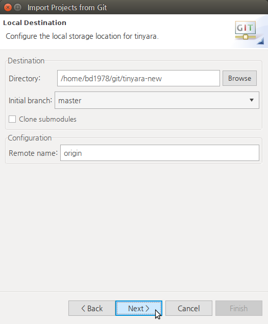

5. Select the specific directory under the `Working Tree` directory to import the project, and click **Next**.  
    If you want to import the overall `Working Tree` as a new project, select the root `Working Tree` directory.  
  
    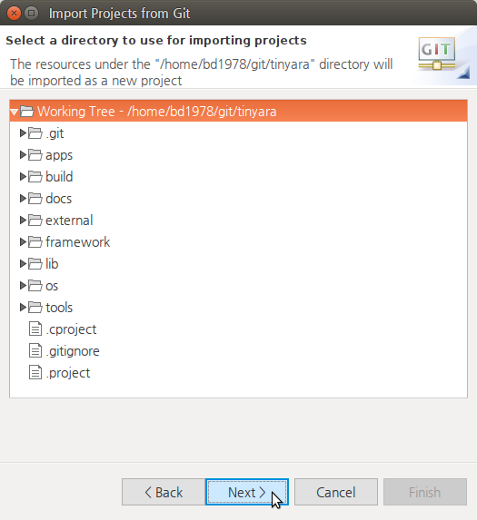

6. Enter the name of the project and click **Finish**.  
   
    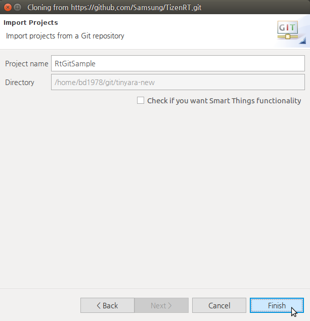

    The new project is shown in the **Project Explorer** view.

    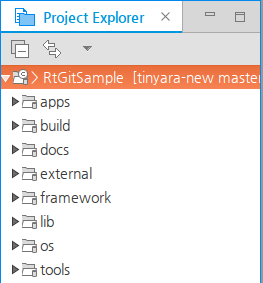

#### Using the Existing Local Repository Option

To import a project from an existing repository:

1. Select the **Existing local repository** and click **Next**.  
  
    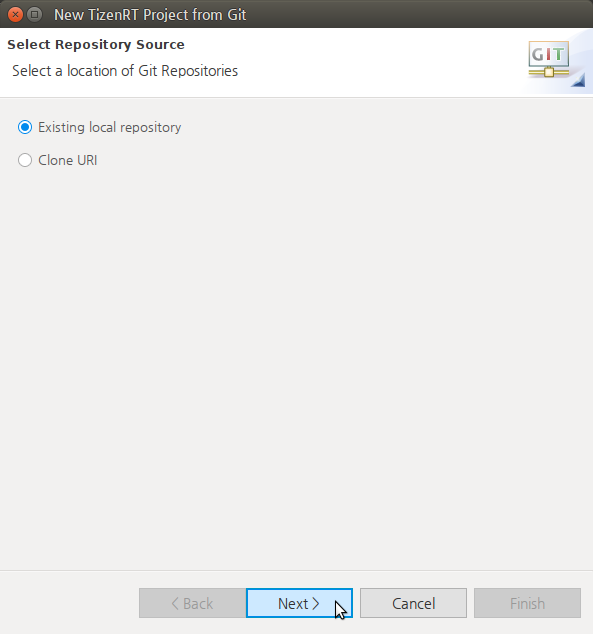

2. Add local repositories by clicking **Add**.  
  
    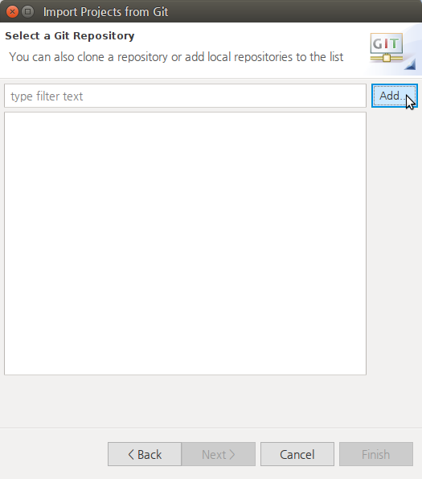

3. Search for a local Git repositories on the file system by clicking **Browse** to set the directory, and click **Search**.
   
    After the search, select the repositories and click **Finish**.  

    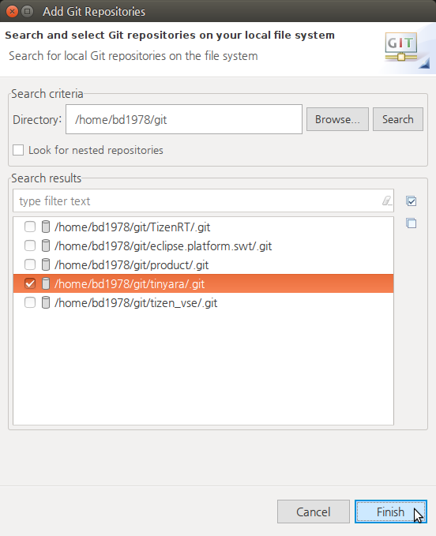

4. Select the repository to clone and click **Next**.  
   
    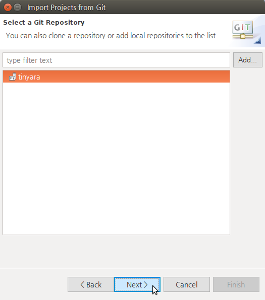

5. Select the specific directory under the `Working Tree` directory to use for importing the project, and click **Next**.  
    If you want to import the overall `Working Tree` as a new project, select the root `Working Tree` directory.  

    

6. Set the project name and click **Finish**.  
  
    

    The new project is shown in the **Project Explorer** view.

    

## Creating Your Application

The Tizen RT App Wizard is a Tizen Studio for RT tool that is used to create RT application resources.

When you create a new application, the basic file sets needed for application development are added.

To create a new application with a template within a selected project:

1. Select the project to which you want to add the application.

2. To open the Tizen RT App Wizard, use one of the following:  
    - In the Tizen Studio for RT menu, select **File &gt; New &gt; TizenRT App**.
    - In the Tizen Studio for RT toolbar, click the **New** icon () drop-down list and select **TizenRT App**.
    - Right-click in the **Project Explorer** view, and select **New &gt; TizenRT App**.  
   
    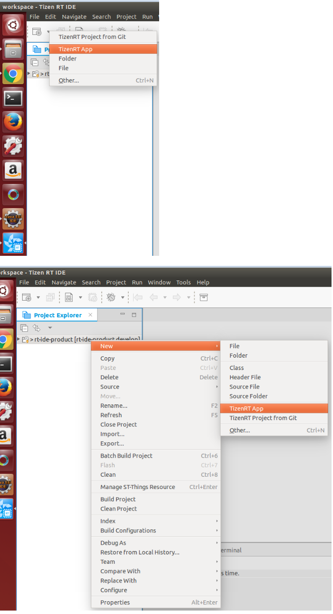

3. In the New TizenRT Application Wizard, enter the name of the application,  and click **Next**.  
  
    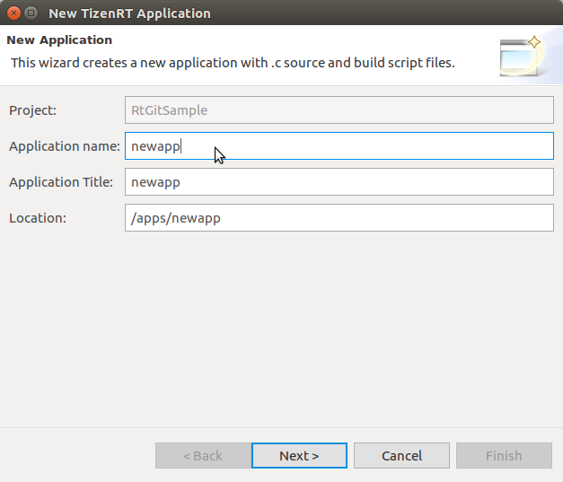

4. In the Select a Application Template page, select the application template and click **Finish**.  

    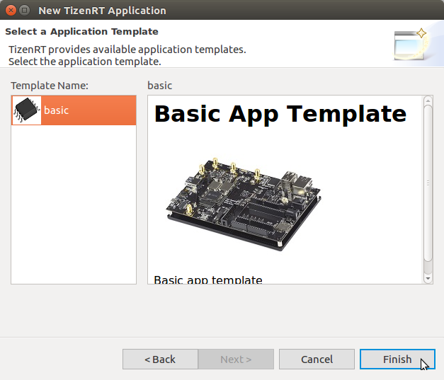

    The created application template is shown in the **Project Explorer** view within the project.

    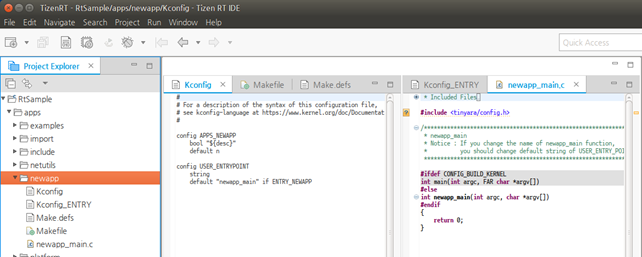

    You can code the required application features within the added template. Open the project sources in the Code Editor.

    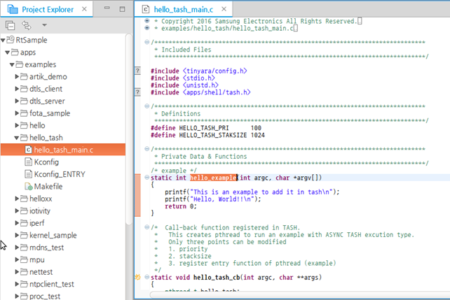

Tizen Studio for RT provides various features to ease code writing and improves your coding productivity when developing your applications:

- The **API assist** helps you to write code quickly by completing the names of the APIs automatically when writing a part of the API name.
- The **API hover** displays information about API functions, API-related types, and macros for the native framework.
- The **API link** helps you to check the original content of a linked API quickly.
- The **Outline** view allows you to see the structure of the code currently open in the Code Editor.

### Using API Assist

When you write code, the API assist feature provides API suggestions to complete the code faster.

To receive the API suggestions manually, type at least one letter of content, and press **Ctrl + Space**. The suggestion list appears. Use the arrow keys to select a suggestion from the list, and press **Enter** to complete the code.

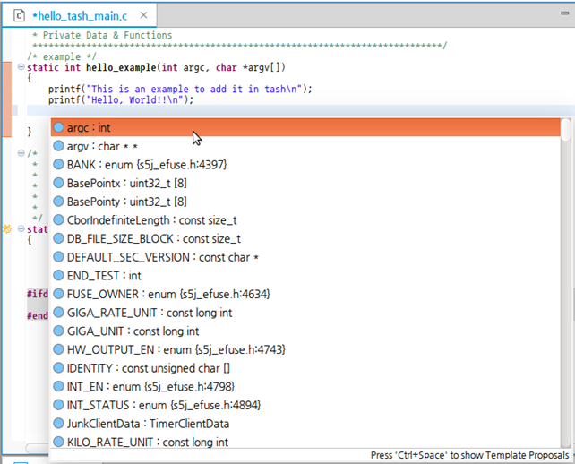

If you already use the **Ctrl + Space** shortcut key in the Ubuntu system for other purposes, such as the keyboard input source change, you must change to another shortcut, or you can change the API assist key in the Tizen Studio menu: **Window &gt; Preference &gt; General &gt; Keys &gt; Content Assist**.

### Using API Hover

When you hover over an API function in the Code Editor, a popup window appears below the function. In that window, you get detailed information about the API function, such as a brief description, defined parameters, return value type, and exception information.

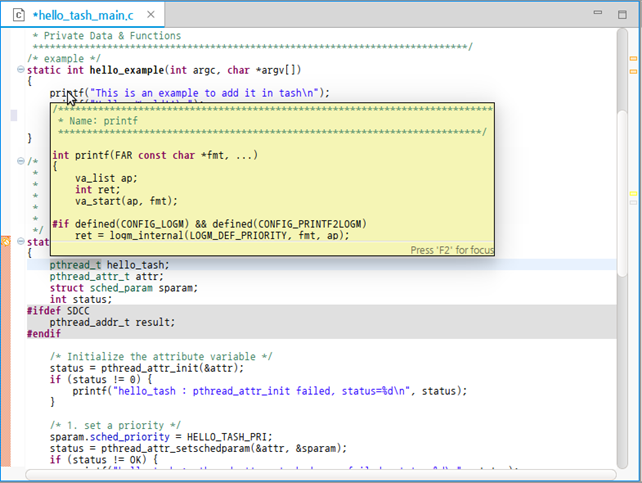

### Using API Link

When you hover over an API function in the Code Editor, you can move to the original content of the hovered API by pressing the **F3** key or **Ctrl + Mouse click**.

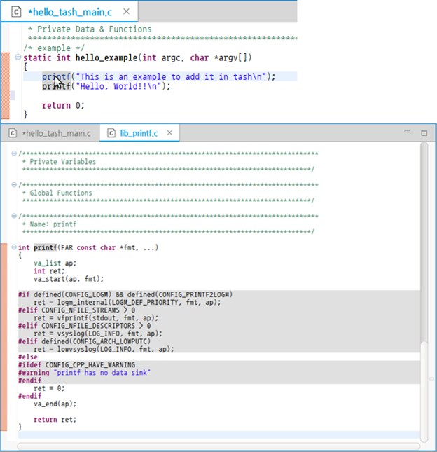

### Using Outline View

The **Outline** view displays the structure of the code that is currently opened in the Code Editor.

## Building the Project

You must build your project before flashing or debugging it.

To build the Tizen RT project:

1. Select the project in the **Project Explorer** view.

2. To build the selected project, use one of the following:  
    - In the Tizen Studio for RT menu, select **Project &gt; Batch Build Project**.
    - In the Tizen Studio for RT toolbar, click the **Build TizenRT Project** icon ().
   
    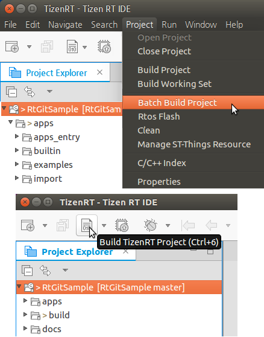

3. In the Build TizenRT Project Wizard, select the board and build option for building your project, and click **Build**.  

    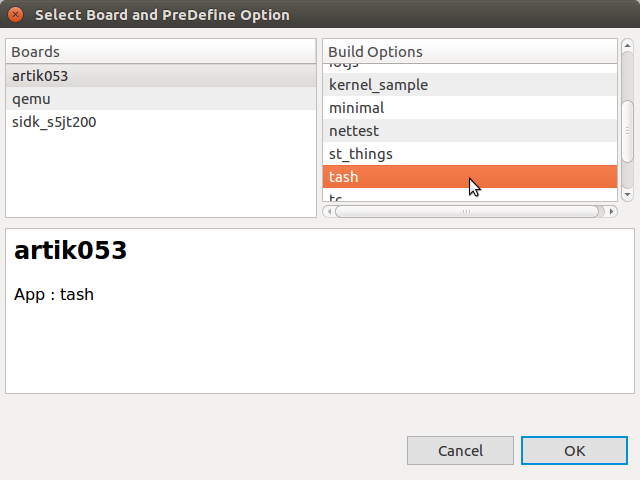

    You can view the build progress dialog box.

    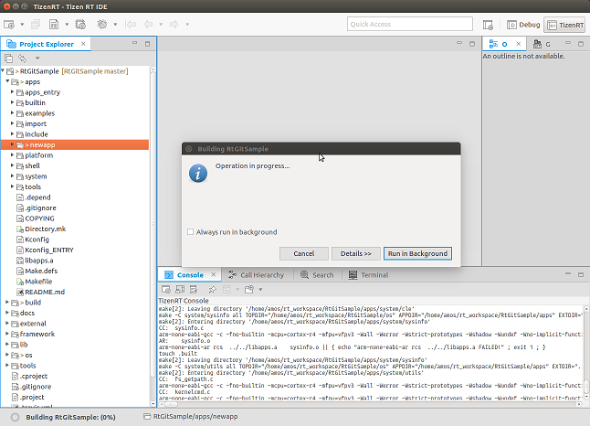

    You can check the build logs in the Console view.

    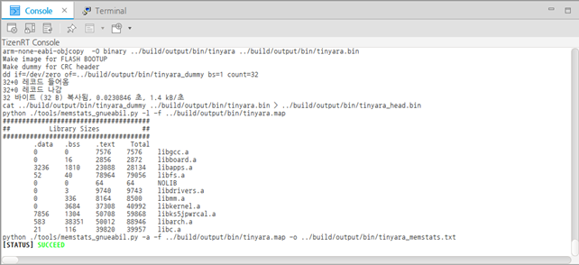

### Selecting Applications for Running

If you want to configure only certain applications to run on the board, set those applications as the entry point with the Application Manager:

1. Click the arrow next to the **Build TizenRT Project** icon () and select Application Manager in the drop-down menu.  

    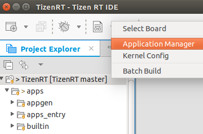

2. In the Application Manager dialog box, select the check box for the application you want within a list of applications, and click **Set Entry**.  

    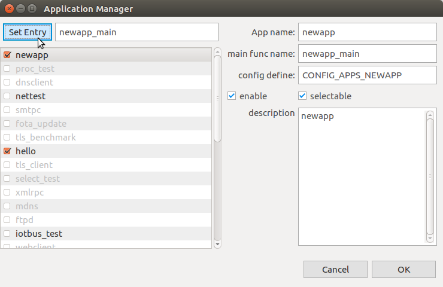  
		
    The entry point name next to the **Set Entry** button changes.

3. Click **OK**.

### Modifying the Kernel Config

In the Build TizenRT Project Wizard, you can modify the kernel configuration for the build.

To modify the kernel configuration:

1. Click **Kernel Config**.  
    
    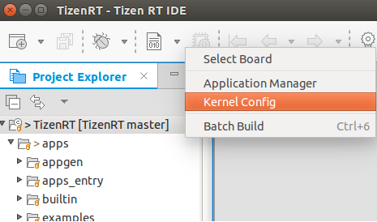

2. Change the settings, click **Save**, and **Exit**.  
    
	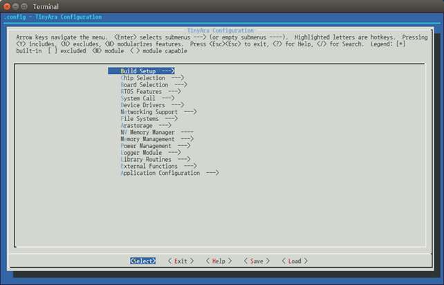

## Related information
* Dependencies  
  - Ubuntu Only
