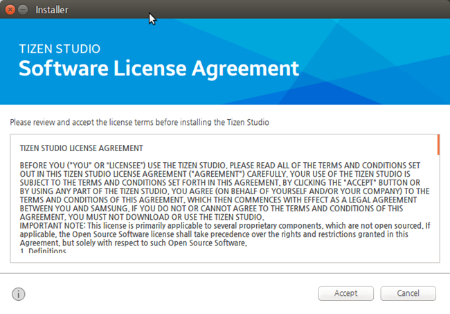
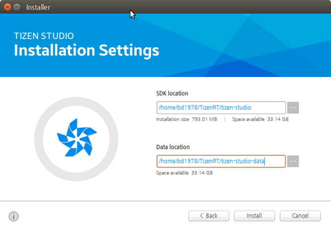
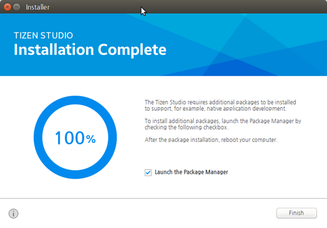
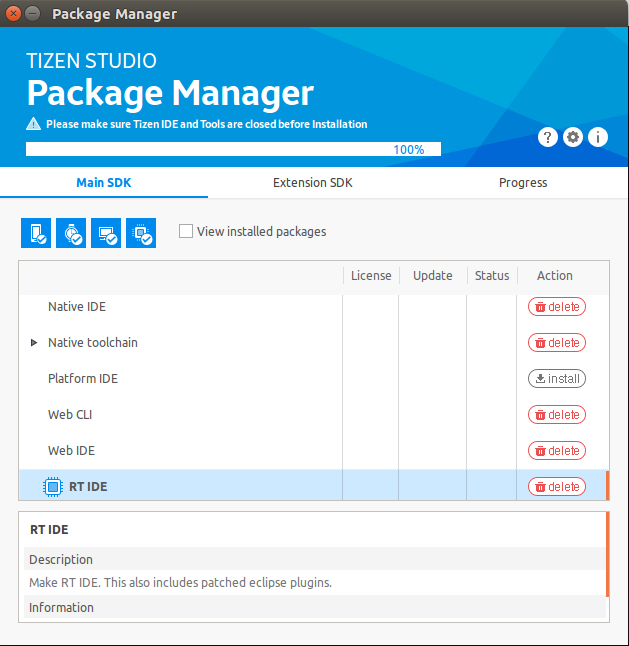
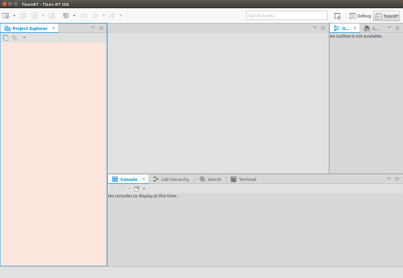

# Installing Tizen Studio for RT

To install Tizen Studio for RT:

1. Accept the software license.

   The license contains important legal notices for using Tizen Studio. Read the complete agreement, and click **Accept** only if you agree with the license statement:

   

2. Configure the installation directory.

   Tizen Studio for RT and its data directory are installed in the location specified in the Installation Settings step. To change the directory, click the **...** button and specify a new directory. If the new directory is valid, click **Install**:

   

3. Install ssssnhe Tizen Studio for RT.

   After you click **Install**, the installer installs the required packages and tools in the specified directory. You can monitor the installation process or cancel the installation. The installation process is completed in a few minutes, unless you cancel it.

4. Install additional tools.

   After the installation is finished, you can close the installer by clicking **Finish**:

   

   If you want to install additional platforms and tools, launch the Package Manager by selecting the **Launch the Package Manager** checkbox before clicking **Finish**.

   Through the Tizen Studio Package Manager, you can install and update additional tools. For more information on the Package Manager, see [Updating Tizen Studio](../../setup/update-sdk.md) and [Configuring the Package Manager](../../setup/advanced-configuration.md).

   

5. Launch Tizen Studio for RT.

   After launching Tizen Studio for RT from the application shortcut, select a workspace for your development:

   

The following figure illustrates on launching Tizen Studio for RT:

## Related information
* Dependencies
  - Ubuntu Only
