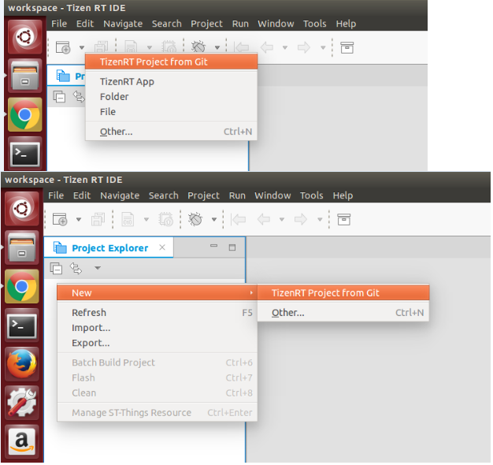
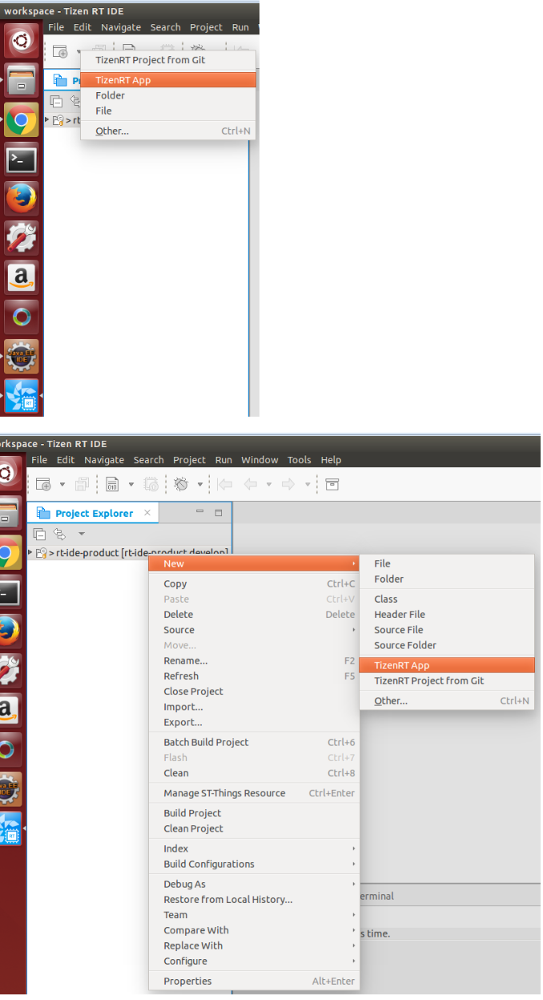
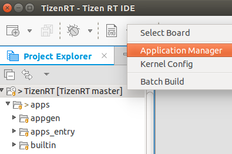
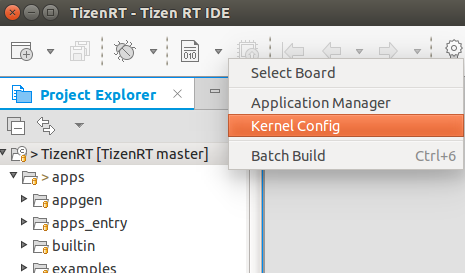

# Managing a Project

You can creating an RT project in the Tizen Studio, create application resources within the project, and build the project.

## Creating a Project

The Tizen RT Project Wizard is a Tizen Studio for RT tool that is used to create an RT project.

When you create a new project, you can select a specific template, which the Tizen RT Project Wizard uses to automatically create basic functionalities for the application. The default project files and folders are also created.

You can create projects from a local template or a remote Git repository.

### Creating Projects from a Local Template

To create a project from a local template:

1. To open the Tizen RT Local Project Wizard, use one of the following:   
   - In the Tizen Studio for RT menu, select **File > New > TizenRT Project**.
   - In the Tizen Studio for RT toolbar, click the **New** icon () drop-down list and select **TizenRT Project**.
   - Right-click in the **Project Explorer** view, and select **New > TizenRT Project**.  
   

2. In the New TizenRT Project Wizard, set the project name and click **Next**.  
  

3. Select the board template and click **Finish**.  
  

The new project is shown in the **Project Explorer** view.

**Figure: New project from a local template**  


### Creating Projects from a Remote Git Repository

To create a project from a remote Git repository:

1. To open the Tizen RT Git Project Wizard, use one of the following:  
   - In the Tizen Studio for RT menu, select **File > New > TizenRT Project from Git**.
   - In the Tizen Studio for RT toolbar, click the **New** icon () drop-down list and select **TizenRT Project from Git**.
   - Right-click in the **Project Explorer** view, and select **New > TizenRT Project from Git**.  
   

2. In the New TizenRT Project Wizard, you can select the Git import method:  
   - If you want to import from a new repository, [clone its URI](#using-the-clone-uri-option).
   - If you already cloned the Git repository you want, use an [existing local repository](#using-the-existing-local-repository-option).

#### Using the Clone URI Option

To import a project from a new repository:

1. Select **Clone URI** and click **Next**.  
  

2. Set basic location information to connect to the Git repository and click **Next**.  
  You can use a public Git URL, such as [https://github.com/Samsung/TizenRT.git](https://github.com/Samsung/TizenRT.git) or git://github.com/Samsung/TizenRT.  
  

3. Select branches to clone from the remote repository and click **Next**.  
  

4. Configure the local storage location and initial branch, and click **Next**.  
  

5. Select the specific directory under the Working Tree to use for importing the project, and click **Next**.  
  If you want to import the overall Working Tree as a new project, select the root (`Working Tree`) directory.  
  

6. Set the project name and click **Finish**.  
   

The new project is shown in the **Project Explorer** view.

**Figure: New project from a remote Git repository**  


#### Using the Existing Local Repository Option

To import a project from an existing repository:

1. Select **Existing local repository** and click **Next**.  
  

2. Add local repositories by clicking **Add**.  
  

3. Search for local Git repositories on the file system by clicking **Browse** to set the directory and clicking **Search**.

   After the search, select the repositories and click **Finish**.  

  

4. Select the repository to clone and click **Next**.  
  

5. Select the specific directory under the Working Tree to use for importing the project, and click **Next**.  
   If you want to import the overall Working Tree as a new project, select the root (`Working Tree`) directory.  

  

6. Set the project name and click **Finish**.  
  

The new project is shown in the **Project Explorer** view.

**Figure: New project from a remote Git repository**  


## Creating Your Application

The Tizen RT App Wizard is a Tizen Studio for RT tool that is used to create RT application resources.

When you create a new application, the basic file sets needed for application development are added.

To create a new application with a template within a selected project:

1. Select the project to which you want to add the application.

2. To open the Tizen RT App Wizard, use one of the following:  
   - In the Tizen Studio for RT menu, select **File &gt; New &gt; TizenRT App**.
   - In the Tizen Studio for RT toolbar, click the **New** icon () drop-down list and select **TizenRT App**.
   - Right-click in the **Project Explorer** view, and select **New &gt; TizenRT App**.  
   

3. In the New TizenRT App Wizard, set the application name and click **Next**.  
  

4. In the Select a Application Template page, select the application template and click **Finish**.  
   

The created application template is shown in the **Project Explorer** view within the project.

**Figure: New application template**  


You can code the required application features within the added template. Open the project sources in the Code Editor.

**Figure: Code Editor**  


The Tizen Studio for RT provides various features to ease code writing and improve your coding productivity when developing your applications:

- The API assist helps you to write code quickly by completing the names of the APIs automatically when writing a part of the API name.
- The API hover displays information about API functions, API-related types, and macros for the native framework.
- The API link helps you to check the original content of a linked API quickly.
- The **Outline** view allows you to see the structure of the code currently open in the Code Editor.

### Using API Assist

When you write code, the API assist feature provides API suggestions to complete the code faster.

To receive the API suggestions manually, type at least one letter of content, and press **Ctrl + Space**. The suggestion list appears. Use the arrow keys to select a suggestion from the list, and press **Enter** to complete the code.

**Figure: API assist suggestion list**  


If you already use the **Ctrl + Space** shortcut key in the Ubuntu system for other purposes, such as the keyboard input source change, you must change to another shortcut, or you can change the API assist key in the Tizen Studio menu: **Window &gt; Preference &gt; General &gt; Keys &gt; Content Assist**.

### Using API Hover

When you hover over an API function in the Code Editor, a popup window appears below the function. In that window, you get detailed information about the API function, such as a brief description, defined parameters, return value type, and exception information.

**Figure: API hover popup**  


### Using API Link

When you hover over an API function in the Code Editor, you can move to the original content of the hovered API by pressing the **F3** key or **Ctrl + Mouse click**.

**Figure: Moving with API link**  


### Using Outline View

The **Outline** view displays the structure of the code currently open in the Code Editor view.

**Figure: Outline view**  


## Building the Project

You must build your project before flashing or debugging it.

To build the Tizen RT project:

1. Select the project in the **Project Explorer** view.

2. To build the selected project, use one of the following:  
   - In the Tizen Studio for RT menu, select **Project &gt; Batch Build Project**.
   - In the Tizen Studio for RT toolbar, click the **Build TizenRT Project** icon ().  
   

3. In the Build TizenRT Project Wizard, select the board and build option for building your project, and click **Build**.  
  

You can see the build progress dialog.

**Figure: Build progress**  


You can check the build logs in the **Console** view.

**Figure: Build logs**  


### Selecting Applications for Running

If you want to configure only certain applications to run on the board, set those applications as the entry point with the Application Manager:

1. Click the arrow next to the **Build TizenRT Project** icon () and select **Application Manager** in the drop-down menu.  
  

2. In the **Application Manager** dialog box, select the check box for the application you want within a list of applications, and click **Set Entry**.  
    
  The entry point name next to the **Set Entry** button changes.

3. Click **OK**.

### Selecting the Toolchain Path

To change the toolchain for the build:

1. Click the arrow next to the **Build TizenRT Project** icon () and select **Build Environment Setting** in the dropdown menu.  
  

2. Click **Browse** next to the **Toolchain Path** field.  
  

3. Select a new path for your own toolchain and click **OK**.  
  

If you set a new toolchain, the toolchain path is displayed in the Build Environment Setting dialog as shown below. If you want to clear the toolchain setting and return to the default value, click **Clear**.

**Figure: New toolchain**  


### Modifying the Kernel Config

In the Build TizenRT Project Wizard, you can modify the kernel configuration for the build.


Before modifying the kernel configuration, you must install Kconfig:
1. Download the Kconfig frontend from <http://ymorin.is-a-geek.org/projects/kconfig-frontends>.

2. Configure and build the frontend with the following commands:  

   ```bash
   ./configure --enable-conf --enable-mconf --disable-shared --enable-static
   make
   sudo make install
   ```

3. If the frontend does not work, troubleshoot it as follows:

   1. In the case of a `configure` command error: can not find gperf  
      Run the `sudo apt-get install gperf` command.

   2. In the case of a `configure` command error: can not find a lexer generator (such as lex or flex)  
      Run the `sudo apt-get install flex` command.

   3. In the case of a `configure` command error: can not find a parser generator (such as yacc or bison)
      Run the `sudo apt-get install bison` command.

   4. In the case of a `configure` command error: could not find curses headers (frontends: mconf/nconf)  
      Run the `sudo apt-get install libncurses5-dev` command.

   5. If you still get an error after the above fixes:  
      - Run the `ls /usr/local/lib` command and make sure that it shows 3 files:  
        `libkconfig-parser-[.la .so -3.12.0.so]`
      - If those 3 files exist, run the `sudo vi /etc/ld.so.conf` command and save the file.  
        If not, run the `sudo apt-get install ldconfig` command to install the ldconfig module.


To modify the kernel configuration:

1. Click **Kernel Config**.  
  

2. Change the settings, **Save**, and **Exit**.  
  

## Related information
* Dependencies  
  - Ubuntu Only
