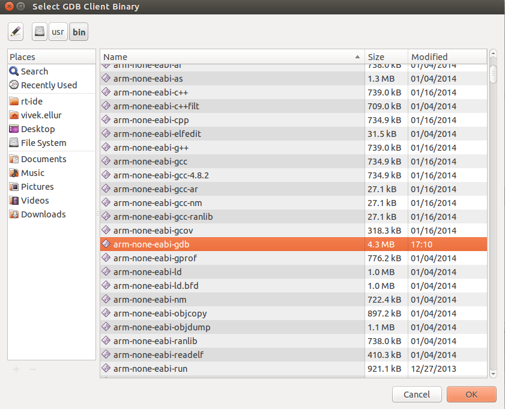

# Debugging the Project

Before you can debug your application, you must install the required software:

1. Install the cross-platform gdb with the following command:

   `sudo apt-get install gdb-arm-none-eabi`

   If there is a conflict with the previous gdb, remove the old gdb first using the `sudo apt-get remove gdb` command, and only install `gdb-arm-none-eabi`.

2. Install the dependable modules with the following command:

   `sudo apt-get install gperf libncurses5-dev flex bison`

To debug the application:

1. Set the needed break points by clicking the left side of the Code Editor:

   

2. In the **Project Explorer** view, select the project.

3. To debug the project, use one of the following:

   - In the Tizen Studio for RT menu, select **Run > Debug As > Run to TizenRT Debugger**.
   - In the Tizen Studio for RT toolbar, click the **Debug** icon () drop-down list, and select **Debug As > Run to TizenRT Debugger**.
   - Right-click the project in the **Project Explorer** view, and select **Debug As &gt; Run to TizenRT Debugger**.

   

4. In the **Select GDB Client Binary** dialog box select the path where `arm gdb` is installed, and click **OK**:
	> **Note**  
	> gdb installation path can be found using the command `which arm-none-eabi -gdb` in terminal. 

   

	**Confirm Perspective** dialog box is shown, to switch to the **Debug** perspective, click **Yes**:
   
	
   
	The **Debug** perspective shows the views useful for debugging activities, organized in the optimal fashion within the Tizen Studio window:

	

    When an action is executed on the board and it passes through a break point, the line is in the suspended state (see the figure above):

    You can perform various debugging functions (such as resume, step into, and step over) by using the toolbar in the **Debug** perspective:

   

> **Note**  
>
> OpenOCD (or other remote debuggers) can only create as many debugger instances as there are connected devices. So, if you connect only one device, you cannot create two debugger instances.
>
> When working with only one debugger instance, you must stop the previously running debugging operation to start a new debugging operation.
>
> If you run more than one debugger at the same time, you get an error.
>
> **Figure: Error when trying to run multiple debuggers**  
> 

## Related Information
* Dependencies
  - Ubuntu Only
