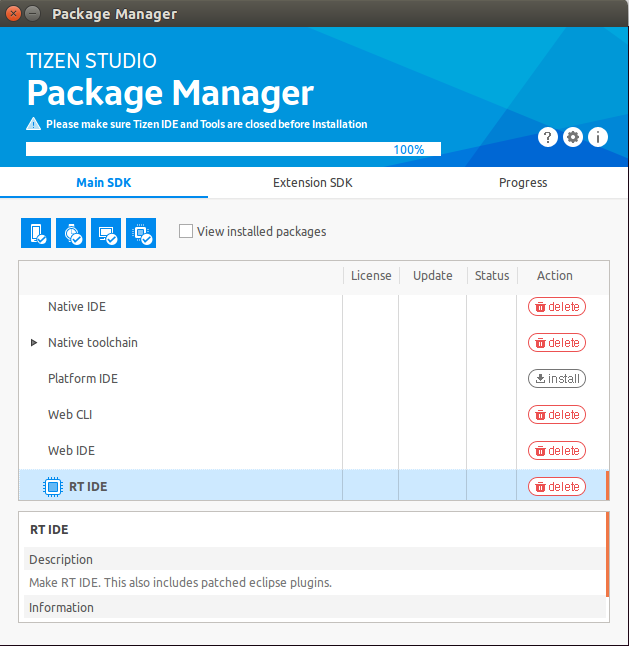

# Installing Tizen Studio for RT

To install the Tizen Studio for RT:

1. Accept the software license.

   The license contains important legal notices for using the Tizen Studio. Read it fully, and click **Accept** only if you agree with the license statement.

   

2. Configure the installation directory.

   The Tizen Studio for RT and its data directory are installed in the location specified in the Installation Settings step. To change the directory, click the **...** button and specify a new directory. If the new directory is valid, click **Install** at the bottom of the installer.

   

3. Install the Tizen Studio for RT.

   Once you click **Install**, the installer installs the required packages and tools in the specified directory. You can monitor the installation process or cancel the installation. The installation process is completed in a few minutes, unless you cancel it.

4. Install additional tools.

   After the installation is finished, you can close the installer by clicking **Finish**.

   

   If you want to install additional platforms and tools, launch the Package Manager by checking the **Launch the Package Manager** check box before clicking **Finish**.

   Through the Tizen Studio Package Manager, you can both install and update additional tools. For more information on the Package Manager, see [Updating Tizen Studio](../../setup/update-sdk.md) and [Configuring the Package Manager](../../setup/advanced-configuration.md).

   

5. Run the Tizen Studio for RT.

   Launch the Tizen Studio for RT from the application shortcut and select a workspace for your development.

   

The following figure illustrates the running Tizen Studio for RT.

**Figure: Running the Tizen Studio for RT**

## Related information
* Dependencies
  - Ubuntu Only
