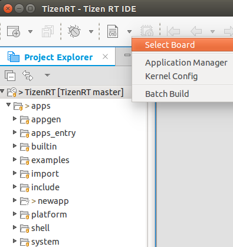

# Building the SmartThings&trade; Project

You must build your project before flashing or debugging it.

You can build a Tizen RT project in 2 ways: using a batch build or build project command.

## Using Batch Build

To build your project using the batch build command:

1. Select the project in the **Project Explorer** view.

2. To build the selected project, use one of the following:

	* In the Tizen Studio for RT menu, select **Project &gt; Batch Build Project**.  
      

	* In the Tizen Studio for RT toolbar, click the **Build TizenRT Project** icon ().  
      

3. In the Build TizenRT Project Wizard, select the board (`artik053`) and build option (`st_things`) for building your project, and click **OK**.  
   

You can check the build logs in the **Console** view.

**Figure: Build logs**   

## Using Build Project

To build your project using the build project command:

1. In the **Project Explorer** view, select the project.
2. In the Tizen Studio for RT toolbar, click the arrow next to the **Build TizenRT Project** icon () and select **Select Board**.    
  

3. In the Select Board and PreDefine Option window, select the board (`artik053`) and build option (`st_things`) for building your project, and click **OK**.  
  

4. In the Tizen Studio for RT toolbar, build the project by selecting **Project &gt; Build Project**.  
  

You can check the build logs in the **Console** view.

**Figure: Build logs**  

## Related Information
* Dependencies
  - Ubuntu Only
