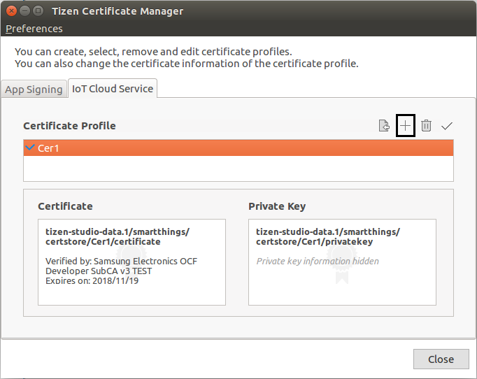
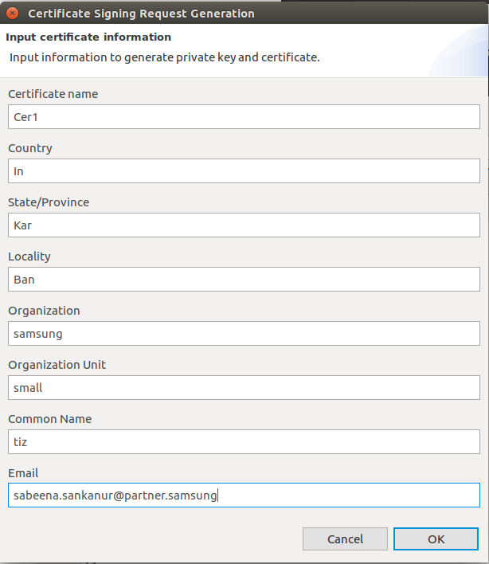
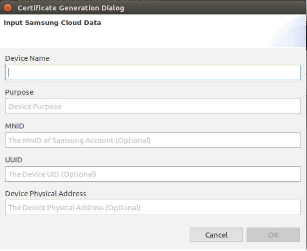
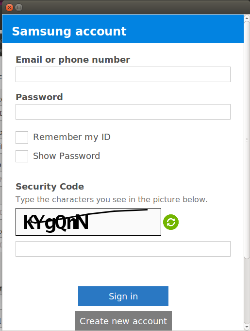
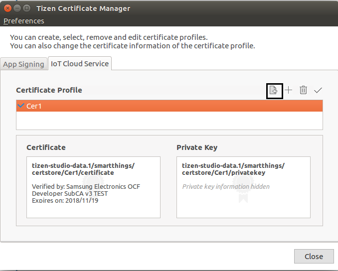
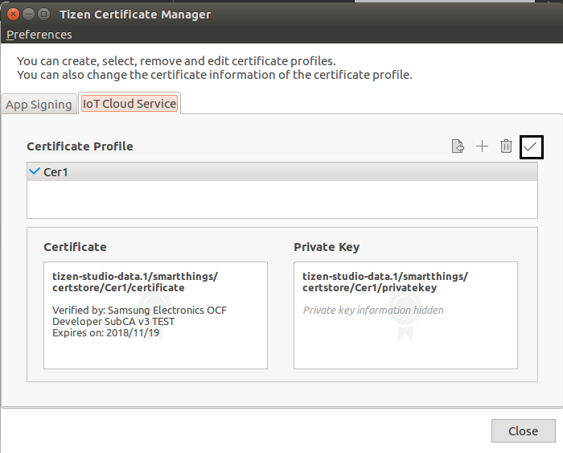

# Managing SmartThings&trade; Certificates

SmartThings&trade; uses OpenSSL for security. To ensure that only trusted developers and manufactures can develop devices that communicate with the SmartThings Cloud, you must get certificates for devices to use the SmartThings&trade; service.

In the Tizen RT IDE, you can perform various certificate-related tasks, such as creation, removal, import, and activation, by using the **IoT Cloud Service** tab.

The Certificate Manager is launched automatically if no certificate is set as active when you try to flash a project. To launch the Certificate Manager manually, go to **Tools &gt; Certificate Manager** in the Tizen Studio for RT menu.

## Creating a Certificate 

The process of creating a new certificate requires you to generate a Certificate Signing Request (CSR) and submit it to the [Developer Workspace](https://devworkspace.developer.samsung.com/smartthingsconsole/iotweb/site/index.html#/main) website.

To create a new certificate to use the SmartThings&trade; service:

1. In the Tizen Certificate Manager, select the IoT Cloud Service tab, and click .

   **Figure: Certificate Manager** 
	
   

2. In the Certificate Signing Request Generation Dialog box, enter the required information and click **OK**.

    -   **Certificate name**: Unique name for the certificate
    -   **Country**: Two-letter ISO code for the country where your organization is located
    -   **State/Province**: State or province where your organization is located
    -   **Locality**: City where your organization is located
    -   **Organization**: Legal name of your organization
    -   **Organization Unit**: Division of your organization handling the certificate
    -   **Common Name**: Fully-qualified domain name of your server or your name
    -   **Email**: Email address used to contact your organization
	
    **Figure: Certificate Signing Request Generation** 
	
    
	
3. In the next page of the Certificate Generation Dialog box, enter the required information and click **OK**.

    -   **Device name**: Name of the device
    -   **Purpose**: Enter the purpose
    -   **MNID**: ID of the your manufacture
    -   **UUID**: ID of the user
    -   **Device Physical Address**: Physical address of the added device
       	
    **Figure: Certificate Generation** 
	
    
	
4. Sign in to the Samsung account.

   **Figure: Samsung account Sign in** 
	
   
	

## Importing a Certificate 

To import an existing certificate:
1. In the Tizen Certificate Manager, click .

   **Figure: Import Certificate** 
	
   

2. In the Certificate Import Dialog box, enter the required information to import a certificate and click **OK**:

    -   **Certificate Name**: Unique name for the certificate
    -   **Private Key**: Private key file in the `.der` format
    -   **Certificate**: Certificate file in the `.pem` format

    **Figure: Certificate Import** 

    

## Activating a Certificate

To flash a project, you must have an active certificate. The Tizen RT IDE copies the activated certificate to the project during the flashing process.

To activate a certificate:

1.  In the Tizen Certificate Manager, double-click the certificate you want to activate.
2.  Click .

    **Figure: Certificate Activation** 

    

## Related Information
- Dependencies
  - Ubuntu Only
