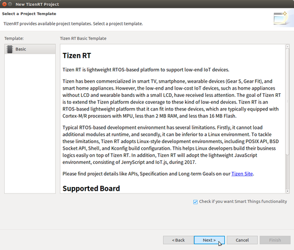

# Creating a SmartThings&trade; Project

You can create a new SmartThings&trade; project from remote Git repositories as well as local templates. To create a new project:

- When creating a project from a template, click the **Check if you want Smart Things functionality** check box when selecting a template:

  

- When importing a project from a Git repository, click the **Check if you want Smart Things functionality** check box:

  

For more detailed information on project creation, see [Creating a Project](../getting-started/create.md#creating-a-project).

## Related Information
- Dependencies
  - Ubuntu Only
