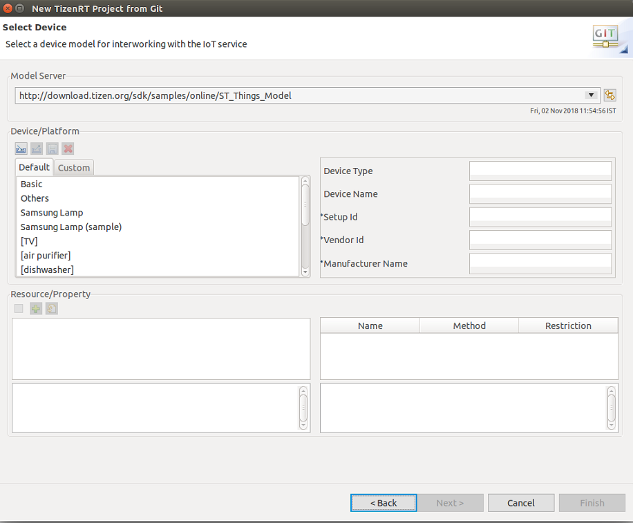
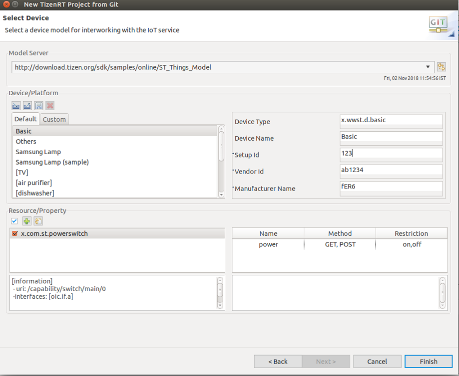
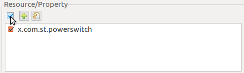
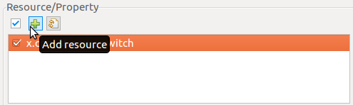
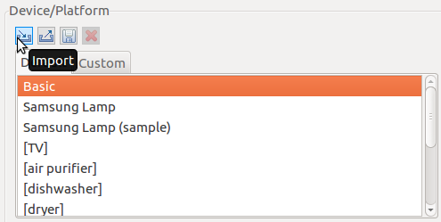
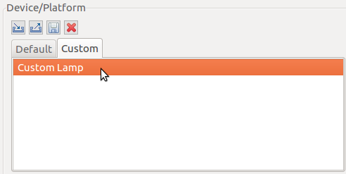
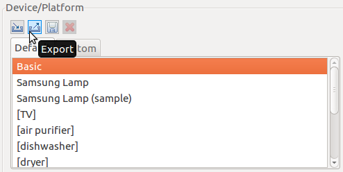
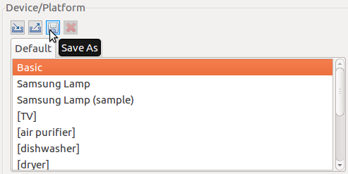
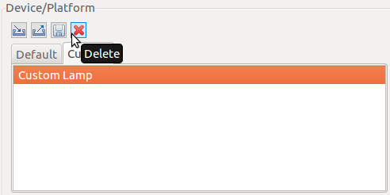
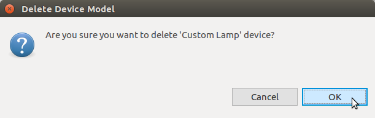

# Device/Resource Model Manager

You can use the Device/Resource Model Manager to select a device model for interworking with the SmartThings&trade; service.

With the Model Manager, you can:

- Check device, resource, and property information
- Select, add, and restore resources
- Import, export, save, and delete device models
- Generate stub code

The Model Manager is displayed while creating a new project with SmartThings&trade; functionality. If you want to access the Model Manager later again, in the **Project Explorer** view, right-click the project and select **Manage ST-Things Resource**.

**Figure: Model Manager main view**

## Checking Device, Resource, and Property Information

To access information:

- Select a device model in the **Default** or **Custom** tabs of the **Device/Platform** section to see device, platform, and resource information.
- Select a resource in the left panel of the **Resource/Property** section to see the its description and property information.
- Select a property in the right panel of the **Resource/Property** section to see its description.

**Figure: Viewing information**

## Managing Resources

You can select, add, and restore resources:

- To select all resources, click the checkbox on the **Resource/Property** toolbar.

  **Figure: Select all resources**

  

  To deselect all resources, clear the checkbox.

- To add a new resource:
  1. Click **Add Resource**.

	 

  2. In the Add Resource window, select the type of resource to be added, edit its information, and click **OK**.

     

     The new resource appears in the list in the **Resource/Property** section of the Model Manager main view.

- To restore the resources, click **Restore default**. This restores the initial resource state of the device, deleting all changes that have been made.

  **Figure: Restore all resources**

  

## Importing Device Models

To import a device model:

1. Click **Import** on the **Device/Platform** toolbar.

   

2. Select the JSON file containing the device model to be imported and click **OK**.

   

3.  Input a device name and click **OK**.

    

4. The imported device shows up in the device list, in the **Custom** tab.

   

## Exporting Device Models

To export a device model:

1. Select the model to be exported and click **Export** on the **Device/Platform** toolbar.

   

2. The device model is exported as a JSON file. Enter a file name for the exported model and click **OK**.

   

Saving Device Models

To save a device model:

1.  Select the model to be saved and click **Save As** on the **Device/Platform** toolbar.

    

2.  Input a device name and click **OK**.

    

3.  The saved device shows up in the device list, in the **Custom** tab.

    

Deleting Device Models

To delete a device model:

1.  Select the model to be deleted and click **Delete** on the **Device/Platform** toolbar.

    

2.  Confirm the deletion by clicking **OK**.

    

    The selected model is deleted..

## Generating Stub Code

When you click **Finish** in the Model Manager, the code for processing the resource is automatically created for the selected device.

**Figure: Source code generated by the Model Manager**

When the project is created, template code for the selected device and resources is automatically generated and opened for editing:
- `common_handlers.c`
  - Reset, ownership transfer, and status change handlers
  - You need to write additional code for the functionality you want.
- `resource_<uri>.c`
  - Get and set handlers for a resource
  - You need to write additional code for the functionality you want.
  - Refer to annotation or TODO in the resource file.
- `Makefile` and `Make.defs`
  - Makefile for building the project
- `st_things_main.c`, `things.c`, `things.h`
  - Project initialization, handler registration, and main loop

If you edit the SmartThings&trade; resources in your project later on, the Model Manager automatically backs the existing source files with a `.bak` extension.

**Figure: Backup files**

## Related Information
* Dependencies
  - Ubuntu Only
