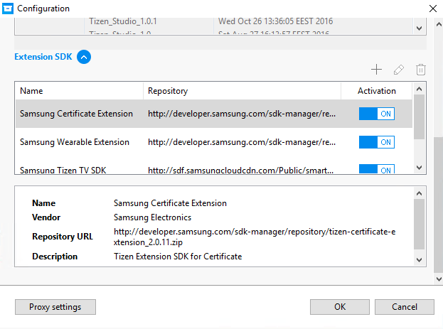
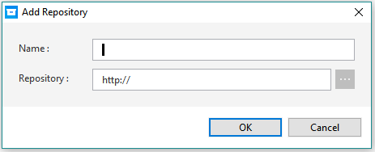
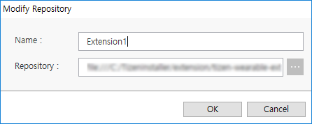

# Configuring the Package Manager

The Package Manager configuration allows you to manage the packages of the Tizen Studio. With the Package Manager configuration, you can change the options for the package repository for the main and extension SDK, as well as the proxy settings to access the package repository. If you want to configure the Package Manager in the command line interface, see [Updating with the CLI Package Manager](update-sdk.md#updating-with-the-cli-package-manager).

## Configuring the Main SDK Repository

You can set the configuration for installing or updating the Tizen Studio using one of the following methods. Before changing the package repository, note that the installed packages may be removed automatically, and you may need to reinstall the packages from the changed repository.

### Configuring the Package Repository

The package repository is a server which stores all the packages that you are using or will use in the Tizen Studio. Using the Package Manager, you can install or update packages from that repository. Rather than providing a single repository for the main SDK, several CDNs (Content Delivery Networks) are offered around the globe for your convenience. You can select the nearest package repository to install or update packages more quickly.

**Figure: Configuration window with the Package Repository selected**

To set the package repository:

1. Select an available repository from the drop-down list. Select the nearest repository for quickest installation and update.
2. Click **Apply** next to the combo box. Wait for a few seconds until the repository is validated.
3. In the **Distribution** combo box, select the distribution you want to access.
4. On your selection in the **Distribution** combo box, different snapshots are listed in the snapshot box. By switching off the **Auto Update** switch, you can select the specific snapshot in the list. If you leave the switch on, the Package Manager always updates all the packages from the latest snapshot.
5. Click **OK** to confirm your setting.

> **Note**  
> If you switch off the **Auto Update** option, you can select an earlier snapshot than the snapshot you are currently using. Be careful when doing this, since the update can cause entire packages to be removed to guarantee system integrity.

### Configuring the SDK Image

To install or update packages with the SDK image:

1. Enter the full path of the SDK image file in the **Package Repository** box, or click  next to the combo box to open the file browser.In the file browser, select the SDK image file, and click **OK**. When you select the image file, the image's origin repository information is displayed below the combo box.
2. Click **OK** to confirm your setting.

> **Note**  
> If you install or update packages using an image file, the SDK image's origin repository URL or distribution ID can be different than the current packages' URL or distribution ID. Be careful when doing this, since the installation or update can cause entire packages to be removed to guarantee system integrity.

## Configuring the Extension SDK Repository

The Tizen Studio supports extension packages from the extension repositories, which are developed and managed by external developers and companies. To configure the extension SDK, you must unfold the configuration panel by clicking **Extension SDK**  at the bottom of the dialog box. To return to the package repository configuration, click **Extension SDK**  to fold the extension SDK panel, or scroll up.

**Figure: Configuration window with the Extension SDK unfolded**

### Adding an Extension Repository

To add an extra repository:

1. In the **Configuration** dialog box, scroll down to the **Extension SDK** panel, or click **Extension SDK**  to unfold it.
2. Click **+** above the repository information table.
3. Enter values to the **Name** and **Repository** fields in the **Add Repository** dialog box. The **Repository** field indicates the external server address. You can also click  to select a local image file or local server location.  

4. Click **OK**.
5. In the **Configuration** dialog box, check the detailed repository information below the table.
6. Click **OK** to confirm.

### Removing an Extension Repository

To remove an extra repository:

1. In the **Configuration** dialog box, scroll down to the **Extension SDK** panel, or click **Extension SDK**  to unfold it.
2. Select an extension repository in the repository table.
3. Click the  icon right above the table.
4. In the **Configuration** dialog box, check that the extension repository has been removed.

### Modifying an Extension Repository

To modify an extra repository:

1. In the **Configuration** dialog box, scroll down to the **Extension SDK** panel, or click **Extension SDK**  to unfold it.
2. Click the  icon above the repository information table.
3. Modify the values of the **Name** and **Repository** fields in the **Modify Repository** dialog box. The **Repository** field indicates the external server address. You can also click  to select a local image file or local server location.  

4. Click **OK**.
5. In the **Configuration** dialog box, check that the repository information has changed below the table.
6. Click **OK** to confirm.

### Activating or Deactivating an Extension Repository

To activate or deactivate the extra repository:

1. In the **Configuration** dialog box, scroll down to the **Extension SDK** panel, or click **Extension SDK**  to unfold it.
2. Select the  on-off switch icon in the **Activation** column in the repository table.  

3. Click **OK** to confirm.

> **Note**  
> If the extension repository is deactivated, the packages from that repository are no longer shown in the Package Manager. However, if you activate the extension repository, the packages are shown in the Package Manager again.

## Configuring the Proxy

The Package Manager provides the network option to configure a proxy to connect to repository servers. To set the proxy:

1. Click the **Proxy Settings** button at the bottom of the **Configuration** dialog box.  

2. Select the proxy option you want to use:
   - **No proxy**: The Package Manager accesses the repository servers directly.
   - **System proxy settings**: The Package Manager accesses the repository servers through the system proxy.
   - **Manual proxy settings**: The Package Manager accesses the repository servers through the **IP** and **Port** value that you specify.
3. Click **Apply** to confirm.

## Related information
* Dependencies
  - Tizen Studio 1.0 and Higher
