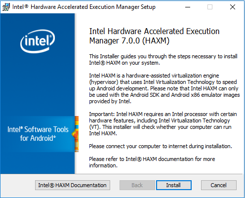
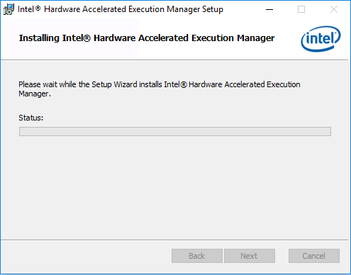
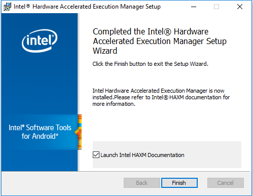
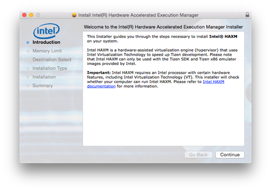
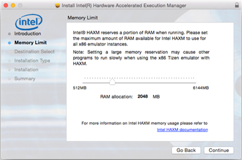
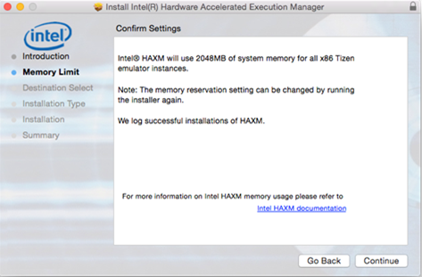
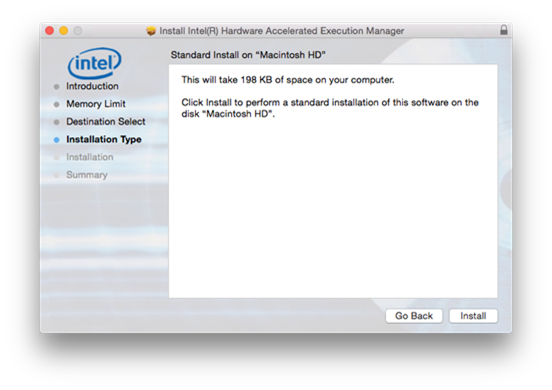
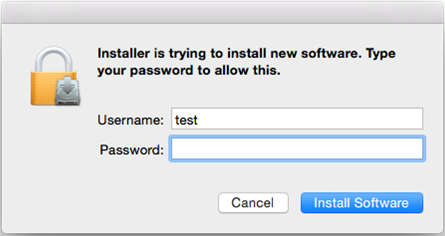
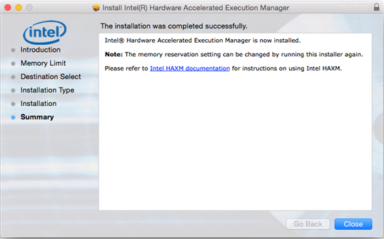

# Hardware Accelerated Execution Manager

The Intel Hardware Accelerated Execution Manager (Intel&reg; HAXM) is a hardware-assisted virtualization engine (hypervisor) that uses Intel Virtualization Technology (VT) to speed-up Tizen application emulation on Windows&reg; and macOS host machines. In combination with Tizen x86 emulator images and the [Tizen Studio](../index.md), Intel&reg; HAXM speed-ups the Tizen emulation on Intel-VT-enabled systems.

This topic describes how to install the HAXM on your [Windows&reg;](#on_Windows) or [macOS](#on_MacOS) development system.

Hardware requirements:

- Intel processor with support for VT-x, EM64T, and Execute Disable Bit
- At least 1 GB of available memory (2 GB or more is preferred)

> **Important**   
> Intel&reg; HAXM can only be used on systems with an Intel processor which supports the Intel VT.

<a name="on_Windows"></a>
## Installing Intel&reg; HAXM on Windows&reg;

Supported Windows&reg; versions: 10/8.1/8/7 (32/64-bit), Vista (32/64-bit), XP SP2 or higher (32-bit only)

**HAXM is automatically installed as part of the Tizen Studio**. If you want to install the HAXM separately, visit [http://download.tizen.org/sdk/haxm/7.0.0/win/](http://download.tizen.org/sdk/haxm/7.0.0/win/IntelHAXM_7.0.0.exe) and download the Windows installer package.

**Table: Windows installer package**

| Windows installer                        | File description | File size | MD5 checksum                     |
|----------------------------------------|----------------|---------|--------------------------------|
| IntelHAXM_7.0.0.exe | System driver    | 2.89 MB   | 1587f7ae42e11c7b22dc674fd776ce252b6a19152e7ca416a748e2bdbf2b36c5 |

To install Intel&reg; HAXM:

1. Run the downloaded installer and accept the UAC prompt.  
   

2. Click **Install** to start the installation.  
  

	Click **Intel&reg; HAXM Documentation** to access the documentation.

	The following screen shows the installation progress.  
	

3. Click **Finish** to exit the installer, once the Intel&reg; HAXM installation is finished.


The Intel&reg; HAXM is installed and ready to use.

Execute the following command, to verify if Intel&reg; HAXM is running:

```
sc query intelhaxm 
```

If Intel&reg; HAXM is working, the command displays a status message indicating that the state is "4 RUNNING".  


### Starting and Stopping Intel&reg; HAXM

To start or stop Intel&reg; HAXM, open the Command Prompt window with administrator privileges and execute one of the following commands:

- Start HAXM: `sc start intelhaxm`
- Stop HAXM: `sc stop intelhaxm`

### Removing Intel HAXM

> **Warning**  
> Close all instances of the Tizen emulator before removing the Intel&reg; HAXM.

Run installer or use control panel, to uninstall the Intel&reg; HAXM.

> **Important**  
> If you remove the Intel&reg; HAXM, the acceleration of the Tizen emulator is disabled, but the emulator still works. If you install the Intel&reg; HAXM again, the acceleration is re-enabled.

### Troubleshooting

If you meet an installation failure because of hardware requirements, check the BIOS/OS settings:

- Ensure **VT** is enabled in BIOS.
- Ensure **Execute Disable Bit** is enabled in BIOS.
- Ensure **Data Execution Prevention** is enabled in Windows&reg;. On the Windows&reg; platform, click **Control Panel > System > Advanced system settings > Advanced tab > Performance section**, **Options** (or **Settings**), and **Data Execution Prevention**. Make sure that **DEP** is enabled.
- Ensure that **Hyper-V** is disabled (on Windows&reg; 8 or after):  
  1. Run **Programs and Features** on the **Start** menu.  
  
  2. Click **Turn Windows features on or off**.
  3. Disable **Hyper-V** and click **OK**.  
  
  4. Reboot the computer.

<a name="on_MacOS"></a>
## Installing Intel&reg; HAXM on macOS

Supported macOS versions: 10.12 Sierra (64-bit), 10.11 OS X El Capitan(64-bit), 10.10 Yosemite (64-bit), 10.9 Mavericks (64-bit), 10.8 Mountain Lion (64-bit)

**HAXM is automatically installed as part of the Tizen Studio.** If you want to install the HAXM separately, visit [http://download.tizen.org/sdk/haxm/7.0.0/mac/](http://download.tizen.org/sdk/haxm/7.0.0/mac/IntelHAXM_7.0.0.dmg) and download the macOS installer package.

**Table: Windows installer package**

| macOS installer                          | File description | File size | MD5 checksum                     |
|----------------------------------------|----------------|---------|--------------------------------|
| IntelHAXM_7.0.0.dmg | System driver    | 218 KB    | fe7e4cd86b7a2b85591397fd6bf2ef43e7b088bfc72badab0c4d3532a65c2a2f |

To install Intel&reg; HAXM:

1. Open the downloaded DMG file and run the installer inside it.

2. Click **Continue** to start the installation.  


3. Adjust the amount of RAM to be allocated to Intel&reg; HAXM or set it to **2048 MB** as the default value.  
  
The installer also functions as a configuration tool for Intel&reg; HAXM. To change the memory settings later, run the installer again.

4. Confirm your Intel&reg; HAXM memory allocation settings, and click **Continue**.  


5. Check the capacity and the disk location of the HAXM driver, and click **Install**.  


6. Type your password.  
	

7. Click **Close** to exit the installer, once the Intel&reg; HAXM installation is finished.


The Intel&reg; HAXM is installed and ready to use.

### Using Intel&reg; HAXM

The Intel&reg; HAXM significantly enhances the performance of the Tizen emulator. For more information on the emulator details, see [Increasing the Application Execution Speed](../common-tools/emulator.md#speed).


## Related information
* Dependencies
  - Tizen Studio 1.0 and Higher
