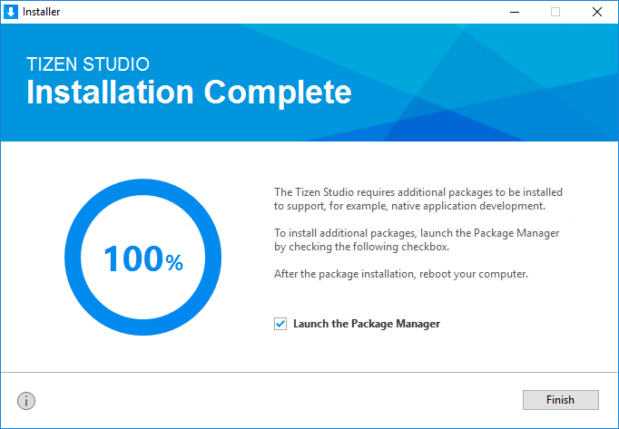

# Installing Tizen Studio

The installer has been renewed to provide a better user experience and show the unique Tizen philosophy. Using the new installer, you can now install the basic platform as well as useful tools step by step with a few clicks.

You can use either the GUI or CLI version of the installer.

## Using the GUI Installer

To install the Tizen Studio:

1. Launch the Tizen Studio installer.

2. Accept the software license.

   The license contains important legal notices for using the Tizen Studio. Read it fully, and click **Accept** only if you agree with the license statement.

   

3. Set the SDK and data location.

   The Tizen Studio and its data directory are installed in the location specified in the Installation settings step. To change the directory, click the **...** button and specify a new directory. If the new directory is valid (no errors are shown), click **Install** at the bottom of the installer.

   

4. Wait while the Tizen Studio is installed.

   Once you click **Install**, the installer installs the required packages and tools in the specified directory. You can monitor the installation process or cancel the installation. The installation process is completed in a few minutes, unless you cancel it.

5. Install additional tools.

   After the installation is finished, you can close the installer by clicking **Finish**.

   

   If you want to install additional platforms and tools, launch the Package Manager by checking the **Launch the Package Manager** check box before clicking **Finish**.

   Through the Tizen Studio Package Manager, you can both install and update additional tools. For more information on the Package Manager, see [Updating Tizen Studio](./update-sdk.md).


   > **Note**  
   > If you install the Tizen Studio in a directory that requires administrator privileges for access, such as `C:\Program Files`, administrator privileges are required to run the Tizen SDK tools.


## Using the CLI Installer

The CLI (command line interface) provides functional tools for running the CLI installer without the GUI environment.

To install the Tizen Studio using the CLI installer:

1. [Download the appropriate CLI installer for your platform](https://developer.tizen.org/development/tizen-studio/download).

2. Run the CLI installer:

   - On Microsoft Windows&reg; the command prompt opens and the installer is automatically executed.
   - On Ubuntu and macOS, open the terminal, go to the directory where the installer is downloaded, and enter the `chmod +x` command to apply the execute permission to the installer file. Then, execute the installer by entering the command with the following syntax:
   ```
   web-cli_Tizen_Studio_<version> [options] [<directory path>]
   ```

   **Table: Install options**
   | Option             | Description                              |
   |------------------|----------------------------------------|
   | `--show-license`   | Displays the Tizen Studio software license agreement.<br/>You must use this option alone. Do not use with other options. |
   | `--accept-license` | Accepts the license terms.               |
   | `--no-java-check`  | Skips the Java version check.            |

   **Table: Install command parameters**
   | Parameter        | Description                              |
   |----------------|----------------------------------------|
   | `directory path` | Specifies the installation directory path.</br/>If you do not enter the path, the Tizen Studio is installed in the default directory (`/home/{user}/tizen-studio`). |

3. If you agree to the software license and the license terms, enter **Y(yes)** for the conditions.

4. Enter the Tizen Studio installation location.

   The CLI installer begins to install the Web App Development platform and tools on your computer.

> **Note**  
> If you want to develop a native application on the CLI, you must install the Native App Development platform and tools using the CLI Package Manager.

## Installing Additional Packages with CLI

Run the CLI Package Manager with the `install` command using the following syntax:

```
package-manager-cli install [--accept-license] [--no-java-check] [--proxy <value>] [-f <file path>] [-p <password>] <package name>[,…]
```

**Table: Install command parameters**

| Parameter                   | Description                              |
|---------------------------|----------------------------------------|
| `--accept-license`          | Accepts the license terms.               |
| `--no-java-check`           | Skips the Java version check.            |
| `--proxy <value>`           | Proxy configuration value. Use one of the following values: **direct**, **auto**, or **ip:port**. |
| `-f, --file <file path>`    | If you want to install packages from a local SDK image, specify the full path of the SDK image file. |
| `-p, --password <password>` | Administrator (sudo) password for authentication. Ubuntu only. |
| `<package name>[,…]`        | Name of the package you want to install. You can enter multiple package names (such as **NativeIDE** and **Emulator**).<br/>To retrieve the names of installable packages, use the following command:<br/>`package-manager-cli show-pkgs` |


## Related information
* Dependencies
  - Tizen Studio 1.0 and Higher
