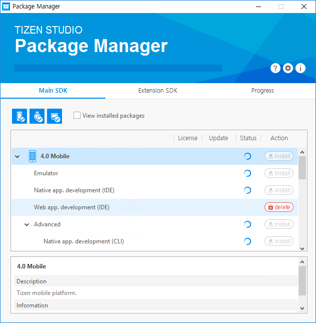

# Updating Tizen Studio

The Tizen Studio provides the Package Manager, a comprehensive package management tool for installing, updating, and removing platforms and tools. This topic describes how to install, update, and remove packages using the GUI version of the tool, and how to update packages with the CLI version of the tool.

The Package Manager features manage the packages that are used in all Tizen Studio programs. Tizen Studio platforms and tools consist of collections of packages that contain the necessary files, metadata, and installation and removal scripts. Each package has complicated dependencies to other packages. The Package Manager offers an easy and simple way to manage platforms and tools without understanding the complicated package dependencies.

## Starting the Package Manager

Before starting the Package Manager, close all Tizen Studio programs.

To run the Package Manager:

- On Windows&reg;, select **Start > All Programs > Tizen Studio > Tools > Package Manager**.
- On macOS, select **Launchpad > Package Manager**.
- On Ubuntu, select **Dashboard Home > Package Manager**.

**Figure: Package Manager main window**


The Package Manager is composed of 3 areas:

- **Header area** contains the tool title and 3 buttons:

  - Click **Inside Trouble Shooting** () to access guides that help you resolve common issues related to the Package Manager.
  - Click **Configuration** () to change Package Manager settings, such as package repository locations and proxy options.
  - Click **Information** () to access information about the Package Manager, such as the version number, the installation path, the package repository URL, the distribution name, and the package snapshot.

- **Main area** has 3 tabs:

  - In the **Main SDK** tab, you can install or remove platforms and tools. The profile filter buttons () allow you to filter the package list based on the profiles selected.
  - In the **Extension SDK** tab, you can install or remove extension tools and packages, such as the Samsung Certificate Extension.
  - In the **Progress** tab, you can see which packages are being installed or removed.

  In the **Main SDK** and **Extension SDK** tabs, you can restrict the list to the installed packages by selecting the **View installed packages** check box.

  **Figure: Package list**

  

- **Description area** shows a detailed description for a platform or package that has been clicked in the list in the main area.

  **Figure: Description area**

  

## Updating Packages

If you are connected to the Internet and updates are available for your installed Tizen Studio packages, an **Updates available** button appears in the Package Manager. Click it to update all the packages you have installed. To ensure system integrity across all packages in the Tizen Studio, the Package Manager does not support updating packages individually.

**Figure: Updates available button**


If you are using the Tizen Studio offline, you can update the packages with an image file. To install a package with the image file:

1. Click **Configuration** () in the Package Manager.
2. Enter the full path of the image file in the **Package Repository** box, or click **...** next to the combo box to open the file browser. In the file browser, select the image file, and click **Open** to close the dialog. If the image file is valid, detailed information about the image is displayed below the combo box.
3. Click **OK** to close the **Configuration** dialog. The **Update available** button appears after the platforms and tools in the image file are re-loaded. Now you can update and install additional platforms and tools with the image file.

> **Note**  
> Make sure that the image file includes a newer Tizen Studio version than your installed version before updating or installing with the image file.

## Installing Additional Packages

If you want to install a specific platform or tool, in the **Main SDK** and **Extension SDK** tabs, simply click **install** next to that platform or tool. The Package Manager installs all packages that are required for that platform or tool.

You can also install individual packages from a platform or tool. Unfold the list for the platform or tool, and click **install** next to the packages you want.

**Figure: Installing platform packages**



While a package is installing, you can cancel the installation in the **Progress** tab by clicking the **x** button next to the package. Due to package dependencies, canceling the installation of a single package can cancel the installation of other packages.

**Figure: Canceling installation**


If you want to retry a canceled or failed installation, click the **retry** () button. Due to package dependencies, retrying the installation of a single package can cause the installation of other packages.

## Removing Packages

To remove a package, click the **delete** button next to the package. Due to package dependencies, removing a single package can cause other packages to be removed also. To ensure system integrity across all installed Tizen Studio packages, package removal cannot be canceled while in progress.

**Figure: Removing packages**


## Monitoring Progress

When you have installations, updates, or removals in progress, a progress bar appears in the header area indicating the overall progress. You can monitor the progress of specific installations, uninstallations, or updates, as well as view the expected time to completion, in the **Progress** tab.

**Figure: Progress tab**


## Updating with the CLI Package Manager

Run the CLI Package Manager with the `update` command using the following syntax:

```
package-manager-cli update [--accept-license] [--no-java-check] [--proxy <value>] [-f <file path>] [-p <password>] [--latest]
```

**Table: Update command parameters**

| Parameter                   | Description                              |
|---------------------------|----------------------------------------|
| `--accept-license`          | Accepts the license terms.               |
| `--no-java-check`           | Skips the Java version check.            |
| `--proxy <value>`           | Proxy configuration value. Use one of the following values: **direct**, **auto**, or **ip:port**. |
| `-f, --file <file path>`    | If you want to install packages from a local SDK image, specify the full path of the SDK image file. |
| `-p, --password <password>` | Administrator (sudo) password for authentication. Ubuntu only. |
| `--latest`                  | This option is only useful for updating the Tizen Studio to the latest version after you downgraded it manually to an earlier version. Otherwise, the Package Manager updates it to the latest version with or without this option. |

## Related Information
* Dependencies
  - Tizen Studio 1.0 and Higher
