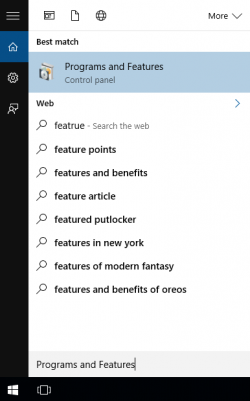
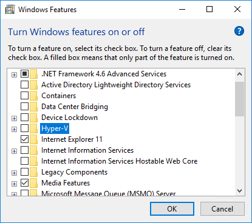

## Troubleshooting 

This page describes methodologies, techniques, and procedures to troubleshoot problems that might arise in the day-to-day operations while using Tizen Studio.

## Issue: HAXM installation fails 

**Description:** 

HAXM fails to install.

**Resolution:** 

- Ensure that the **VT**, **Execute Disable Bit** option is enabled in BIOS.
- Ensure that **Data Execution Prevention** is enabled in Windows&reg;.
        
  - To enable **Data Execution Prevention** in Windows&reg;, follow these steps:

    1. Click **Control Panel > System and Security > System**.
    2. Select **Advanced system settings**.
    3. In the left navigation bar, click **Advanced**.
    4. In **Performance section**, click **Settings**.
    5. In the **Performance Options** dialogue window that appears, click **Data Execution Prevention**.
    6. Select **Turn on DEP**. 
    7. Click **Apply** and click **OK**.

- Ensure that **Hyper-V** is disabled (on Windows&reg; version 8 or higher).
    1. In the **Start** menu, run **Programs and Features**.  
         
    2. In the **Programs and Features** window, click **Turn Windows features on or off**.
    3. In the **Turn Windows features on or off** window that appears, disable **Hyper-V** and click **OK**.  
         
    4. Reboot your computer. 
 
## Issue: HAXM installation fails due to Intel&reg; Execute Disable (XD) Bit capability

**Description:**

 While installing Intel&reg; HAXM, you may encounter an error regarding the Intel&reg;XD support.
  The following conditions can trigger this error message:

  - Your computer's processor does not support Intel&reg; XD
  - Intel&reg; XD is not enabled
  
  **Resolution:** 

   - **Intel&reg; XD is not supported**
  
     Intel&reg; HAXM requires an Intel&reg; processor with Execute Disable (XD) Bit functionality and cannot be used on systems not supporting this hardware feature. To determine the capabilities of your Intel&reg; processor, see the [official site](http://ark.intel.com/).
  
   - **Intel&reg; XD is not enabled**

      > [!NOTE]
      > Apple-based computers have Intel&reg; XD permanently enabled, if the processor supports the feature.
  
      If you receive an error message that Intel&reg; XD is not enabled, it implies that your computer does not meet the minimum system requirements to use Intel&reg; HAXM. Besides, to determine the capabilities of your Intel&reg; processor, see the [official site](http://ark.intel.com/).


## Issue: HAXM installation fails due to Intel&reg; Virtualization Technology (VT-x)
**Description:**

  When you install Intel&reg; HAXM, you may encounter an error regarding Intel&reg; VT-x support. The following conditions can trigger this error message:

   - Your computer's processor does not support Intel&reg; VT-x
   - Intel&reg; VT-x is not enabled
  
**Resolution:** 

- **Intel&reg; VT-x is not supported**
  
  Intel&reg; HAXM requires an Intel&reg; processor with Intel&reg; VT-x functionality and cannot be used on systems not supporting this hardware feature. To determine the capabilities of your Intel&reg; processor, see the [official site](http://ark.intel.com/).

- **Intel&reg; VT-x is not enabled**
    
    > [!NOTE]
    >  Apple-based computers have Inte&reg;l VT-x permanently enabled, if the processor supports the feature.
  
    If you receive an error message indicating that Intel&reg; VT is not enabled, your computer does not meet the minimum system requirements to use Intel&reg; HAXM. To determine the capabilities of your Intel&reg; processor, see the [official site](http://ark.intel.com/).
  

## Issue: Visual Studio throws errors when using Tizen.NET.SDK 1.0.0

**Description:**

Visual Studio&reg; Tools for Tizen supports Visual Studio&reg; 2019 (16.0 or higher version), yet you encounter errors while using Tizen.NET.SDK 1.0.0 or 1.0.1:

```
Severity Code   Description   Project  File  Line     Suppression Stat Error   NETSDK1013  

The TargetFramework value 'tizen40' was not recognized. It may be misspelled. If not, then the TargetFrameworkIdentifier and TargetFrameworkVersion properties must be specified explicitly. AnalogWatch.Tizen.Wearable C:\Program Files\dotnet\sdk\2.1.700\Sdks\Microsoft.NET.Sdk\targets\Microsoft.NET.TargetFrameworkInference.targets 96
```
**Resolution:**

This error occurs due to the updates to Visual Studio&reg; project system. You can resolve the issue by following
either of the following options: 

1. Use Tizen.NET.Sdk 1.0.3
   Since Tizen.NET.Sdk 1.0.3, Tizen.NET can be used as a custom SDK for MSBuild.
   
   ```
   <Project Sdk="Tizen.NET.Sdk/1.0.3">

   <PropertyGroup>
      <OutputType>Exe</OutputType>
      <TargetFramework>tizen40</TargetFramework>
   </PropertyGroup>

   </Project>
   ```
   
2. Use **Microsoft.NET.Sdk**, if you want to continue working with the existing Tizen project using legacy **Tizen.NET.Sdk**, and add the following lines to your **csproj** file:
   ```
   <Project Sdk="Microsoft.NET.Sdk">

   <PropertyGroup>
      <OutputType>Exe</OutputType>
      <TargetFramework>tizen40</TargetFramework>
      <!- Workaround: Set TargetFrameworkIdentifier to avoid Tizen TFM issue on VS2019 -->
      <TargetFrameworkIdentifier>Tizen</TargetFrameworkIdentifier> 
      <TargetFrameworkVersion>v4.0</TargetFrameworkVersion>
   </PropertyGroup>

   </Project>
   ```

## Issue: Cannot use external library **FSharp.Core.dll** in .NET&reg; Core SDK preview version

**Description:**  

While trying to use the external library **FSharp.Core.dll**, you get an error. 

**Resolution:** 

1. Switch from .NET&reg; Core SDK preview version (v3.0.0-preview5) to .NET Core SDK preview version 2.2.102. 
2. Build using Visual Studio (right-click on the **Project > Build**) and the **FSharp.Core.dll** library gets included in the build directory and using the functions from FSharp. The core will also resolve the issue.

## Issue: Screen Reader not working

**Description:** 

The screen reader fails to work. 

**Resolution:** 

- Check whether the **Accessibility TTS** (screen reader - voice assistant) and **SystemSettings.AccessibilityTtsEnabled** is enabled. 

For more information, see [Accessibility](https://developer.tizen.org/dev-guide/csapi/api/Tizen.System.SystemSettings.html#Tizen_System_SystemSettings_AccessibilityTtsEnabled).


## Issue: Emulator terminates unexpectedly on macOS&reg;

**Description:** 

If you use a Macbook&reg;with both Intel&reg; HD and NVIDIA&reg; graphics, the emulator terminates unexpectedly, while you execute the emulator with OpenGL ES version 1.1 or 2.0.

**Resolution:** 

1. Verify the emulator configuration in **Emulator Manager**. 
2. On **General tab** in the Emulator configuration window, set **OpenGL ES version to version 2.0** or to **version 3.0.**

## Issue: UI display perspective issues on macOS
**Description:** After updating Tizen Studio, UI perspectives are not displayed correctly.

**Resolution:**

- In macOS&reg;, if the UI perspectives are not displayed after you update Tizen Studio, it is recommended to restart the IDE, doing so clears the cache from the previous installation.

- In case you see any old perspective, it is recommended to create a new workspace and import the projects to the new workspace to resolve the issue.

## Issue: Cannot view Connection Explorer

**Description:** Not able to view Connection Explorer.  

**Resolution:**

Since Tizen Studio 2.0,**Connection Explorer** is replaced with **Device Manager**. Additionally, you can fix the issue as follows:

- Reset the perspective:
  1. In the Tizen Studio menu, select **Window > Perspective > Reset Perspective**.
  2. After updating Tizen Studio to a higher version, run the following command:
  `eclipse.exe -clean -clearPersistedState` 
  3. Launch Tizen Studio.

> [!NOTE]
> You can create unit tests for Tizen Studio versions higher than 2.3.1. 

## Issue: Preview tab does not appear

**Description:**

The preview tab in the Web Page Editor does not appear. 

**Resolution:**
- Use Web SDK HTML Editor that has enhanced features compared to the Web Page Editor. 
- Instead of the Preview tab in the Web Page Editor, use the preview feature by pressing the **Ctrl + 4** combination of keys in Web SDK HTML Editor.
- In Rapid Development Support (RDS) mode, check for the web unit test results update status.

## Issue: Cannot launch Tizen Studio with GDB Client

**Description:** Tizen Studio fails to launch with GDB client on Ubuntu&reg; 18.04.
**Resolution:**

Ubuntu&reg; 18.04 does not come with `readline6` dev package. To install the `readline6` dev package, run the following command (for 64 bit system):

> [!NOTE]
> Xenial (16.04) contains a `libreadline6-dev` package, but Ubuntu&reg; 18.04 does not. You can download and install the package with the following commands:

```
$ wget http://mirrors.edge.kernel.org/ubuntu/pool/main/r/readline6/libreadline6-dev_6.3-8ubuntu2_amd64.deb
$ wget http://mirrors.edge.kernel.org/ubuntu/pool/main/r/readline6/libreadline6_6.3-8ubuntu2_amd64.deb 
$ sudo dpkg -i libreadline6_6.3-8ubuntu2_amd64.deb
$ sudo dpkg -i libreadline6-dev_6.3-8ubuntu2_amd64.deb 
```

## Issue: Emulator stuck at booting kernel

**Description:** 

Emulator gets stuck at booting kernel 

**Resolution:**

 The cause of such an issue is that the user has insufficient permissions. To resolve this problem, after installing KVM for Ubuntu&reg; 18.04, run the following command:

```
$ sudo adduser $USER kvm
```
After the command is executed, "kvm" group (/dev/kvm) gets added into the group file (/etc/group). 

> [!NOTE]
> To apply this change, you must restart, or logout and login your system.