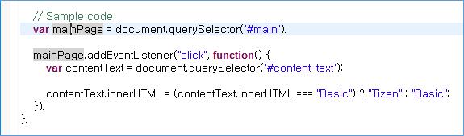
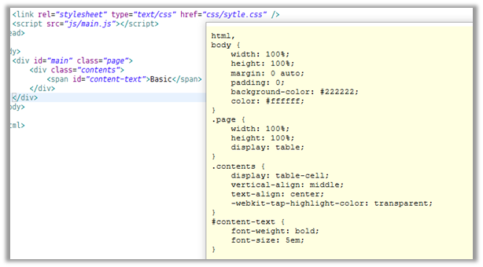
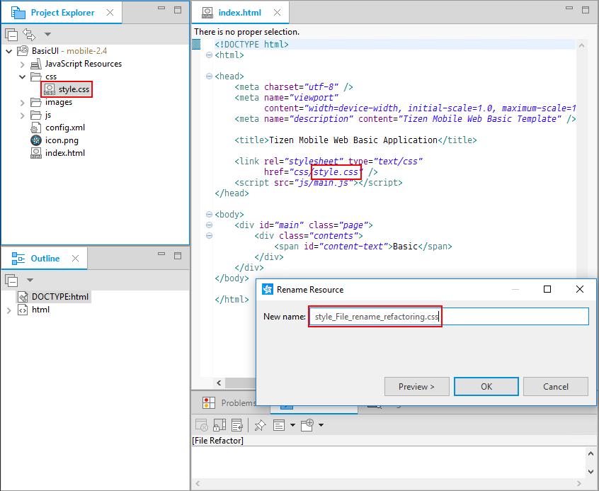

# Writing Your Code

Tizen Web Editor is a powerful tool for creating and modifying source code. It supports all basic coding features, such as syntax highlighting, content assist, and privilege checking.

Tizen Web Editor provides support for JavaScript, HTML, and CSS file editing.

## Checking the Syntax

The Tizen Studio provides a code checking tool to help you to identify and correct problems with the structural quality of your code.

There are 2 ways, manual and automatic, to inspect your code:

- Manual check	 

  1. In the **Project Explorer** view, select a JavaScript file.
  2. Right-click the file and select **Check JavaScript Rules**.

   > **Note**  
   > You can check JavaScript immediately, even without saving the file.

  **Figure: Checking JavaScript rules manually**

  

- Automatic check

  When writing code, if there are syntax errors, the automatic check displays the CSSLint or JSLint validator results on the left edge of the editor.

  - If you save a file, the project is built and syntax is checked automatically.

    **Figure: Checking JavaScript automatically**

    

    **Figure: JavaScript scan results in the Problems view**

    

  - Using content assist.

    You can get suggestions for HTML, CSS, and JavaScript tag and attribute properties. Also, if you mistype, content assist displays an error. Press **Ctrl + Space** to open content assist.

    **Figure: Content assist in a CSS file**

    

### Syntax Check Settings

If you want to adjust the error level settings for the CSS or JavaScript Validator, go to **Window > Preferences > Tizen Studio > Web > Editor > CSS Editor** or **JavaScript Editor**.

By default, the CSS or JavaScript syntax check is operated when a document is saved or the project built. However, you can set the detailed attributes in the preferences. To change the inspection point, adjust it in **Preference > Build or Reconcile**:

- If you select **Build**, the editor performs a check when building the project.
- If you select **Reconcile**, the editor performs a check when saving the file.

For more information, see [CSSLint](https://github.com/CSSLint/csslint/wiki/Rules) and [JavaScriptLint](http://jshint.com/).

## Editing HTML

When editing HTML documents for mobile applications, you can take advantage of the advanced content assist and content hover features, as well as advanced file refactoring.

### Advanced Content Assist in Mobile Applications

The advanced content assist supports code completion of the attribute values for some elements in the HTML Editor.

The advanced content assist has the following features:

- Proposes code completion of the `href` attribute value of the `<a>` element:
  - List of HTML files included in the project
  - List of `id` values that are assigned to the elements of the edited file
- Proposes code completion of the `href` attribute value of the `<link>` element:
  - List of CSS files included in the project
- Proposes code completion of the `src` attribute value of the `<script>` element:
  - List of JavaScript files included in the project
- Proposes code completion of the `src` attribute value of the `<iframe>` element:
  - List of HTML files included in the project
- Proposes code completion of the `src` attribute value of the `` element:
  - List of image files included in the project
- Proposes code completion of `id` or `class` attribute values of all elements: `id`:
  - List of ID selectors of linked CSS files
  - `class`: List of class selectors of linked CSS files

**Figure: Content assist with the  element**

To use content assist in the HTML editor:

1. Press **Ctrl + Space** to complete the code using a list of available code suggestions.

2. Navigate and select the lines in the list.

   Additional information on the selected line is displayed.

3. Click the selected line or press **Enter** to insert the selection in the editor.

### Advanced Content Hover in Mobile Applications

The advanced content hover displays additional information on the attribute values of some elements in the HTML editor.

The advanced content hover has the following features:

- Supports a preview at the `href` attribute value of the `<a>` element.	 
  - When the HTML file path is assigned to the `href` value, the preview shows the HTML code of the linked file.
  - When an `id` element value is assigned to the `href` value, the preview shows the code snippet of the element that is assigned the `id` value.
- Supports a preview of the CSS file at the `href` attribute value of the `<link>` element.
- Supports a preview of the JavaScript file at the `src` attribute value of the `<script>` element.
- Supports a preview of the HTML file at the `src` attribute value of the `<iframe>` element.
- Supports a preview of the image file at the `src` attribute value of the `` element.
- Support a preview of the CSS rule at the `id` or `class` attribute value of all elements, if the selector (that is made by the `id` or `class` value) exists.

**Figure: Content hover with the <link> element**

To use the hover feature in the HTML editor, hover the mouse cursor at the above attributes.

### Advanced File Refactoring in Mobile Applications

The Tizen Studio supports file refactoring in the **Project Explorer** view. When file refactoring occurs, other files to which the refactored file belongs are changed.

The advanced file refactoring has the following features:

- File rename refactoring

  When a file is renamed, other files to which the renamed file is related are changed at the linked code line.

- File move refactoring

  When a file is moved, other files to which the moved file is related are changed at the linked code line.

- File delete refactoring

  When a file is deleted, other files to which the deleted file is related are commented out at the linked code line.

**Figure: Before CSS file rename refactoring**

**Figure: After CSS file rename refactoring**

## Previewer

To test a Web application, or a single Web page as part of a client application, use the previewer window.

Not only can you preview the source code you have developed, you can also visually define the type and hierarchy of the selector to help development.

For more information, see [Previewing Pages in a Browser](previewer.md).

## Using JavaScript Log Console View

The **JavaScript Log Console** view is a tool that helps to debug the log analysis using the JavaScript Console API when developing Web applications. The **JavaScript Log Console** view is active only in the **Debug** launch mode.

Using the console functions provided to JavaScript code, the view shows the log information in the target.

**Table: Supported JavaScript log methods**

| Method          | Example                           |
|---------------|---------------------------------|
| `console.log`   | `console.log("console.log");`     |
| `console.info`  | `console.info("console.info");`   |
| `console.warn`  | `console.warn("console.warn");`   |
| `console.error` | `console.error("console.error");` |
| `console.debug` | `console.debug("console.debug");` |

**Figure: JavaScript log method colors**

## Live Edit

When you change the source code in the Tizen Studio, the running application is updated instantly without any reloading process.

For more information, see [Live Editing of HTML, CSS, and JavaScript](live-editing.md).

## Code Beautifier and Minifier

The Code Beautifier is a tool that can help you understand code and make it easier to read.

The Code Minifier is a smart compression tool. Minification is the process of compressing code from the original size to the smallest size without affecting its operation.

For more information, see [Cleaning Up Your Code](code-productivity.md).

## Web Unit Testing

If you are implementing a component in your application, you must test it to ensure that it does not behave in an unexpected way.

For more information, see [Web Unit Testing Tool](web-unit-test-tool.md).

## REST Viewer

The REST Viewer supports the testing, test case management, and automatic code generation features of the REST API. You can easily develop Web applications using the REST API.

For more information, see [Using the REST Viewer](rest-viewer.md).

## Related information
* Dependencies
  - Tizen Studio 1.0 and Higher
