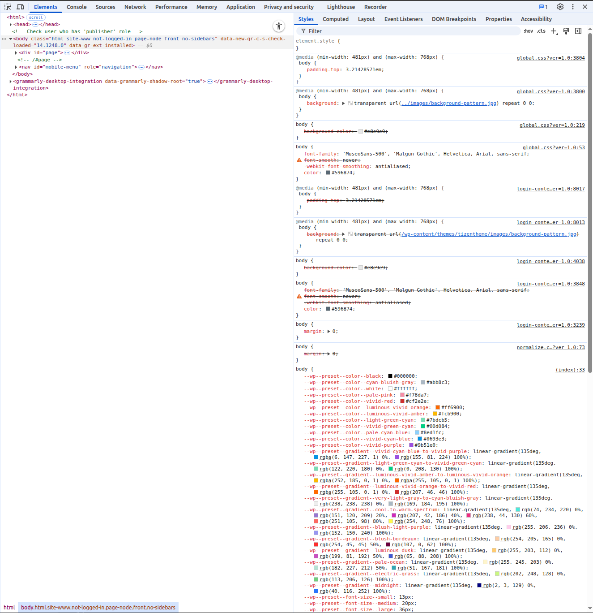
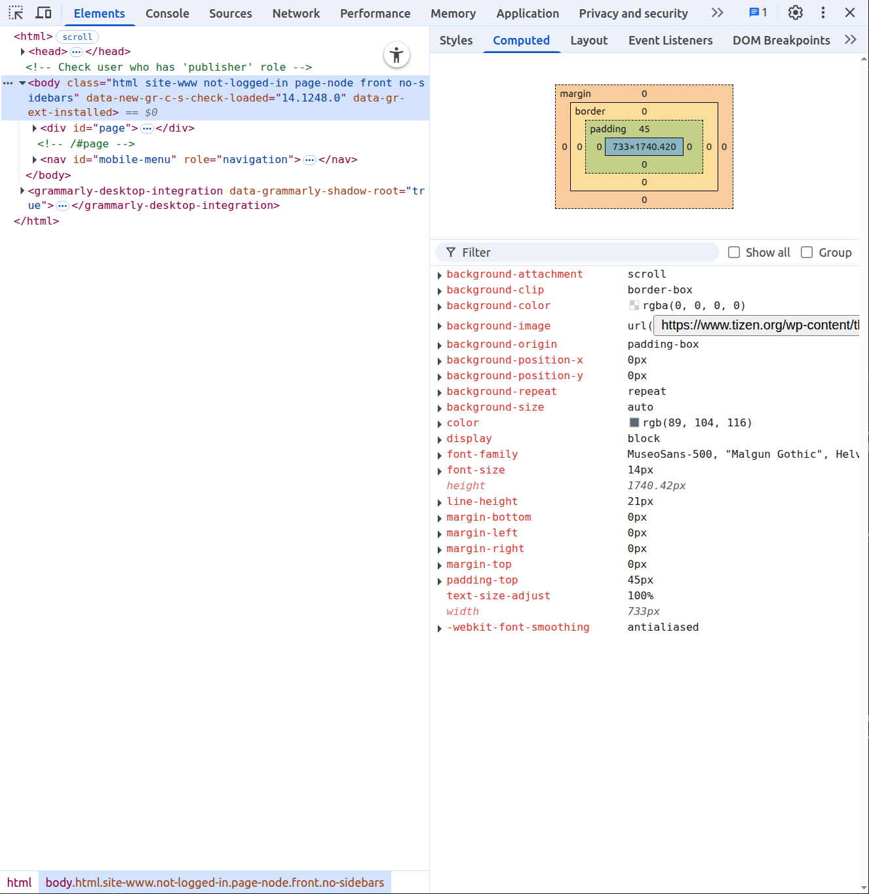
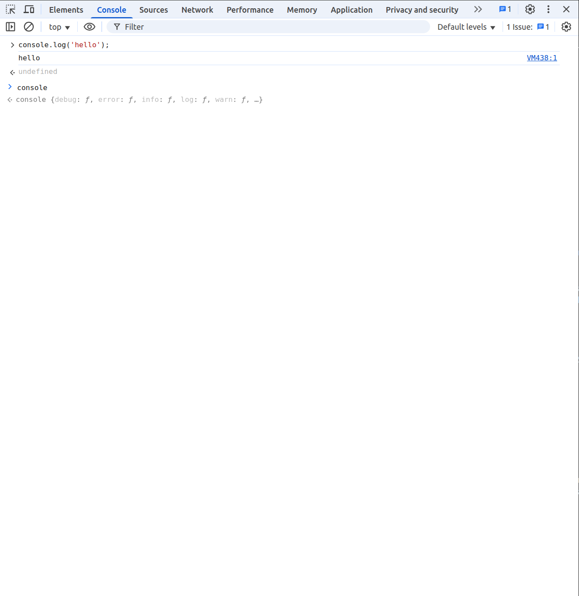
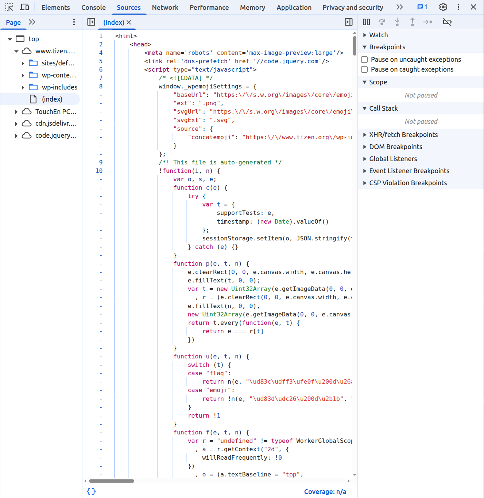
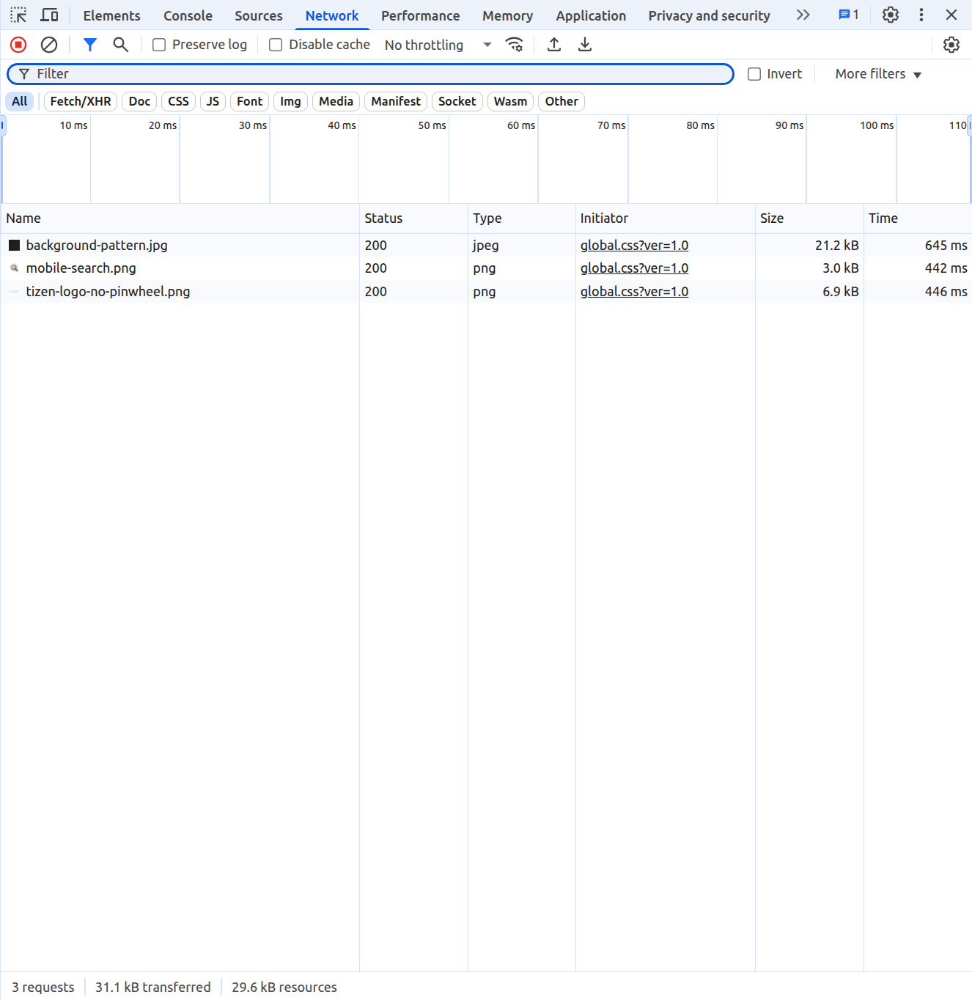
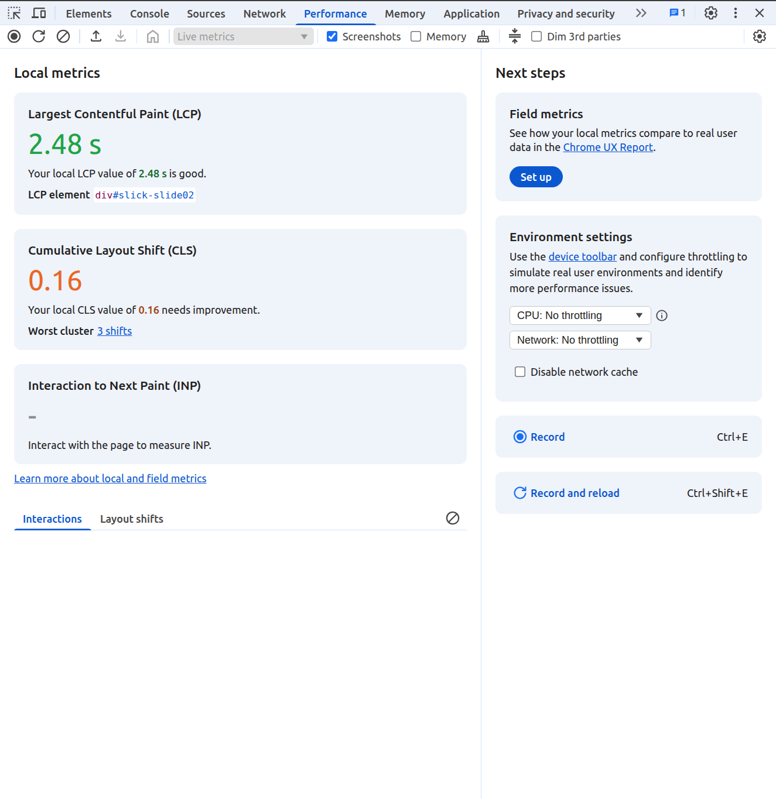
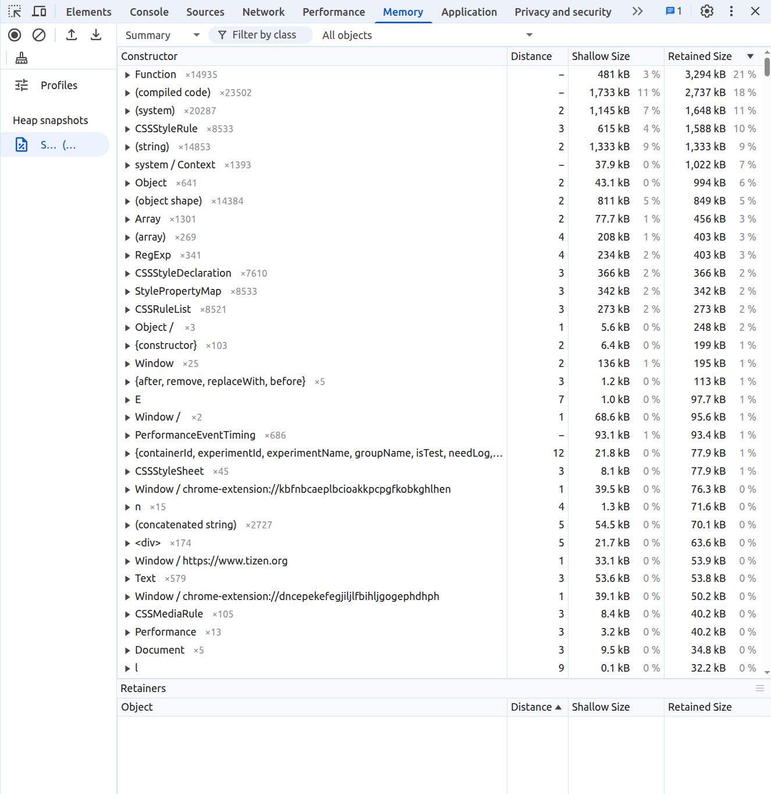
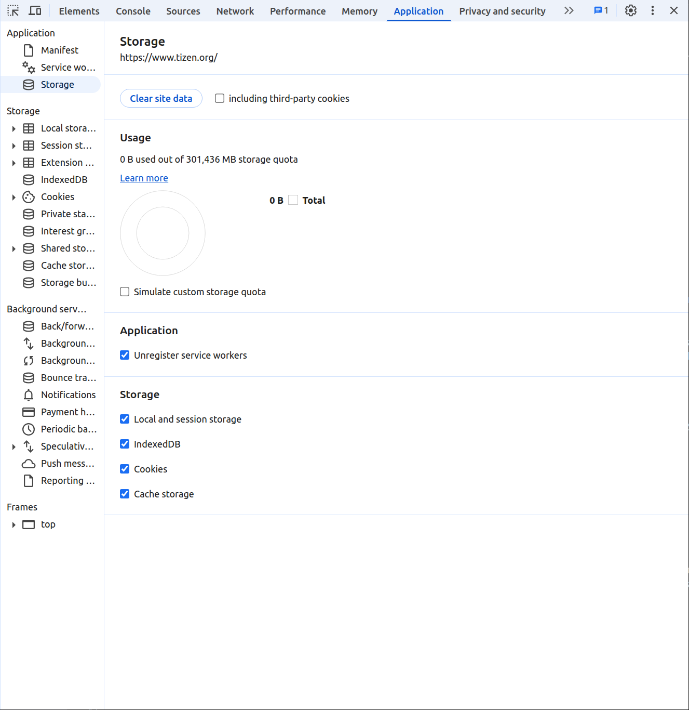

# Debugging with Web Inspector

You can [debug Web applications](../../web/tutorials/process/run-debug-app.md) using the JavaScript Debugger tool. The JavaScript Debugger is based on Webkit Web Inspector, and has been modified to support remote debugging.

The JavaScript Debugger supports the following panels:

- [Elements Panel](#elements)
- [Console Panel](#console)
- [Sources Panel](#sources)
- [Network Panel](#network)
- [Performance Panel](#performance)
- [Memory Panel](#memory)
- [Application Panel](#application)

**Figure: JavaScript Debugger panels**

When debugging with the [emulator](../common-tools/emulator.md), the emulator communicates with the Google Chrome&trade; browser through the HTTP protocol.

When the JavaScript Debugger is started, the **Network** panel is off. To enable the **Network** panel and start monitoring the resource loading status, press the F5 key. This reloads the current page and displays the load time on the **Network** panel.

---

## Elements Panel

The **Elements panel** allows you to inspect and edit the HTML and CSS of your web page. It provides a live view of the DOM tree and the styles applied to each element.

**Key Features:**

* DOM Tree Inspection: View the hierarchical structure of the HTML document.
* Real-time Editing: Modify HTML attributes and content directly in the panel, with changes instantly reflected in the rendered page.
* CSS Inspection: Examine the CSS rules applied to a selected element, including inherited styles and the cascade order.
* Style Editing: Add, modify, and disable CSS rules in the Styles pane. Changes are applied in real time.
* Computed Styles: View the final computed styles of an element, showing the result of CSS inheritance and specificity.
* Event Listeners: Inspect the event listeners attached to DOM elements.
* DOM Breakpoints: Set breakpoints on DOM modifications to debug JavaScript interactions with the DOM.

---

## Console Panel

The **Console** panel serves multiple purposes: displaying log messages from JavaScript, providing an interactive JavaScript interpreter, and showing errors and warnings.

**Key Features:**

* JavaScript Logging: View output from `console.log()`, `console.error()`, `console.warn()`, and `console.info()` statements in your code.
* Interactive Interpreter (REPL): Execute JavaScript expressions and statements directly in the Console, within the context of the current web page.
* Error and Warning Display: See detailed information about JavaScript errors and warnings, including the source file and line number.
* Filtering and Searching: Filter log messages by severity, source, or text. Search for specific messages.
* `console` API: Utilize various `console` methods for logging, timing, and assertion.

---

## Sources Panel

The **Sources** panel is your primary tool for debugging JavaScript. It provides an interface to view your project's files, set breakpoints, step through code, and inspect variables.

**Key Features:**

* File Tree: Navigate through the HTML, CSS, and JavaScript files associated with the web page.
* Code Editor: View and edit source code directly in the panel (changes are typically not persisted to the server).
* Breakpoints: Set line-of-code breakpoints to pause JavaScript execution at specific points.
* Step Controls: Step over the next line of code, step into a function call, and step out of the current function.
* Scope Pane: Inspect the values of local, closure, and global variables during a breakpoint.
* Call Stack: View the callstack, showing the sequence of function calls that led to the current point of execution.
* Watch Expressions: Monitor the values of specific expressions as you step through your code.

---

## Network Panel

The **Network** panel records and analyzes all network requests made by the web page, including HTTP/HTTPS requests for resources such as HTML, CSS, JavaScript, images and API endpoints.

**Key Features:**

* Request/Response Inspection: Examine the details of each network request, including headers, request and response bodies, status codes, and timing information.
* Waterfall Chart: Visualize the sequence and duration of network requests, identifying potential performance bottlenecks.
* Filtering: Filter requests by type (e.g., XHR, CSS, Images), status code, domain, and more.
* Throttling: Simulate different network conditions (e.g., slow 3G) to test the page's performance under various network speeds.
* Cookies, Headers, and Timing Tabs: Dedicated tabs to inspect request and response headers, cookies, and detailed timing breakdowns.

---

## Performance Panel

The **Performance** panel allows you to record and analyze the runtime performance of your web page. It helps identify performance bottlenecks, such as long-running JavaScript functions, layout thrashing, and excessive painting.

**Key Features:**

* Performance Recording: Record the activity of the browser as it renders and interacts with the web page.
* Flame Chart Visualization: View a detailed breakdown of CPU usage, JavaScript execution, rendering, painting, and other browser activities over time.
* Statistics and Insights: Get aggregated statistics on various performance metrics and identify potential areas for optimization (e.g., Long Tasks).
* Memory Usage Timeline: Track memory allocation and garbage collection events over the recording period.

---

## Memory Panel

The **Memory** panel helps you monitor the memory usage of your web page and identify memory leaks.

**Key Features:**

* Heap Snapshots: Capture snapshots of the JavaScript heap at different points in time to inspect object allocation and retention.
* Comparison Snapshots: Compare multiple heap snapshots to identify objects that are being added and not garbage collected, indicating potential memory leaks.
* Allocation Timeline: Record memory allocations over time, providing insights into how objects are being created and garbage collected during the page's lifecycle.

---

## Application Panel

The **Application** panel provides tools for inspecting and managing various application-related resources and storage mechanisms.

**Key Features:**

* Local Storage and Session Storage: View, edit, and delete key-value pairs stored in the browser's local and session storage.
* Cookies: Inspect, edit, and delete cookies associated with the current domain.
* IndexedDB: Explore and manipulate data stored in IndexedDB databases.
* Web SQL (Deprecated): Tools for interacting with Web SQL databases (note: this technology is deprecated).
* Manifest: View the web app manifest file for Progressive Web Apps (PWAs).
* Service Workers: Inspect and debug service workers, including registration status, caching, and events.
* Cache Storage: Examine the contents of the Cache API.
* Background Services: Monitor and debug background fetch, background sync, and push notifications.

## Related Information
* Dependencies
  - Tizen Studio 1.0 and Higher
