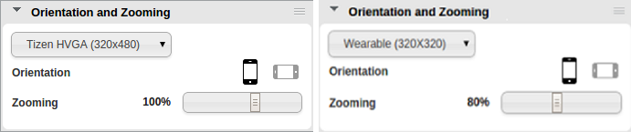
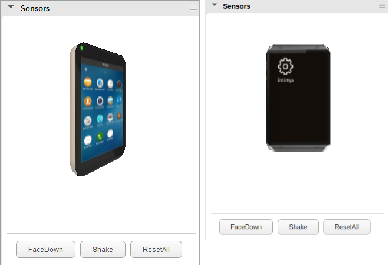
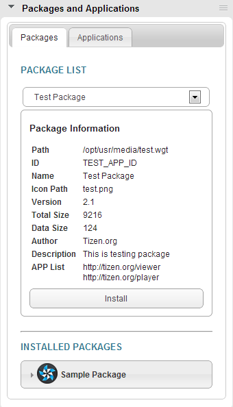
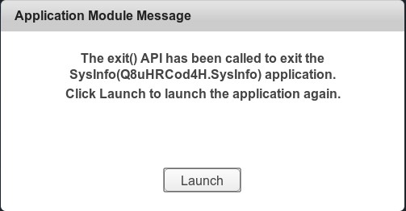
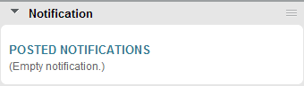
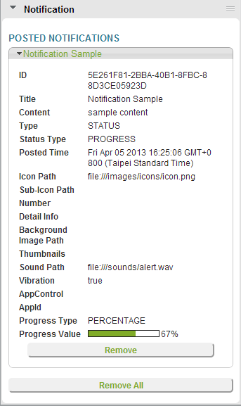

# Taking Advantage of Web Simulator Features

The Web Simulator has several features for developing Web applications.

<a name="basic"></a>
## Basic Panel Operation

The Web Simulator provides the following panel operations:

- Expand/Collapse

  Each panel can be opened or closed by clicking the small arrow on the left side of the panel bar.

- Reorder

  Each panel can be moved and reordered by dragging the items on the drag area on the right side of the panel bar.

- Show/Hide

  Each panel can be displayed or hidden by clicking the panel-setting button on the right side of the application address bar.

<a name="panels"></a>
## Panels

The Web Simulator has the following panels which allow you to control the simulation conditions of various device aspects:

<a name="orient"></a>
### Orientation and Zooming

In the **Orientation and Zooming** panel, you can switch the orientation between the portrait and landscape modes. If your application has subscribed to the orientation change event, it receives the event and the subscribed event handler is invoked.

You can also set the zoom level of your application to view specific areas of the application. Zooming is a visual aid and does not trigger application notifications.

**Figure: Orientation and Zooming panel (mobile app on the left, wearable on the right)**



<a name="system"></a>
### System Summary

The **System Summary** panel displays generic information and settings about the application, system, device, and platform.

**Figure: System Summary panel (mobile app on the left, wearable on the right)**


<a name="geo"></a>
### Geolocation

The **Geolocation** panel contains location-related settings. You can set the local time zone to test whether your application reacts properly when the target device is located in different geographical areas.

**Figure: Geolocation panel**


The panel also provides an input area to configure geographical data being sent from the device. Additionally, a map is displayed and updated in accordance to the changing of data.

To simulate a custom, multi-point route:

1. Click the red location marker button in the upper-right corner of the map.
2. Click the desired location points.
3. Double-click the map to end route creation.
4. To send the geolocation data to the application along the defined route, click the play button. You can also set the speed of playback.

<a name="config"></a>
### Application Configuration

The **Application Configuration** panel displays a graphical representation of the `config.xml` file. You can use it to ensure the validity of your application configuration.

For more information on the configuration details, see [W3C/HTML5 Specifications](web-simulator.md#spec).

**Figure: Application Configuration panel**


<a name="sensor"></a>
### Sensors

The **Sensors** panel provides slide bars to configure the ambient, accelerometer, and magnetic field sensors.

To change the accelerometer value, either drag the simulator image, or enter a degree value along each axis.

The following buttons can be used to simulate the accelerometer sensor:

- **FaceDown** simulates placing the device with the screen facing down.
- **Shake** simulates shaking the device along the X axis.
- **ResetAll** simulates returning the device to its default position.

**Figure: Accelerometer sensor (mobile app on the left, wearable on the right)**



To set the magnetic field, enter the X, Y, and Z axis values.

**Figure: Accelerometer and gyro sensors**


> **Note**  
> If the computer does not fully support WebGL&trade;, the simulated device in the **Sensors** panel looks like in the following figure.    
**Figure: Sensor without WebGL&trade;**


<a name="package"></a>
### Packages and Applications

The **Packages and Applications** panel provides a simulated packages and applications management center on a device. It lists available and installed packages and applications on a device:

- On the **Packages** tab, the available packages list provides INSTALL and UPDATE operations. The operations generate events, such as INSTALLED and UPDATED, and call the required callbacks.
- On the **Applications** tab, the installed packages list shows the installed packages and applications on the device. You can simulate the UNINSTALL operation, which generates an UNINSTALLED event and calls the required callback.

You can use the **Packages and Applications** panel to verify created operations and operation details.

**Figure: Packages and Applications panel**



The following sample code demonstrates how to receive the INSTALLED, UPDATED, and UNINSTALLED events for changes in the installed packages list. If you select **Sample Package** from the available packages list and click **Install**, the "The package "Sample Package" is installed" message is displayed in the console, and for each application in the package, the `oninstalled` event is generated. You can subscribe to these application events by registering the `tizen.application.addAppInfoEventListener` interface.

```
var packageEventCallback = {
    oninstalled: function(packageInfo) {
        console.log('The package "' + packageInfo.name + '" is installed');
    },
    onupdated: function(packageInfo) {
        console.log('The package "' + packageInfo.name + '" is updated');
    },
    onuninstalled: function(packageId) {
        console.log('The package "' + packageId + '" is uninstalled');
    }
};

tizen.package.setPackageInfoEventListener(packageEventCallback);

```

#### Preinstalled Packages and Applications In Mobile Applications

A **Sample Package** is preinstalled in the simulator and contains 2 sample applications: Tizen dialer for making phone calls, and Tizen sender for sending SMS messages. Many sample applications, such as CallLog, use the Tizen [Application](https://developer.tizen.org/dev-guide/latest/org.tizen.web.apireference/html/device_api/mobile/tizen/application.html) API to invoke these service applications. Since the simulator allows you to run only 1 application at a time, the **Application Module Message** window is available, which can provide return data for success callback and simulate application launch failure.

The following sample code demonstrates how to define an application control and invoke the `http://tizen.org/appcontrol/operation/send_text` service provided by the Tizen sender application. You can use the **Application Module Message** window to simulate the success value for the success callback or an error message for the error callback.

```
var appControl = new tizen.ApplicationControl('http://tizen.org/appcontrol/operation/send_text',
                                              'sms:' + phoneNumber);

tizen.application.launchAppControl(appControl, null, function() {
    console.log('launch app service ...');
}, function(e) {/* Error handling */},
{
    onsuccess: function() {
        console.log('Message service launch success');
    },
    onfailure: function(er) {/* Error handling */}
});
```

**Figure: Providing application callback data**


The Web Simulator does not have a home screen. Therefore, when the `application.exit()` method is called, you cannot navigate to another application or to the home screen. In this situation, a message is displayed stating that the application tried to exit and can be launched again.

**Figure: Launch an application again**



<a name="communication"></a>
### Communications in Mobile Applications

In the **Communications** panel, you can handle calls, messages, and the push service.

**Calls**

The **Calls** tab provides controls for simulating incoming calls made to the application. The calls can be tracked by call history-related methods using the Tizen [Call History](https://developer.tizen.org/dev-guide/latest/org.tizen.web.apireference/html/device_api/mobile/tizen/callhistory.html) API.

**Figure: Calls tab**


Click **Call** to display the calling screen. Click **Answer** to simulate a received call, and **Ignore** to simulate a rejected call.

**Figure: Calling screen**


**Messages**

The **Messages** tab provides controls for simulating SMS, MMS, and email message exchange between the panel and a target application. To send a message from the panel to the application:

1. Enter the sender name and message body.
2. Select the message type.
3. Click **Send**.

The application receives messages using the Tizen [Messaging](https://developer.tizen.org/dev-guide/latest/org.tizen.web.apireference/html/device_api/mobile/tizen/messaging.html) API.

The **Message Thread** section shows the message history of the current session.

**Figure: Messages tab**


**Push Service**

The **Push** tab provides controls for delivering push notifications to your application. The applications table (on the **Packages and Applications** panel) lists registered applications for receiving push notifications and connectivity status. If an application is connected, the push service sends the push notification data directly to the application. If an application is not connected, the push service posts a UI notification on the Notification panel.

For the application to receive push messages, it has to register itself with the `tizen.push.registerService()` method. If the registration is successful, a red pause button is shown at the **Application** section under **Status**. During this status, notification messages pushed by the service server are posted on the Notification panel.

**Figure: Registered for the push service**


After the registration, the application must connect to the push service with the `tizen.push.connectService()` method. When the application is connected, a callback provided by the application is called whenever a notification message arrives.

**Figure: Connected to the push service**


To push a message from the panel to the application:

1. Select the target application on the **Packages and Applications** panel.
2. Enter the alert message and application data.
3. Click **Push**.

The application receives push notifications using the Tizen [Push](https://developer.tizen.org/dev-guide/latest/org.tizen.web.apireference/html/device_api/mobile/tizen/push.html) API.

**Figure: Push tab**


<a name="network"></a>
### Network Management in Mobile Applications

The **Network Management** panel is used to manage network capabilities, such as Wi-Fi, cellular network (2G, 3G, and 4G), NFC, Bluetooth, and bearer selection.

**Figure: Network Management panel**


You can also set additional parameters for the NFC and Bluetooth functionalities, such as NFC tag and target type, Bluetooth adapter information, and the simulated devices.

**Figure: NFC parameters**


**Figure: Bluetooth parameters**


The **Bearer Selection** section provides network bearer selection management by listing supported network devices and their current availability status. You can request and release specific network connections from this section.

**Figure: Network bearer selection**


Your application can manage network devices and network status using the Tizen [NFC](https://developer.tizen.org/dev-guide/latest/org.tizen.web.apireference/html/device_api/mobile/tizen/nfc.html), [Bluetooth](https://developer.tizen.org/dev-guide/latest/org.tizen.web.apireference/html/device_api/mobile/tizen/bluetooth.html), and [Network Bearer Selection](https://developer.tizen.org/dev-guide/latest/org.tizen.web.apireference/html/device_api/mobile/tizen/networkbearerselection.html) APIs.

<a name="power"></a>
### Power Manager in Mobile Applications

The **Power Manager** panel provides controls for managing the state of the battery and power resources.

**Figure: Power Manager panel**


The **BATTERY** section simulates the device battery level. Your application can retrieve the current battery status using the Tizen [System Information](https://developer.tizen.org/dev-guide/latest/org.tizen.web.apireference/html/device_api/mobile/tizen/systeminfo.html) API.

<a name="download"></a>
### Download in Mobile Applications

The **Download** panel allows you to create a simulated download object with custom size, MIME type, and download speed. All simulated download objects support start, cancel, pause, and resume operations, and provide status feedback mechanism. You can use the simulated download object created by the panel to test various conditions for your application.

The panel contains 2 predefined simulated download objects: `http://tizen.org/small_file.zip` and `http://tizen.org/big_file.zip`. When an object is selected from the drop-down list, its details are displayed at the bottom half of the panel. The panel also allows you to add, remove, and update download objects. Details, such as URL, MIME type, file size, and speed, are configurable.

The following sample code demonstrates how to start the download process and set a listener callback to monitor the status of the download. By adjusting the parameter of the download object, you can verify that you application behaves correctly in different scenarios.

```
request = tizen.DownloadRequest('http://tizen.org/small_file.zip');
downloadId = tizen.download.start(request);
tizen.download.setListener(downloadId, listener);
```

**Figure: Download panel**


<a name="noti"></a>
### Notification in Mobile Applications

The **Notification** panel provides a notification center administrating system notifications. As the Simulator has no real desktop UI components, such as status bar or notification tray, the panel serves as the final rendering place of all the notifications. You can easily verify that the notification details you created with the Tizen [Notification](https://developer.tizen.org/dev-guide/latest/org.tizen.web.apireference/html/device_api/mobile/tizen/notification.html) API are correct.

**Figure: Notification panel with empty notification**



The following sample code demonstrates how to create a status notification. When it is posted with the `post()` method, the details of the notification are displayed on the panel, as shown in the figure below.

```
notification = new tizen.StatusNotification('PROGRESS', 'Notification Sample', {
    content: 'sample content',
    iconPath: file:///images/icons/icon.png,
    soundPath: file:///sounds/alert.wav,
    vibration: true,
    progressValue: 67
});

```

**Figure: Notification panel with a notification**



## Related Information
* Dependencies
  - Tizen Studio 1.0 and Higher
