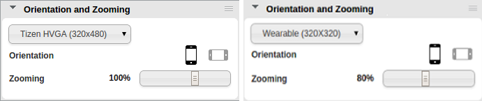
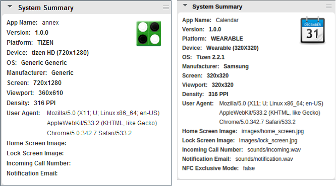
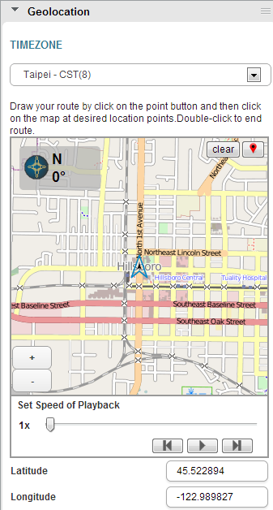
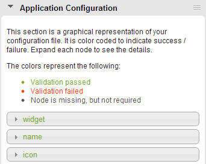
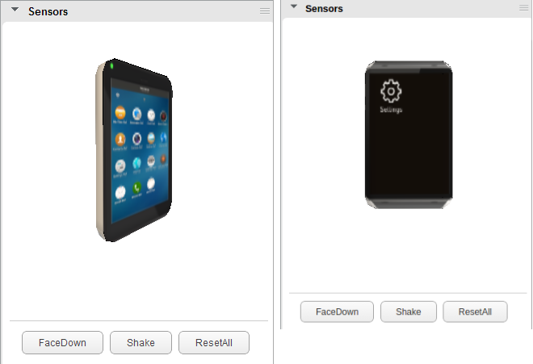
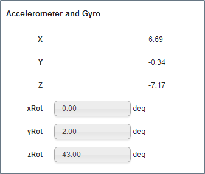
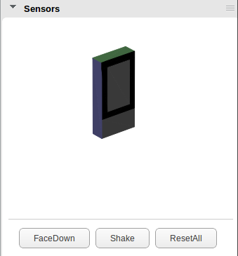
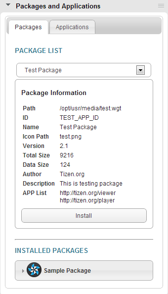

# Using Extended Web Simulator Features

The Web Simulator has several features for developing Web applications.

<a name="basic"></a>
## Basic Panel Operation

The Web Simulator provides the following panel operations:

- Expand/Collapse

  Each panel can be opened or closed by clicking the small arrow on the left side of the panel bar.

- Reorder

  Each panel can be moved and reordered by dragging the items on the drag area on the right side of the panel bar.

- Show/Hide

  Each panel can be displayed or hidden by clicking the panel-setting button on the right side of the application address bar.

<a name="panels"></a>
## Panels

The Web Simulator has the following panels which allow you to control the simulation conditions of various device aspects:

<a name="orient"></a>
### Orientation and Zooming

In the **Orientation and Zooming** panel, you can switch the orientation between the portrait and landscape modes. If your application has subscribed to the orientation change event, it receives the event and the subscribed event handler is invoked.

You can also set the zoom level of your application to view specific areas of the application. Zooming is a visual aid and does not trigger application notifications.

**Figure: Orientation and Zooming panel**



<a name="system"></a>
### System Summary

The **System Summary** panel displays generic information and settings about the application, system, device, and platform.

**Figure: System Summary panel**



<a name="geo"></a>
### Geolocation

The **Geolocation** panel contains location-related settings. You can set the local time zone to test whether your application reacts properly when the target device is located in different geographical areas.

**Figure: Geolocation panel**



The panel also provides an input area to configure geographical data being sent from the device. Additionally, a map is displayed and updated in accordance to the changing of data.

To simulate a custom, multi-point route:

1. Click the red location marker button in the upper-right corner of the map.
2. Click the desired location points.
3. Double-click the map to end route creation.
4. To send the geolocation data to the application along the defined route, click the play button. You can also set the speed of playback.

<a name="config"></a>
### Application Configuration

The **Application Configuration** panel displays a graphical representation of the `config.xml` file. You can use it to ensure the validity of your application configuration.

For more information on the configuration details, see [W3C/HTML5 Specifications](web-simulator.md#spec).

**Figure: Application Configuration panel**



<a name="sensor"></a>
### Sensors

The **Sensors** panel provides slide bars to configure the ambient, accelerometer, and magnetic field sensors.

To change the accelerometer value, either drag the simulator image, or enter a degree value along each axis.

The following buttons can be used to simulate the accelerometer sensor:

- **FaceDown** simulates placing the device with the screen facing down.
- **Shake** simulates shaking the device along the X axis.
- **ResetAll** simulates returning the device to its default position.

**Figure: Accelerometer sensor**



To set the magnetic field, enter the X, Y, and Z axis values.

**Figure: Accelerometer and gyro sensors**



> **Note**
>
> If the computer does not fully support WebGL&trade;, the simulated device in the **Sensors** panel looks like in the following figure.
>
> **Figure: Sensor without WebGL&trade;**
>
> 

<a name="package"></a>
### Packages and Applications

The **Packages and Applications** panel provides a simulated packages and applications management center on a device. It lists available and installed packages and applications on a device:

- On the **Packages** tab, the available packages list provides INSTALL and UPDATE operations. The operations generate events, such as INSTALLED and UPDATED, and call the required callbacks.
- On the **Applications** tab, the installed packages list shows the installed packages and applications on the device. You can simulate the UNINSTALL operation, which generates an UNINSTALLED event and calls the required callback.

You can use the **Packages and Applications** panel to verify created operations and operation details.

**Figure: Packages and Applications panel**



You can receive notifications of changes in the list of installed packages. The `setPackageInfoEventListener()` method of the `PackageManager` interface (in [TV](../../web/api/latest/device_api/tv/tizen/package.html#PackageManager) applications) registers an event listener for changes in the installed packages list. To unsubscribe the listener, use the `unsetPackageInfoEventListener()` method. You can use the `PackageInformationEventCallback` interface (in [TV](../../web/api/latest/device_api/tv/tizen/package.html#PackageInformationEventCallback) applications) to define listeners for receiving notifications.

Learning to receive notifications when the list of installed packages changes allows you to manage device packages from your application:

- Define the event handlers for different notifications using the `PackageInformationEventCallback` listener interface:

    ```
    var packageEventCallback = {
        oninstalled: function(packageInfo) {
            console.log('The package ' + packageInfo.name + ' is installed');
        },
        onupdated: function(packageInfo) {
            console.log('The package ' + packageInfo.name + ' is updated');
        },
        onuninstalled: function(packageId) {
            console.log('The package ' + packageId + ' is uninstalled');
        }
    };
    ```

- Register the listener to use the defined event handlers with the `setPackageInfoEventListener()` method of the `PackageManager` interface:

    ```
    tizen.package.setPackageInfoEventListener(packageEventCallback);
    ```

- To stop receiving notifications, use the `unsetPackageInfoEventListener()` method of the `PackageManager` interface:

    ```
    tizen.package.unsetPackageInfoEventListener();
    ```

## Related Information
* Dependencies
  - Tizen Studio 1.0 and Higher
