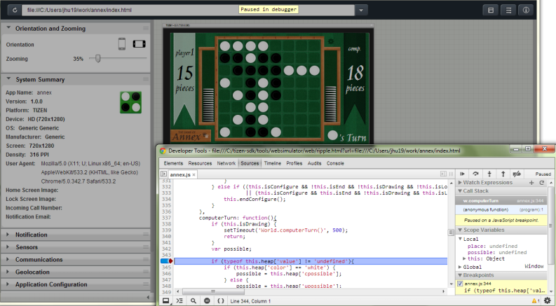

# Using the Web Simulator

The Tizen Web Simulator is a light-weight tool that provides many [settings](#setting) and [features](web-simulator-features.md) to develop Web applications. You can use the simulator features to debug your applications.

The Tizen Web Simulator:

- Supports running and debugging modern HTML5 Web applications.
- Simulates Tizen Web APIs using a JavaScript backend. For more information on the Tizen Web APIs supported by the simulator, see [Tizen API Coverage](#api).
- Includes configuration panels for sending in events and messages to debug features, such as Geolocation, Accelerometer, and Messaging.
- Runs on the Google Chrome&trade; browser.
- Provides [preferences](#pref) to allow you to customize how it works.

The Tizen Web Simulator is based on the [Ripple-UI Framework](https://github.com/blackberry-webworks/Ripple-UI) and is licensed under Apache Software License v.2.0.

> **Note**  
> The Web Simulator does not support a wearable circular UI.

**Figure: Tizen Web Simulator**

## Web Simulator Settings

The Web Simulator has several settings for developing Web applications.

### Application Navigation Bar

The application navigation bar is used to load an application, view the browsing history, and modify the Web Simulator configuration and visibility settings.

The navigation bar has the following options:

- Address bar

  When the Web Simulator is launched from the Tizen Studio, the file path of your application main file is displayed in the address bar. You can edit this field for changing the file or project to run.

  

- Reload button

  Reloads the current application.

  

- Browsing history

  Click the history button to view the previously launched applications.

  

- Configuration button

  Opens the Web Simulator configuration window.

  

- Panel visibility button

  Opens the panel visibility window.

  

- Information button

  Opens the Web Simulator information window.

  

### Simulator Configuration Settings

You can modify the following configuration settings in the Web Simulator configuration window:

- Configuration management

  Save your configuration settings to the local storage and restore the settings at a later time.

  

- Device settings

  Set the device API and device resolution to simulate the device resolution of the target device on the **DEVICE** tab.

  > **Note**  
  > To provide similar UI rendering on the emulator and the target device, set the emulator resolution to **tizen WVGA (480x800)** or **tizen HD (720x1280)**, as the viewport property of these resolutions is configured to be the same as the target device's.

- System settings

  The Tizen System Information API (for [mobile](https://developer.tizen.org/dev-guide/latest/org.tizen.web.apireference/html/device_api/mobile/tizen/systeminfo.html) and [wearable](https://developer.tizen.org/dev-guide/latest/org.tizen.web.apireference/html/device_api/wearable/tizen/systeminfo.html) applications) is used to retrieve device and network-related information. Use the **SYSTEM SETTINGS** tab to set the device status and to test whether your application can retrieve the current device status. You can also test the application listener functions for status change notifications.

  You can modify the following system configuration settings on the **SYSTEM SETTINGS** tab:

  - **CONFIG**  
    Manage the device vibration and screen lock status.

  - **CPU**  
    Manually set the CPU load. If the value is set to 0, the CPU is idle. If the value is set to 1, the CPU usage is 100%.

  - **BUILD**, **LOCALE**, **DEVICE ORIENTATION**, **STORAGE**, and **DISPLAY**  
    Display the build type, language, country, display orientation, dots per inch (DPI), and device width and height. You can also set the display brightness and storage attributes.
  - **PERIPHERAL**  
     Display and set the video output.

- Network settings

  Set the network type, Wi-Fi network, cellular network, and SIM card-related configuration options on the **NETWORK** tab.

## Simulator Preferences

To view the Tizen Web Simulator preferences, select **Window > Preferences > Tizen Studio > Web > Simulator** in the Tizen Studio.

### Google Chrome&trade; Browser Settings

In this section, you can modify Google Chrome&trade; browser-related preferences.

#### Google Chrome&trade; Browser Location

Enter the full path to the Google Chrome&trade; browser program. When first started, the Tizen Studio attempts to discover the location. However, it can be necessary to enter or modify this value manually.

- For Linux: `/opt/google/chrome/google-chrome`.
- For Windows&reg; 64-bit: ` C:\Program Files (x86)\Google\Chrome\Application\chrome.exe`
- For Windows&reg; 32-bit: ` C:\Program Files\Google\Chrome\Application\chrome.exe`

#### Extra Parameters

The simulator is started with default parameters, including the ones described in the following table.

**Table: Default parameters**

| Parameters                  | Description                              |
|---------------------------|----------------------------------------|
| `--allow-access-from-files` | Allows the simulator JavaScript APIs to access files on the disk (such as `config.xml` and the application icon). |
| `--disable-web-security`    | Allows the simulator to do cross-domain requests (such as access the map location on another server). |

To add more start-up parameters, enter them in this field.

#### Profile Data Location

Enter the full directory path for the simulator to store user preferences and Web application data.

> **Note**  
> Linux users must manually define this parameter instead of using the default value, since the total length of the directory path in Linux is very limited for this parameter. Using the default value can prevent you from launching more than 1 application concurrently. There is no such restriction in the Windows&reg; version.

### Simulator Settings

In this section, you can modify simulator-related preferences:

- **Simulator location**
  Set whether to use the default version of the simulator, or a custom version.
  - Internal: Use the simulator that is part of the Tizen Studio.
  - External: Use a custom build or other simulator version. Enter the full path to the `index.html` file for the version you want to use.
- Selecting **Launch the simulator in Google Chrome application mode** launches the simulator without the Google URL bar or tabs at the top. The result is that the simulator appears as a standalone application. The setting has no effect on the simulator features.

## Tizen API Coverage

Below is a summary of the Tizen APIs supported in this release. Some APIs are supported with a JavaScript backend and others are provided by the Google Chrome&trade; browser. Tizen also supports [W3C/HTML5 Specifications](#spec).

### Supported Tizen Web Device API

The following APIs are implemented by the simulator in JavaScript:

- Tizen (in [mobile](https://developer.tizen.org/dev-guide/latest/org.tizen.web.apireference/html/device_api/mobile/tizen/tizen.html) and [wearable](https://developer.tizen.org/dev-guide/latest/org.tizen.web.apireference/html/device_api/wearable/tizen/tizen.html) applications)
- Alarm (in [mobile](https://developer.tizen.org/dev-guide/latest/org.tizen.web.apireference/html/device_api/mobile/tizen/alarm.html) and [wearable](https://developer.tizen.org/dev-guide/latest/org.tizen.web.apireference/html/device_api/wearable/tizen/alarm.html) applications)
- Application (in [mobile](https://developer.tizen.org/dev-guide/latest/org.tizen.web.apireference/html/device_api/mobile/tizen/application.html) and [wearable](https://developer.tizen.org/dev-guide/latest/org.tizen.web.apireference/html/device_api/wearable/tizen/application.html) applications)
- Bluetooth (in [mobile](https://developer.tizen.org/dev-guide/latest/org.tizen.web.apireference/html/device_api/mobile/tizen/bluetooth.html) applications)
- Bookmark (in [mobile](https://developer.tizen.org/dev-guide/latest/org.tizen.web.apireference/html/device_api/mobile/tizen/bookmark.html) applications)
- Calendar (in [mobile](https://developer.tizen.org/dev-guide/latest/org.tizen.web.apireference/html/device_api/mobile/tizen/calendar.html) applications)
- Call History (in [mobile](https://developer.tizen.org/dev-guide/latest/org.tizen.web.apireference/html/device_api/mobile/tizen/callhistory.html) applications)
- Contact (in [mobile](https://developer.tizen.org/dev-guide/latest/org.tizen.web.apireference/html/device_api/mobile/tizen/contact.html) applications)
- Content (in [mobile](https://developer.tizen.org/dev-guide/latest/org.tizen.web.apireference/html/device_api/mobile/tizen/content.html) and [wearable](https://developer.tizen.org/dev-guide/latest/org.tizen.web.apireference/html/device_api/wearable/tizen/content.html) applications)
- Data Control (in [mobile](https://developer.tizen.org/dev-guide/latest/org.tizen.web.apireference/html/device_api/mobile/tizen/datacontrol.html) applications)
- Data Synchronization (in [mobile](https://developer.tizen.org/dev-guide/latest/org.tizen.web.apireference/html/device_api/mobile/tizen/datasync.html) applications)
- Download (in [mobile](https://developer.tizen.org/dev-guide/latest/org.tizen.web.apireference/html/device_api/mobile/tizen/download.html) and [wearable](https://developer.tizen.org/dev-guide/latest/org.tizen.web.apireference/html/device_api/wearable/tizen/download.html) applications)
- Filesystem (in [mobile](https://developer.tizen.org/dev-guide/latest/org.tizen.web.apireference/html/device_api/mobile/tizen/filesystem.html) and [wearable](https://developer.tizen.org/dev-guide/latest/org.tizen.web.apireference/html/device_api/wearable/tizen/filesystem.html) applications)
- Messaging (in [mobile](https://developer.tizen.org/dev-guide/latest/org.tizen.web.apireference/html/device_api/mobile/tizen/messaging.html) applications)
- Network Bearer Selection (in [mobile](https://developer.tizen.org/dev-guide/latest/org.tizen.web.apireference/html/device_api/mobile/tizen/networkbearerselection.html) applications)
- NFC (in [mobile](https://developer.tizen.org/dev-guide/latest/org.tizen.web.apireference/html/device_api/mobile/tizen/nfc.html) applications)
- Notification (in [mobile](https://developer.tizen.org/dev-guide/latest/org.tizen.web.apireference/html/device_api/mobile/tizen/notification.html) applications)
- Package (in [mobile](https://developer.tizen.org/dev-guide/latest/org.tizen.web.apireference/html/device_api/mobile/tizen/package.html) and [wearable](https://developer.tizen.org/dev-guide/latest/org.tizen.web.apireference/html/device_api/wearable/tizen/package.html) applications)
- Power (in [mobile](https://developer.tizen.org/dev-guide/latest/org.tizen.web.apireference/html/device_api/mobile/tizen/power.html) and [wearable](https://developer.tizen.org/dev-guide/latest/org.tizen.web.apireference/html/device_api/wearable/tizen/power.html) applications)
- Push (in [mobile](https://developer.tizen.org/dev-guide/latest/org.tizen.web.apireference/html/device_api/mobile/tizen/push.html) applications)
- System Information (in [mobile](https://developer.tizen.org/dev-guide/latest/org.tizen.web.apireference/html/device_api/mobile/tizen/systeminfo.html) and [wearable](https://developer.tizen.org/dev-guide/latest/org.tizen.web.apireference/html/device_api/wearable/tizen/systeminfo.html) applications)
- System Setting (in [mobile](https://developer.tizen.org/dev-guide/latest/org.tizen.web.apireference/html/device_api/mobile/tizen/systemsetting.html) and [wearable](https://developer.tizen.org/dev-guide/latest/org.tizen.web.apireference/html/device_api/wearable/tizen/systemsetting.html) applications)
- Time (in [mobile](https://developer.tizen.org/dev-guide/latest/org.tizen.web.apireference/html/device_api/mobile/tizen/time.html) and [wearable](https://developer.tizen.org/dev-guide/latest/org.tizen.web.apireference/html/device_api/wearable/tizen/time.html) applications)

### Non-supported Tizen Web Device API

The following APIs are not supported by the current version of the simulator. Support for these APIs is under development.

- Message Port
- Secure Element

### Web Simulator Known Issues

The Tizen APIs have the following known issues on the Web simulator:

- Not all Tizen-specific properties are supported in the Web simulator `config.xml` configuration file. However, the syntax and values of all Tizen-specific properties are verified. The verification result is displayed in the **Application Configuration** panel of the widget configuration editor.
- You can run only 1 application at a time. If your application uses the Application API to invoke another service or application, use the Web simulator features to simulate results for the required callbacks.
- DST (Daylight Saving Time) -related methods of the Time API are not supported.
- For the Messaging module, the attachment is not supported, and the message body is always loaded.
- If you are using the jQuery Mobile swipe component, the swipe action is simulated by mouse click and unclick events. jQuery Mobile does not recognize swipe actions if they begin or end outside the component, and if the mouse pointer is dragged slowly or not in a straight line.

### W3C/HTML5 Specifications

The following W3C/HTML5 specifications are supported:

- Widget:
  - The `config.xml` of a widget is parsed by the simulator and the information is shown in the [Application Configuration](web-simulator-features.md#config) panel.
- Content (documents, graphics, multimedia):     
  - HTML5 audio
  - HTML5 video
  - HTML5 forms
  - Session History API
  - HTML5 2D canvas
  - Inline SVG
- CSS3:     
  - CSS3 2D transforms
  - CSS3 3D transforms
  - CSS3 animations
  - CSS3 transitions
  - iframe sandbox attribute
  - HTML5 2D canvas
  - CSS3 colors
- Device/OS integration:     
  - Geolocation API Specification
  - Orientation and acceleration
  - Browser onLine State
  - Vibration API
  - Web audio
  - Web notifications
- Network and communication:     
  - WebSocket API
  - Web messaging
  - XMLHttpRequest
  - Cross-origin resource sharing (CORS)
  - Server-sent events
- Storage:     
  - Web storage
  - File API
  - File API: directories and system
  - File API: writer
  - HTML5 application cache
  - Web SQL database
  - Indexed DB API
- Performance:     
  - Web workers
  - Page Visibility API (via JavaScript backend)
  - Animation timing control

## Related Information
* Dependencies
  - Tizen Studio 1.0 and Higher
