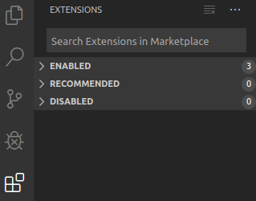
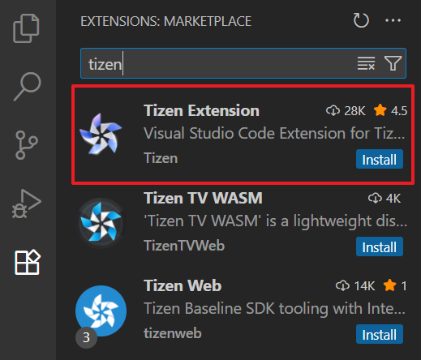
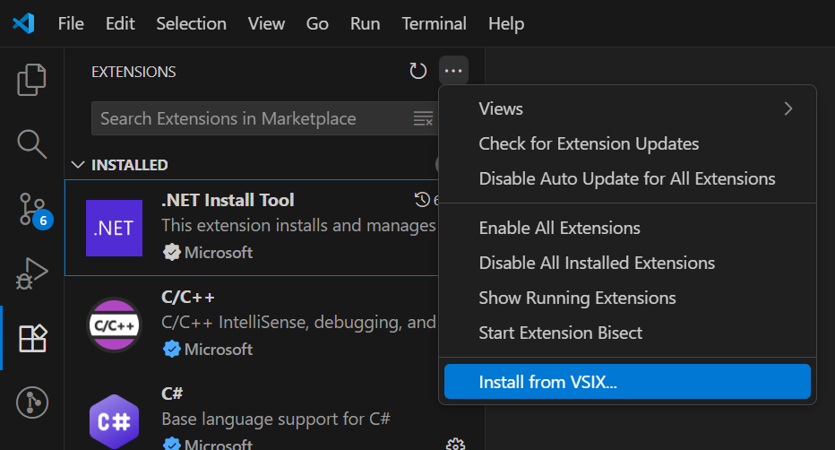
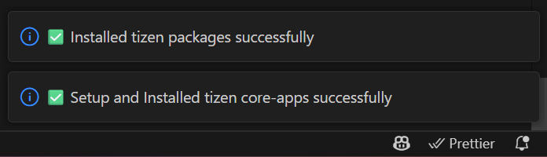
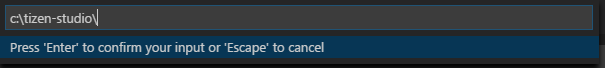
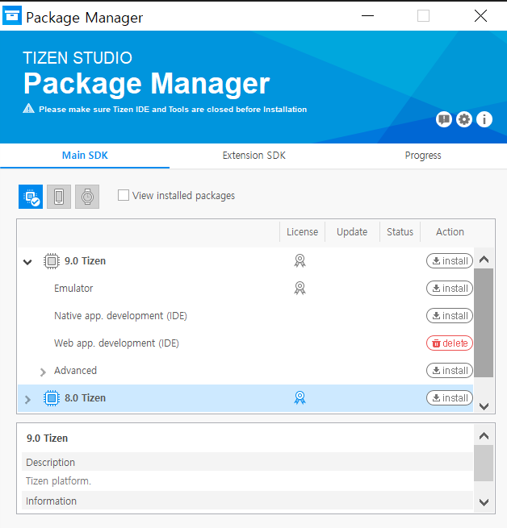
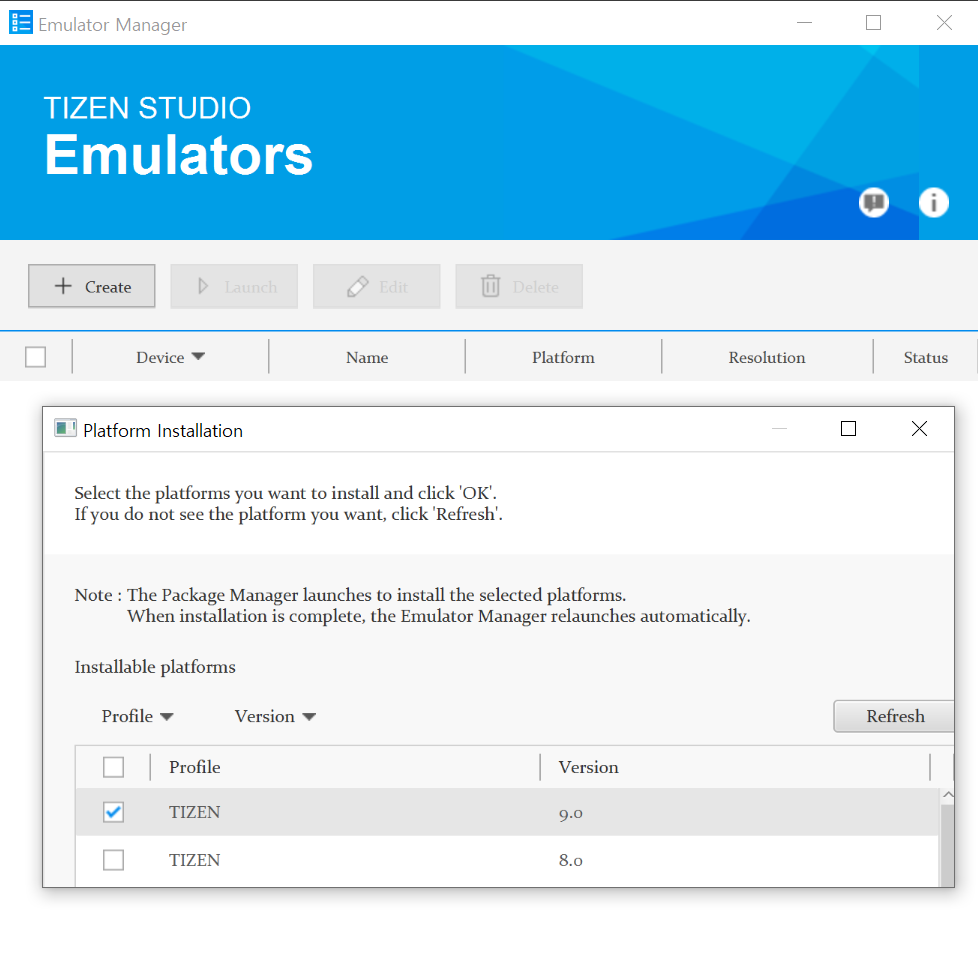

# Installing Visual Studio Code Extension For Tizen

Visual Studio Code Extension for Tizen (VS Code Extension for Tizen) is a Visual Studio Code extension that enables you to develop Tizen applications easily using Visual Studio Code. This topic covers 2 different ways to perform the installation: installing from the Marketplace or installing from a VSIX file.

Before installing VS Code Extension for Tizen, check [Prerequisites of Visual Studio Code Extension for Tizen](../index.md).

## Install from Marketplace

To install VS Code Extension for Tizen from the Visual Studio Code Marketplace:

1. In Visual Studio Code, at the bottom of the **Activity Bar**, click the **Extensions** icon.

   

2. In the **Extensions** view's **Search Extensions in Marketplace** field, enter **Tizen**.
3. Locate **Tizen Extension** in the search results and click **Install**.

   
<!-- 4. Once the extension has been activated, it asks whether you want to use an existing Tizen Baseline SDK installation or install a new one. Alternatively, you can use the GUI to perform the same task. Click [here](../tools/welcome-page.md#install-tizen-sdk) to access the GUI.

   

   - To perform a fresh installation, click **NO**.

     The extension suggests the path where to install the Tizen Baseline SDK. Click **YES** to proceed.

     > [!NOTE]
     > If you click **NO**, you must finish the Tizen Baseline SDK installation before you can use the extension.

   - To use a previously-installed instance of the Tizen Baseline SDK or Tizen Studio with the VS Code Extension for Tizen, click **YES** and see [Setting Tizen Baseline SDK Configuration](#setting-baseline-config). -->

The video below shows how to install Visual Studio Code Extension for Tizen from the marketplace:

<video controls height="400">
  <source src="../media/vscode-installation.mp4" type=video/mp4>
</video>

## Install using VSIX file

To install VS Code Extension for Tizen from a VSIX file:

1. In Visual Studio Code, at the bottom of the **Activity Bar**, click the **Extensions** icon.
2. In the top right corner of the **Extensions** view, click the **More** button () and select **Install from VSIX**.

   

3. Select the VSIX file in the file browser and click **Install**.
4. Once the installation is complete, a **VS Code Notification** will appear at the bottom-right corner of the window, confirming that the extension has been successfully installed.

   

   This notification indicates that the initial setup process has finished.  
   After it appears, you can start using the Tizen Extension right away by opening the **Tizen** view from the Activity Bar.

<!-- 4. After the installation is complete, activate the extension by clicking **Reload**.
1. Once the extension has been activated, it asks whether you want to use an existing Tizen Baseline SDK installation or install a new one:

   

   - To perform a fresh installation, click **NO**.

     The extension suggests the path where to install the Tizen Baseline SDK. Click **YES** to proceed.

     > [!NOTE]
     > If you click **NO**, you must finish the Tizen Baseline SDK installation before you can use the extension.

   - To use a previously-installed instance of the Tizen Baseline SDK or Tizen Studio with the VS Code Extension for Tizen, click **YES** and see [Setting Tizen Baseline SDK Configuration](#setting-baseline-config).

## Set Tizen Baseline SDK configuration

If you have a previously-installed Tizen Baseline SDK or Tizen Studio instance, you can reuse it for VS Code Extension for Tizen:

1. Once the extension has been activated, it asks if you want to use an existing Tizen Baseline SDK installation or install a new one. If you want to use the existing SDK, click **YES** (if you click **NO**, a new instance of the Tizen Baseline SDK is installed automatically).

   

2. Enter the existing Tizen Baseline SDK path.

   

3. Confirm the path by clicking **YES**.

   

4. Wait as the Package Manager built into the VS Code Extension for Tizen installs or updates the required files. During this process, the extension remains deactivated. -->

<!-- ## Install emulator images

If you do not have a real device, you can run applications in the Tizen Emulator.

To download emulator images, you can use the Tizen Package Manager or the Tizen Emulator Manager.

- To install emulator images:

  1. Click Device in **Active Target** in Primary Side Bar.
  2. Select **Tizen: Launch Tizen Package Manager**.
  3. Select the profiles and versions that you want to install and click **Install**.

     

- To use the Tizen Emulator Manager:

  > [!NOTE]
  > The Tizen Emulator Manager shows the emulator images installation window only when no images are installed on your computer.

  1. Open the **Command Palette** and enter **tizen emulator**.
  2. Select **Tizen: Launch Tizen Emulator Manager**.
  3. Select the profiles and versions that you want to install and click **Ok**.

      -->
