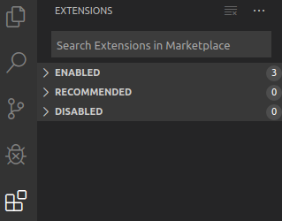
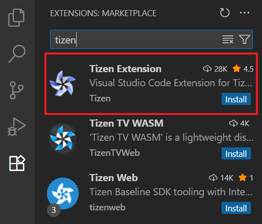
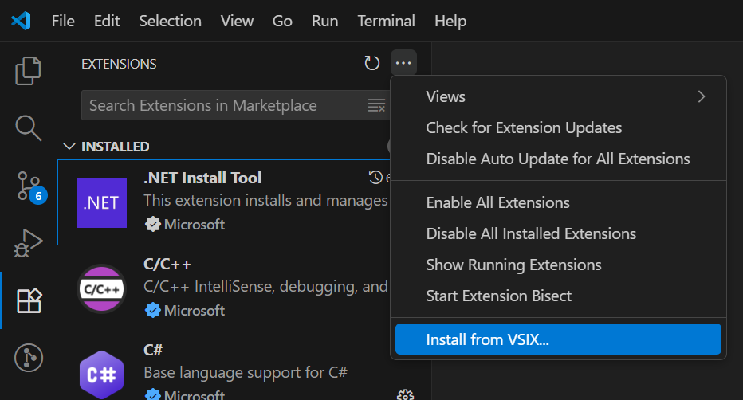
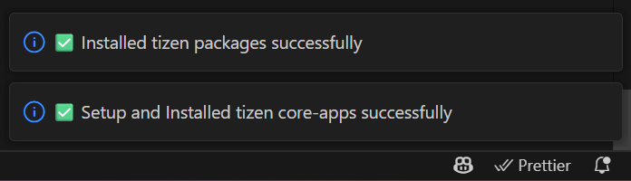

# Installing Visual Studio Code Extension For Tizen

Visual Studio Code Extension for Tizen (VS Code Extension for Tizen) is a Visual Studio Code extension that enables you to develop Tizen applications easily using Visual Studio Code. This topic covers 2 different ways to perform the installation: installing from the Marketplace or installing from a VSIX file.

Before installing VS Code Extension for Tizen, check [Prerequisites of Visual Studio Code Extension for Tizen](../index.md).

## Install from Marketplace

To install VS Code Extension for Tizen from the Visual Studio Code Marketplace:

1. In Visual Studio Code, at the bottom of the **Activity Bar**, click the **Extensions** icon.

   

2. In the **Extensions** view's **Search Extensions in Marketplace** field, enter **Tizen**.
3. Locate **Tizen Extension** in the search results and click **Install**.

   

The video below shows how to install Visual Studio Code Extension for Tizen from the marketplace:

<video controls height="400">
  <source src="../media/vscode-installation-new.mp4" type=video/mp4>
</video>

## Install using VSIX file

To install VS Code Extension for Tizen from a VSIX file:

1. In Visual Studio Code, at the bottom of the **Activity Bar**, click the **Extensions** icon.
2. In the top right corner of the **Extensions** view, click the **More** button () and select **Install from VSIX**.

   

3. Select the VSIX file in the file browser and click **Install**.
4. Once the installation is complete, a **VS Code Notification** will appear at the bottom-right corner of the window, confirming that the extension has been successfully installed.

   

   This notification indicates that the initial setup process has finished.  
   After it appears, you can start using the Tizen Extension right away by opening the **Tizen** view from the Activity Bar.

## After Installation: Setting the Tizen SDK Path

After the extension is installed and activated, the **Tizen** view in the Activity Bar displays a setup prompt. The extension needs a Tizen SDK path to download and install essential SDK resources, such as the server, SDK tools, and platform packages.

To configure the Tizen SDK path:

1. Click the **Tizen** icon in the Activity Bar to open the **TIZEN: SET UP** panel.

2. In the **Tizen SDK Path Setup** dialog that appears, choose one of the following options:

    

   - **Use default path**: Automatically detects and uses the standard Tizen SDK installation location for your operating system. This is the recommended option for most users.

     > [!NOTE]
     > The default SDK path depends on your operating system:
     > - **Windows**: `C:\.tizen-extension-platform`
     > - **Linux**: `/home/<username>/.tizen-extension-platform`
     > - **macOS**: `/Users/<username>/.tizen-extension-platform`

   - **Browse for folder**: Manually select a custom directory where you want the Tizen SDK to be installed. Use this option if you prefer a non-default location or already have an existing SDK installation.

3. After you select a path, the extension downloads and installs the required SDK resources to the chosen directory. You can monitor the download progress in the **Output** panel.

Once the SDK resources are installed, the Tizen Extension is ready for application development.
